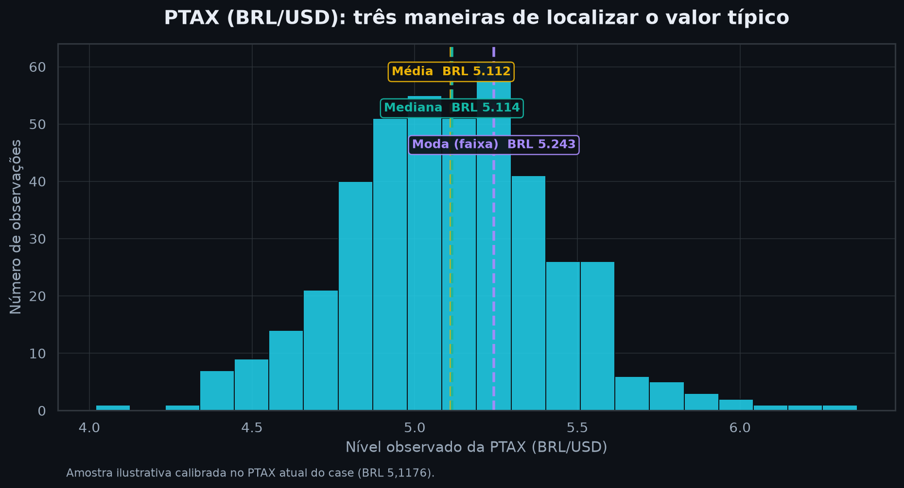
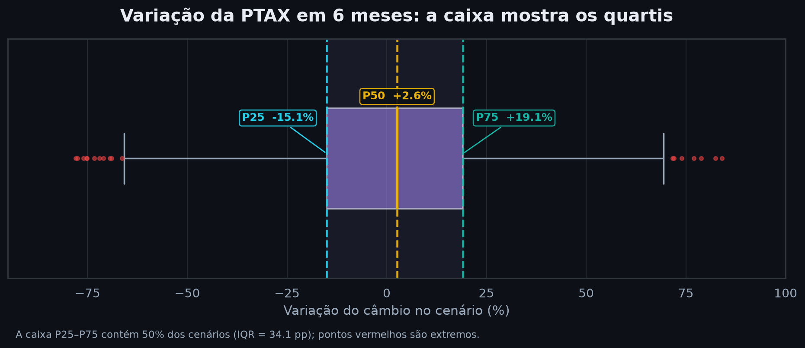
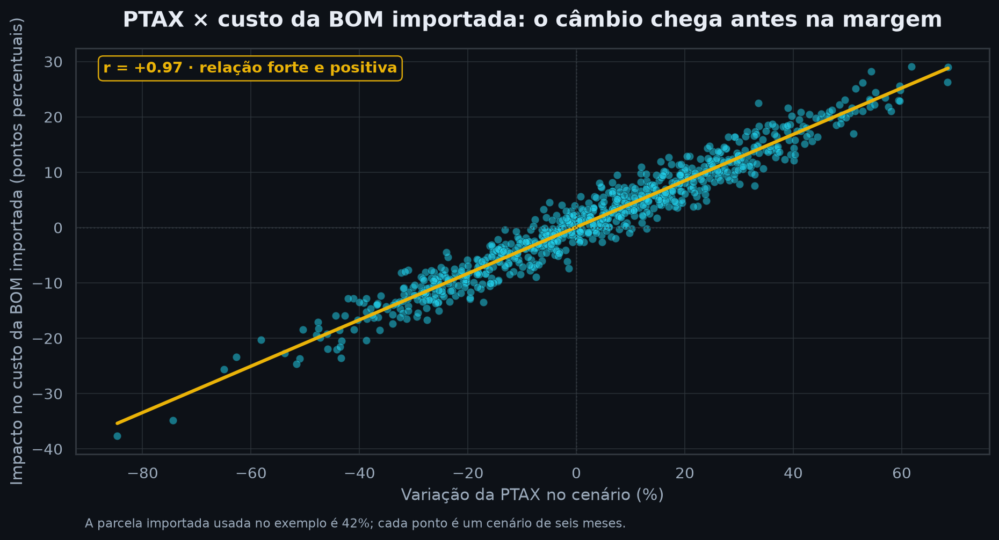

# L0 · Fundamentos de Estatística para Executivos

**Análise Prescritiva — Camada de Alfabetização de Dados (Learning)**

| Campo | Detalhe |
|---|---|
| **Notebook** | L0 · Statistics Fundamentals for Executives |
| **Autor** | Matheus Mendes |
| **Data** | 27/julho/2026 |
| **Versão** | 1.0 |
| **Público-alvo** | Executivos não-técnicos que querem *entender* — não calcular |
| **Dependências** | numpy, pandas, plotly, matplotlib, seaborn |

---

## Por que este notebook existe

Numa reunião, a diferença entre soar como quem **entende os números** e quem
apenas **repete o slide** costuma ser uma única palavra: *média*, *volatilidade*,
*percentil*, *correlação*. Cada uma dessas palavras esconde uma decisão de milhões.

Este material foi desenhado no formato **narrativa-primeiro**:

> **Conceito → Intuição → Matemática → Código → Recado Executivo**

Você não precisa rodar uma linha de código para se beneficiar. Mas se rodar,
verá os cinco conceitos aplicados aos **dados reais do case BYD Camaçari**
(câmbio PTAX, custo da BOM importada, cenários de Monte Carlo).

**Objetivo final:** ao sair daqui, você deve conseguir dizer, com confiança e
sem blefe, *"Eu entendo o que esse dado está dizendo"*.

---

### Os 5 conceitos

| # | Conceito | A pergunta executiva que ele responde |
|---|----------|----------------------------------------|
| 1 | **Média, Mediana, Moda** | "Qual é o valor *típico*? E a média está me enganando?" |
| 2 | **Desvio-padrão (volatilidade)** | "Qual é o *risco* por trás dessa média?" |
| 3 | **Percentis** | "E se der errado? Qual é o meu pior 5%?" |
| 4 | **Correlação** | "O que se move *junto*? O que posso antecipar?" |
| 5 | **Visualização honesta** | "Esse gráfico está me contando a verdade?" |

---


```python
# ──────────────────────────────────────────────────────────────
# Setup — tema escuro (#0d1117), paleta e dados reais do case BYD
# ──────────────────────────────────────────────────────────────
import json, os
from pathlib import Path
import numpy as np
import pandas as pd
import plotly.graph_objects as go
import plotly.io as pio
from plotly.subplots import make_subplots

pio.renderers.default = "notebook_connected"   # gráficos interativos embutidos
np.random.seed(42)

# ── Paleta (mesma linguagem visual do NB-01) ──────────────────
BG      = "#0d1117"   # fundo
INK     = "#e8edf5"   # texto principal
MUTED   = "#9baabb"   # texto secundário / eixos
GRID    = "#30363d"   # linhas de grade
CYAN    = "#22d3ee"   # destaque primário
TEAL    = "#14b8a6"   # positivo / estável
YELLOW  = "#eab308"   # atenção
RED     = "#ef4444"   # risco / negativo
VIOLET  = "#a78bfa"   # secundário

def style(fig, title, height=460):
    # Aplica o tema escuro padrao do case a qualquer figura Plotly
    fig.update_layout(
        template="plotly_dark", paper_bgcolor=BG, plot_bgcolor=BG,
        title=dict(text=title, x=0.5, font=dict(size=17, color=INK)),
        font=dict(color=INK, size=13),
        legend=dict(font=dict(color=MUTED), bgcolor="rgba(13,17,23,0.6)"),
        margin=dict(l=60, r=40, t=70, b=55), height=height,
    )
    fig.update_xaxes(color=MUTED, gridcolor=GRID, zerolinecolor=GRID, linecolor=GRID)
    fig.update_yaxes(color=MUTED, gridcolor=GRID, zerolinecolor=GRID, linecolor=GRID)
    return fig

# ── Dados reais do case (fonte: outputs/nb01_results.json) ────
BYD = {
    "ptax_atual":      5.1176,   # BRL/USD (PTAX, série BCB 1)
    "vol_hist_ann":    14.2,     # volatilidade histórica anualizada (%)
    "vol_calma_ann":    7.1,     # regime de calma
    "vol_turb_ann":    25.5,     # regime de turbulência (3.6x a calma)
    "imported_share":   0.42,    # 42% da BOM (bill of materials) é importada
    # Monte Carlo: 10.000 cenários de câmbio a 6 meses (NB-01)
    "mc_mean":          1.92,    # variação média do câmbio (%)
    "mc_std":          24.31,    # dispersão dos cenários (%)
    "mc_p5":          -27.82,    # pior 5% (real apreciando/depreciando)
    "mc_p50":          -0.31,    # cenário mediano
    "mc_p95":          37.21,    # melhor 5%
    "bom_p5":         -11.68,    # impacto no custo da BOM no pior 5% (pp)
    "bom_p95":         15.63,    # impacto no melhor 5% (pp)
}
print("Setup OK · tema escuro carregado · dados BYD:",
      f"PTAX={BYD['ptax_atual']} · vol={BYD['vol_hist_ann']}% a.a.")
```

    Setup OK · tema escuro carregado · dados BYD: PTAX=5.1176 · vol=14.2% a.a.
    

---

## 1 · Média, Mediana e Moda — o "valor típico"

### ① Por que isto importa
A palavra **"média"** é a mais perigosa de qualquer reunião. Ela parece
inofensiva, mas um único número extremo — um fornecedor que atrasou 60 dias,
um mês de câmbio absurdo — pode inflar a média e esconder a realidade da
operação. Confiar na média errada já custou orçamento a muita gente.

### ② Conceito, sem jargão
São **três formas de responder à mesma pergunta**: *"qual é o valor típico?"*

- **Média** — some tudo e divida pela quantidade. O "centro de gravidade".
- **Mediana** — enfileire os valores do menor ao maior e pegue o do **meio**.
  Metade fica abaixo, metade acima. *Imune a extremos.*
- **Moda** — o valor que **mais se repete**. Útil para categorias.

### ③ Intuição — um exemplo de negócio
Cinco fornecedores prometeram entregar em ~2 semanas. Quatro cumpriram
(12–15 dias). Um travou e levou **60 dias**.

- A **média** vira ~22 dias → sugere que "em média atrasamos bastante".
- A **mediana** continua ~14 dias → mostra a **experiência típica** real.

O fornecedor problemático é um caso a resolver — não a régua do processo.
**Média para somar dinheiro; mediana para descrever a experiência típica.**

### ④ A matemática (acessível)
$$\text{Média } \bar{x} = \frac{x_1 + x_2 + \dots + x_n}{n}
\qquad
\text{Mediana} = \text{valor central da lista ordenada}$$

A média usa *todos* os valores (por isso sofre com extremos); a mediana usa
apenas a *posição* central (por isso os ignora).


```python
# ── Prazos de entrega prometidos ~2 semanas; um fornecedor travou ──
prazos = np.array([12, 14, 13, 15, 60])          # dias
media   = prazos.mean()
mediana = np.median(prazos)
moda    = pd.Series(prazos).mode().iloc[0]

print(f"Média   = {media:.1f} dias   (puxada pelo outlier de 60)")
print(f"Mediana = {mediana:.1f} dias   (experiência típica real)")
print(f"Moda    = {moda:.0f} dias")

fig = go.Figure()
fig.add_bar(x=[f"Fornecedor {i+1}" for i in range(len(prazos))], y=prazos,
            marker_color=[TEAL, TEAL, TEAL, TEAL, RED],
            text=[f"{p}d" for p in prazos], textposition="outside",
            hovertemplate="%{x}: %{y} dias<extra></extra>", name="Prazo")
fig.add_hline(y=media, line=dict(color=YELLOW, width=2, dash="dash"),
              annotation_text=f"MÉDIA {media:.1f}d — enganosa",
              annotation_position="top left",
              annotation_font=dict(color=YELLOW))
fig.add_hline(y=mediana, line=dict(color=CYAN, width=2, dash="dot"),
              annotation_text=f"MEDIANA {mediana:.0f}d — realista",
              annotation_position="bottom left",
              annotation_font=dict(color=CYAN))
style(fig, "Um único outlier separa a MÉDIA da MEDIANA")
fig.update_yaxes(title="Prazo de entrega (dias)")
fig.show()
```

    Média   = 22.8 dias   (puxada pelo outlier de 60)
    Mediana = 14.0 dias   (experiência típica real)
    Moda    = 12 dias
    


<script>
window.PlotlyConfig = {MathJaxConfig: 'local'};
if (window.MathJax && window.MathJax.Hub && window.MathJax.Hub.Config) {window.MathJax.Hub.Config({SVG: {font: "STIX-Web"}});}
</script>
<script type="module">import "https://cdn.plot.ly/plotly-3.6.0.min"</script>


<div style="height:460px; width:100%;">            <script src="https://cdnjs.cloudflare.com/ajax/libs/mathjax/2.7.5/MathJax.js?config=TeX-AMS-MML_SVG"></script><script>if (window.MathJax && window.MathJax.Hub && window.MathJax.Hub.Config) {window.MathJax.Hub.Config({SVG: {font: "STIX-Web"}});}</script>                <script>window.PlotlyConfig = {MathJaxConfig: 'local'};</script>
        <script charset="utf-8" src="https://cdn.plot.ly/plotly-3.6.0.min.js" integrity="sha256-QaOVwtVY0T02VaHrr6pnoHLCwayMJp4O5n4YyaE3rJk=" crossorigin="anonymous"></script>                <div id="76c89919-89cf-4776-8c3d-4e2930b8096a" class="plotly-graph-div" style="height:100%; width:100%;"></div>            <script>                window.PLOTLYENV=window.PLOTLYENV || {};                                if (document.getElementById("76c89919-89cf-4776-8c3d-4e2930b8096a")) {                    Plotly.newPlot(                        "76c89919-89cf-4776-8c3d-4e2930b8096a",                        [{"hovertemplate":"%{x}: %{y} dias\u003cextra\u003e\u003c\u002fextra\u003e","marker":{"color":["#14b8a6","#14b8a6","#14b8a6","#14b8a6","#ef4444"]},"name":"Prazo","text":["12d","14d","13d","15d","60d"],"textposition":"outside","x":["Fornecedor 1","Fornecedor 2","Fornecedor 3","Fornecedor 4","Fornecedor 5"],"y":{"dtype":"i1","bdata":"DA4NDzw="},"type":"bar"}],                        {"template":{"data":{"barpolar":[{"marker":{"line":{"color":"rgb(17,17,17)","width":0.5},"pattern":{"fillmode":"overlay","size":10,"solidity":0.2}},"type":"barpolar"}],"bar":[{"error_x":{"color":"#f2f5fa"},"error_y":{"color":"#f2f5fa"},"marker":{"line":{"color":"rgb(17,17,17)","width":0.5},"pattern":{"fillmode":"overlay","size":10,"solidity":0.2}},"type":"bar"}],"carpet":[{"aaxis":{"endlinecolor":"#A2B1C6","gridcolor":"#506784","linecolor":"#506784","minorgridcolor":"#506784","startlinecolor":"#A2B1C6"},"baxis":{"endlinecolor":"#A2B1C6","gridcolor":"#506784","linecolor":"#506784","minorgridcolor":"#506784","startlinecolor":"#A2B1C6"},"type":"carpet"}],"choropleth":[{"colorbar":{"outlinewidth":0,"ticks":""},"type":"choropleth"}],"contourcarpet":[{"colorbar":{"outlinewidth":0,"ticks":""},"type":"contourcarpet"}],"contour":[{"colorbar":{"outlinewidth":0,"ticks":""},"colorscale":[[0.0,"#0d0887"],[0.1111111111111111,"#46039f"],[0.2222222222222222,"#7201a8"],[0.3333333333333333,"#9c179e"],[0.4444444444444444,"#bd3786"],[0.5555555555555556,"#d8576b"],[0.6666666666666666,"#ed7953"],[0.7777777777777778,"#fb9f3a"],[0.8888888888888888,"#fdca26"],[1.0,"#f0f921"]],"type":"contour"}],"heatmap":[{"colorbar":{"outlinewidth":0,"ticks":""},"colorscale":[[0.0,"#0d0887"],[0.1111111111111111,"#46039f"],[0.2222222222222222,"#7201a8"],[0.3333333333333333,"#9c179e"],[0.4444444444444444,"#bd3786"],[0.5555555555555556,"#d8576b"],[0.6666666666666666,"#ed7953"],[0.7777777777777778,"#fb9f3a"],[0.8888888888888888,"#fdca26"],[1.0,"#f0f921"]],"type":"heatmap"}],"histogram2dcontour":[{"colorbar":{"outlinewidth":0,"ticks":""},"colorscale":[[0.0,"#0d0887"],[0.1111111111111111,"#46039f"],[0.2222222222222222,"#7201a8"],[0.3333333333333333,"#9c179e"],[0.4444444444444444,"#bd3786"],[0.5555555555555556,"#d8576b"],[0.6666666666666666,"#ed7953"],[0.7777777777777778,"#fb9f3a"],[0.8888888888888888,"#fdca26"],[1.0,"#f0f921"]],"type":"histogram2dcontour"}],"histogram2d":[{"colorbar":{"outlinewidth":0,"ticks":""},"colorscale":[[0.0,"#0d0887"],[0.1111111111111111,"#46039f"],[0.2222222222222222,"#7201a8"],[0.3333333333333333,"#9c179e"],[0.4444444444444444,"#bd3786"],[0.5555555555555556,"#d8576b"],[0.6666666666666666,"#ed7953"],[0.7777777777777778,"#fb9f3a"],[0.8888888888888888,"#fdca26"],[1.0,"#f0f921"]],"type":"histogram2d"}],"histogram":[{"marker":{"pattern":{"fillmode":"overlay","size":10,"solidity":0.2}},"type":"histogram"}],"mesh3d":[{"colorbar":{"outlinewidth":0,"ticks":""},"type":"mesh3d"}],"parcoords":[{"line":{"colorbar":{"outlinewidth":0,"ticks":""}},"type":"parcoords"}],"pie":[{"automargin":true,"type":"pie"}],"scatter3d":[{"line":{"colorbar":{"outlinewidth":0,"ticks":""}},"marker":{"colorbar":{"outlinewidth":0,"ticks":""}},"type":"scatter3d"}],"scattercarpet":[{"marker":{"colorbar":{"outlinewidth":0,"ticks":""}},"type":"scattercarpet"}],"scattergeo":[{"marker":{"colorbar":{"outlinewidth":0,"ticks":""}},"type":"scattergeo"}],"scattergl":[{"marker":{"line":{"color":"#283442"}},"type":"scattergl"}],"scattermapbox":[{"marker":{"colorbar":{"outlinewidth":0,"ticks":""}},"type":"scattermapbox"}],"scattermap":[{"marker":{"colorbar":{"outlinewidth":0,"ticks":""}},"type":"scattermap"}],"scatterpolargl":[{"marker":{"colorbar":{"outlinewidth":0,"ticks":""}},"type":"scatterpolargl"}],"scatterpolar":[{"marker":{"colorbar":{"outlinewidth":0,"ticks":""}},"type":"scatterpolar"}],"scatter":[{"marker":{"line":{"color":"#283442"}},"type":"scatter"}],"scatterternary":[{"marker":{"colorbar":{"outlinewidth":0,"ticks":""}},"type":"scatterternary"}],"surface":[{"colorbar":{"outlinewidth":0,"ticks":""},"colorscale":[[0.0,"#0d0887"],[0.1111111111111111,"#46039f"],[0.2222222222222222,"#7201a8"],[0.3333333333333333,"#9c179e"],[0.4444444444444444,"#bd3786"],[0.5555555555555556,"#d8576b"],[0.6666666666666666,"#ed7953"],[0.7777777777777778,"#fb9f3a"],[0.8888888888888888,"#fdca26"],[1.0,"#f0f921"]],"type":"surface"}],"table":[{"cells":{"fill":{"color":"#506784"},"line":{"color":"rgb(17,17,17)"}},"header":{"fill":{"color":"#2a3f5f"},"line":{"color":"rgb(17,17,17)"}},"type":"table"}]},"layout":{"annotationdefaults":{"arrowcolor":"#f2f5fa","arrowhead":0,"arrowwidth":1},"autotypenumbers":"strict","coloraxis":{"colorbar":{"outlinewidth":0,"ticks":""}},"colorscale":{"diverging":[[0,"#8e0152"],[0.1,"#c51b7d"],[0.2,"#de77ae"],[0.3,"#f1b6da"],[0.4,"#fde0ef"],[0.5,"#f7f7f7"],[0.6,"#e6f5d0"],[0.7,"#b8e186"],[0.8,"#7fbc41"],[0.9,"#4d9221"],[1,"#276419"]],"sequential":[[0.0,"#0d0887"],[0.1111111111111111,"#46039f"],[0.2222222222222222,"#7201a8"],[0.3333333333333333,"#9c179e"],[0.4444444444444444,"#bd3786"],[0.5555555555555556,"#d8576b"],[0.6666666666666666,"#ed7953"],[0.7777777777777778,"#fb9f3a"],[0.8888888888888888,"#fdca26"],[1.0,"#f0f921"]],"sequentialminus":[[0.0,"#0d0887"],[0.1111111111111111,"#46039f"],[0.2222222222222222,"#7201a8"],[0.3333333333333333,"#9c179e"],[0.4444444444444444,"#bd3786"],[0.5555555555555556,"#d8576b"],[0.6666666666666666,"#ed7953"],[0.7777777777777778,"#fb9f3a"],[0.8888888888888888,"#fdca26"],[1.0,"#f0f921"]]},"colorway":["#636efa","#EF553B","#00cc96","#ab63fa","#FFA15A","#19d3f3","#FF6692","#B6E880","#FF97FF","#FECB52"],"font":{"color":"#f2f5fa"},"geo":{"bgcolor":"rgb(17,17,17)","lakecolor":"rgb(17,17,17)","landcolor":"rgb(17,17,17)","showlakes":true,"showland":true,"subunitcolor":"#506784"},"hoverlabel":{"align":"left"},"hovermode":"closest","mapbox":{"style":"dark"},"paper_bgcolor":"rgb(17,17,17)","plot_bgcolor":"rgb(17,17,17)","polar":{"angularaxis":{"gridcolor":"#506784","linecolor":"#506784","ticks":""},"bgcolor":"rgb(17,17,17)","radialaxis":{"gridcolor":"#506784","linecolor":"#506784","ticks":""}},"scene":{"xaxis":{"backgroundcolor":"rgb(17,17,17)","gridcolor":"#506784","gridwidth":2,"linecolor":"#506784","showbackground":true,"ticks":"","zerolinecolor":"#C8D4E3"},"yaxis":{"backgroundcolor":"rgb(17,17,17)","gridcolor":"#506784","gridwidth":2,"linecolor":"#506784","showbackground":true,"ticks":"","zerolinecolor":"#C8D4E3"},"zaxis":{"backgroundcolor":"rgb(17,17,17)","gridcolor":"#506784","gridwidth":2,"linecolor":"#506784","showbackground":true,"ticks":"","zerolinecolor":"#C8D4E3"}},"shapedefaults":{"line":{"color":"#f2f5fa"}},"sliderdefaults":{"bgcolor":"#C8D4E3","bordercolor":"rgb(17,17,17)","borderwidth":1,"tickwidth":0},"ternary":{"aaxis":{"gridcolor":"#506784","linecolor":"#506784","ticks":""},"baxis":{"gridcolor":"#506784","linecolor":"#506784","ticks":""},"bgcolor":"rgb(17,17,17)","caxis":{"gridcolor":"#506784","linecolor":"#506784","ticks":""}},"title":{"x":0.05},"updatemenudefaults":{"bgcolor":"#506784","borderwidth":0},"xaxis":{"automargin":true,"gridcolor":"#283442","linecolor":"#506784","ticks":"","title":{"standoff":15},"zerolinecolor":"#283442","zerolinewidth":2},"yaxis":{"automargin":true,"gridcolor":"#283442","linecolor":"#506784","ticks":"","title":{"standoff":15},"zerolinecolor":"#283442","zerolinewidth":2}}},"shapes":[{"line":{"color":"#eab308","dash":"dash","width":2},"type":"line","x0":0,"x1":1,"xref":"x domain","y0":22.8,"y1":22.8,"yref":"y"},{"line":{"color":"#22d3ee","dash":"dot","width":2},"type":"line","x0":0,"x1":1,"xref":"x domain","y0":14.0,"y1":14.0,"yref":"y"}],"annotations":[{"font":{"color":"#eab308"},"showarrow":false,"text":"MÉDIA 22.8d — enganosa","x":0,"xanchor":"left","xref":"x domain","y":22.8,"yanchor":"bottom","yref":"y"},{"font":{"color":"#22d3ee"},"showarrow":false,"text":"MEDIANA 14d — realista","x":0,"xanchor":"left","xref":"x domain","y":14.0,"yanchor":"top","yref":"y"}],"title":{"font":{"size":17,"color":"#e8edf5"},"text":"Um único outlier separa a MÉDIA da MEDIANA","x":0.5},"font":{"color":"#e8edf5","size":13},"legend":{"font":{"color":"#9baabb"},"bgcolor":"rgba(13,17,23,0.6)"},"margin":{"l":60,"r":40,"t":70,"b":55},"paper_bgcolor":"#0d1117","plot_bgcolor":"#0d1117","height":460,"xaxis":{"color":"#9baabb","gridcolor":"#30363d","zerolinecolor":"#30363d","linecolor":"#30363d"},"yaxis":{"color":"#9baabb","gridcolor":"#30363d","zerolinecolor":"#30363d","linecolor":"#30363d","title":{"text":"Prazo de entrega (dias)"}}},                        {"responsive": true}                    ).then(function(){

var gd = document.getElementById('76c89919-89cf-4776-8c3d-4e2930b8096a');
var x = new MutationObserver(function (mutations, observer) {{
        var display = window.getComputedStyle(gd).display;
        if (!display || display === 'none') {{
            console.log([gd, 'removed!']);
            Plotly.purge(gd);
            observer.disconnect();
        }}
}});

// Listen for the removal of the full notebook cells
var notebookContainer = gd.closest('#notebook-container');
if (notebookContainer) {{
    x.observe(notebookContainer, {childList: true});
}}

// Listen for the clearing of the current output cell
var outputEl = gd.closest('.output');
if (outputEl) {{
    x.observe(outputEl, {childList: true});
}}

                        })                };            </script>        </div>


### ⑤ Recado executivo — Média, Mediana, Moda
> - **A média mente quando há extremos.** Se alguém citar só a média, pergunte:
>   *"E a mediana? Tem algum valor extremo puxando isso?"*
> - **Média para dinheiro** (custo total, receita — cada real conta);
>   **mediana para experiência típica** (prazos, tempos, salários).
> - **Moda para categorias**: "qual defeito mais aparece?", "qual canal mais converte?".

---

## 2 · Desvio-padrão — a volatilidade que a média esconde

### ① Por que isto importa
Duas operações podem ter **exatamente a mesma média** e riscos **opostos**.
A média diz *onde* o negócio está; o **desvio-padrão** diz *quão instável* ele
é. Ignorar isso é planejar o orçamento com o cenário médio e ser surpreendido
pelo cenário real.

### ② Conceito, sem jargão
Desvio-padrão = **o quanto os números balançam ao redor da média**.

- Desvio-padrão **baixo** → resultados previsíveis, agrupados. *Tranquilidade.*
- Desvio-padrão **alto** → resultados espalhados, imprevisíveis. *Risco.*

No mundo financeiro, essa mesma medida ganha o nome de **volatilidade**.

### ③ Intuição — câmbio calmo vs. turbulento (dados BYD)
No case BYD, a volatilidade do câmbio **não é constante**: alterna entre
regimes. Em **calma** o câmbio oscila ~7,1% ao ano; em **turbulência**,
~25,5% — **3,6× mais**. A média de longo prazo pode ser a mesma, mas planejar
compra de peças importadas no regime errado destrói a margem.

### ④ A matemática (acessível)
$$\sigma = \sqrt{\frac{1}{n}\sum_{i=1}^{n}(x_i - \bar{x})^2}$$

Em português: para cada ponto, meça a distância até a média, eleve ao quadrado
(para não cancelar positivos com negativos), tire a média disso e a raiz. O
resultado volta à unidade original — por isso é fácil de comunicar.


```python
# ── Dois regimes de câmbio: mesma média, dispersões diferentes ──
n = 2000
media_ret = 0.0
calmo      = np.random.normal(media_ret, BYD["vol_calma_ann"], n)
turbulento = np.random.normal(media_ret, BYD["vol_turb_ann"],  n)

print(f"Regime CALMA       · média={calmo.mean():+.2f}%  · desvio={calmo.std():.1f}%")
print(f"Regime TURBULÊNCIA · média={turbulento.mean():+.2f}%  · desvio={turbulento.std():.1f}%")
print(f"→ Mesma média, risco {turbulento.std()/calmo.std():.1f}× maior.")

fig = go.Figure()
fig.add_histogram(x=calmo, name=f"Calma (σ≈{BYD['vol_calma_ann']}%)",
                  marker_color=TEAL, opacity=0.75, nbinsx=60,
                  hovertemplate="ret %{x:.1f}%<extra>Calma</extra>")
fig.add_histogram(x=turbulento, name=f"Turbulência (σ≈{BYD['vol_turb_ann']}%)",
                  marker_color=RED, opacity=0.6, nbinsx=60,
                  hovertemplate="ret %{x:.1f}%<extra>Turbulência</extra>")
fig.add_vline(x=media_ret, line=dict(color=INK, width=2, dash="dash"),
              annotation_text="mesma média", annotation_font=dict(color=INK))
fig.update_layout(barmode="overlay")
style(fig, "Mesma média, riscos opostos — o desvio-padrão revela a diferença")
fig.update_xaxes(title="Retorno diário do câmbio (%)")
fig.update_yaxes(title="Frequência (nº de dias)")
fig.show()
```

    Regime CALMA       · média=+0.32%  · desvio=7.0%
    Regime TURBULÊNCIA · média=-0.16%  · desvio=25.6%
    → Mesma média, risco 3.7× maior.
    


<div style="height:460px; width:100%;">            <script src="https://cdnjs.cloudflare.com/ajax/libs/mathjax/2.7.5/MathJax.js?config=TeX-AMS-MML_SVG"></script><script>if (window.MathJax && window.MathJax.Hub && window.MathJax.Hub.Config) {window.MathJax.Hub.Config({SVG: {font: "STIX-Web"}});}</script>                <script>window.PlotlyConfig = {MathJaxConfig: 'local'};</script>
        <script charset="utf-8" src="https://cdn.plot.ly/plotly-3.6.0.min.js" integrity="sha256-QaOVwtVY0T02VaHrr6pnoHLCwayMJp4O5n4YyaE3rJk=" crossorigin="anonymous"></script>                <div id="9d1498f0-ff63-487b-a351-370999eb3ea7" class="plotly-graph-div" style="height:100%; width:100%;"></div>            <script>                window.PLOTLYENV=window.PLOTLYENV || {};                                if (document.getElementById("9d1498f0-ff63-487b-a351-370999eb3ea7")) {                    Plotly.newPlot(                        "9d1498f0-ff63-487b-a351-370999eb3ea7",                        [{"hovertemplate":"ret %{x:.1f}%\u003cextra\u003eCalma\u003c\u002fextra\u003e","marker":{"color":"#14b8a6"},"name":"Calma (σ≈7.1%)","nbinsx":60,"opacity":0.75,"x":{"dtype":"f8","bdata":"1CcWBJ82DED3FWrq5Gnvvy96U2r0ZBJABkdupISgJUCMYzcGjpn6vypct8sTmfq\u002fLZofIsFsJkAOJly1jssVQIGJlXyIqgrAJHcc0EHRDkCN++THdlIKwFBbpEwVdArALUowZqZ8+z8YNkAGKCsrwNDQoNprfijAyWQRShzwD8ADF\u002fX3r8McwDvKYFlo2QFA7fnEv7LJGcAna2ukAQ4kwJAo3SjtzyRAp6ekoe+l+b8\u002fjHodUK\u002feP1p5iJ4+OyTAbeJhpMLrDsBPgnvenDPpP7asp4MXWCDA8bR\u002fIvNWBUB9ixkv4g4RwCH+0eF1kQDAUUQt06UWEcA69PLSZk0qQO2nvJFViLi\u002flQoRRvsJHsCdEvIDO1wXQMUyLMYCViHAakcBaBa69z\u002fgxDD3ytMrwFzqEtA43CLATI3lKgpd9j+YpVOK8vgUQN7oNO+pd\u002fM\u002faiW+Y3lG6r9Lz8riSRoBwFKjqR+5\u002fiTAQuBIKo5xFMDHlMtlDioKwG5fJZGzBR5A9QZ9HXyEA0AbNiXqAAkpwH5xx69waAJA71NFiGffBcCnf9hjfjkTwIM1P5whXxFAxUDZZ8dHHUCNihprx3IaQFPJ43Ny1RfAGzUmADKQAcAhx3DW1dACQIAPXHGatBtA0dpjppM3C8DkhKKVQhf1v8h2fm9\u002fax\u002fAFYcpSHP8IMA\u002fN99CYxMXQAP6FCk0QiNA7q98z1Zc4L\u002fvI6DoFYAcQMcRFCR6igRA4R+EVkdSEsBIj0Ux+4YEQOnuBA4S1yVA3+y4n4NH0L\u002f77vzoyjcmQAoLSBGmmTLAKeUMWo9XF0C9XUag78bjPzQGXlvO+wDAeGersxnZ5D8784fkNTkswLgzA\u002fRo9Pi\u002fUfq31bNIBECneR3AcPwkQNUKbUcQcA3AbwVqZxL2FsBdP9Pl8n8MwGxvLe1W\u002fxlA4UjQ202sAkAKa6IdIxcOwIWW+a9RJw1AKvNqRlcO5j\u002fw8wfBb4IbQB2NvvE08BPATGX2QHicAsAgbKb0kEUGwJv472YryCTAUlSyYtPRAEBQ+E2u56f9P1KAftijlqI\u002f4jg\u002fTyum+r\u002fwRF3dJxkkwLotj\u002f6E5AfAlrSz3ld3A8AeH6ts4MgWwLrWQVFyUvK\u002fB1nJAjnzBkB4O5a5qcgqQB1jC4sA1fM\u002fA7WxOfpB\u002fT\u002fFe4M\u002fA+rgvzKpsvsdPyvAUQ40AYcYyL9MDOwNXV7bPyNOXlkwfTFAUMFpJSra9b\u002f\u002f2h9WvSABQAEsoVjKi8+\u002fZwn63mCYIMDVMve1YzogQJx6jpraWhVAyAEDYR53FkBptBdNnNMZwCF+2Bhw6yNApH29TALoI8DfdI6Rr6oQQA3x2Ym+Gi9A4\u002f12ZZghHMCrx\u002fcENhUQwKThuNIKpOY\u002fEaShVPCYDMA4KKLB+AQmwDWZwByvJ98\u002fBP6zd18rHsCYzESuaeYKQMIG2PqUHBrAbAkLUVICJkDG8ZOSkD4WwCYfXjcISwLAi7u+d5gaF0BsilkecHohwHE+\u002fxnm1vk\u002fzgTor7mPIkCjleLmhdMmwKE6dbFy+fQ\u002fwG5Nts6F\u002fT+4kuU9KjQWQJzKdS+QkCHAP5KXth\u002fAIsAZqrWqcqUNQPhYdA1l3gBAE1XNnbt0\u002fD\u002fnSP5Voq0DQIcXjj4NUBPAxTpyIk9i+j\u002fFYLAagqUAQL3+VtyeSRTAvH4gqHZ+KkC6\u002fHvk6OkKQENciWCg6iDAxCV\u002fSGilEkAQ5IRbU64bwHknxH5rWhZA0ACoBbpzIECGa29QsE4XwHJhOzshXBtAcycLNypyB0Ctl6\u002fItFgXQH19Mss47ypAwYvLbkfg+78drP6h9mcVwICNeS4gQxnAiiRkYEQrF8D8ttpte4Thv9fTCGWfYANARSJQdJxu\u002fz+LaPT9830XQEEz2mTaobc\u002faSx\u002fF+OjJECJgcTnpBD+v5CjN\u002fItUDNAAtolFdrEEUC8FybY4FcYwF1m+hrRaR7AzXvq7ohnC0DqrzbEp2L5v6BGlbYRRxRAS09M70DhCkCnQcht9ovgv0j2rW+HDBjAnikoy8WCJcCsAO5Cr1wJwPBEjJ5cUhhAbHUCSjBS+D9Sw7F1grAhwEOPsN9grPM\u002f3n4wrdLiBUDOzzdC\u002fxkZwCOESHGSdvE\u002fSokr7jVz2j+gpN717DogwKfn87KDUgRA5YewcUHaD0CG+PA7N8IeQAWDAvyP7R1AzhYxixqQI8Ax37j4XKIawGM8LFoGQQ1AaYhe19suDUAffeaUNEENQMGus4m5WjtA5ODZNJo2EEDQ7GMaAiAgQDqkrHP5FxtA2cDz\u002fN9\u002fEkDkXT1cROgBwLySm4MCjhVAMcC\u002fmb\u002fyFcBWTuVhEOf6vz0VxQOTkQvAARuP2w+a4j\u002faaNmXH28wQHj\u002fzubhgyrA\u002fW2r1mJ9E0BR5b9zi+YmwBLv21FEzgrASopaPhvtHkA7siWVdjXdPwjP37iimx7A7ZpWSYtQFMCcg6WN8kwTQF29M7wOvhTAuLVqTfaW+D84RI9ENbXUP50HrillgRLAexa3YapxLkAiYLxI2AASQIzsa1\u002fMwSzA5nv1yWMu9T9CfNDKc8sSwOQlaQSINRhAr1rQWfGBFsAQN5ZHcBHqvwENTUXrrgxAfZnW9WKWGEA\u002fHZxHUQshwK6ZzWLq\u002fwLAY0AttBX6CsDH3ZIA940SwD80NX3HESlALVlmEMIAB0Btd9S6kOchwJ2LSTc5ERpAdg45U3YiLkCuYVx4b1IdQOUED7U2kyXAxiRFmyaBC8BmQnC0ef0hQIZg3kIKGRTAbo2LUn01CUBvDYZA5v8VQM8Px8EnUxrA6fsu0V4M279gpSzYUwM3wCP9bTm1Fx3AL8\u002frABax\u002fL9gVhoB8bchwJLmED4kLidAj1x7ldlOJMC5pK9Pmf4IwP+HCVRKtO0\u002fYyaoEFF3JECcfkhmpWMkwIqnFjdVhCBAmlEpJ4CZsj\u002fSkhrj9d8bwCLfwaxaPwpAaCgVdfmc9j85e7wY0QsRwG3sMkTTt98\u002f7WZSmMTiBcDa+8Y0iMrpP9H+cXH0zRJANcEyA32FJkDgZHz3tJMhwJ0Jmb8ASi5AHcAFxTq4K8Dz5oRGJz7xv8xRuylNtRBAqIoMb7Hr\u002fz8AWXVLRq8RwL3cXS2HpPe\u002fh2f\u002fw6AADMCkUyzj6rwQwLZwPXTyIBhAMbFycEpHBEDltCDcuq0TwH39bnBzjBlAS1HngGF0AUDimgYv1RUXQGzr5E2n4RFA8f10FSCLF8B2KQkAe9EPwBw15JgfORVACQxxz6JVEUBaWel50P7Cv\u002fCG4tQiqOo\u002fTMAJQ5EkIkBssovr9cwQwBegN807Ew9AJFyt+RX49r+sXamGhLr4vxfJ6haMNB9Ai3DnZRtxF0Dcim1bihoXQNhaBTOtiSJA0U3OQZoWwz\u002fWD1slEl4TQCD169+GnwHAQGdoWqNpAkDrAA1YiZHtv8AzhYCYCeY\u002fJ7VWlgfnEECLUe2pyjwXwEnTkgg\u002fti1AshDSFSaSHMAvAaCF0T0hwHTpIPP2cSBArPfYVrR7FkBk5aXImbkRQDDAnbxS2BFAgzDm8n1Ctr8f+0jvZXsZwNyGRCIJOeE\u002fTFy\u002fizw7E8Dh3MWwgrEbQAOnW\u002fiptPC\u002fAdix37FxF8BrEhgONUECwIwUc4tadAdAmirew4ACEMBpXJkE31kXwMHz8GLQrvs\u002f60PdEwXU+z+Fr6\u002f8W8sMwEKyYhdGwQrAYA1SKmJc+j+S2LmBE5AkwF\u002fHUY1p\u002fCPA9IhNemBnFMAUo9x6Yj\u002f4v9EcN0DYqAFAidT8BDfzJEC6KmJNh1sYQMr7x7JEK\u002fK\u002f4IAtjCxIwb\u002fW7jAcyngcwAdSZgci08C\u002f9c5z2VNlAMDa+NsGllQCQLTRGcNMfhfAPsg4u7Z\u002fDUBaEcb\u002fz8MlQBDtpZjWtei\u002f+dAFtjXRBkCRneN0n5kTQD1eKQ8RygbAsm6Kyfd0+T9gg7SJUOO2P2HVXoonMeY\u002fBZUIIBf0FcCSqNtUXEbGP9HSTyZLSQxAL12FfjKbJEAPnmNZSD4bQBQh6rU\u002fky5A\u002f3P+eOzKFcAhF4S1HsYYQNVI5P3g0\u002fQ\u002frYmsIl8YL0C+xuTfpvQWwABBORod2RfA\u002f+qhBNMFEcCLjQ8mySguwGZa6Qvm3A3AenDZtjKPFcCzCAgjsRXxP6UqQcFnaQNAJTSZmEGkKkAKrhoj9v0aQCX3rQFSYhDA4O7DgtWDGcDhSEX25fALQMXnHs9PvyLA2hkzCrgBKkDlc6IvgL8gQGIrancwpgrAvocMLpZTKMDo+XXLmDkjQPPJYgEBBuq\u002f4wM1ubWTIUBpG6M8EKQmwIQr\u002fjeyBRHAk3T0ftgPoz\u002fSX+9VFVnVP9VUvN9PkAnAL9r0Pl6wEUBDNdAOB1IewG0XG4yfLPC\u002fFyEZZcdU6z+RpKopWjgNQKIuII25NRRAitKlDZnwH8B8SFHUz8glwJu9RVycJCJA\u002fDzckBzgAkAol27oy0EVwCAhvWa\u002fBiZAfVB\u002fwwFI6j+6B+kq+74gQHdXa48urt4\u002ftuJpGTtDLUA0GQnZA+0oQKJ9i5lGSPy\u002fEaH6nbWXG0AQcn0sJFQSQIc5Kts\u002fbyNAwue7KGFnG8D8e0tY3nsTQK8MF10rDx5ARHj4qV75KMCQgdefYc0gwFGD1E0E9SzAeCPSI8ia\u002fr8x0yy40WAUQCp6kExeVSVAr0ia65bV4D\u002fu\u002fwDeVyAnQP1dyN\u002fxmCPAPnqkxiIwKMDwoXrxqT3ZvzBg6m6e0AVA9iYLUoa2zb8q1g3GkFstwHCM7LWBP+S\u002fKdRe7QGGIsDsnG2MyQQTQN2XILyh0gRAzU7GT02xGsCoLv07CTANwPk67u7nFB7AhOFz1jt73L+SBjhIRCAbQK\u002ffz2Wf\u002fhvA2VClVD2hDEAP59O2Xh4OwOd7\u002fqyAhBbAyWNrbTpR6L98oC0zoGYdwAtqS\u002fqAcg\u002fA8HBElYYCIcCAX682K+YrQL2JXQEVBtA\u002flVgRykjfE8AheOHP4E74P0PqnNtbhem\u002fwtoCRiYa+b\u002fty8fRPHERQE7Wb1FigxVAG1UCPekhDsBjD83ObVoQwAahA4XxPv+\u002fL54Hz\u002fhXMMD9i8rFBYQlwGgjlYDcaCNAz\u002fy4YMlbJ0B7tifSXUr8v+8yCbzMXxBAEoXvhNOtAUCgPV57LNw1QE\u002f0VOfByx9AH85ksRgQ7b+EtqtFKSMbwJmoFfDAzybAdVuATgwd9z+jjgrz+HoVwL6UPDstMiTAymB179dcEsBIA\u002fpeSbcewKFDzuYY9SdA+tATqt8JGUB\u002fQcrmbfusvwZxTZfkAyVA52qYBP2T4T9uXcJy4XUYwNKmRlPcoCVASbzI4y6cDkC919jGMXUdwMu+53Fan\u002fW\u002fcryaThjeGMCIA8DqwKIjwDMJ2WWuTRpAs6fWghwdK0CIWe2lEtwjwAejXegF+g9AKLAnhm56EsCQ0gtaMasLwI4fZ9fw0hDAQuhS+Y6JGMCYBi6nWAzWP35vTvhWmRfABZ6hNVG5\u002fj8z1ti2BNTWv14EPdT9JPu\u002fajA10VnGGcApi1q4W2EQwO88\u002fRH\u002fcxVAyLyOlLxzDECO+wa4N8MbwBJ+Yxh8keY\u002fwBeLi+JWFUBE139An7QnwBNNmVLk3A5Abv3TLorREsDMQ\u002f0FezQQQPyFBgozrRXA2PRffxuhKcBijp44cRwnwP\u002fwLXqM2dU\u002fy4oZWiWB\u002fT\u002flff1bvq4ZwGUouJbSIhJAHR\u002fRLfWXJ8BtiA450wbev7lDJz1JMiHAXkkI9xuDEsAFBCSAt4nVP80t9KCMbxjAtKwyyb7XBcDBCay3JpQcQOQ35xE8YhDAIv\u002fj4NC7F0AZdwbatQogwJQKns7GFw5ARXNp52N4JEC7O\u002fEGdowxwI6QyEy\u002foRbAVlTMkYtjEEAG\u002fZ174hD3v+lYwAbCFAVAfaU\u002fwjYnEcCzoQLRVqzjP2qKqtRXr\u002fG\u002fRVHUEB+VIEBG+h4X9+b8P5LVHkYDLQNADv5RRQVlB8Cuv9RAL7ILwKUrGfq9kQjAAsqEU6ZnBkDomtN9c+kHwM30wuiOdQBA2BhLOn94LUBBJKzPbL0YQMllHJqkhALAjPQqIacOIUCLQeEMvi0HwDJz+YT98CzAI\u002fiw0jChHMARqiHqs5AqwDrVcYpJ9wPAMCK9ZRa9wD\u002fnO8JWL84nQL3nORrJkQJA0YOPP8vj+L8IARM\u002fHI4XQIfrhEjrZS\u002fAK7GOXwzE+j8wSfWQf+QVQEwlpev0\u002fiTABG6ZUsY9IEANHSAxAjoDQBkS6lWelgfAPCqUyJP4EUBTEUUaNh8wQNc+3TD2qPQ\u002fqTOI3KYy\u002fD8IUIGXeRcKwKWQgGC1IhjAe9cLn9+UF0CCiJ9kElAYwIdFaniFQuA\u002f9auYeoUhC8BQ\u002fi72vzQLQEbtzsS28wJA5TrMlVR3HUAJE0\u002fkC\u002fgMwJZoXBllqP6\u002fGji+8wDMG8Cop7kiYTwJwPuuJEJAbgVA\u002fPt6K5x\u002fFUCDSQPCgjAawC88hgRishhAhcVIxgNAI0D3dAubrHsHQGAiCjSHpipAvMxNysH5FcBEmWabkawhwG1uPPwAQinADjmLl2s+JUAfH3QEgJUSQO0PGvT2Qdm\u002fz66wg+\u002fN\u002fz9dVgBtwfYfwJW6ohdmXTFACFcZ3upb7T9PC1lWwNroP++E+hidnBRAO\u002fg8UEJSC0BM4g3Y5275P22xWsMQcxbAMOIz74bHCkC1XDkTibkqQI0usvbeGiNAx1aFUY2fJkDNv+sifAkNwKrgmqjSGhzA1KBudyuU7L8AVqNHR1LZP0b4mcM1Ex9A24Q+inIIKMBAT4OoOLglQHSSYFwf8\u002fG\u002fBkgTODE\u002fCMAea5lVZ74cwE5HOie8fyfAsu+mh8dgF0BnlsNXaKjgP9qXlA9EUSLATPNmz95jIsDFqf4BlBIDwIue3R86sydAR2C381R9\u002fb9c8diqOVglwOn1afuZ6vu\u002fzRk73jz7\u002fr8UayB13CUzwKAp9iXtq9i\u002fLB8NFfI7+r\u002f6MZfhssUTQOxTEUBTQSpAc8lrEZT+H0Dgm6mdtov+vydPus7ibB\u002fAhiwuulZFMkCLRGjQqujaP3pK4aVgUbk\u002fDuGI4cTsxb9aVeQsn4D2PyKHUlQ7ZvC\u002fDKPFk8BKEMBXEt84xA8PwDAjrNgjxM2\u002fS8+nttTdDsBfy9iJrD4UwL+ALZdSLug\u002f4Wn1OyX3\u002fL9zI0u4UFslQL4X5xhn0jLAOTinALH\u002fHkARQxfWxLEhQDKNGCwwcS3AkGARp\u002fN2A8AxEsEeDBkFwNw3sSWW\u002fCPAYsyP1wkXFsBHfvajVIofwDotBYDa4ShA4DyjlcGSGkBKe65pWw4iQKp4BzbYfhRA7rxCOVQIIMBqatq88coNwD3\u002fasrlywtAaESo061aIcBVMD+myD8UQHVdrw4MTfu\u002fNzwYxDFKBcAIdUqe9jAUQCcMV6fxOwlAIW5+oLyABMDQVKxMZXYgQMhH+UfDsx7AM8wKJhl+EUCh0MdYFdgQQMTHi4gNlQHADZI5LDyGAkCdBYFODMQhwA1wTskLPhpA43wc\u002fj8B9b+XJu6Wz7ANwKgTDHi3yh1A2hwPQdwAFMCJ\u002f27bCQAkwEBxCouoGibA9xLLS+81EUAVGnDlnS4iwNw9lB4H6yhAwxAY0zqQLcB8u\u002fBL9RYoQGQSO7+5+Pc\u002ft6ip4ST55b\u002fs15o4j\u002fMOwJm8QifCqwZAUx6Y0egZ0b9m4kAtclUfQMm2lHfY8+k\u002flCFRBQQT8T\u002fGc3ljNqcEwLRH+IZH4Nm\u002fhTQTGK97AUCEAS\u002fczUgowDvPF3TsJCPA48Tpx9MbFUCS+sRSCmnzP79TnKCH5vS\u002fBjXExbTAwD+O4jG2Hb4DQJvgfp2JqA7A7axeMJYaFsAg8YlNfj\u002f2P1eNSVQpyRvAf\u002fz7WFIwB0Due\u002fxeOy0owLqJeIZfOh1AsYV4CvLXCkDobzUbwRX9P\u002fabuniO6BtAWlPcK1WmJ0BqW3JJ4M4cQF+Vbi3yIyrAhcsQqIQrIsDaqi5Vrr4RwAlVLegntsc\u002fhMsAIS1nDUDhn0akcpwUwCZwRvF5N\u002fU\u002frcJfou9zFcC4hwei+l0RwKDDQpJ++SPAT\u002fzoZUY4GsDa7TXVpDEjwFrWcij9thvAqN+itmXsHUC5VHp6gvYawLlHuR2esDJArkempzwFDEBDx\u002fWIVP\u002f0Pzi7SbqaYBjARzc7b4jjE0AuGjgEHlkQwO0DRzN7uOs\u002fQLQQrDUtMkCZWGayJtPlv2b7GaHWUSBA\u002fj2utl\u002f4E8A5E5iXK8zPvyCgjOc2JSlAetjLIU3OEcA7XXDtnLwpQBuFg8GjGRRAh\u002fpshrfyD8DzQCpz2\u002fURQIU4eiDcnhtAQjdWoc6oEUBYEPq1FEwmwBxp4P+TphTAtU5m6jwe\u002fL9xyAtTSengv8PDns+IoBFA3yJxVdQv9D8puYNqPvYiwGlZcYNhmAVAAxnC3TNXEUDc5L8KzcsPQBN7v0u1sR5AlAEKmPKuF0D\u002fNol\u002f2BQKQPls7eYf4t+\u002frEP12OyVJ8CEZxUb\u002fmYIQDsm9+bjl\u002fc\u002f7+zqdfLZ\u002fj94wDSGPCEiwOeFD6a2sx7A\u002fjVmrtfoHUBl2qgDT\u002fnRv8KhEl3IWhNATeC2eFm8yT\u002ffM0Nj2QrLP6VYVdaypRpAeOreA7RPDcAwwiolsdblPw2rnj7aQQrA8tjwOOytCMB6vM4pnI8BwHel\u002f2cBPPk\u002fQTk1UWMxC8AnegW37NQhQAWYbCYnaBnA\u002fE6ZwoY69b+gjF2XCvoIwF3zSNMNjCRAoAqKnCBU9j9gs5Ar7E0dQB6rFR9PGCXAlH0+vz9W\u002fj+QKrnD+EMZQOf1l27mseI\u002fPV7a8HdCHkBkSICzyWENwHoJNYNCAyRAvD22K3pSMEAYWjaD9psEwLsQT4v2TQnAxNRP31ejJEB3uK+HD24mQOAb1pbNsg3Arsh5O9rdB8D6sOemXwEAwFb0ErRYFyPAdTOilPcWGsC3Xa9JgYQcwIvO3gYyzhXAJwdSQomFz7\u002fOx5DTVpv6Pz3FzB9hBCZAhmRc525aHMBeCJnlavQbQG3hJVIjT\u002fi\u002fKIUmbu951r\u002f2eJ8nNSoTQA0ZIWCj4h\u002fAZ6DQK4u4BUB1qlZQsujyPxY1n6Wi+AtAQDSZUL5sAECuv5\u002fnwG4xQPEwrvGfHBLAzUad2h4pDsCbTisbe7IRwDKs6ukUjQ\u002fAhYLlMg8aEsAMP9AZUOIgQK8GrynRKyRAAHhhyY01EMARlGHWjqMXwFVM8mLCxgpAZya0zMNdD8D+KHvgqvkRQOYvz3xTDfc\u002ffNkicwiGJcCldCOsffklQASUXOBfgClAyrCFCThnEcCsSd6nfQUGwE\u002fLHyO2PABAMmxP8ET\u002fAkB4YQha4bMSQAhEqtt+iyxAU0TfkugZ9L+c8KC28KsWwDzxBewZliPAa+T4XCfCFMBTjCI\u002fFRvOvzkol6WTeylAaYsPfXtmDcDwxACYHGz5P9eb616q2b2\u002ft0ocFwzgIEAQI\u002f\u002fO8\u002fAxQCWDB7RBJw7AJIjGTtfMC8D3MBWdd6cdQM8vAbefXRNAo1c8hSY5KkDV7fA3ZJUQQLOom\u002flkaATAjMJlAEzGEEBOjWvwt3wfQEZ+f9A7TRdAmhBLlCvQDECyFGbTJkseQIiPlJKfmiBA2ywio2ygI0BN0bZfYWwSQEe+eqgP\u002fPK\u002fmh\u002fEMquq8D+WedPB5iEhQOoOX\u002fhyMxfA85OgCs7wBECV\u002fT4EdlcGwF\u002fwPUSQH8o\u002fQ5o7n20nIkCZXM12d7X1Pw5a0OXLGdU\u002fS2LtWllPI8AMVWnajzEVQFam5Z3tVBJAChvvEt23LkDaSIF9V3sBwA97yf495fg\u002f9c1G\u002fnlU\u002fD9APYuwW2YmQKHrnG+xpuW\u002fNQeUdGSy\u002fz\u002f70MuZpkMRQCAH\u002fFHkMvU\u002fruutfIBbCcB909CRcgz2P+UYUna7fR5Az7jqRC0nHcBzpJ0W8TXuPxfrIIso4hPAuaoDxzv4IEC2uxTLFqElwBbrVrkrvw\u002fAGUoBYvZsBUCqnwoy\u002fjomQNvTS7194N2\u002fgm5SlwuJD8DvyXjWYbYqQPB2F\u002fTRjyTAI9opcxk5L8AiAGSAKf4IQCyqAiNFhAzAKXcVZcUAHcDpvgvjCB4UQNdc\u002f2Udsvs\u002f7WFryBMFEMD+ReGcKS4iwDYsWB8dxxhAR1k2\u002fzh3EkBiZLG2Yojmv62jIxLlOCpAjAyrvPFjHsBthVjPlqklwPUvZMxyphPAtSuwb9u21L\u002fKcOVVs6T7P2fFetGHZ\u002fu\u002fi3Gyxyr\u002fA0AdDPuamMUhwHQpvoJfgCRAHNdD6Cyq4r8rPXgHMLsfQOCz9i6AdwNAcvJApY7xCUDd9e+fby4QQMfksWYKbglAW1Zm\u002f9lAEkCuECY7vN8iQAf3mGkmU\u002fY\u002fqPrgrL0iFEBfoZ6sUGPkv644wzUdcyRAjr73gKQ1E8De0l9Wx5IpQIT4UwluP9K\u002f3bKvVSdRJMCha9tz9hrtP98Mt5mEVxPAyjKSmtDfF0AyX3pe1ogSwN21aDPdVwnA0\u002fdexNvUKsB0TFxO5bAJwDv82J+kNTHABCsOtc19JsAz55LKhJgVQMPAcdsUURZAvUraSX4qCECvXGmoTXYbwDq\u002f1x0XrtW\u002f75EsXyAxmr8hT0gn43IgwMQdNUwnWSVA31sfWcbqGEAWIzXh\u002fRn5v5dZL9MQb8g\u002fLtXs\u002fxqs9z+RMANWHf4swEFOEVNQFPy\u002frqvbW0xeE8AJtUSZLXIcwMb1paXY7v+\u002fsidKN\u002fOGKUAR4ZgWLzMSQPhVVCGzOBDA6QkF5udCEEDCwZHX794jQJd8JOx0QhpApRJdFZYY2z9UO9g4fV8SwAmdGt9c1BNAcoh4oJdZBkAoz2asaWwZQBkPMvzzCRJAg2ATBqvOHUBVZLGHv2YOwCtiG6z9tCJAb6\u002fvPYNy9j+uCNAC\u002fXctQNaxCc6rkhPA1TWnW5OmKEBPwPvuj3v2P7ACtMcRgBLAqmyIThZ8C8BYy+wrGzICwHYxT1K2FwhAla1iPnKyDUAsh1dMB0sQwLh2TQEqIsa\u002fMuEFypRrLkCSwMcF94coQPy7ecZ+yAhAoNApzM5E0T9r5bDzZ0XrP+okxmSFbBFAGpXSbhwMHcB\u002fkyDo6zz9v6md\u002fAajsSfA8IdqCQatBkA8nYWUX2ESQPC3G+\u002fqcQvANOHntcFZJkDGMitB52chwL0bHqpLyyTALZV7Amt\u002f+T\u002fH0tnQ0rwdQE+xO\u002fhp6SdAEeyOVosQCsCUbfztcKIeQFxlZTeNf9G\u002fIDOkMEec878IDm2rjxgZQCjMDfSlhhJA0dZmMoBiJsC10Zj8hPckQCEXoHjomCNAhxgKUBfEEcDbrQvOTHsGQDGkFBmYDwxAMSx+aM+c\u002fT8UtO+O4EEPwKXc7nT4EhPAQvsd5jk5x79uAYjCGqcgQNyMmZFh4A5AafWtZAcNBcDloyLtjuoVQNbDTdWCOTTAB+EYOv5PIEC\u002fYpggNbQowPxJy2UulgTAvHlAsHLMH8DXzuwUbWIiwOAu22jWeyBAkXqf57+QCsCzUp6Sca4DQC7ebx4aUtW\u002f+huNJY4YC0BdieD+NHThP6eN7+7uNyLAB0foHkJLHEDXyh2gnQsMwPa0cYx8GibAZVsDDiNRCMCf86Lej08lQMkBW8BzJRhAj9whU67NA8DJEHqGfNYDwDKiUbnURALALkbe7mR9LUCLMVqjpbEFQAlJGksmbQhAvjebpJJCHUDakjftXiD7PxfsaC1cbf2\u002fMdEM8ypO9r84I3DxjkTgv\u002f2OE8Tt6dC\u002flhbQZyiqFECb8T+KrZrXP+Yvcx+WzhRAeIg7DrxW4r\u002flHQSfrN3hP9Ds1u\u002fbXyzAW5QJmBEGGkDpnLE5OK4DQNEOm8XuVxxAcHa02DuQNMB5V9vjqKctQKpE6b36tu+\u002fpuaKru54H0DD8pg0iIgdwKg9q4QcZxFAuymHpMDqHcBkIhfDDLcRwBHy2gPjLStAQt8ebFmp9b8f0nm8S7P4P++cxIy9tRhAFOphd5wnDEBu8n0kbBbxP4nDki\u002fTugRAj8seu3IQMUDse8lUli7av1TDkjNI2PY\u002fPiMbf63WHUAS8FShnWUfQCK\u002fdLIX2yBALyIu\u002f9IjEkATsmYsDTsgwIoiq63ZMSdAPq+f3DFHIMBMFlrQjzABQEAUmxvjaxXAivJWo\u002fsk3b+RJrfsd6wCQDZW337KQAJAcqG1txD3B0CyRNLHKeomQJeh\u002fGbAwglAMHPhMXe8+79JfBeiTGEbQHS8Ho\u002f24yBAwD\u002f8lJluIcDTyEpkVvcQQNzXDGrO6RNAAIk7t8\u002fmAMB0OBsr+IgjQOWJgUfbC\u002fG\u002fW5A3qu2H7D\u002f++umfNKnzvzULC6EEUbw\u002ftASQv1siH8COhdt633IkwJj6MUVYpCZAquT0br8NGMC3HOOl0SccwFsZK\u002fUAlC7AlBbk6oElEsC4disusskiwJn41rINUSdAoi\u002fEL8atHECzc0bWIIsTwPEp3PwN\u002fC9AecJ66tPhG0D9m\u002fjkTnMCwEg0znnrvjHAJKuGaAREMEAicGazX7sjwLY9nIBaXSfAkcxe\u002fn4KHUD\u002fgRB1flIxQFBF7MkbqCNAppAqSdgDEEBEn2saGuQQQMj+jSesPBhANP4s5LaNFUD2kKAbf\u002fH\u002fPxQwJG6rrOc\u002fM00ttTtx3L9vSxfIn2kVwHVc8\u002fV64v+\u002fPTyJkjwKKMDPoV9Uv1fmvxb2vulzExzAg6ZYKIlXH8Buc1MYnG\u002f0P6F2COs0xCNAHF34b4cUGkBS64pzFU0mwAhMMg7+GhzACiuKaMi3GkBCA2mLE+cbwB8FkgCxhPm\u002fJeVjkzI+D0BnOetjQIAbwAqcBAX68Oc\u002fOWUQEXPxIsBSdvftLhQRwF7ZDpniKQJAsytZz9meJsDGodnl2gQJQEyJwPXJ2MG\u002fsoWdW6VhD0DLsgsCyG\u002f5P285zVzsXiNAkijiMXVz7D\u002fyg3Rs5mMIwNHeHdE2yes\u002f8yJM7PzbDkBWSlRRtzPWP5vThaPicdI\u002f0Odpp8LvE8Bf5mYJjtMSwEFk1CzA6iPAKWNktg\u002fYKEBFLOEOsakhwAjW2qyyrRPAc4frsRtnFMAw5fJLdWoZQLOpbuXNwADAYd9ev8q3IUC1PAbWiyATwG34nryYsf8\u002fl4W1pU65F8B2YdHNC3YuQBVJzWMo3SDAuyjhfQqZAUC3bDa6z\u002f8RQI34bUz4gAdAnl8iKnYM9b8il\u002fuNyX7tv30M1Elu6NM\u002fZnxQrA2z8L+Wpy9nyV8bQCU\u002fkHaxYy9AYcRpZWCqD8CTbZ3+gXMjwCHnDzXEDuS\u002fDbiAM+FQMkBABLQbCdMWwAOhDnWERidAkdH2KsfSJ0AEr\u002fOrnXEPwOEEXQ28KBBANc6xIowfJ0AsgYUW0ogFwKq4QU5xIPe\u002fFx70iw2FEMDC5Sz1r9EcwKE7I+mBcBLAt543hURhIcBYIlpEnfnOP6Hcz2wD3hXAdTamTd6O+j+SWhXq\u002fRcmwNo5W2ZDywJAucQ+xhasF0CJVgS4oE8swL8J7+4UPwVA7Waog9JuIUAqit96SS0hwJqUk5giwCdA+I3sId\u002fMB0AcM7PbtwUUwK0bSYFqV9m\u002fIzm6HIW2D0BhDgN\u002ft0ThP80CS3HxmQ5A3OSEUKolGsDTFzSjSD3zP9Y\u002fX4siEyTASBqpfkNF6b+x9VomxasZwBW2Fc6Y4xTAvTExJ3KNIUD7\u002fX\u002fXQv4eQGtt7IOtTBFAdiBE\u002fIwFH8B\u002fdf381PgBwChXaU7aOSFA19LIxloZ8D8PXfAFnXcwQAEcLfInVwZAVOxUeBjR9T++Mor5zI4BwKbDHJYqV+4\u002fMBJkGRFS8b9aUA67OxwUQBf7OsibKxtAq9unMHVSFsAuNuBLTOciwCtMJEn5EirABRderJnaDEDUCJCk6lUfwK0TIhkwki7AXFDkZz4SBkDn2uGiRrMxQMA7mISoEaa\u002fiTLFzynQF0CbpLIUdZfiP0n65hm9d+a\u002f14bJvA0aGkARz7P30nwAwMxeFkIyYP4\u002fraBqU75FAkCQVeTqSPkSwEkuVXGLLBxA2MKyEhzg87\u002fRWc3RkXYVwEc+AEdIeQ5AiZi\u002fuziEGcA0+eLXbJzJP18PwMUek7C\u002fBSe0JuXWHkC6GfP3ffYKQCn0HY+Xvsa\u002fZL879Hw5F0BvFCe3rr0jQP0WAxMCrw9AzsPzySHRsj9lQYp9yaAiwLDag2jNPx7AGgsSHTZWAcDa84PDZU8RwI48h7VsPfW\u002fui8wv+G92T\u002fFXv8JKBYOQEI5Oj1vBOC\u002f3wmmgx+iC0Bkj+SZE0zdPxwB1083DSzAoIV6E1itGsCy2PDxS17wv83E7Hl7LSHAHINpyrgJEUCJBXbelbwlQFIQ6G1xTiFASM8nnEI\u002f+L\u002fj5GdwFislQJTdVM584\u002fA\u002ftnyb638lA8C67RDHrmsRwG8ULbYmLgHAKsGXx2YMBsCnri32+VvzP2eowY+\u002fPfI\u002fwS8mKVIllj+j48c3btEIQM2fMMI86CBA1A5JbaP3GkAh7Seu5hUlwM3dV84BIjLAS8rGJeGIGkCIkDOg4GgjwIyYXZqJiPm\u002f35aNSZidIMBznmktj5YpwK+x8x1NwQ5AJPHkllyPFUBarFgSdl8QwDrwBX16ZTLAAjBRztQGD8DX4FPIJEEGQFIqcqsjACXAGjUdXGbU9D9S9a4wwtO7v6wasFCucxBAl4ZHSC0r6z9OpaK1maIbwBAKT9fG\u002fSBAQLllK0sC8r8P8wFCetDIv9iFCjs7gRrAgz38ta0tCcCreYSh3iAZwC+VqFKMpfO\u002f7nUvFWdOKEBjvaORInsjwNNaCk+e6SbAIbd4lf\u002fjJED8jcSqd8f3vx3IHSttABPAXmHm5YWIHUCTL1Y1ETMRwERyOhfp7SlAwwI50cpAE0BFm7tIn7YLwKXRYy8\u002foi5AEfXFLsozEcDmhIGHVBMVQGmUDxz0\u002fwBAcaf+BRd8IkAAXwDPZywmQCLZL9raFc0\u002fAmSDN6ZlFcBxfWDpXCAKQKLs6QZDPxPAac70uBCXLEADWc3uVAXvP1pCG08RwATAWp0Lfcz69D8V\u002fRbQEiEjwDaNCNAFmBvAuj6boL4LIUC0K7FY4qcSwG1b+St2ux3AP0OAP1x7DkC\u002fhvOQRdYgQOIRoQEUaxRAiYGoQ6pJHEBGF5f4M34VwC+YRe6QMCTAyZFU6aVRJUA8ol7jBVQCwLI2lB2gfvy\u002feR8cWEDcIkAHmo+BB5gPQI6mChH55AlA4QIhbje+LkD6sZGLokYSwNAee9TEWRpAO1a0riHo2T8pkhHdF4P+P7WgItZJtCVA3DD8kVbYDEDbubhwQZMOQJhsLK6OdR5AWtjsY7S6BMD3G8bUY9UXwHs0kEYurB3Axb4bdxnsK8BF63diuTItQEIhRR\u002fEVB\u002fA1C4bzWgi+b+9tx11LHL\u002fv034t3bwdQFAtZ1bX7wqF0BF4PiH\u002fG8YQDIrI8o0jxDAkqR6tSr88r+0bGxE8AwAQLKPm\u002fpVQPy\u002fyL2ZywXTJkBXE9knK+MLQAsAJf\u002fa3hRAPqI9d2nTEkAOqyjqz6kgQBOVD4VlkPQ\u002fuUXVVT5qIsBVi25WyLMGQFHThgqgfxLAqVwNa4IGDsCVj6TYGacQQFv4VBholSFAsZ\u002fGUuRUwz93V4HXrYoBQHEv00rkKyhAwZOW13xZ+z+2t\u002fK40XgyQNoaSTh7DxBAMZBRi7kAKcBeNtBMGGUVQKiGOwxZpgVAZrOxW4JQIkAhrdI1TB4TQEe6ygcLde+\u002fc96cppFiIcCuFQcTu773v2SWlbifJxjAzdCdP6N8EMDfj3pPM7cQQG2UrdVvtidAkrbg+9ZqBkBZMuIrRvsgwEoW8OPgQAlAzTLrqf79IEBVnMSZXVERwMAjUQXecu6\u002fjhyYz3+yuj+anXBShkoWwDOwoBBCaRJA5Rs4Ort6679hrz9dVtQHQMjjNlJsNBnAOsIQYP7YCMAZ71FdAIQUQKmbCdRKLQXATmPm5tuFKECduxqkB7MGwOwcYPowhvk\u002f19FB8k58GkBWWGkJCyQkwPfqx2bkACnAtmeL2hCqJcAu51fovu0hQK+1Snx1WA\u002fAjQcbdMgpMkD1eA9FTgYQwBEy7RMM9\u002fQ\u002fJTwiy+DlJUCo0YyCjHwsQCbQN1H6RS1ABDzcJacoIUDpta4cWBUdQHVsMm7o0xBAPN77Ef8aFkC6HFFnrk4PwCIz6BaiPBfAwA7mn52ImL971O+5PVXzv8cPO2VMvgnAwKuR6gPHE0BlpvlzcyEbQKzaQgQHFuQ\u002f4TyxCh77JED9HTGtRDYgwJ5rWUvt\u002f\u002fW\u002fVoGKwpVbFMBrCY3hO4EqwGpuAyj5yOK\u002fDSiahDmp679pYB1IsX0lQGnEZNZA6hFAMNyPdT8WHcBIgN1O\u002f1MqQD5B9KGzViFAwRLhSBWIEEDYF7Ichbr5v7EIgMyBPxvAlqWYLS8kBcD3hqdRo+seQMvLqB\u002fZwipAt280tv\u002fpJUAY3fT8QsQLwHQ42AsRzB\u002fAJfbtjTIB8D\u002f7uuh6oRwpwAZ0KfodWwJAWc6s9YTE8L8LVConi3gKwH+I+ogQpSbAf1bFCygsDUDRTHZ45UEOwP9\u002f27XhnCDAGTpIsZ9kNMBRKZNxawHJvxtSYS99KilAyphgbgKXJ0DqmluVi\u002fYJwA0aiJNSGhHAEPu5SlqgCkCcTd9XqVocwGSWK7BLJAFAHVk6xrXBFUD3nb\u002fMJWwhQF9AsxVIwea\u002fVteglSgj97\u002fIyHbbSO8YwKzkrzzAexfAW+DQWF66+b9lYg\u002fSyd0EQBogrysg8hlAOZ56p27PFsA6ekyzODIlQIRrGEe1zP6\u002fFkYHLilrw7\u002fyqmEdhzgVwP4uoJFMNjHAM58lGF0bGUAgpdddJu0UQDi5q5p09f+\u002fNrLR+clw3j9uIhBCK04NQIlbyKwqMCbADDZBY9kMDsDI9ZY2n44WQMqsBcmXzyHAWi+2MpGsAECH7Zk4ckMjwDMw2NxDfgpA96CBmgsy0L\u002fYNuLBU+8mwGfCA30PiiBAobcuTMbcFMC+3ET82wIXwPvL0YffyPY\u002facw4yIZPIEDuiupSbtkcwGF\u002fzrD+Btw\u002fZJp2wFVbCEAPsYquJ68TQLFFX+YzC\u002fQ\u002f7zH93uDYBMAHyul06YAXwGG\u002f4mVnkuM\u002fsiAgJeFyHsCoBFK92L00wAsv28XtywhA4B09xverGUDvf9ax3cYwwEex02clrRzAgWCWx3+VEUBE7\u002ftTaDctQN+VON225cI\u002fV8aoYd+sFMA\u002fK\u002fDP68b0vx0472TzhSNAb9vx\u002f2pYEsCAw44QcrIWwJFAJx16awvA0atsjxQTG8DyEWjr5d7rP3UfSPgHEidAJV+cwtRZAkCeK6j216r8v7quLlcrkwDAg8rS34IyJsClJeqyjxQZQA9MVK1Cr+G\u002fg3kdCKWA9L9ELS3Vyqs2QEmu0TUb+ABAZsuxV9JZFcCVge+dlDcIwEWwh3DUTiBAx\u002fEdZyu86T9A6GeYbWwkwK2p13spGxpAxewJvaz5EsA5PTjkz5kqQKACKqdhrB5ADuZ9EGtoCcCy9nEswDAiQCqQdSNj1d4\u002fjlNddwE4GED\u002fabYnZ4gLQBHV8\u002fZZCRjAL3QJXd1GEsA25hElOkAdQPECtbHmAwPAKHJ+H1\u002ftBsDvIhiKHyAbwFm3lSN4DwhAbL9FyrBJLUBNKzksZFEewBXo5HK5AsY\u002fWIYHRLQNJECTpBe7Mhjiv3vXZQrZsQlAj\u002f3XoQYsHsCQm9yG7VMIQCRRaWR0QvW\u002ft1ORv6b+G0CTmSDCYtwgQJMA1XbKYjJA9anqPip2EEAvDfXNVoECQMWeS6oBFfY\u002fQr27B1IPBMAJSUhs0zkDQKz\u002fbXFfxwDA7MDHXh0j8z9YHRMGu7UiQCZjrZH3lRzAQL5wwa8vIEDy94kI+rMiQF80IEw+0+q\u002fkAIN710hLsAVosjlG0MRwDQZwKbVaiJApkLsl1HIxL\u002fOWfmyU2EcwOy328fUqwzAwni+0qTfF0CK2yaH8Q0PQGyqpxmHJPu\u002f9lTQn+vVBMAiNrMVekAGwBgVVH9KMhrANMB1tTbwJkAyi5AnzE4CwKIaBlqdSCFAX2S0wUmaJUDWhBWbHlocQHgT5ckahAjAUU+y+Y7uBkDPDnTyLP3Fv5CiZyVGqhnAhAaGhXFsAkA2vYiiC74gwPhfrL1z3SBAGZUIPuhjCsBjBhFuC9r2P4\u002f83nY7FwBAAMY08l5p\u002fb8x5y6lf6kQQAANqKV6+QrA2+INDK6+GECe6fHD5xwjwMfw6giktuw\u002fpCTjCmWIK0AYaJsRz2gcwEF94R56PxPAK79GmqEwDUD7EmyKhmb0P2RllDBx6gNAUo2+FizJC0Bj\u002fabQrQYSQGoGADT2gx9AwsITVBdHB0Dk+pGaKGj7v1UoAz3hGRNAvTtEaHP6KkC6B7cyZyLuv8iIdMU3rRvAltgcV+twH0Cl0XvzwFnrv78QCZ0W2i7At58vNRgRGEAFykGfGWgOwFJPcZW0keS\u002fveGJdELbAkCQ1LQVCaT1P7GtIJ3\u002fJRRANtTA+VG8CMDcFKEC+CQNQOwmVFwIfP2\u002f5D\u002fLnXL7FEA9kNe+93kRQBiEUHcDkRrAEo+ZPYbXHkBKaNlWVnEOwHfTT0bn8hZA5Oz3v6bcBEC+cDlRKhoqQAvrb5G\u002fYvm\u002f2mbDfVjXA8DGYUWTBqbBvw88jgF6OAHAIiteyeW3FkD2dkDBnPMmwIolLVKx7B3AAN5nt1pTHsCzJO7GHf0aQNQFofZrSihA5fs3zRm757+48FoXmy3zv4CAg3vq1N8\u002fiDQh9qh\u002fIEBRpBJtOlYawIfAscImFPs\u002fsEhIrBOyG0CTuh9jT3YMQEoorTRWifU\u002fXvMxaQFuHEDopsAfZTEzwJB7p7psQBNAYDUPUGSTEsC1URZ6t\u002f4pwIpPVnVLCQ1Am0\u002fwBoaBI0Clpb8Icjrvv2TwnnPHDxtAFJtTNPTkJkCskhce+qsiQGWNz1uZSSdAA7ReT5ATFUB1Qj06diPhP+n\u002fmVN3vybAG2cPD+Tz+7\u002f\u002fb7FzvfIXwIifgpvP0y5AvwStdAr787\u002fH+ZBe\u002fP3rPxwnzd4JUw9A6yIfmR3Q0z9cjZh72REoQBvnfPDorhHA7BMDBX8b9j8tWaziDhYVwAecsruLviLAhTrrVc5fEcBYTO11W9TQv\u002fYDUtVlYgjA6+AecC2qE8AzjU7IPvgjwHxucaCv4eK\u002fQHMIovVdJcDN0FMv6ZUVQH9w77f1uuI\u002fTZ3+v32yJMDt85G4JZABwIsSs1l6XBXAIlYhfw0hAkCdm7cyzggjQEUhj4CgoCrAXw+260gi6j96P\u002f376jDyv5HoNDDpEBNATw0+XBk4+D\u002fziBIqHlsVwH766qlMHwLAanTZJ22bFsCZb8OWAI8eQDKq8vg2XsM\u002f\u002f4RyWDX\u002fKkCvqmE\u002fdJDbv3uI+opmHhTAlPE+kad+JcDT4Fb6xZopwJNMoKamfibAMTgObXhY\u002fj+C\u002fT3RROUMQOhV0sbxcybAv4ToW0lrGUBwdZQZGHALwM1ArsT5rPA\u002fxZHSkr7kJkBvB4RsYXgZQHzXIgdNgf6\u002fEhLC7lJPGcCFfEeDR44uwDWNTUSIbBTAXD29UQH897\u002f70RSmMAkcwE\u002fVKkJT0u2\u002fiw+AkfN14T+EweD1K4v5v2lyDV3HdRLAPRzPab8o8z+aD0OsKxoJQI6jGDCj9x7A89ybeQUJJEBv8n2FM2bmvwgKBeVqIcE\u002f7vZujAAdFEDkb6ZZTH76P6lD2ECvERtAWc0P2wNPAEA1+gcpqmQRwMrb5uqMiARANH0Ta6w9IMC8MI0MLqroP3fg4OQMM86\u002fmCO7Bl+k97\u002fb1gsqJzTtv0IuZ8zluCrAM33wLeYqD8CZIO0TKBjlP0LctTDhKPI\u002f08UB\u002fpsvHcCB04PkGfkhQFbaoQdwmRjA\u002fDQcdVeIG0B\u002f\u002fVFuv0MIQH9WnL5UWhLA+6k8M5w1KUD13urNG\u002fMgwD8WRFaeGhpACssvOaJqHEAm\u002fuJarQsTwKIxyc3jxSNAKpgwssBn\u002fL+fAV8Z1mUAQD+DoVmTkv0\u002ft\u002fVPgdOD7r\u002fv8iWF5gYXQMNFGPv6iBZAmysXcEPUKMDzdX2jiYUiQDVZ+ql9myfAYOHiHwZTHUBOb7\u002fWmP8fQLgmVijD+x7AxOKMgpFVB8BrKPlL6mYfwK8g3Vc\u002favi\u002f8kWQnhB\u002fAcDeb6WlcSQWQGzmnf47myJATyxp\u002fJbRI0BMzn9yX+4PwNewfsCBxPe\u002f1w2qb6LnJ8CmHFRr\u002f+IWwJ7w4XjbZhtAxONZePfwJkAba4fiGochwIrwFcBz0xDAXNAakF\u002f\u002fx79HbcrliNP\u002fP0lv1jQk\u002fhbAy+lw1C8WCEBeIETQAOoKwOPlgPq4RLq\u002fJ11T9WgHD0ByigTfolinP390lGNmyQjAfQtTx0Hn6L+v+rfzeBPkv98rVqJBBAXAP4aPHTRm\u002fb8oSDP2ZrMmQIUqpa433A9ATKpgLIXIAMC\u002fnkImI8sTQBsbsJ8A9gLAqHE+7YqoIED9Rf2n5P4EQPtsXjsJYei\u002f0b3XiiluCUDBpeDwck4mwBoiJm0GACDA0FGg+yf0IMDI0kGPAz3wP68s2dwJmihApX4X6DivL0DdwpkA4x4SQJtDT+mtcgxABMvOfzSTKcBDApBD6dIOwJfB8cOAXxbA5DL0dM+hEcBGu5Eq5BnzvxpEtx2T0ArAv4JakiYbLMD+cWZSmz0VQFfVVFlFdx7A1l+Ofa4t+z+\u002fBuyPtHMtQA8BMjJLHBrAc6w19Az3McDeM7Ptuj4AwMWX8btqRB9ANCsLE\u002fzOK0BOKaGfqHUhwAHF0XBnNgxAdHx\u002fffxtCsBpQCmaSxLovxZRh8RbxjJAieFXBZlXJcCxC1jEJ9P8P85b5gOikApA5g9g1BnWHkCFkz+FA0PmPw6GACFNfwFAsZVYLOI+BsClQq9dpJL+Pw2rI01KfgPAPt5MhhOnEUB6bswSbv4EwN3vfWZXawVAy6uRVhOYyr\u002fca0Tz1fofQO1vm2RyWte\u002fbt1031MtKcAlvTZIVushQJRBLD8JuRnA6rbJjSSREsB9cK4ksuoQwCK+s3tbhCNAahPUV5pTLsBsgc\u002f2K0c2QBB0tZb0\u002fR1AcxbzESVc+T+Bod8Yn\u002fHYv1Rh9EcvOABAdVtDeYmZDUDB6I6z+VISQMyXkPTujg9As4OBkExa5D9AV8bA6mr2v0VSb+VEL\u002fG\u002fDC8doT4k9r\u002fXnn4mexkgQKmwMhFl2xBAyTtCTHPgNMCMGqs3qaASQJWzhng9H\u002fY\u002fzealAqUAwb\u002fI2NJ+XhEGwALBSca\u002f7B9A4E7UeeXoGkDs9FE6IfMVwIKiZqvdHgdAD1KJR1WYG8AXDaodMJcjwGoWCiN8zBHALcRkDPJ9GEAxcTivmREbQKhYbCesJA1Am9FHhbyXFEDbPEUupVENQOgaCurTNxLAfK+W1H+ICEBS+jQjTLsWQF4KT+v\u002faxVAQ01tGfDhIECsz4X8ph0UQJZSeY1W9gNANqtMmGtkHkDm\u002ffzGPhrIvyns19qUCxnAEYVBiz+G8r9VZAN9vScVwA=="},"type":"histogram"},{"hovertemplate":"ret %{x:.1f}%\u003cextra\u003eTurbulência\u003c\u002fextra\u003e","marker":{"color":"#ef4444"},"name":"Turbulência (σ≈25.5%)","nbinsx":60,"opacity":0.6,"x":{"dtype":"f8","bdata":"45vSU5A3McBScr7SV3sNwFGKhdDqNDTAbAhz0H1pH8CH2iwewiRIwL8nNHmGwRVAV9QzGDV6nz\u002fFd5df9NU0wPik5UOOzzBAnbY1NnXoN0AhyzxNE39EwOapJD4RczPASscYFfacM8DpH1X8r\u002fc3wDxECdDPJjVAdDGoKTDFE8CtCgv0AvsawCdbdFSbjEnA73NZRwI0MECSUiT54Jk\u002fwFGD1ubXc\u002fg\u002fQuXB2d1KHEADZFmNMFlBQBWRZmL9r0DA12vJBdg\u002fU8AvXW7nrcASQJGPyFXe9EZARgWuf9eXP0AnGz5soGIVQK7Pd1LNEinAxLSgdOWUNEAUVWZBT9M4wKearbhTSyhAFPQiHGvHKUCP3+XeDAk7QE7oEOPDl1FA\u002f4KaA2IDJEDEoepyB\u002fUpwKuQ6Rtf3uS\u002fKmpahUOORsDZS5ZaFrcxwFGrVG2X3yTAknIEhX+6KsD6Tb2xlBQPQAWVod\u002fB+DTAAEcIlBaWPEBS+SLtpKB1Pzf18BQzW86\u002fsKmxUP64IMAu6VqjragPQIe2F9E9CjVALDixRKAcNsC4LoE3L8gwwGsNV+Hk+h7AZCywNewoQcD7ndeEHeQ0wNXjaiuKSSjA8ADmNwNMNkCDRUBdAMgaQII7XA8FvxNAAXwVcqmyNUBB9uuxGgYMwN\u002fJgrno6SNAA3+MH6cOBcCcolJEJBEbQG4Imz1\u002fuC3AFHGsmEwYT8CZY7FPmGQLwBEtHJTZI0JAU9GUilWeN0Ay+S5iHZ44QHNVKRt2hT9AnDDv1A0WAkCJANLITiAUQKlZYyoQgC\u002fApkNxr6UeIMC3dOYUgmcvQM\u002f8pyX1sj5AmSymOnFyDMDg5mbJq\u002fUmwCV5oqx2kos\u002fXgnc9VqpLkDmL5H7vWhCwDGjxxC8Rk3AQEWiIc8TLMBLnRuLzyA\u002fwEWWkEZH6inA5PMv660lDsCPnHN5nB0nwPfu36HahEJAU2ofyvqpIECdItWJ\u002fKUeQN4zRVaJuy9A8fy5dk0KPcAOYhheUn86QHDThJ5t6f6\u002fJCaNwOUYMUA\u002fKCiCFVU7wMph+fZ3z0PAglQmBi\u002fbNECJEx0cZzIjQC5sJrGXADfASqS5HCktNsAtegmZ1rI8QJIiHBh7VD7AcEqqPK\u002fxREAgAkiNQPc2wJI4VChsRzBAvV2cXHHCIMDqs84QN8MuQMguP9HzvyvAPFVXLtmaEMA0ZWoQ7bHwP92XKZtHjjnAy1SP8BnkMkDazswthCwqwOLhCXQzURfAQOkM2xxbOcBSiASBulVQwMCRle8dfBPAfxIu2MbCTkAI\u002fx6U5QE0QCeYTiPVbt+\u002fz4QO95rQGsDU\u002fkD\u002fCFXiP6hkOeov5ytAOnRHl1gcPsDNkAHCSmo8QCG8tlwCPjJAyGy7AFFQMkBXIzg\u002fvVwmQAoNHmHXAeA\u002f3DN+KnAoMUAfODyvuS4uQJsofgNbDiLAoILv2vFALcDvjpTZV8cEQNLWSnQAwENA\u002fHrpF+SYP8DfXrShALZCwPnFni48zhBAAAAKYh7D9D96hZUrTK4RQKe0ghwb4hhAWxil3EHEFsDh2S0N6v5CQEzP\u002fL9ZaUTAYr5Ft20gNcBPSHdoYBAFwLeEkkde80TA7x1tA+nvEcAkyg\u002fjCS9FQO4agpYaC+E\u002fA1+E4g+IF0AGWOCDLRFAwHRZUOw2by\u002fAZIN4XpAiI8BFsAqbFjQgwHNyfgxJV0BAS2K96DZxLEDMDJL4mFc8wEOqGpe7JBlAXG5pfMhoKUDb36GW5BI9QBzPUILiJkRA46Is7ojiOcCEShMgR600wOazCvC7CEDA+9vm\u002f7neF8BjmUFixsgnQP6Ic9lRLTlABBV2ue78\u002fr\u002fUZDjk7U8gwL5zmc1o9Q5AXK62F9BLNcDv6IsfQaRKQFA06dRnf0TAsVPNLPLXEkDuj6X6DM1JQIYIimDXMcY\u002fShK+nUxiE8AK3Ga0zjoiwDFHXzljZhLAugNJOPqAQUDrdV5shDNMwPgPdqogjUNAJacy0MsnQsDqVOVb0zIbwLXVKRQ35CXAD5MOyCYELkAYGHEjR2BEwN1HDlcgkidAC7B1u1jPSUAQKjBjZmFBwDAWwYGbWRNANF6ebmvhMMAqlCUkYrglQK4f7MjJP98\u002fv4MSZaBbMMDwcuMZqeEoQK0zNWlkAUdAp2ozO+F4E8BQWc9wlFoyQPhv9DA+fUDAYwXy3Z1jOMCc\u002fFmCvBcoQGbmipsn7EJA+NM3TOMiIkDwZ0JAku4fwBXsWOq4gJK\u002f96pXZKniP8D9+ntWjdQuQMLkcsfefzZAySVwy30OJ8A1zb7K3vgnwFmK1cGcHhtA6Wp+GNBFJsDz4l5Za\u002fv6v+9mde59xUpAQ4H5yFUyGcAFhLowfUYiwJDk7CQngzDABDgCzxX6MkBqEgwoIHwSwESdE3EbjzDAhj0tgrzYQEA+ipKOlRlCQCBejEwhny7AcxUx62LMR8COG1WjDLE5QDlj53RDdTHAMYGIMzQpNECrqXk6ax5JwPaM0BvgwjZAz2ZNxYfiPsDKQ4CcbaIyQCL+Q24sS9c\u002fri4ZCFFTOMBajTsfRMIkwPRjbXFJgDFA02ATXzuaBUD42CKLGM4tQGyCHiEaM0lA\u002fhlMQ6\u002fxQ8B+K8bzlJ5EQKJYXG3iSQVAE7f1I0PrNsAVpdjHJPZAwLYy5sdPShPA30qbLIiAN0C5ojURIAUKwFurmOFoRENAwmYTMKOAQsB1gTdrqrrTv9S3A9mf7z\u002fAuIOa7pOLIkA4a3DTmZ02QGyWWkp3dSXA1cUwtxOaUMCyQTkb70oUQDx96vsORiZA\u002f74D6nieJEC6z2inL4M\u002fQDQBvqLWTzvAg511Y3NYMUAOWAVlsGg+QCdX6lNPrUbAAt0jzl9NIEC\u002fhE9mkrYpwNk6FqlwoQDARKiVoEO7IUA2yO+RQdkowKTfH7gFOzHAqV7bq03e6z8VLQSfirk7wDNKgDVEsDvAROX54\u002fJSMUCplITUU0s9wLgvKCGw\u002fTBAdlMJiJeXJ0Bd\u002f1p9CAFGwOsIa10kRzHAulRBbCVzPkDsSTdwDAU5wEbVnxVDryfASib5waqQJ0Ax0o4m+fkzQATOzfIuqBnAPZaG1Rd5LsCK155\u002fnSJCQH61lrzEK0ZAuh5CQPz1OEDdvO6Yp2cBQG+aO89bnDTAVFE2HiQtNcBWkly08aUqQNp+nm+bViVARQPTW9HeQUA8oldhI5YwQDtV0tkNKkPAGD1IMh3TOkDzYoD7VnM5wB2VVQEhlSPAifQoUDqFGUAifOPS23FJQArT5Rdj01NA\u002faqUUmDxLkDqd8JOoa8SwCFQm3iBQitA3z++V52iNkAWXO3yologwD\u002fnt+KR40ZAQkjej5t3F0DPVTqliGIpQN3F6kwn+zBAnAwUGzyAJUAqk66EmmQ1QKgc6Ivbei\u002fAMWETDTB5LMDP0ZiMzg08wNFY\u002f8ggaiZAI0A6wuXcM0CXC\u002fm6rlgnQPZ+3hWLWUVA9lKynPFDwr+XMLSniw0xQMjW3JGf1jvA7lxrRfm9I8DV5HdxeLwxQGh2tUbwpjVA5ee8nxD8HcDMknQOZjb9v0eASQRXWkPAakAIjV81IsCbxsHZa7Q2QM1Qxm7gVS1AdZaFELGIKUBYkpYXw070P9t0QsLcDcc\u002fgNjZjpPWMMAARn6x89ExQOlQ7QY5eCVAyWDuTswXKUB+gCAx6dMqwFl77uOCdEvAiljEgDb6O0Dic9iqs2sowLXWfz8zADbAjvkpxAevMUC1onf1Hf4jwMWtXcRDBztAHVaOMqF3L0BXOMAtV24xQEw7q7x6akHAHl+UAZLnPkC+oHIcxqUaQO5dx0ZI1SLA\u002fyPbvlFADUA1F6i9oaVGwOof2QBf1yRAZXF+ubw\u002fOsCpmuulHT9BwMwHb\u002fr6aEPAbSPNNKFfPEC1QNzY1AswwPIEs1UWjkNAHOPQhGxTK8Dt8dv90MRFwL58TuqreDzASKNY1WCDP0BkxateoM0PwG41kV5w9ivAEsWVWmVSEEAZY9aARpcpQDCz9SRhfjxAI4\u002fPx+Z3QkCRTk2yI1kiwGtmzzo46EDASQ0mfjMWJcC6GYPQcYwaQLU3wxNrkzjALazq+kdoOMBw6eScfoghQKVhkgyk2fO\u002f4Q5bQSnD6j+s\u002fKkhdVczwOTb+TM5gBfA1gvx2mSRN8BLqysZN7M2QG0Hao8bZjpArfTmCfWJR8B7+yHO2LM3wNiErearFEPAwlHLMluTMMD50rjrdgUBwHXz61mke0LApy7EnuaBN8Cdif9u1Zk5wCleBB0qJBVAT0Szl+BK\u002fD875xq0gGcywKsRc4glCRJAioT2hnThK8BOc0VPdbUbwICAmsolVkVARES4zkMXQUD8g8xJ1ZFAwJwp7EN+KDVAp4YJ9cuwNEBF8R3d3Ec9wF7jUv\u002f64DRARXjaTc+bQ0DlanH1+J88wNs4uVp1ZTfASY05R0vzOUDZYDcaSbEbQCJbBAITICxAl1RkmbteIUCBaqQK7ewjQOFuCeOa6UDAYsBO1uO0OkDpwVNeFdM9QHlISeLZZRfAvcqkmBS98b9gP3HuiIVDwLBcKC8cOipAImF3LsgsLUCXvi8zul\u002f5vxivD1vHqzxAT0AbW7YJIcCm4UC2fsssQOtK32leADrAWlVYOvM34780U6AGvcgRwIHyzo49+xZAPtw+KIvYIsDW7axbBtIKwPyCcplvEDVA6QZp1WRGJsCcu8Ee3ntEwMqrJ1GkTkZAVX7F7BCdQUCw0iUI8nlAwGHDDJ1pljFAicnFrtamKcCDn1WcLeAaQG9RBMzHAh5AdSllQtvoF8DkPY4ZbPwzwEI3\u002fBvamzHAzjZrnOZcN8DrH\u002fWnIjY1wPJgh1ajaPu\u002fauiBMHtAMsB8UyiWb2QxQMrvaRdf9kJAksee1CyVLcBgGLiPVGsYQA6DZ4jjeylAagmjLnYSKEBrrPQ1YP3+P4ZQexc78DJANvoWCT6YKED\u002fScLVdY8\u002fwM6iQ83ZKTZAFZTODTygNkDx7OhPu3YzwGg9D+QP9e4\u002f9JHXi8VsMUAEz5w6mlkVwJ5DAJRmXDtAjeDXCK4jTkAWpMi06go0wA4AEMa6m0HAygm8qE\u002f9HkAMLycrXGYyQA7CJ\u002fxhjBfAfHisW3GHQkBSmquWNRFBwK0b7m1fqzFABnKlbh7mLsD2+BqrDOxFQIGY6PKRZ0lAALXc9LuMM8C7jHKZBAcswDW1GMVj6zVAimIetWC+I8AZUlNjHIfyv5k5hByKt+Q\u002f5zGvLNB5SMCuw6WzTJXWvzsWF\u002fyKljHAtAdnKTYmKcDuDtLNA2hCQJUhhw49BUDAcYNLfJq8NECMSX6wR3QcwMchDvcYiRzAoBmFOIwnNECe7QWvtVchQGxA2FzsGS1AH60HOU+wOEA60Kvvj+UgwNgm1uBcOS\u002fAennN1dyrO8Ca2yCqRww1wJAr4g7szFJAETiCr0S9P0CR7Iof6DlBwK9+lrWA3EDAkMsGST6TKEAdg3TVFukrQDGM3TM6\u002fitAHF262mcBGsBcsYIouZcJwKXqiYnLuCBAZ+\u002f4Ja2FAUD0IPbhy0tMwJc99yeHcBfAMS0cMPu1NcAn+rXdHt8RQKR6R1TxB1NA4q0pM9e9IkAwbkQd4\u002fofwPEYJiyFgTdAJa8oGvmdKEAZvlfwwGwlQBRllpUK8y5AVTbo5Y44SkBoT4+QcNY8wGFUhIq9JyhAxgEPgGqfN8DcRZTqxVQsQDvIAYAvbTfAC1lWICRJJcAQMIVJYxkewEwg3Kwh4jhAOcMZratrN0AEWj0EC8Q\u002fwG0b+Q3CafY\u002fLDqOJSMYMsBEYDmRwgtAwBIz7cy\u002fIhbAqEErQhp3H8DqWvF3zfBOQIq1+jW5FCZANL5JJIuQQcCrzWp8sM0swDgGPRSXCzpAPU+tXa2gSkA0UKxHpjhEwFlYyLwS+EfAx0CqkNTaR0AtKrt9zd4jQBF4NAc3JDbAlbKLCh5EK0Aq2MJRis1QwDrvRuIJCbY\u002fCyvvgQi4IEC+mTiuopE3QPpmhni22jnA4I4eI+16AUC25H8FLJk3wLMvDKSUDBpA6SVzH9LUNsAY1FggKtAkwDmsWdKuZDnApcIMDZ6aMEAFASUJ+OM1QBx4+41p7hfAQW9LosMz7z9avwDPM3hCwJSIFRkokR7AUmtbl8V79L8zLBhjIrVQQMs55bXrWjzAFd3oEhOrQkCGipR7fms5QLDrtVD6nxxAgph\u002fIyNsRkDP9lKENfoiQAHnFsrc2CNA6aBAkVis9b89+n4pdTM\u002fQI9X6UvA9TtAE\u002fXtuNfoL8C0zQzZBdJAwLY6vPs6tBTA+nr72KZmNMCu0+3HA+v5v7TvPQP\u002fjT9A5znfyIdSJ8Dp1jAI0XjxvxMHjs1brPc\u002ffLJhio6iNUDPvPnG2KVMwBgEhTwU8S7AG+KMLgqNFUDaA6mMHZo+QNnvP0JHFinAX0uUahHtR8Dncx7g85ovQIxr6EqlMzDAnFXx2SRWPsBvj40SdNcvwG9J2n1T0hLAVLrz3IvXLsBFNFC19x5MwAJsdlIM4DZA4e29LzFBQEDOaQa0Ip0wQJzc7+LPAj3ATv+x0FiNFMCRkWBOG0nFv\u002fYHegvciS5AH73jPO0KMUCNAkvCr7gywDmR18wiugBAKCEpwkBSJ0DnsNfWzY9CQLpQ\u002f8gE9zFAx64\u002fSfYeNEBKE3AGwxkBQLCpKRi9+0FAEfHD8dzlJEAAAIiPLvU1wOPrPH6Z5EFAYtO8nenLMUCCMT37YZgmwJ26T5tCdCjA56MTPi5AHkCGnUM3V58nQNhBeRWyHxRATqFqX+TAH0A3GNEuqaxFQCMXa6AIUztAaJAtZuBxE0DnQ+Ie4AA4QHa4JOhQVDrA\u002f3qH51VLJEBv\u002f9pvkxFHQO0zqUqdPRbAdix9slqdNcDFGXIV1qAwwFSuHt0fyTvAUicN\u002fewCNMCWtmOOWuUiwHRI6U\u002fF60HAAn7DCDd92T\u002fGMW69EAI3QCQPfxTVJTfAL5iKVvFeQ0D\u002fWzfJ5gwqQDFFzkuhRzpALtRBDljGMMCaYfQ2V8o1QOiVEf4k2DvAxq6uIomzNkCMGoufEYcRQOWkN3g\u002fNyxARBP9FUj6PcBPdAMUBNM2wIH6w19pdS5AIu5n1tAuOMCZOcUQn58nQP1dFHpWbkHARDRGmuGgNUBdc9yF6W0\u002fwGW86fbTKixAySbQyjzoL0CcsynEhsQxwHmiHlnwri1Ad2n2GquQGkBEQMWIHnsrwGWKdFDYtznAa0s+oAIGScCFDMTwB9UhQMoMriiE80PAU5mWZkFzA0BEztrpKN8awDN0eqxxUTFAlrjZFwPPHsA1HkkyRc0gwJVgseamqTJAhBpAg4QWIUDpUPNvux8gQIpRhPXB7idA5EA7fxuUQ8DkcFYGUUwzQOCOxX9kPC9ASpeET+jsOcCJVXrobeUYwM7lzEyRCfC\u002fHzYOx\u002fVvC8CJoWov4AYhQCr1Vy77P0JAdAVS8MWVO0CcYs5cFbtAwDaQUey+uS9AzRs7a6PxQEAz4zYLLLojQF0fQJPr0TtAUCb0\u002fAyoSUDk4H6ixho6QMITSzDybRlABFNBalamOkA\u002f2TZIn44NQO3xhQhAgeM\u002fhLRwcxDsIcD\u002ffiIw++5DQPdo+8uz3jTAEnfu86WJQ0CUVhvbOX4pQALIy9lV10HAXpSjdwfAIkAEfKOMfMZKwFFug\u002fah5i9AmBjnhsqSNkCs76iizDUuwLiTy6UnNAlAMDVkr17qSEDaGqJqB8spwHZOdXmMADvArQaEOybkQkC4snt04gVJQNpj8akWILg\u002f8eNvqNTKOUCnGrjPkxpBQHf50ePv7jLAVpwgKifAKMA7ujAZJmM\u002fQJhpl\u002fjie0VAQadx9vi0LEAwffCXbW82wMVB0njEVUlAx7yOJVsUK8ANDisSjxchwLkigRGQdSFAdkW7lMfQQ0Ci9yRTwcY1QHnyouV7KCVAlO2+7rGgJ0C\u002fvvUlBcHxP9CT2soRdyxAqGXH9j0gUMBnWp6TA0EewDANOPtlnRhAbLhy59FZPcB60y9V1rMjQEMTtQsn2xTA9CTpZ99hRkD58jMdVg5EQBqEALmOwSfAmzcNQVnFDsDF\u002f5nirCv+v9W8FrrdCCfA6frODH7kE0Co5H66EFYzwILGBSuo1DzAcrEoJB7CL0A6ejqykQ0wQAegasKSgjTAnz4yWOHUNkDn\u002f5B98BowwM1u\u002fZOm0hlAVdGxqTTrNEAu5s\u002fCh23rv7rE2+sYMSdAzkjmY4FWKsDgNk+rIgoUwPjUBsZm\u002fxTAtHKc16kJM8C4uWpM7QcSwBL9MaywvkPAX3HB2YAMKcCLXug7qw4dwLc7VJ5dIRrA5mroNvuhGMD12GyrJTP5v3C8UqWWcyhAjGoi89hMNkCXesjaqpEwwAuZYMR+rj7Aot+8RneSOsAWceHc69gowMEkKkqv8iHABFo0yYiiM8DCnMZYhoZAwLhU4A8dQyfA41uRcmmBEkDS7JtntFguQOX4OyO3bSzAYLAmfRkQJcBQ0jSPfKE3wBiZ01WEp+m\u002fO2ijyIqiNcAYPwm5wTotQOT1f3cRxUbAl5RuM1NXIsBHPZ7Mg7YeQGITo3FJwBJAmp+o6wcrUUD8nQQ3\u002fdYhQDhKmel3mjnAqbTpW4Z5A8DXciwEq6VGwEpCUMY9cQDAyhnqnzA+NcCafJ\u002fvqlc3QFZbRD7MBizAiyAcsvvRB8AXezzt6zQwwJ5lNF6cK0ZAETQOQyViIMBw6zhYd11HQIcbO1\u002fIwjRAKCgo+tyVKEC9rJoSLs4iQJ+w8+JqFSRABH1SXeyTSMAzDCIENHIcwL\u002fa1fQwjTVAaThyiDbz87+q1CcniupBwEYx+UCKYfW\u002fvPG+TTO6RUC1z9KItcs\u002fQAnHdtwxTPm\u002fGZHflQ9DOECf\u002fsGbHbEiwE6OBNZvuUXAzqj4+emSN8DHXEfZRO1DQBtJ3uGB8hvAGy16Ej7TGMCZaMP+X5UewAp\u002fbBEaR0hArgYcQSG7REAVzjhDGUpMQI7fjxD9OBDAKq4QvlgnHkD17H0\u002fUlZDwGIPiMa21EJAa6Yv0UPHPcBCHJeKcRwWQNgH2d4w+zvAU6RRyz4ILsA\u002f9q8uplk1wN8nBV5rAC\u002fA3VoaOMl+K8C6peyHMvYrwO55ePcAQDVAY6caWIssPMD8pRwax34WQB\u002fqUlzWDj9AU5Emr0osKsBrAqoTk04ywMRT24F1gxfAKn1aBD8VPkB7kXrYicwTQOXfG6mIFyvAoa7PWX6tKEB8txFewxs8wH9c2TXqXzFAT8UV6sbWJEDzRRurfmUfwBEiasBJYjXAInaVyECcNsBU6pc8k0YrQDocbePIVj9AFOQfUFhAMMAha5ZhsmAnQJM+YmIOnErACo4t48TQLcCrNjY7Fljpv4IWDNFpMjfAfYc\u002ffIPhN8BURGnTQwcxwP6otYy8zR1ArQJMC4kbE8DcNfU0lolMwJBryB33CUvADd7CVDvzLsAM0HBajlcnQNKNEovtg1HAmSx1KHp8KcAh9N8nsdYqwEtihdWIs0FAcTkXQ9iiI8CStw3fTYgjQAhwXEwD0QxA60DvQisqS8DPmltR25YzQIj1Kf1u+BVAKTlykvTrKUChWC+0ngdZQD4KK22LkkrAyp7m7Gj9RUDyXWhi1FEdwD3bZ3u7Th1ACKMvuqmR8r9wsp9e1KIlwEZwKxy9Dy3A1abC6BDOIEC41+8QDlhDwJjn3+LHIzNAHMfditU5JcBQdpm3F9E8wHZy\u002fSxe8ybAHd1uxVUHQECF77+7VU0rwK2Atm74RyJAkpnEvK6jMsAp0fm9tlMzQLAZyZj+ejFAFNae9tuRR0AtIwRkU+gRwAoWRIP6DDFAPkTcq3oBBEAnHRu6uYVAQHwr\u002fK6JVDLAbO7oCWX\u002fMkCJ9VaQ79sTwLobGKRTMPq\u002fzqEGh663AkDhB7VQgLoZQLYNbw\u002fytQfAxTgdNJfmFUBvUvIy+h5EQHkO7\u002foDITlA14ePV9cpNkB+s0EohjsnwC94AdH2rDbAfMgquTNcOECi3r1d1VY2QAokzg3MxkJAWLqBMJLNLsDSkhh4+WkXwDuMBbxG50TA6vmGThoEJMCS9zy\u002fnGk5QBiIwUyQyifA33mgVg1VMEDRy1DHam4TwDXHsnjjhiBAd47hHyFEPcAAgbdx+mEBQI1J962IEVPAAHzvgzsQE8A4L9la3clEwKj1uHG7wD5ACrx4SurSM0DbXCI528wnQGTwoXeQZENANjWd7IYyOMAoVvm6ZEdGQEewSbZYxTdAgLpCge4gGMCpJtUMVPU8QHtqCVHiNTzAO66qrm0GNcByzllXvwkvwNfYojxV+irAutmeUjXxOsC1YHdISTA\u002fQKFwIcM0ZxrAM0nBC076IUBcwpTngRYtwNhHAP1yNkfAlzOu3LyLG0CPRlCpmWFIwO5ULliwAPy\u002fasBFJy5yQcAle04HeFZJQLedujdgPTdAUI+X0OKSBUBxXJ4UvRxAQMoW7y3AlDXAZVxNsaq3K0CBlio2c2EUQAMrJ6UX7hpAQ9keOvY4QEBhcsdcta0yQGlPEPwmcx1ALNCodo0ZRcCPN66lLns4wFEE8\u002fFZCAnAERdNZEcMA0B38VNM+NE8wLA5e3G2v05Av1M6nIJVQ0AF0Q69QbUuQFyhiigbZP0\u002ft533WzOlFcBSe0OrH0Y4wAwuJ2mvnP8\u002f+CYiMG9KGkCEeJOJNqo\u002fwLw5pd4BCyFAm4MCoj+sD8Ba2W54FVNIwChMz+WX8DXAPAUGqggYJcBoEn2aaRFIQH9QRotbYixA0hsMCAMHQcBznWGWsMkoQHufz3RmukPAK\u002fqkpM6bO0CGwV7iAAcowK\u002fKCGsOGgPAPNZHd2bnQEBu0YVITWlAwDXEAZox0EHAUc+7CXnDLcC\u002fpPiBiXo6QGnbaEUlX0PAUw+f8xMOUsDZiIJ+VAInwOnMYSOHIyxAjxUdB0+bPkDJTvHkCJ8nwBuk1\u002fWV+yTAL7N1+6lsPUDoB5c\u002f1tZHwHWbQPmG0CPAr7u\u002fPllsE0CgLW7n\u002f+gmQMNfgUMJACrAluDM7pYa7D\u002fxTPWF5rlPwAJByK4LyTDAY38MfwIhJ0BslUxbagw5wAaYsLLIEPg\u002fOuX9C17KJkDytJqGUnghwAx6oWUmYxFAu6IM27eMOMA7e+KiCBMVwF6urXj7Hi9AmwDHweACEEAZyM+TwOktwNvgpB693hZAIby8A\u002fk4MkC0LyEiAiNKwGn\u002fqnxvjj1AkcV5USQmIcCgPk5SMrMlQM93NL+ghz5ARXM5mCR9QcDMoOQZOxcywLIjUWOVbh3ApIjszVf8M8A5oWg+1R5GQP5XQxsC2TXASAEyADhVLMChYfyiAdkUQLiqttGhpz7AfjUt4wEuJMD5+qB2qzAgQGvEAlDT+SDA1bGtCgkNA8AQG4DG9f4qwIjaqCg7T0PAMDNPkbhmIEAgxej+GWBGQGe\u002fWdsNCN4\u002fcSK3vBj6FkBYwukZGKoxQDCq7UAYL0DAbr8SAgK1RUD82OajNaMUQMQU4oNhzkRAhfH5SD2xMsBBexh0Jy5HQDHzgA43xDNALcLTyX00LEBu7KK32N4XQK57YEuUWRnAVG0zFxKdPkDwTkBiJ6IMQIm0oPiDFEnAy2vMQ\u002f58PMCtX2DlzfQSwPXo1YWxnh9AGkn38o0W979jDBL6cBU\u002fQC1v\u002fX9l4EjARIRzhLxKDUDfhmJa4i1HwJuTnuBmXzNA+4UTDANFA8BH3\u002fSDbWYlQBlFOo9tBzbA3ZLqbCxQQEC9BGPsYJA6QJxcrSHBwi1AHHmToOhrCsDILyfhnZItQG\u002fsMj2YBjLANL5UPRHRNUC2WfbX5wdFQLGAuRvyTDtACQveTNiaMsCbskwcqm4iQDcqOmLQfEDA5mI7viAxLUB3PS8CFPsmQPCqwp0U10fAgu6c+x+gPcDmermnUuEcwLySRroMsB7AZbK1JnfXPsA\u002fxT+cgdYjQIwSqZd6phlA5vFPbcHQE8DcQtqRzkUzwHaNgcr1vTpA7ZF6sj8bRUAUCKf0YKkowCaHdIZzOC\u002fA1fBGEDUNKUBECyh8bkIiwKmE2CDhbwzARoqirXTcMkBEWKNlI1hIwHVoblTwzkBApaoc3VWn\u002fT+cj89ZdPwkwPK8tRoqNALAqdIUgluo7r\u002f04CQcpBJGwN3CvnZ6D0NA9j0MMGHc8D\u002fm0fr31ZcmQIDc6Ia3QzhAl6yZBSYKOsBRf1IspiUoQHGPCOikTBvAh3cOObiXNUBI8WEyRR9LwK1G0skZNwTA\u002fTbrLW2+LsDejXgFoAsmQNB86Zvl+CdAeJ1bwGELMsABZxgsEikywKi3kWFjkwbAF404zEfdNsA1K1c1eHg1QCrYe4Re1CLA9oAQbDSIUsAYhOFArR0jwP+vMjOdezrA2IuS+HvMRMDYT9bM640\u002fwO1MF3+\u002fUQZACZKQBK\u002fwQEBWPLh73\u002fEfQBtKyhuC7i7AX7wKAUlAJ0CyWjMS4mknwK5N5OhZtjHAu32Y861vPcAAKiUf+FVGwPsArArY4iPAtAMTvRcfEECMnz0VE7YDwIBT8zzdNiXAK9iBjdQdOMC6YLEkQwUvQIXGslsey0DAJ+RHBOnJM0DNg9YCeY45wHAg1LDlLzPAkGGZPJazQsD66i1yTpIpwAvhefjW3jhAIw6XUgpMKkBog1+5I\u002fM4QEJ1EtQXoSpAeI4zs8EkPMDOKJ67yN4gwKgkdtEj5TPAtwHCGf\u002f2QEDB8H\u002fjooQ+wLgk7foOyjZAYVLm7jPFNkAJg9td4VNHQCWfTD\u002fe5CTA8SCw\u002fwkqMkBEm6fETxdNQAbrDAPufy\u002fAOz34EV+SQ8CDRN5NWvhHwOBXLYmVLDJAYpv2LpoCSMCCWcZf\u002f\u002fwiwAWJupuPTSZAp8fjuU3jEkABCIKvm7IlQFGEY8ZurBZA6fTOzzdOQECGUE+puEg4wPJfjpxsQzHAvMhlveuzM8DQmWb9fSs1QHZL5E7N9TZAjpv9oDIDJ0CoCou+2C0+QDaxQzNACj7AEz3CytFBRUD6SgvS2WtDQFXpH\u002fEjwjJAs47NqMq3RkBrU6vYNx9FwCGCzuIxvyrAW78gnQ\u002fAMsCwFpUo0WUyQB4beplRxzrAULhap+1QM0DHwsYSbnlBQNSZEtdIujFAqu7YhU7xHECa2rtQ1jA5wIloQDw+mDXAOytxIIPdP0Cvj7wdl98zQATeU4IF1++\u002fV0mbHjpQJcAdKFalPNRJwKbZeUuGTjvAsr7dNN9eSEARURYwaFNAwJRwmnSyUxNA1Fo6IZiwOUCRgXhNEQBAwFMqWvAo1xJA7njYbrbqN0AJJvDfHWbUPxxzdNk7SVJAJWbX105GRcCjbmU9Yf86QFyZfu8yoBHAJ77lQhivM0Bt\u002f7nHtIEmQBjn9CwLsjLAsoPUxY1bF0ChEfO5MLBHwOS9i9b\u002fwy5ArWSWjINpHkAKSsxvLEkwQMZ2L3xl+zpAWCK4BqW\u002fIkBwHGNl0jUOQO5IxTWddzbAqdKUjGApMsBqqfbrAEM+QAtTNuIyUEJA2z+hKopJGMAPax8b5cTyP5lJiJhSETfAGeMqtsHnPUCFF2tN1\u002fcwQPx3\u002fToiwEhAjyGVa7FlNsD\u002fjr9oRUcjwGsR7BOEmxdA6FO2oEh8MEBdaQNrg\u002f8VwG+RvaOwQjbA0\u002fWqDtR5NkDgHnBXkmMyQDJfwvRvXTfAwOtIUSpIQUBdbu6iDtc9QFHp1xGAZQtAbEMqNOs8AEBF6QY8x0EsQGYktZgy+TXAWfT9s3SB6D\u002fW8nFAYXFLwCOo0KCAWTZAET+2wLboQ8A2ks2NKStDQINBPkYM1iDAUNHxWAyXFcCeMf3Q2AEwwHskOmVFYR3ANfZyGBYWQkDjLcQbNbhPwMEAXdgDSEBAGzW7DDw9IUAaUwX0b8c+wHnQSKmjazvA2ov1ML9fRUCbLG\u002fXRBw4wOzHUXcSaT3AYWdMq2MAPUD9WWB3JUQhQB5MuzXH6jfA\u002f65X6IIYFkCAfZEPHSg6wG2IqH4pEjxA\u002fuBPMaEQO0B8r3V43yErQAvs6MjYcSJAw7Y9noR0RkDHE0jYmGGAv+sb6zdGIz7A+wMF11TsJkDl6K+J25hKQBe9u5dZ4DnAKUqNBEJvIsCD68+VHj0lQHbKcvBA\u002fvW\u002fx9ZPT3oMOcAZZivzfJs8QH5EG+iclE1AvOTyeGIBFECADeH+wQ03wIE4oaHOv0PAXdh+0URQGkD5ovh9HCY8QFTl4EPKOyhA5MexrHFir7+6pAXbhw0uwDdS7Omk2TvA+uBatEFJNUAXiJnkGU03QMMx\u002fRNDtUPA\u002fzJDAzxFREB5Cn3oEkctQAMdWORG2EFAo6v7eLQcQcDG2aLPDGpBwDHhnfLFYw7A3xmBfVqkKUCgKKNcUudGQDplenxIATJAZXBsvOTAGMAo70NgIyw6wAwy3JhxXT9AccNB1piZOMDCuNREUsNEQMWGvRraAR3ADZg57qhHRED8aAM\u002fEFAxQM9kJtNz8gvAJV4bMT19KsDoqM+r5GIhwJ014kwa2CVAfAzDetd6\u002fz+c\u002fBM\u002fzUguwMl3n6b35BDAVI4\u002fV5sHAEDRvkgmMCRLwIx1u8jXXSdAWZJ5wp77OMClPKI09Gg9wLIeXvB9g0XA9L9y3kPfRsDUuhY\u002fLkhBwMWjviJ9FDLA1bFKFXDnSEBmpomS4tEqwEC8iihpIRJAtcX+Wq9sJEBKApqPv7wKQCe9s4jQmP+\u002fbSw2sOB6PsBYPTHY039CQJfJq5mwCkdA+juprjJ0RcB+qerP2xw6wDBdalxoihzAC9SYsoCYOMAAxVLi4s0pQL8EMDMpkjLAYMGYNb6aS0B6nZu25ls+QNqDpau7rhVA5i9nlCowOkB8zX5mUTM8QF9yz\u002f3lwizABFjfI0TQNMAXeej64uH\u002fPyMoCrjC+DVAJJJuTkpeDEBUslAHURtEwDKONYXWeDTA5SnzUVEu\u002fr\u002fwsoT8Ht\u002f+v\u002fP7p65gJklAJv1OWd2rQcDPnssf+cgpQN0DZxZ3\u002fEJASoFnEAP2TEBHQNkQ0J8kwD3y7VkaEClAsv+gjcoOLUA\u002fqOZBa\u002fATQAuhhH8XKgTABvFLPRg8JkBJMgwooCRQwE4roLSMZDFAgAWczIO9CUDADJS2Q7EWwM3vCk31GEpA1mliIvg1McD5sZRjj44kwONtEBNuZElAqDoJOrI3NcBxWkMdTg4swIt5bHZB\u002fg3AqtQikFBwNUCJJTmaIzIVQL7+3Q4he0DAwB6IJf4jK8CNFD6WnvkuwAS8bG+Vgf+\u002ftDoyl9C3JUCDbT8nGFQlQB0baAHnpEbAXmveIWghO0DYe5XkE8MZQK6qktMcp0FA5Td5D3SnJkC7IUSvbxU8QErNqTA3yydA3gbIsxQqQUDolg4agaIqQDtrz5yG+QPA8lTsFzr5TEAAnbpjoqs2QAJMFKLOQi1AfdmxjNtFQMDSd3M7CW1AwKTgyPxi2x1AngbH87KvDUCSwxr1+1EvwAipizWuwgxAggY4PkdBRECQptJclrsxQMgQw+iAGD3Acwd+3m+\u002fBsCZxE850oY0wM94R2PPxSPAN5+GhyoYJcA6hKYGJFwowLUm3wjDAEDAlpe1WaMKCsDEfyUWS5cswH3LIjrcrFLAxq18k+YsSkCWUGgBfcM7QCK2sXX7MCPAEfRBzHK23j\u002f2mZZAj+A9wA3HtufWnkVAE8ukE8AwSEDMpwZbLPcPQJRc2qibGTpAjR+EnxbhEUDMN51jEgtBwMjMXBLEACXA9oT5Xs7pCkAPMz40ky4nwK8p\u002fnB5TRbA7JUzIEClAsC\u002fes11zH8AwMsBB3lLUvU\u002flLRiP6ELO8AT0KNxrkgywPBAHw\u002fiYEDACkZ5Di7vOEBAne3k1NhKwDj0UESjaj1AAW\u002fwXwutQUAPzNYbitIewNGLptlRmFDAKctmTEVtIsCp62ND6C\u002f6v\u002fnB72cvxTnAGehI\u002fLBGKsAcFQOgjoJDQAfb9\u002f6k9DBAFeI+9o2TN8Acf\u002fVNkF5EwBdX1sCJrSDAIc1ejsjFFcBiYzdoYE4pQCh\u002f31EYTSvAgfPYcSMWKkAMdd\u002fAV6xIQG7xcTaXyzRA9QoKmL+e879r7lzTbK4SwPnh43S5MCLAljD4TzkbPkAizE1QNP4vwJEcDuhrc\u002fI\u002fItuCuYTj9D8pijJfS5cpwLnfmkC6f0HANHd+T8F4IEC9WZIrvuP4v0ynyrojgylAvuGJg682K8Bk4wB9hSE\u002fQKCGUUmUWzbAIXf7dxnURUAAWv0aSUhGwG0idKNbLCZAoE7xFTk\u002fKEC5JZ2DZUk0wEJr\u002fiLjpCVAoNMBVFlQQEBOU2JaskNMwAbAohHWoylA9rSDNAnKT8C9xk0e3J84wGCoDFmZxURAKMjLCL+rLcAIcOKhFu89wLKjcMuMMBTAEHIdc6VdSkA4RvxgnFpHwEWEf3vzzjrAYXKf9J0XQ0Bkw+Jaiq9HQAZALZ6XGQXArf4NOomYP8C+Ae9L1bhKQAj3LI1CVERApv3JeipQMUBV7wTPXLc0wIwSXT8EAfS\u002fGn0ui1JbEMALTt85mN8gQA4Y75URgEJA9l4ontVsNkAIoX9sHHk7wA+m4WjijEFAXqoNpoHwH0BGEDdfKoUxQD3UzRPKskJAksaoV2VYPMAtGWLx0Tvtv6dO662rGivA1YoFQH79Q8Ddgl09pa4hQO3SGzzcAlBA3Q6mhQN2R8Ba7+VfSlfqv0OqENt2VTBABp0c0aIbCUDzUKLZ\u002fxMHwI205GekkEDA4sbCBYe+F0AH5e+9J0wzwMX2tYnn60vAwqS+Skx2PkD94Lm2V3A4QNZb5r3iE\u002fU\u002f1dt2J5ldF0AX\u002fHniJWU7QG\u002fjqwX14RZAJRl+NW0NN0DJUU3w2lcewExAxp5QukBAGyEZri1cIEB+RQ6YFcsTQD89ibl6MUDAsma1w\u002f1EHUCV0YBvADc1wIcP46q1RjDAzB10qMXKNMDPLdyyYTA7wDTI7vxAF0tAMOBnnn35QEBKo+FbFHxIQOOGJwYPLz\u002fAH4mmyU8S\u002fT+AEodGAn5AwGSuOwR\u002fvTHAYmhDb4hpN8BB7\u002fcfAZw\u002fQCa8prcsNSTAu2u1WmE+O0DJRGT\u002fZs8uQEeg264TX01AA6336+fcQsBGPL4lIw5AQJTO50v3Oz1AUZbkkDfSOMB7Be8Aka45QEiNQGm1JCFAVNyBL9wzF8BcPrGepgI1wAaUKbRYVjLAmeizMJYiSkC\u002fo1S3a9SRP6fZYaG+8TNAPpDkvP0qNMCeotZJ4eIzwGCuw2MylztAm+8FSgQ1QcAaG5bsBy0lwOLK\u002facwxOs\u002fF\u002fxMoFK4BkA96iPee0QSwKPCMLTSLyRA7RwkXvaqMUCBHvDBtrsyQKPDgcdTIznAIcd0oNv7HMDqCV12aXc+QIE\u002fTMBB0DZAi\u002flTZAOBQcCS6pns6+whQO\u002ff5F3tOEnA5DjXs0Em8z8ne0LBTzJIQLEQ\u002fvnXKzjAuHqs+XVGNcAsJjwflnszQNKR40K0q0PA8kIx9Z8iMMAvCZ+vImsuQIWcJTaeLDDA965i96URGMAf0VpYC\u002foyQP3dkaa0fyVAmBx6dik3G0CvTDealEshwIasd5aE3yJAYeCow9A9CcCwYsorHFknQBwOD8zxVynATOMKtj2fEsA3f8XIcT45wB67hx\u002fzkOy\u002feP\u002f2sDauNMAKmizHfmg8wGoKvO4oYhpAqm96nw+zFUC8yayImfYzQP2D\u002f4LG\u002fCXAt2FKuInPJEDoNfWNNhcsQGB1gIL3riZAVCiHA94NNcB4kojGW3gOQKk8djg3kiJAdNC2SzZuxz+QXQJZQ5pKwGf44360XhBAfNk4ibM1TEDQ75k1rFwiwOyBwCXjkDLAVW3oVHAKI0AhkX3g0dwfQE1xRtcsaj5A9O5Tga4JQMDGniBGc6YyQFmCF+mMHC5AHnVl83X\u002fDMBqOcDQ5kUhQPs6jmZMQDpAmQKMjHk+NkCGWjdMoSU9wA1e3B3+6TRAKrhXbZhk+r\u002fReCbFjbv9P\u002fZLQ4FH3f0\u002fQrtpM0qmDsDSDj1vd2M+QCiaRjQWFAHA3BwOqmWMPMBN3jIB7REkwEE87JETOhJAwQujaVBYP0BxlLATAcIuQPH5OFdLsDXAZy5s7qivT0AXvoob0AEbQJHrKxjgQkBAD0HHcyLzDsDLfPTNiTMrQL+t2eYMaDVAcjAiBWAQP0CnX38TgPY6QGMPWrezPTZAhf6LucURIMBOwf5gtygtwCSRPQ6G9iBA3PM+xnXLN0B2uhHVrrcWwKqpuE1xKTtAWm+HT1eFQkA2jpsyvl03wFPVRRlrVzXATjCXc\u002fKiDMCjNDbKYWAfQOMu6za\u002fwCrAmAxY7JY9QUCbfgrwnaAlQJ8GwFAqGPA\u002fwiIKBs9OQsCXuaWk0sZAwCUNx6q2qRxA5ZOfyMowS8Dzvw48f9I5QOQ1PpO2IRDAi6RGTLqsVEBvXXHkCW1NQEhjO4P\u002fgRLAdT1+91exBcCxF7T3J2M5QJ\u002fFNsgnt0VAvbY234biRMBTdcDBusZGwLRR6FJJuS\u002fAI\u002fmDzTi4LUCaSS99LlcpQJ9sqNJ3RztAfjx8HqCXPsDbmevA5IdNwDRT4t0d4TVAjOXtG3ceNcCuweYpWLxJwBoVJR\u002fPlw1Agnoa1Nk5NECEtHfJT+YIwEswyCSrWSfAx\u002f1GQERBEMCVm5UbVOYiwOFwFZkGMEHA\u002fE1Eem85MsCN6bSX1JUqQLzj7sTVZyBAUsLkrWAkEUBTuFFMVGA5wGtQGBtpgxLA26RCuPDBS8DNqi31YTQSQFeikKPKN0JAJRIyOZHLQsAWx+on3+EtwDUMMG\u002fRyCBAonYKhY7yP0D31WlFBdwmwEB6J5kCpzHAvu\u002fOrJAaScC6svXu8xkFQGmf4BBWCUpAUYc7WGJKHEBbkcFY\u002fS3iv3KUX00bbSBA18IQiCYa0r\u002f35TqaW7s0wBbh1Axf\u002fjRAAO9yuxUHF0ASBxP+rL7cPwkiOn4w3zjAjyMuX6aeQEDJjx\u002f1LfMwQI0+SjjvMizAIooXo+mLOUAysvnsSGApwNgpazbr8DPA7kwYildfM8DZtr2LxJRGwI1I1xJ1DChAb3CtXNtYR8BRnUYFSFM\u002fwCPEhyG4dkrAzJW1VOeOAcD5npDxVaoOwIJ8r4NYqSDA+M0Ye\u002fKVOsDOFIqJV+Q9wNo0vBzQridADFGNigEULMAtk5XOXyIgQLwgu0bnkjbAogn+C+l3EkC4T4lG5p1AQAzBfg775C1AZ5IwjXkIJcBn2GzB+jsaQGMg6cA\u002fjBjAgCtEZo64yT+F5KWKLZsgwPWiC\u002fMewxDAvo+pfy6iFUBufXFFpVQ5wJTUAjCo5znAyRH58DO0QcAW3DruSGdEwLhh1+FrCj\u002fA24PljeJDEECYhjvtHcQ2wJLhKR3AMSpASt\u002fEMZBT7D8pH+ufMhlJwLu4tDyuszBAfKo+wOSsNEC31aJ\u002f71c5wD1HGlIFbiVAHTtIcjjXNcC3G4jdvOwDQPhfCqNSH0DAwYDhD7PcRsBuc5ysD4YjwHwRc9iePQnAXkIMKBtIJMA2R9z6WTE+wARFHwgVZSTA9YCiF9N3G0Ctac+5\u002fFDyv8DPeod3nRJAStZNFIMWMcCPAO57+eA9QPC2FD4P\u002fj3ALZdHVZbdKEBCRPSSYiM+QHimW268hihAAeWsB1CoFMDziN08cvEqwEVYEoeUazpA5pd3FJckQsDBXLae+Lw4wGPytaGDRiTADEjJWmePP0BtnqQKP14jQPC9GhhnrzjAeCXFOsGmH8AhizJcmlQvwJzyi6aAGTLANSHi5zD2OEAHa2WcXn1BwO4T5YoPg0RAU3Bz9K4eNUDta8gdJdE7QKromGUjnCfAZdWPDYGWDsD6Os25zkVCwKRrDQ3+wSrAVxltXigtKUAFybKOWYZAQNaaEAuFOzzAjB\u002fCpgukIsBtCH1Sc90OwAH37R\u002fby0HA\u002fDP726coLkBCGId5NXYywCNy2mgI7hPApEXqp6YMJ8DsQX5AzSA0wA+ijlmt\u002fsa\u002fNrUSUP\u002f9FcAke6D8+fYiwIJ1WsBlkzLADS1fz7ZLIEBNgrUhaBVFQPgVe4l4iQxAmdON4qhmOUDyoXUyr7lBwBBW1nl3FxBAGgGi0Z77O8DJjrHWrtRCwBYrFdad2jLAEHriBrhkPkD03mcNtDk4QFK3g9xWyRhAf+yLELyKQ8Be+UPGRwUUwEF1Fpr9xR5A1u1sHprnEUAztutqJIJHwAtoi7L+szbACCzjV8sk+r+ScNFp0FkrQHid7kQpAEzATIRzmWGJEMAdFJo2lC4NQGCmHF5EqjVANK1fbPmqMUAacWcXDbYtQPNGCfoCZjTA0XHIDrhTSMC1PzxhsgskwGaK1w2nijlAXU3UTjzEQUBykBTsdh4yQIdUz0l55SVAOTeKQ5NcI0BxiCO1r1wswLF5Jc5EiArA+jhpytdHRUDsNAXHBAk4wELCMFKjlkRAe6o0S2ZsIMDCzQrdNeZAQG3A5hzY70HAWyZAtJDhLUAgZa+soskywEhODZ9uC0LASTT0ZFxKFkAlfDPz1L05QOzAExjHizXAN\u002fmWwMkcQ8BxAL4\u002fgLwCwFUN+fw41gHA0yxBbtz2K0Cm+YUP9DY4QKUemP7LPfi\u002fWe284VyoR0BJad23N98WQFIgSsjxqiHANMJy5ieMRMCulLG9kMoawFZzlDLeJyHAwqFSpd58OEACcIeqL5YnQEbFru\u002frEj7ATkDfEuiREUB57rpnwR8xQHPfLo5+e0NAzmXvOqChNkBiPeOUzmYzQEZ2xqncg\u002fg\u002fGtXoMc3NI0C0ehybxNw\u002fQFyLCXgv\u002fkDAivympEfSIcD3ZrQrVLMzwEtcRB45ViNANXjO7uNeP0BUBEumGHIuwCaIpxX0eU7AbEFtPPQFJcByod0RKEs3QDuXgMdLaytAuByOT2bWJUBkS55iL48cwA2yYp7BTkDAccUCw65HKkB8iFwQMUY1wDjp7Ejk2EtAlsLex4oYLUDFTZe58ZwtwKhXFuw+Li\u002fASaMuEuv1AsCzFMbK320YwPm38t2wejxAcJ5C87IDE0B728KMF6gywIuXTf1lGkhANEWiFyge9D8F63tD\u002fJozQAjQG1oBBS\u002fAiUpNb9aEIkCduSg\u002ftLsfQLFlzrbQF0jAuFtNo9uxSUAb7nncqXRAQJGKRTTIQSTAlwXp6p0bPMBxMayxw7khQL0lE16zrwFA4F6AIZ0jIkAEQmEOeIoTQEMltXt70SlACRRLfAF0QkDJy1HLJ\u002fksQLgPSa4mxDrAeRf+t2dfQUC97IdH9+pEQD9lVBYoGFRAS2PLRiumPMDQPbWXIsYYQK7R4Fz4i0rAsmS3Vuo1LEB5eH6XTfUrwM0f8YcghkhAGygOwK\u002fAM8AoGdFRfolFwFiBG8TRCCjAWZNM+f0vScB0YolfLSczQFO8JFpuVErAWgbcxKw45z9TcMpP+n1KwEa9AOLOVSDAGE0xfvzzREA0fk1unmQiQA=="},"type":"histogram"}],                        {"template":{"data":{"barpolar":[{"marker":{"line":{"color":"rgb(17,17,17)","width":0.5},"pattern":{"fillmode":"overlay","size":10,"solidity":0.2}},"type":"barpolar"}],"bar":[{"error_x":{"color":"#f2f5fa"},"error_y":{"color":"#f2f5fa"},"marker":{"line":{"color":"rgb(17,17,17)","width":0.5},"pattern":{"fillmode":"overlay","size":10,"solidity":0.2}},"type":"bar"}],"carpet":[{"aaxis":{"endlinecolor":"#A2B1C6","gridcolor":"#506784","linecolor":"#506784","minorgridcolor":"#506784","startlinecolor":"#A2B1C6"},"baxis":{"endlinecolor":"#A2B1C6","gridcolor":"#506784","linecolor":"#506784","minorgridcolor":"#506784","startlinecolor":"#A2B1C6"},"type":"carpet"}],"choropleth":[{"colorbar":{"outlinewidth":0,"ticks":""},"type":"choropleth"}],"contourcarpet":[{"colorbar":{"outlinewidth":0,"ticks":""},"type":"contourcarpet"}],"contour":[{"colorbar":{"outlinewidth":0,"ticks":""},"colorscale":[[0.0,"#0d0887"],[0.1111111111111111,"#46039f"],[0.2222222222222222,"#7201a8"],[0.3333333333333333,"#9c179e"],[0.4444444444444444,"#bd3786"],[0.5555555555555556,"#d8576b"],[0.6666666666666666,"#ed7953"],[0.7777777777777778,"#fb9f3a"],[0.8888888888888888,"#fdca26"],[1.0,"#f0f921"]],"type":"contour"}],"heatmap":[{"colorbar":{"outlinewidth":0,"ticks":""},"colorscale":[[0.0,"#0d0887"],[0.1111111111111111,"#46039f"],[0.2222222222222222,"#7201a8"],[0.3333333333333333,"#9c179e"],[0.4444444444444444,"#bd3786"],[0.5555555555555556,"#d8576b"],[0.6666666666666666,"#ed7953"],[0.7777777777777778,"#fb9f3a"],[0.8888888888888888,"#fdca26"],[1.0,"#f0f921"]],"type":"heatmap"}],"histogram2dcontour":[{"colorbar":{"outlinewidth":0,"ticks":""},"colorscale":[[0.0,"#0d0887"],[0.1111111111111111,"#46039f"],[0.2222222222222222,"#7201a8"],[0.3333333333333333,"#9c179e"],[0.4444444444444444,"#bd3786"],[0.5555555555555556,"#d8576b"],[0.6666666666666666,"#ed7953"],[0.7777777777777778,"#fb9f3a"],[0.8888888888888888,"#fdca26"],[1.0,"#f0f921"]],"type":"histogram2dcontour"}],"histogram2d":[{"colorbar":{"outlinewidth":0,"ticks":""},"colorscale":[[0.0,"#0d0887"],[0.1111111111111111,"#46039f"],[0.2222222222222222,"#7201a8"],[0.3333333333333333,"#9c179e"],[0.4444444444444444,"#bd3786"],[0.5555555555555556,"#d8576b"],[0.6666666666666666,"#ed7953"],[0.7777777777777778,"#fb9f3a"],[0.8888888888888888,"#fdca26"],[1.0,"#f0f921"]],"type":"histogram2d"}],"histogram":[{"marker":{"pattern":{"fillmode":"overlay","size":10,"solidity":0.2}},"type":"histogram"}],"mesh3d":[{"colorbar":{"outlinewidth":0,"ticks":""},"type":"mesh3d"}],"parcoords":[{"line":{"colorbar":{"outlinewidth":0,"ticks":""}},"type":"parcoords"}],"pie":[{"automargin":true,"type":"pie"}],"scatter3d":[{"line":{"colorbar":{"outlinewidth":0,"ticks":""}},"marker":{"colorbar":{"outlinewidth":0,"ticks":""}},"type":"scatter3d"}],"scattercarpet":[{"marker":{"colorbar":{"outlinewidth":0,"ticks":""}},"type":"scattercarpet"}],"scattergeo":[{"marker":{"colorbar":{"outlinewidth":0,"ticks":""}},"type":"scattergeo"}],"scattergl":[{"marker":{"line":{"color":"#283442"}},"type":"scattergl"}],"scattermapbox":[{"marker":{"colorbar":{"outlinewidth":0,"ticks":""}},"type":"scattermapbox"}],"scattermap":[{"marker":{"colorbar":{"outlinewidth":0,"ticks":""}},"type":"scattermap"}],"scatterpolargl":[{"marker":{"colorbar":{"outlinewidth":0,"ticks":""}},"type":"scatterpolargl"}],"scatterpolar":[{"marker":{"colorbar":{"outlinewidth":0,"ticks":""}},"type":"scatterpolar"}],"scatter":[{"marker":{"line":{"color":"#283442"}},"type":"scatter"}],"scatterternary":[{"marker":{"colorbar":{"outlinewidth":0,"ticks":""}},"type":"scatterternary"}],"surface":[{"colorbar":{"outlinewidth":0,"ticks":""},"colorscale":[[0.0,"#0d0887"],[0.1111111111111111,"#46039f"],[0.2222222222222222,"#7201a8"],[0.3333333333333333,"#9c179e"],[0.4444444444444444,"#bd3786"],[0.5555555555555556,"#d8576b"],[0.6666666666666666,"#ed7953"],[0.7777777777777778,"#fb9f3a"],[0.8888888888888888,"#fdca26"],[1.0,"#f0f921"]],"type":"surface"}],"table":[{"cells":{"fill":{"color":"#506784"},"line":{"color":"rgb(17,17,17)"}},"header":{"fill":{"color":"#2a3f5f"},"line":{"color":"rgb(17,17,17)"}},"type":"table"}]},"layout":{"annotationdefaults":{"arrowcolor":"#f2f5fa","arrowhead":0,"arrowwidth":1},"autotypenumbers":"strict","coloraxis":{"colorbar":{"outlinewidth":0,"ticks":""}},"colorscale":{"diverging":[[0,"#8e0152"],[0.1,"#c51b7d"],[0.2,"#de77ae"],[0.3,"#f1b6da"],[0.4,"#fde0ef"],[0.5,"#f7f7f7"],[0.6,"#e6f5d0"],[0.7,"#b8e186"],[0.8,"#7fbc41"],[0.9,"#4d9221"],[1,"#276419"]],"sequential":[[0.0,"#0d0887"],[0.1111111111111111,"#46039f"],[0.2222222222222222,"#7201a8"],[0.3333333333333333,"#9c179e"],[0.4444444444444444,"#bd3786"],[0.5555555555555556,"#d8576b"],[0.6666666666666666,"#ed7953"],[0.7777777777777778,"#fb9f3a"],[0.8888888888888888,"#fdca26"],[1.0,"#f0f921"]],"sequentialminus":[[0.0,"#0d0887"],[0.1111111111111111,"#46039f"],[0.2222222222222222,"#7201a8"],[0.3333333333333333,"#9c179e"],[0.4444444444444444,"#bd3786"],[0.5555555555555556,"#d8576b"],[0.6666666666666666,"#ed7953"],[0.7777777777777778,"#fb9f3a"],[0.8888888888888888,"#fdca26"],[1.0,"#f0f921"]]},"colorway":["#636efa","#EF553B","#00cc96","#ab63fa","#FFA15A","#19d3f3","#FF6692","#B6E880","#FF97FF","#FECB52"],"font":{"color":"#f2f5fa"},"geo":{"bgcolor":"rgb(17,17,17)","lakecolor":"rgb(17,17,17)","landcolor":"rgb(17,17,17)","showlakes":true,"showland":true,"subunitcolor":"#506784"},"hoverlabel":{"align":"left"},"hovermode":"closest","mapbox":{"style":"dark"},"paper_bgcolor":"rgb(17,17,17)","plot_bgcolor":"rgb(17,17,17)","polar":{"angularaxis":{"gridcolor":"#506784","linecolor":"#506784","ticks":""},"bgcolor":"rgb(17,17,17)","radialaxis":{"gridcolor":"#506784","linecolor":"#506784","ticks":""}},"scene":{"xaxis":{"backgroundcolor":"rgb(17,17,17)","gridcolor":"#506784","gridwidth":2,"linecolor":"#506784","showbackground":true,"ticks":"","zerolinecolor":"#C8D4E3"},"yaxis":{"backgroundcolor":"rgb(17,17,17)","gridcolor":"#506784","gridwidth":2,"linecolor":"#506784","showbackground":true,"ticks":"","zerolinecolor":"#C8D4E3"},"zaxis":{"backgroundcolor":"rgb(17,17,17)","gridcolor":"#506784","gridwidth":2,"linecolor":"#506784","showbackground":true,"ticks":"","zerolinecolor":"#C8D4E3"}},"shapedefaults":{"line":{"color":"#f2f5fa"}},"sliderdefaults":{"bgcolor":"#C8D4E3","bordercolor":"rgb(17,17,17)","borderwidth":1,"tickwidth":0},"ternary":{"aaxis":{"gridcolor":"#506784","linecolor":"#506784","ticks":""},"baxis":{"gridcolor":"#506784","linecolor":"#506784","ticks":""},"bgcolor":"rgb(17,17,17)","caxis":{"gridcolor":"#506784","linecolor":"#506784","ticks":""}},"title":{"x":0.05},"updatemenudefaults":{"bgcolor":"#506784","borderwidth":0},"xaxis":{"automargin":true,"gridcolor":"#283442","linecolor":"#506784","ticks":"","title":{"standoff":15},"zerolinecolor":"#283442","zerolinewidth":2},"yaxis":{"automargin":true,"gridcolor":"#283442","linecolor":"#506784","ticks":"","title":{"standoff":15},"zerolinecolor":"#283442","zerolinewidth":2}}},"shapes":[{"line":{"color":"#e8edf5","dash":"dash","width":2},"type":"line","x0":0.0,"x1":0.0,"xref":"x","y0":0,"y1":1,"yref":"y domain"}],"annotations":[{"font":{"color":"#e8edf5"},"showarrow":false,"text":"mesma média","x":0.0,"xanchor":"left","xref":"x","y":1,"yanchor":"top","yref":"y domain"}],"barmode":"overlay","title":{"font":{"size":17,"color":"#e8edf5"},"text":"Mesma média, riscos opostos — o desvio-padrão revela a diferença","x":0.5},"font":{"color":"#e8edf5","size":13},"legend":{"font":{"color":"#9baabb"},"bgcolor":"rgba(13,17,23,0.6)"},"margin":{"l":60,"r":40,"t":70,"b":55},"paper_bgcolor":"#0d1117","plot_bgcolor":"#0d1117","height":460,"xaxis":{"color":"#9baabb","gridcolor":"#30363d","zerolinecolor":"#30363d","linecolor":"#30363d","title":{"text":"Retorno diário do câmbio (%)"}},"yaxis":{"color":"#9baabb","gridcolor":"#30363d","zerolinecolor":"#30363d","linecolor":"#30363d","title":{"text":"Frequência (nº de dias)"}}},                        {"responsive": true}                    ).then(function(){

var gd = document.getElementById('9d1498f0-ff63-487b-a351-370999eb3ea7');
var x = new MutationObserver(function (mutations, observer) {{
        var display = window.getComputedStyle(gd).display;
        if (!display || display === 'none') {{
            console.log([gd, 'removed!']);
            Plotly.purge(gd);
            observer.disconnect();
        }}
}});

// Listen for the removal of the full notebook cells
var notebookContainer = gd.closest('#notebook-container');
if (notebookContainer) {{
    x.observe(notebookContainer, {childList: true});
}}

// Listen for the clearing of the current output cell
var outputEl = gd.closest('.output');
if (outputEl) {{
    x.observe(outputEl, {childList: true});
}}

                        })                };            </script>        </div>


### ⑤ Recado executivo — Desvio-padrão / Volatilidade
> - **Nunca aceite uma média sozinha.** Sempre pergunte: *"E a variação? Qual o
>   melhor e o pior caso ao redor disso?"*
> - **Volatilidade é dinheiro:** um insumo com preço volátil exige hedge,
>   estoque ou contrato — mesmo que o preço médio pareça bom.
> - **Regras práticas** (distribuições típicas): ~**2 em cada 3** resultados caem
>   dentro de ±1 desvio da média; ~**19 em cada 20** dentro de ±2 desvios.
>   Fora disso é sinal de estresse.

---

## 3 · Percentis — "e se der errado?"

### ① Por que isto importa
"Em média vai dar certo" é uma frase que já quebrou empresas. O que mantém uma
operação viva não é o cenário médio — é saber, **antes**, qual é o **pior 5%**
e se a empresa sobrevive a ele. Percentis são a linguagem do risco de cauda.

### ② Conceito, sem jargão
Um **percentil** diz **onde você está na fila**. O **percentil 5 (P5)** é o
valor abaixo do qual caem apenas os 5% piores cenários. O **P50** é a mediana
(o meio). O **P95**, os 5% melhores.

Executivos vivem de três números: **P5 (pior caso plausível), P50 (típico),
P95 (melhor caso plausível)**.

### ③ Intuição — Monte Carlo do câmbio BYD
No NB-01 simulamos **10.000 cenários** de câmbio a 6 meses. O cenário mediano é
quase neutro (**P50 ≈ 0%**), mas a cauda é dura: no **P5**, o câmbio move
**−27,8%**, o que joga o custo da BOM importada em **−11,7 pontos percentuais**.
É esse P5 — não a média — que define quanto hedge contratar.

### ④ A matemática (acessível)
$$P_k = \text{valor tal que } k\% \text{ das observações ficam abaixo dele}$$

Não há fórmula assustadora: ordene os dados e conte a posição. O P50 é a
mediana; o P25 e o P75 marcam o "miolo" onde vive metade dos casos.


```python
# ── Reconstrução do Monte Carlo (10k cenários, cauda gorda t-Student) ──
sim = np.random.standard_t(5, 10_000)
sim = sim / sim.std() * BYD["mc_std"] + BYD["mc_mean"]   # calibra média/desvio

p5, p50, p95 = np.percentile(sim, [5, 50, 95])
print(f"P5  (pior 5%)     = {p5:+.1f}%   → dispare o plano de hedge aqui")
print(f"P50 (mediano)     = {p50:+.1f}%")
print(f"P95 (melhor 5%)   = {p95:+.1f}%")
print(f"Prob. de perda (<0) = {(sim<0).mean()*100:.0f}%")

fig = go.Figure()
fig.add_histogram(x=sim, nbinsx=80, marker_color=CYAN, opacity=0.75,
                  hovertemplate="variação %{x:.1f}%<extra></extra>", name="cenários")
for val, cor, txt in [(p5, RED, f"P5  {p5:+.0f}%"),
                      (p50, INK, f"P50 {p50:+.0f}%"),
                      (p95, TEAL, f"P95 {p95:+.0f}%")]:
    fig.add_vline(x=val, line=dict(color=cor, width=2, dash="dash"),
                  annotation_text=txt, annotation_font=dict(color=cor))
style(fig, "10.000 cenários de câmbio — a média esconde a cauda (P5)")
fig.update_xaxes(title="Variação do câmbio em 6 meses (%)")
fig.update_yaxes(title="Nº de cenários")
fig.show()
```

    P5  (pior 5%)     = -36.0%   → dispare o plano de hedge aqui
    P50 (mediano)     = +1.6%
    P95 (melhor 5%)   = +40.1%
    Prob. de perda (<0) = 47%
    


<div style="height:460px; width:100%;">            <script src="https://cdnjs.cloudflare.com/ajax/libs/mathjax/2.7.5/MathJax.js?config=TeX-AMS-MML_SVG"></script><script>if (window.MathJax && window.MathJax.Hub && window.MathJax.Hub.Config) {window.MathJax.Hub.Config({SVG: {font: "STIX-Web"}});}</script>                <script>window.PlotlyConfig = {MathJaxConfig: 'local'};</script>
        <script charset="utf-8" src="https://cdn.plot.ly/plotly-3.6.0.min.js" integrity="sha256-QaOVwtVY0T02VaHrr6pnoHLCwayMJp4O5n4YyaE3rJk=" crossorigin="anonymous"></script>                <div id="a22e5a6d-1be4-4099-8e42-a845ad3d5b83" class="plotly-graph-div" style="height:100%; width:100%;"></div>            <script>                window.PLOTLYENV=window.PLOTLYENV || {};                                if (document.getElementById("a22e5a6d-1be4-4099-8e42-a845ad3d5b83")) {                    Plotly.newPlot(                        "a22e5a6d-1be4-4099-8e42-a845ad3d5b83",                        [{"hovertemplate":"variação %{x:.1f}%\u003cextra\u003e\u003c\u002fextra\u003e","marker":{"color":"#22d3ee"},"name":"cenários","nbinsx":80,"opacity":0.75,"x":{"dtype":"f8","bdata":"q3nnpHlwL8C7uAgso1NGQImCQMjbu1DACo7tAIgkMMAUmtk7jLcwwORhbtSCjDtAKjIdlcK6IcBQNCRDDRg2QPyApuDN2SrA+5QszcJnG0CKip\u002fv5BI7QKgw8GnN0hjA66h\u002f6GqKJMAsvXI3B8MzQHTq0iVprTvATrvS34WyEkDApB0eJnqwP12hLeFB0R5Acq97SVRTMcBDt5eX7fISwCz120x6fS9ATZnObvx7IcAas8se248VQARB2XGN3jTAMn95ZLfAPsBAmg2oQ2PAv7pVJ+OMSBvAZCE7D3huC8AUST9LvZM+QNQFDOTMmRBAbO9w1YFaPEDeulYwQXkTQGBCJg6IC8u\u002f5OYvdOkUMkBK4IQ6LdgwQJClh80yewHAxB698RytNkAqkSYOwy4\u002fQOJ8ZR0kSf2\u002fYM+nlU8IM8CvHaCl\u002fMhOQBrsc4A\u002fBCfA\u002fGWjmLfWIsCxmnCygBBHwCzjLepn\u002fTNAGALcsxn8OkBADGWO+y4dwB4LDw80uQzALOQuIxIP7T+O6nxy7mcZQBSZ9eJdwSFA5NUua6i7S8D2reP1L7gewOAaj3bgeyvAMLNhf3WBN0AAUy5mngwUQErB6+cRIwFA5gcswzbhOUB+nrDNT4YSwLDKoANpVrG\u002fIb6QRNaBKMDYGpaqjYM5wGxIb\u002fYLpkVAS7N\u002f7FA8KcDoBMVxVr0awLFESCve1irA9HOjU+SBIkCz3vbKFl0uwKNyW\u002fBdWEZAXOi\u002f7oTUAED4xpyBF+kiQCIE0EsVfCbApb13OAtaJ8BI\u002fs6+\u002fdk+wNwv9TP8ITbAN9h6C7n1JEDfV6\u002fsEUktQMr3ndsP7jvAX7joNVwMTMCBLVGD5XwTwAYz2XN+5DdAvMQR7r8lOsDK3PUagk0AQPY5lmS90jXAzuvTMYSfNsC303ySaaBRQJI2pWzX2TlAsERr60TCJ8BsGygewp9GQBZzzt0NniVABFHPD+KxJ8ADSuO4JMktQEKlX9HSnzLA2ses+Jo+JUBDe69MDWInwJxJWUYsyTDABaBV+9YlQ0CaFX3n\u002fvNNwICUFc4JGvm\u002f8NH7bldWPMDek+PASvUzQBu96AdmDBjAMpoXtVWGLUCS\u002fKYhsN8yQFlM1ITzt0DAg7NgPi4pLMBg+ENmMB9AwNqWTktvqT3AABCGT1sLOUCX26y6DvAqwFkXvtrvNxxAaK9bmdckMsBICRvVM7MowGzASQjqrzbAPhn9glGtOkB0B7ix0Dg7wKgSvcYTajLAPDZW1lm2VECbp2mq9I8QwM7DGrrweTpAzsQ+ehoMCkDmGZdCVoICwAVMCIILKQtAAGvWjc1NeD9x3K6LR2UrQC6LpqaOGSlA4HZBxcWtH8B6tzebqO05QDjTLdqp1ARAsmEEetH+NsBNfjRz+cgUQDbNjR5ADz5A2InL0myiQEBLB7cqYIEmQEbAjBR0LBpAGtOko6boI8DqQLu3lsgwQFblXRA1wBxA9FbDyyrHNsAYk3MpI2\u002fevx4ANUa+gy1AXAi\u002fNGTMPUCc5XzFMHwsQOYFl9YkwiPAkff3Y6N17j90mbrwDiTsP1OxkYoWNUPA2zvci8EVFEC6sERs5zg+wPRVRKWAgzJAADZ\u002fSIZHJcDM4H9YLwwrQOoAKHKCTz\u002fANWp1v6HdIkBKIBvyPG8IwI7\u002f0MBa0jjAtHJd5H25MEDYd2bNjZNBQCIEt5ZmIhVA+qj3G6rSGkAG20lKDuYeQDhD10Q4\u002fzDASrj7mdVkM8D4inP4uqs3QARVBq1ySUFAekuMj7k5C8Dig5gLzFcuQOLCf+6UxiRAwriiO4ivNkBAHY90uUU5QISvPD0tOzBA6K4hiSiX5r8QDH56VNshQEy6KptOOCPABpdTgkwzMcAiMTwKEMUoQCVPOGD5UUVAq67GFvkqSsA0FRC\u002fA702wCgZ3kTiBvK\u002fVUHIi8uEHUC1LSdy+boxQEoF\u002fqeeQjxAA4oobpwYEMBmfg3XnwA7wCzJDlv47y1At+6Jd\u002fvLLEAAPQoA2rIwQG0w4yZlvypAgESHjmPNkj+CbK+CfEE5wCrZICCE3DBAXlNsqd4VAMCA1uaOvLJNwNQxjNlPRiPAUCiawV663r963l28BhPrP1ayIq\u002fzESpAQhAi6derJcBFa2BXFY1AwKv7iJ\u002ftYSRAmQ5IvKcJQ8AKG7IjwgY+QBJrgZ10GABAAomx3OXxJsCG\u002fHuXRtsRwImtjocfgijAkcZ8649iFcDMX+RjvjMgQIjrwIl91jpA0uQiKxl4MUALPszzGyFJQE7XmUgspSJAADIqBrKtgj+QusSkjgwyQHPXDW0U5kXAnIeCmRpAE8BqA58xx58mwAv5LCq8cUXAjPOeWJR6NkC6WtcbKIoTwKGS1+T3BgFA+tFjYmAiPkDofiwjCcIpwLUOSTokLC3AKk1XRQ9SN0DhX8vaU1FAQKyT09uwGvG\u002fhJfzyvVkQMA\u002fuIZhUQsowO67V2J+ifQ\u002fyGnxttlJ+L+6SOa7RRE1QKSVkHB39hBALl7lh7YDM8CVTVRFewIqQNS3Imb05Oe\u002f+fTkS6+XRMCRoodXZE1KwPClX8CDmytA2vmRNSS6QkDTFUCPXN8gwCaBrAc5NTDAtlIyBcROOcCLWUMvsqUswJRrh6rr5DDAXpfaMDBZJkAay5FUvbsfwPMh0o2nLBLAGaRwuBsxIcBkHL2bVnTovyoezsa4mkRAsTLOO+0PMECUnR3QChkkQHz+\u002fj+7jTlAwk77cK4iAcDOJys2IVU8QM08ltra3URAmmew0TCDIMA0IoJI1wpJQGgqz0cehTBAyhI9xVNIJ0Ca\u002fHh12a4DQK6XYJwPYyXAtTNWv4FXKEAx6Hvo1EopQLYXDRMlfAxAyka+CpqlHMD2vUuJ7GAYQJzW0BJl6THAckETvQClLEBFilcH0ndBQHQSssuI1w\u002fAVqPbpnwrGUDNuNNpNp4BQF5iXNUyeiDA7wVWt7SdUcAzvghDw6EqQAAMH1izmRHAueEv3yoYQUAppDK9gcMiwESuif86ThzA9F1Pa2EYScCybUmYC8dRwPavn1+PeBzAWDlSQQwA+L+QHyiNDAkqwJttx4Y4nB1AiKW5crn\u002fFMD2BqxyMaI6QDSjgsZNPfG\u002fLpbK3Yel8b9sxDjVfV42wGYkt\u002fydaxFAouxusjPmMkDHrhyUQH4RwGEraHzBeCjACjELThc+JcAzqA6pi3owQCT8cLNrxhTAwXtMzrThKEDbeNYbjmYlwK53U16IIC5AbFmGusN8CcASjkZw\u002fhY2wNZC47+UBEzAMOgcaQEHFkB34yzrSVAEQORwzkZdXjXAlKM49qj+QkAabsE8FJ8gwP+2fH7LHCxAXXwWQdC3KcAfQxVnHo4VwIZnxFrFdx\u002fA2oPi4bPtJcAYSdXV+w45wMSENm0fnvw\u002fDqG+SSKBScA+\u002fS8Y\u002fzIXwKZLrwCayTXA3x4K\u002fpI7KsBZeOZ0sZgiQBiJ\u002fm4DjU9AJjARyPcLNsD87WWB8FwgQMnqsPB3K0BAbHTI5quAMsCIopz2AtUZwKMEhwT2FirASZHnBLbzT0CYJ9GkSMAyQDhs4mOUbP8\u002fzfkTLyyAFcA0lcp8AVctQB4rL1sZgUBAZHWb16+7N8DMM2OBHR4rQOqq\u002fiGcjCtA\u002fguROun0NUAZEwSiJ4zwP4OGizb+7ylAUaDLu1vwKMCS6KJ7+908QHWtUqRM2EBAr9wWHxUvTcCkUOTScbg8QPiBl4IEukNASqoByZQJIEBohu2zBcs9QCN8eb3ooA9A+b7ECVllKcAADFXMF1mQvwIZfmFL4RZAAD72uKNoOED70PLN2IUQwCoUSct1mjpAmG\u002fm+vB7A8DcIC7CEpM7QBD3lBScciLA+i6b50YiNsBEVjfukFEcwO94MJCM1BXAWAWhVC\u002fnOMCYhFO4s9M7QEORDh9uySlAatcjccy0LECY24qRqOcVQOhOfgZHak1AiORgxOhvJsCsDaHLdAUGwKDScgM+S\u002fQ\u002fhqfmKe0cOkBEhoX3X0IBwNDk3vzlHkLAMnf2G+q9N0BYFLAu3nsjwABGLbavZhJAETF32qCs+D+hBUvcvVkvwOo9bQPUjDlAGxEpYHAeQEA+WX2+DkUxwEYIeFQaoz7ADB7Yd6NSO0Ds90u5fT7nP3wFe2xUzyTAUJG7TTGCN8A6ugF9U44RwAjXWNlhpxVAtfWpMtcrCEDAoRB\u002fXRc4QDRhWDZt2gtA5gSOlSamOkByAp7GK0oGQDE\u002fqmhjsxPAwHVRatc8RsC2aWtmRS9SwIaC5dzobzRApFo2XeWiKsBDLzUWpkYowKZ1Wt3CDizA5PQx6+uWEEAI06ZYL34RQErzGRapECNAhs9LxWCwI8Cl\u002fOIrwCorwH76mvAVEzJAPSewNB7sDkDlXu96oKglwHFWbmcpEy\u002fAKN1bn430P8AtqzM1arRhQEOLuJ+0SijAu8j3k4r6AkBV07HwdthDQJHFJN5s9EDA2sPnAfcKGUBeEyrXtRU5QJM4uDDfykHA0WFGfzxiJMAoV8h7EDQ+wB37DZwfBx9AZkWwZY7OQ8DvRQa3QKotwLWgGJv+NUTAhswDztcRM0Boj8H0fobRP6qOZoFIDzJAjvGcUbj8PED\u002fJ3CIU4QuwDD5dmg1RxXAk8XMe3dxIMCIVmk+T4BIwNSY335mhCXAOkzcp679EkDCo1PoxVw7QB\u002frTe\u002fvL0BAHb5WhpfWQUCu\u002fynhRL8NwEXwSQjKhi7AMliAZeNHQ0C0kU9XCoo6wGY3surgRDVAPkGrCiynMsDpssmFtbwjwI7wFVS\u002fM0HARyfwUCTXJ8BUGqaNHlcpQK7hzFOEQiFAdq367w6xH8Daqngeo3ouQPC39HiZIEdAlYJxh+IfKMDijwnhkq8ywAVLeXoTeifA+YPu+jegH0AleL+HGicTwOsCOlE4AilAKLZxAExrQcDLPDGiVvsrQG5VNIPGwzPAt+Ie4Y1YRUBbYv2WAykXwASUuH\u002f2Oz1AxNM9nm\u002fvNsCGJu1siVkSwNQkHVMukRLAzAy3+MieJEAPw4j3XmwuwNbwWKgtYfq\u002fjMYPwj8zCMCBOCarHLMWwNmOs3eFuyrAYLAWgKe\u002fL0BoWs\u002fEiyZEQG\u002fwTinn+iDARkn4r3Pg9T+g9I1V+qI9wCcZQ8YLCy\u002fATeHEBG4BQUC0ZWaDGuZAwEIHZlOsnA1AQkR83Ip\u002fC8CAXQ5LX0pAQLNqgZjyRUjAQv\u002fLcfzBNMBAG6C2rlqmP\u002fZmo0OE+zBAuGapjnoqNkC8vPbJtM8yQCPIxc51PiTAg+hivWYoUsCo+yD9WUhFQFTm74sxERdA0ngFL20EDUB2D0XF\u002fbs5wNpl+izFyP8\u002fPIOZo0j0M8B6E53R6d47wCDGeq7ttCPAelBlwjdPMcBsskrv7HIwwBj7SMovX0fACM2Y46Xh778tYXrrCidAwBpMf8yRdRFAXrWQYdPiIkBMTc6N1\u002fEhQEh\u002fx0\u002fhZDLAVKMMle5rMkCCeWLUolcwQENFsp\u002f\u002f1SpAkBbec5Gw4L+psyCqovItQHaGPhSoMgPAqKsD2QAe9T9oTcBOqzn8P\u002f4LcjTaiB1AgVE3\u002fLZJEEAwGgMdqXgcwNVVo\u002f9Wv1XA0SuMXopCFMA2bCHJ610zQC+yshVTHELA\u002fE5eTjC2MsBReAPQ4qMQwOITAEGx+zvATGYLSuIZ9r8xjk4luW5DQACI2ZCqKR9AoRwmqW5oHUAClOf1WpRSwMhvbbfJZzPAZ+RcLXxlEECwStJF3pgBwHmNQS9sjiRAPoPr\u002fuoVQ0Awf5uZFFAxwMiBOAh5vx7AJoOR8BxuOECKPwj\u002fR6QNwI66DV8gtzpAsJyEJsWAIEBMXb9NXEM2wKiJf8JOADxA5C9RS9JqPECjhiI77p5aQE8r2NJ+IRPAGYtxsj9EREBYmRbnPZjav1hRbn9pPjFA9hiUlvxmM8D4+9I6CWwlQEyQYoubdANAvphKR1atGMAwqDs5kKD9PzZMaIWfJyrAPtf5KMZ8JcAv2ohV9dknQKaUersuKz9ARFu0011nCMA4CkZCfjkxQGB585ZsHhdAU19BoDQZSUASWPmoqpE1wJzybEvnn\u002fS\u002fEHEBmfR56L+SNuwKmNozQBkCARMw6BhAKmOA0OZDNkBNEr53teYrwLAMASOSeyRAAEvs9CavSEB4JREuTuRCQNjJgzvCZjdAqLtjD9kMI8CGtpWkn9EwQCYoqRB6BFBAkCmdFr0NDMDuek91\u002fy5CwMyY6Xsm6jxAQp2z4w7WN0AvaN7beOVBwBjISbPCpjZADxeWB1R+FcDy6kkz840BQPQNwQUeZUFA0PnSiUeeNcCONJOysKIuQFJ59UDgjjjAku2dz6ocM8DQRiYvbcYzwJ5qfiom0yrABCjP++8iQEB\u002fdBIcot4owOk4Vyj89SdAM9nzmuOyHUDiMz7oeX0hwCT+zlNfN\u002fa\u002f8LWZYKggC0AgoqYZof9NQLZQWIeV4xzABN+pBjl0P8AbULJAPSIxQNB0cpcEAiFAEQYwD47MJ0APwqw0QOgkwIwixA4+cwvAuIMqhEAIM0A1\u002foTkFIApwIZal7q2WUTANGejCIfp7r+h32cLycgQwOsjTndpSSNAyuYEIOBeM8C6cSMdpc09wM6kYeJ0eiNAEQ9J8BtN9j\u002f1wFA1brVHwM1JfbFXBhDAMGIz2xj9OkA0bKbFHmQDQB7x7J8ucyXAfytZ1fxgEUCA8y+wiBoqwNhRXavKPDVA3tYZgmNmN8CwIqRQvyUDQPgyAWplhj5A6Fz57YUP2b8EghSwLyZnQE9BioM2aVzA7M4MEIph8b9zY3Fyz51RQIxFC\u002flBIyBABP0LZESmOECLin99ioMXwFDpMXTCgzBAz38Qdn1AL8AZBHWhed5CwN6YNNKPGgDApIQuRaJZBEA9YhQtcB0pwBSJZamfvjbAZv3Kxc98PsBBBTvR+7EuwI4A8hutPCRA0LLsh4XdPMCVSe1cUt0uwNjndWCBrTNA4gwkVh0WP8DZh29NG\u002fQeQNVH7\u002f6bXyPAyhdSgC8jSsD3H9KcIA1DQGYDCp7KvSnAPgdxjQME8b\u002fXiaB9d3cqwGJj75bdGjHAWBSpU732OsA49QzICDYTQEqz2JszQDtAYLmpIe+EP8DWA9Ya1fdIwPF33aT\u002fiEjAJsUCZ5Q8IUDYySNd8fw6QFrNO4PQtwNAoycBwLFaRkDoYTZEZHnTvwR6I\u002fSsQQ7AkQVnzMa\u002fSEB\u002flYO3ImYNQCMoed8Z+xLA6DY4LhRyNkBu6znOdfk1QAvRLV8wmhtA7FkGcVGOR8AKf8saWUIiQKgWY3wuaDjAFMnTeh1D\u002f79cZwkMjDw\u002fQGDnEpjQYTJAhu0WF7UMM8DQAeW5K5YTwEmPL7hWNiNATdrFK69HRsC0veWkD6ESQPB2iRWMHjNA0HfRgX4xwb9nW3qdvK5MQJC+VTEGPAlAhp1f5pPaJkCUJq6yqcskQFyNQDwH9+K\u002fXwOZCvOtKkCZTYnIy+gmQEuCywRiQhhAzYnQCaMQE0ABL5vJibpEQEErZFigwCNAbQya5HNSLsCK+1U8Mz4GwKSZn6Y17jBAAoC\u002f7JYOMsCKKHrFaaj2v2KfchCdj0bA9nGD5u+R7D+y4QWcVSk0wOMrXtNvmUVAFmvODs8UNUB5oxCrkrJMQHi5w+ar8uG\u002fF3KLZtukR8DPA0+kNV0vwCKYhMvHQDrA2cb3t+uZJ8CWPBZDlIotQCxzYyg+JfS\u002fmnlkEy31EUC5AV36kaRFwKL4tZP8TDZAiEWjUe1oQEAAY8ns6yoIQPggvozRjDxAVQOk8vG2BUDkEyA02K0wwEtayTN9YCTA9uAPor8iD8C4feZEC5kUQAlZAZDqkSnA0gdG4tY\u002fMMCoJ4aQKuwJQIDuBZjZhTlAJkhLTHZ1P8Cyi5l2N1cdQDKHCo4esSJAHqjwRKM4BcBW+NSQBL8yQFphAnpAIiBAuKW6uI5UNUC8W7atPYMywFt9l2sJCSzAIsC3YXQPMEBHiW72nnYtwP23mH2FQRHAtQB9qqAuJsDQwYMv1hDSv0jIcCqaeQzAdrQXuKszMUBwH\u002ffVhEIwwFja4\u002fOEn0NA\u002fCKeIvB0QsBMTRpoVwk9QIEhMCozN0PAnGsM6Odm+j9YAs\u002fWvYUwQGoyu57ZsEtAeH2+k83rJMBa33zi0CwtQC+2Fx8RKUDAXiKeVsmHEEBniwwSQrpLwPKy+nCyIjpA0EP2T+flQUA\u002f86j8528mwEZn2jczq1BAjvXOjqOeN0BJoGfj4ZgqwGntjE9cYh9APs4ljso1M8AmumHVMppBQMDb0ngBJqM\u002fTPjUfaozQMC6bqzSRuYzwG9jE\u002fzZbC7A\u002fsk4ItPwCUB1yVYFvNUpwGY5aZISSVlA+x4GFdK7LMB2SSt+GJA2wFzkUJ1jivq\u002fihgTXJ+UIkD1u0+OKXkrQM56UgkpfDLAFa6Nehw7IUBKbHbxFyw3QNrNxBc5PCXAbs0dq5+4OkAlanNGA2ERwC6Tl\u002fJw9SjAcL6N2yf+IMAGrMp2a1QhQOtzzDBITSbAKldG4C89OMASiXboby5JQMXIbW6xMCTAmJAOG\u002fNkOEActCSLFSAXQFa7xvasKghAeG0fjJbxCcDgbbqaXQ4PwE4rMD7XklBABl0R1uSGNUD0wMXq62gwwHSpllWODjbADMg6Kb2kLEAYeaZt\u002fkAqwPJC6MfHoSPAHod8cUEP9L+kBV0BjlIhQGDdjdc1ZDvAMqNtz9KwNMAD3QW9bWUvQIM5JMIKVw9AowlXMm1FJcBv2E2rqBVNQGpKUbqyrzNAYD8a3R9WHMCevb80Puo6QFV+6FYEH0DAsLubIVakGsC6YSr1NEIXwHa59LAM+x\u002fAO4IDuSdUE8BR87UGQxgTQFjMmaMTZQrA+q6Vw5h48r9c0kssWQ4yQIS5dmWh9jzA1MXYNCxQQUBqyZa7BtRFwPCPOUgMjTLAEN506tStLUA4dQJoLo84QA4PC9nwNirA+gKenChiG8DdBuYCaGExQAfyx61HIlNAWDPsEHHNM0Ca6l7lje0bwH+BCdbe6SHAcJp5M6VLNMBRhwU36bcuQOhNwxK6ECTA6M1moZ2DKMAVWItuLwtAwANMw0l+9CVAvH3fZcRHNUA8on40earaP7CE4VN8lv+\u002fIlE6J2jJPsAwM9DDwfYtQJWCnN\u002fgWylAywaACmFnJkBOazwxUhsewLzTUxyZN0zAgKWyg7t\u002fR8DhJnJZmwshwNyCqvejFzzA2ji4nFco8T++5IynJj0zwFe4\u002fAxsPyLALBYDKIBvQ8CsJPY6esJHwCN8DU3wdUXAujgAiJGFO0D1Gio4b8AlwNUj6YeGykhAFKWcEX2DMsCWeH\u002faV\u002fU8wPpGrcvAezzAAFPXee2zKUD7aPY1E5NCQBm+XNYq8SFAJlwJCxoYGcCT5xcLP4EswJX159+ZnTFAt2YqDj1rLUCUDaljREzZP1KKRcXMMzDAquNNTSt9OUCElit8UM0GQBH0nFQhqyzAooHJH6S5KMBctApARO8WQKqXO4XcIwZAhBrEGy0zFcAulfemZyZEQLXwzpN+JBTACblrrvoFKEBgiNP4lAIoQGyeDF8gzAPAe7ow0WygIcCjCjTTXa8lwDilLL5WxzhAknvPxYD\u002fMcAoRjEQk\u002fkgQPgs\u002f\u002f+FdjTAIsIVyF9HIMDgCydu3V7pvwQoBxOoAdc\u002fuo4tasYBN0Bk7mXba8bjvwamB4zgoFbA8J\u002fajGe0E0BzE90zBG0oQCbN7\u002f\u002f5mEpArj363MQHOMAP\u002fp8xfj8qQMNTgjCcWiVAI8rDovf1IMCgst4mDHcAwBmArqpitizAI\u002fW1JSlkUMC2M6PI8yY3wIAxIQ06rjBAABFd7lSiN8ATyfugOMEVwFTLJDIB6SrAJruuZ2XbMEDirAfu0DUnwFCCIpCjYf4\u002f6CPZ9\u002fH7KkB0A9btn3wRQPIRGh46zyJAtsCQzqs5NcCbrW4HzGAbQHIEBwMViiJAx83SL5FKIcDw6UH853kRwCSYuQVD4hjAQnYrtXbYQsDlqqWeX9kjwL4qC4KB4SJAjKrXbFksH0BVISrSQOMlQM2aMTX+8izAm5EuGDLuGkB+B9NqviI3QHvH3dNxNCzAAhU6FqnGMsBAVPTUSJMQQC788nckSCBAbDGd61OlE0DBG+6RssEwQOiMSbb9Bj3A6JIqIQpOD8AU7fJ44qQ1wMhyZWdO+kXAAqe\u002fsWOrMEBqnQT\u002fB\u002fIxQJzYeWbW+yvATnTIDlE\u002fO0DMUA+FurU3wPyP4s9VYRnAfGhwViXUJ0AudzT\u002fBFE8QIIa+nJwczHAAGZX9CS1N0DSkN88FTozQDl7RvtzgCtAZ4OibievRsAdv+y0sE1GQCI1ZSzuoxRAoW8A97WQJkCGa8nXwik4QPERo4Ea7ELAmDdWGq2iQ8BJx5VpL9UswEDi0m89equ\u002filoQtW+aBsCCZTmE\u002fTI4QKOiCpe8v0RAKgPcOav4\u002fT\u002fvpfd66IoWQATyfs6D6jFA2VLMRnb3RUBE6MjCtNMLwEWiCemcey7AYnhDHHOn9L9auMjvKCQ6QAwSWV2krjbAYrA21jtZQEDBTeBAfj5EwNhFaMJiP+i\u002f0rW6xu\u002fUNkBmb6eaXig5wC4A2\u002fjUAFbA+PfNpH22KcByy9V8dPs\u002fwIdrPRkvbEXATpsL4VAPIsC\u002fbWHnrddRwHH4dCvtHlBAnZnosHmEKcCNQbFA0A\u002f7P0YmXT5QTQHADMP+NtzKFUBsnlfwtKwsQKwyaQdiMznAtdYSZhu+K8DAXjGIkYcxwOzggY7BX0ZA7PAzM6tOGcCugnNpYhQ8wFxus1Fl5UFAFrc1nFA\u002fFUBOiLFSHy1BQA2+kWQb6UJAobCHq4JnQ8DO52pWIDswwAjokC3VmxrAA4B9kvAxQsDyWGEBLu8mwITQAa8yBxdA2hAbMu+4N0AJCUNo558mwB5uvsDDCjbAokR4NdbTM8Bn3YBwKEoUwKDZlaQ3oNg\u002fFsmHfcZLFECwcaeRCwcoQGhrIO6PuRfAKoAoySxwNsCHrQYwgMcsQMZCWH9pZx\u002fAJDBKUaFkE8Ao+ETgNVEiwJoFZRu\u002f\u002fBbAd+EDs8+jKkBEf3fnKxY1wKCpPpU0s8K\u002fENfPR6bbw7\u002feBstvfgspQEhG0GjrRBbAIGbasvuoMUBON6uC9SJTQAasLyESfy5A567xfdSsR8Ay8RtETlMawFImUsc+fSXAbBRB+jrSNkC3cWQmpYYZQFMz1ytSLCTATApukWyBH8CywKDrdAI0wEHWC0QaChRAXk\u002fKTwv3PEBqEv3in9kbwCQS2Rb+FjDAHiDbJVeBKUCBX+IhM\u002f4UwKTUDQlKeDBAbrU5JbFR9z+utl0cE8UyQDopVjVQeijAitDJT0vdDcDQJp1RziRCQJyOlsuqMOq\u002fnAujekNEKkC8zW+BEbw1QIS\u002fuxp6+x5Ahvzsi2C\u002fI0BYSfL+DhvuP3BN7\u002fTt1\u002fC\u002fOIb4lIxrIsA1+lORNoIQwKqtWA8zHjPAtiVifXQd7D9MpEgo1a8wQNwJDOLWKybAb9QUBry0RcC+W7XNSX44QECp+hbg3zNA4voQdFamOcCqASnlPGQBQETM\u002fW36rERAgqcVek8ANUB6j\u002fMlujZDwNOxY8aH2UBAphholU4pIEDsWPflS4IhQNT3N2jrnPq\u002fWJfTi8JiQkDRrRG939FAQKX5aRgOESZAq67VZ7yhJMBXQ8XVG8oaQPiEYyJprzDAoQ2EfYG2IECOI5pxurFBQKZ\u002frKsatjLAUsorjkN69D+eizWiXJ09wFq2thH\u002fcTHA0q0MJHOhQ8Akm+CMapFMQH38f7JsDERAmNvyfWiQ3b8yv0fgaoInwK6MezsJgSTAXIK4cb4qNEAGB2ERRvwKQG7QslbTiQfAi7nWkrggLsAAawmJ85JMQJIymg4JigPA0KyZfcXJPkBL0dqL9WAbQAoT42ScmDRARGNo\u002ffV5K8ClCIs3CtIuwIXX0w\u002frGy\u002fAVBvW97pbOcAp9G8FgOEiwNPu32YDuQNAnh7Z1x3UOMBeELl3cPM3wFXE4ycg9RTAkEhbRWapHsA3yXCWBGFEQAxyPXXq+jTA5OeMZQoeFsDe9xMze7niPzi36m3VpCtApY5MV2EoJsBSuiRu6L02wBv72O8raEVAzL\u002fF3GwPQkAkLA9KNn46QLwZ3uLekyvAQ9EwNRVaUcCiUb1L1Nb7P6JCdGkRffQ\u002fyokEFbAGNkAEkBo0+ZotQORv5s9aO+S\u002fwZdsQCBPJEDe9dlJFxs4wDtPdamyxyPAUS6jyAHWUEA67V9Y2N0ywAIeCc5lpDJAEn81vJ5qNkAbc\u002fK3VjEowGnVbKyU1wBApLVzS6cTFkCgQs42sDkjwDau36tfHELADBei2LkLKcCKaN8A5PsCwOh0mht1bAfAeqk4DgLIQkCSgmP7yusxQEerZt6kjvo\u002fDLqgV4Gg9T9aZiYx54AyQAZxRoRa2vU\u002fJAGUGPVLBMD0YRzD6w8RwFZX8Q1SQTHAWVuTHBX2IcDI+W3cAusrwJS+iO+4Xj9AIJRKjSZ9078aw+AIIocawKw5ccM95yNAOp8ZcMwjP0AB+z\u002fhKC8EQADSF30Dq4w\u002fVB1xChT5SkDCx5VqX68OwMwWd69PKUZA2O93WIk9IUBKHIjJyJkdwEo+1yw8RD5A5spzcMm7KMBmlMI8VOwnwDIcTcDiajnADBLMtjy3DEDWNJuDW0w1wKmV92itghfAizqoJhAZF8BtCFnVJgcqQChZnMzVEStAukQtgMIFGMBGv1jj0YY6wCKpuwg38zjAOTl6ZeN8EUAUzrzfFi4gQOWXnK\u002fuPRfATvrxXfteH0DDDpDYFlFRQA79oogckw\u002fA7nxG2a3VOkComHlScJzcv3ixC1NahTdAogf8I5alOMAOcjZ1G1sjwNDo\u002f4+WRzhAjU5jsNxSWcBHZEnY9qQtwIbbmCorKDPAzKMyWoSLI0CqBx2J06k2wE6u4GIpbBnAfAVl4rpSGED6dEG8z1U1QFbmxCshoDZAbKHxVCSqGsC9jb5DxsUsQIV\u002f9UzQ7DBAmH\u002frq7gINsAE7hI6ocZCwEWC+TQ8ay5A1skl+sxIK8CC5Vdf1i4EwKjJsuEGVQLAHnawEEFGNcB+C+PhQkpCQNqgboh93ShANOHBYBzFGMDh1NXBHBkwQOYxFHCNVCXAQXQsiaviUMDe2+6\u002foKojwOFpMUwX20LAAwRp5AkvEkBD9HnQ8GIsQCoOsomH4inA3m7EDgQDNcAmm1Rf0awfwNYAHAMPiFXA\u002fhMAZTEkKkAEjM5vxGkUQD1x+uQFQi7AepfFDp3wN0AC7FCLh5RQwAaaOHhDXyVAjn7N5EW1RMAidDmFkfMYwLD3Wu\u002fewDFAgrsO6DsWBkBQeUI0W0Y9QKh6Q5SS8TLAqEnGKuN3+T90jL4m3tEXwCCRyMlXATlAvgppT6ShMsDgpXALjGk2wMXFHSruvkNAmgTbSoAsQEB3jbuPhENMwOmdhB8aGEHAtTK0EdIjIkA8H1cB+nc6QDCy4kPFde4\u002fKAXuz0BXMEAwVQLb+WI4QMP1WVlc8i1ATD9S2yCTOMCu06gIeI0+wOlrUhDk5xLA04escvgqKsA6zGASQ8kRwJeC49WuY1TAeqRptBdaMMAyK9CPQxhEQCo\u002fgmn+0TbArAOjbMNBJMAOWCMz\u002fOoJQE1LFmecXi9A2hlQyEEPJsBLb5nOlronwBaVBO4oUyPAIBzbjfdZHsCJ1yiQCEZMwMmxKCm9zQxA4RwnF9U0RECTAGkXqGFKwJ14dyIGyirAS4kdntcbQ8DldQeA0JxGQPIrnK\u002f8azJACHCxKYqGOECYOaE+6HrfP1X8NjKP0yBAalEx\u002ffkLOsCrHoBoOBL9P15mBQ1yVh\u002fA4gNLJADyFsB84IF2xWMrQJAFVzogXT1AlIwGP3rkR0DUgKdJK8I4QCRYphI9bzdAoib5EyjQIUDmtruqmNDhP5fPaKBglCnAjnvgobx9NMCMrsjL43E+wPaCMuV81TFApndz1a80FMBfvvY6ojkDQILDTDI2nzlARJl25RFDFkA6yGA2Q6wVQHbTjdgtYP8\u002ft3bUnk4NAUCC+KHkuPgwQHPCvniiQBfAeqi+McL2O0D4R+L1xL0xwOJVOf9IWDdAS8+EuybvJ0CbkyfgXQNHwNSV8ixr9CpAVsHJCGDlP0CE0zx56PM+QMwdDApVQzVA1JfKMAJkOUDf1fUozolAQJT0F3+kuzpAHDm1ivAQCEB6OqYJexc2QItMvr7\u002fFBRAfaW\u002fGVJsGEAyPGLKmmg8wLwpUOfQkSrAmkiTmzy7M8AXHSN+foNEQP+yrIOIAVRAhImMdiIXLkDJJarrPA0twFienztvuzBA2xHmHoc4L0C6e2+R23g1wARIInOe1\u002fK\u002frrkeIRBYNMAn84dXzigqwMfDDJJvxxHAV8ANARxhQECI5MIOpn00wGZXidRp+QnASOn8VD\u002fhKUB\u002fGMn22bktwJChgHYGHTLAZjWF1VgUF0BfrnZXfv0XwHRNCN7y6C9A6uykyFK\u002fJ8BKxKhBVHsiwI1sm2xQxy1A2OoW6IZ4JEDuizqzSEYewAAbQbgD3cG\u002f6qdIpS++N0Ac+BfJ+0clwC7ZReImE0BAUbbKek\u002fbI8Dh2qGcyOIdQIe6YitqAynAdCg3jFcWFsB9ax9PDtXtP0G62GcstyxAqZaukRBdKkCuyGTCalFGwJT1Ec+MzhnA6HGAz8COO0AEmmCbRu83QDzkvLC77D3AUyEHWWrHSMAHhYANG2AtQJSN9ae4BzhAqAYQCR2mPsBi7s+ZrRwcwLKMaYzRVD3AiEC1NwcBIECsLkFlIKQyQHsefxN4kwBAIg6s+KWPO0C4ctOxt5s5wDy9fzNiISFAsqoAlF0HPkCU6daR5xI3QA6SSoWhETNAJs0k17\u002fnNsDAtfXB7GFBQLglPT4xxTFAlCw6yrF3GUAU2Vs6FuoxwEotlaOm\u002fEPAUvpxkR2JKsCqE+IPaLZKQEyAW6bYyBdA\u002fk\u002frMXiKK0CKz0vOtzo2QPcCST2TcBfAhu9q4aE6KEACCcdTk+nxP2+7w5Jupk1AI7b1Chb5CUC8PHcbYZQ1QOh+sLiC2tq\u002fTD3klHcZQMCoIsgestZAQDLf5QAnRDJAG7LGVitiScCbGOKDGphdQHTBVAj3BT7AiQdyCWHpTkAWF+sVocz9v7FNQ0Grc0pACmQS\u002fk6BA8BAf64IWPQFwPyy25ak+TBADNaOtWSOG0Dzy0+37GxAwGaPWcIshTFAoVqmPdqADUDn6O8OvbwvwNgAxwNPjA9ACITJJPedNkCUyrGZUJwzQMHmNcUAB0FA54Y8wxPTLcDSDIcgfhM2QPZ\u002f59ZmNxtAFC6MUKJsOUC+KvifcFs5wK7LBHKLeD7AUcMvtVBUKUCVsKp3be4vQAlAGP2DmQVA8eS84LEtIMAg4O2Vfk8VQMTi2kpePCjAFOPVif3NP8AYQhUytGnsP1ZLvZmUWzVA4ys2ajjyR0ACVgM9\u002f045wFz6nHl7GDrAJDJRPRlwIkDrzL2KP\u002ftHQFDNYPFNHjVALWqjGE1tEkDFm\u002f2z6Q4vwOQFc0ehlva\u002fpOesLGBhP0Ar63Hvw6dCwNJdn8xAkSRAapQsNpmgM8AETyiNJZrzPx5j9bfM3RJAqvf1VOReNsDAjcgjsjIxwNURaWQbOS\u002fAknHQedpmGUCjACXjCjn7P7VXNYkI3yLA1J8IwsUG878wtvGSOSUQwDOA40s6f0dAJgOJirddOUAuHwt1YUAOQIVHKcs0QCpAhJXTwQcNMEAeWwarHxkUwIYuwbwTMAxA3o5vV1BqJcAC+F3cMatGQLhPTm2WlDjAYsOxRwkfHsDdIVwp7AwlwCBJVNPKjDHAXEOvoVMKIsCMbx3D\u002fycewLS8PosUqTbAxNDJM9bkNsD4iRNy7TYVwKbD+\u002fBh6QbA9gHlT4W6QsDREKEpbo1IwCRyDc0\u002fbShANqZSDB3sPEBy5ssBdncPwPAT1WL2aj5ADNEWHUAd9D9vzfbVAxglwBin6ma\u002fwj5ALhBPAm\u002fvNkBe+hm+GPMoQESk6iGuJgDAphErEfo1QMCW3rnCm9kjwMyiBIj\u002fKxNAlmu+n9PbJMDrptxlATQWQN2EShk48iTAQy+6nsxBVcDOSrTShYIqwHK9uU0Q1j3AnQuNj5dY7j\u002fadKVEFjBAQJ\u002f5UnEMmkJA2ahFLbreUcApymNkVwEowKRjXMZ1kBRAGymBwbuZKMBYfsFdveoxwIucANbYSS9AlKkxby\u002f7KkAuTNxPaQAywAJ+wq+uI1FA3zWx+knyBUA\u002f9C\u002fiKEUTwELqUER6pPm\u002fZwvWQdlHL0BCu9XG8mARQBmxrJi7RBbA+nUSb6dxFEA5LBT08Fv6P9cYvq6JE0HAynIjaorxCkBig5w8Se8jQA+Z8vLUSDBAlI+Nn5R7QUAI+p2nJlc7wMje\u002fJ8rLCxADOrF1ru1NEAMCcAEnCEoQEyPjG4vACHAF0gU0waDH0DDaKn\u002f7pstwHMG9NSpcBVAZTTi0yxVJUBJ5qdjiilDwAbmw\u002fWlTy1A0OLUKlfDtD8t9NEmmOosQCECCjIZfhNAdkJLw2pOFUDctqv8KGE6QIPp2wve+SNAHAk0+YY7McBqCo9QUyI\u002fwOpBbZX\u002f7CJAZU8WxH3YIsDydfe+0WU2QEqNZgjKfjrAjg20hFMxM8Crt4mSsnhGwHvk1zAPvS9A0CG7ZcBb+b9er349JRsyQDz\u002fARNE7RvAnHa98Ek9H8DUMkdWkqI2QBygwffOOCJA179Bp0Z+LcC1PriCLd8GQHQZYRg8bjXABGBEPLp3McDkj2gotXs1QHb7RVNZ3TPA7GNKRwY94z\u002fv5cnGKyxFwFZ1\u002ff7CJUFAQbEP4jRG9z\u002ffVUmj729DQKDnyliksjjAxPhgJVxhO0A4iOIlfXscwHazztBD1znAKPHJZuWmPUDFMedGnPZVQJAuXoGPXgfAZ\u002f+eCjd3LkD9h1KZShMlQGqczZ75mD1AEvoJzIPqNECRZUaIP1klwEdRJmXpnSjA0GVV\u002fSEAIcAaMW953L4fwHbBuVcNWxvA087hvIKJQUDnrebLcMscQDc80OZCrklA7JXOH7KXMkB+4m17gxz8P631VIL1CCnABHkMXZqPPEAz14PimhoqwPErLh5BdwBA5uqZ3DJjMkBsT92Z2i5AQPH9QfUSLBDAlbSc0yOHGEB8SElcOv0dwD2TfKZEtiBADqT\u002fz6PYJECmbhDSJzhBQCbvVOu9VTDALlkZuCWZH0Bj+zTYyPtEQPZiQq3r8zFABEFDcdVQEkA4Ta6V4tX9v4emEvWDIEtA6I\u002f+oHMs6r\u002fsN9N0E1VBwGIMSDZbyyDAzW86ApjpMEDE5LKvOfk6QPIJntJKtQvAuNcpCqbPxz8oQ9KJSGPDP+5egum0zjxAi9uoJnTfE8BOciYd4MUhQKgNyZzE1zDAvnRf\u002fKOGDsDFcboK1W0QwJR+TI1eTDnAlNt\u002f0J7hEkCUNLjYTqonwOgzKhH4+zBAwJBxhV0bJECSujGIo+RLQOhxF+PguzjAlIssCmiyMcBW7+tDwxMxwJ1f03imTPA\u002fhCCYLjEUM8AVHvCNIMIhQAL\u002f4LKtmB\u002fAwuVkY\u002fxDPEC4iS8O0rg1QHgC0oMX+vq\u002fBpWMqQvPO8ADSjcxAH0swK4cYxfOOSBAlDQ4\u002fRMgQsCsRLWw\u002fJsXQCR1DB7tfhRAcqU4CROWPkBP5aQwi7MSQBnQeJo91SLAtLLPDhbsIUCI5jMuj540QHpRUtkbqT9APNjJ1Um+GMAemJ1haS8pwN5Ws7TtfRBASFNgg2IQMUDThjmVAkggQMSm1JowmEHAhEMefXY9B8BPP3er548QwCDOJbuMmDHAq9DZ2AGiQ8B7qRjymr5QQMUC4E7U8EZAdCbIS36u\u002f7+rJe8+U0cvwHb22cV+YAnAsfxwyot+KsBoG0nB1D02QMI1xMycWz5AFqs2PhuZDsA+LmJ3tL8bQI515r+tqyhAGswvWCuCIkCYPzOvuCoJwLgA2G4dZELA1duRgBMwGEBW3PWUMY8oQJGqC1z80izA0coeSm3+REAQOFjMLp3\u002fvxqNzCOlRALA2gaj83\u002fnM0Dukc\u002fAkCgbwIXP9Xnv5UPAgAQ\u002f1e5rN8CYkSL9fWovQFf9lSZwORNAxkvevw1+B0BocLlsbKEwwNKe5fVqqTHA6QAu9ZKRLsDMEQeiYL8VwFBNeo77XU5ATUSLERbwIsCuVeYHdAo1wD0sBvb0ABPAyXZHaavhLMD\u002fvfxM0VVUwAmfSYARRkJAeGEOwOBwUcDBhdxGY31AQAg8cZs1TyNAYrQLh9q5R0AhqNqOIOdCwJi4rLcw99k\u002fNtQi9IhzMECvrtttyglGwB5kBQlvPkBAnisyHwZUBsAgatEeVgLaPw6FnxefjznA0jrowNjPJcAvqrRmIr0bQDC6t7i1ktG\u002f72kuQBhoFkAs9ZC79\u002fQiwAJnyV9\u002fZDdAxBjoq2hHNsB5UTVbc+lAwJbP3my64jjA4peGfxFV9j\u002fcbTbvrIQwwNpbY+\u002fpliNAuLRYHaw+FMDqPYQ7wtBHwMtQZb8SwCHAdAN2BxWLEEBM22VDvHnmvxoLoNoB4iXAMjN7T3I0NcC4uZjtx7pOwC5PqOdHUzdAaOSaHajaEMDKAD9JOqQ7QCHkPsYy6hFATPfKBgChCcCEuaylO09AwOJ2It6UeCBAENhUp9O5NEBYFpBatSbYP9aWllteRD\u002fAPjYb7BIHQ0D\u002fEeSmV9ItwMY9ziulrvg\u002fZ0TAKxEgMEAoRVWSHbkhwIXKxrUquivAVLDhU8VBCMBmBmU\u002fke47QOi+gZEnIStAtpqJZg\u002fxMsA0anrh\u002fJ5FwGGJmhlDN0JAsrh0rpcGLMAIxRG8+6M6QIcQk7ZaLCNAJNkewrw0O8BKBEork1\u002f2PwoLN2+K2kDAUpDfVd8pKkD0VEsqIjgVQCB4M7ay+eE\u002foLZk+SWa8D9sHH1WeaIzwLzcXPUyKto\u002f9o8EXrrnK8B0MiHp4go1QJTtTqRzTkJAikQVZT7oNEAoqXMnSHAyQCHNhprfZkdAOctyTGUlSUAyusRIb6EkQDz5ofgbSjnAkRcnHqun+D++W\u002f4QKeogwIQxoVY0QwhAwPpGwk+tD8AGWe8uzohQwCYZMqGmCzDA+QObLSejGkDsNHZaDSA6QKTXxvYKwh7A76utYbjAI0Dw1rwyTaczQGwfC8DLx\u002fW\u002fGOd7afwxFkDwAlWwzOk6QIfNUaFrs0XA+CVsHFRlB0CANQtrl5skQC3fKenBRkZAd6sD6T4pGUDgrr+no08VwCy87XSo3A\u002fAFKwRTGuxB8CsJb91YY42QLoUVPElRhrArEBMevIqKcCB5TL9A\u002f4nQKBbkLLPVP2\u002fIHXFUbu1PEDR8vLW3hxRQCh88DVWyDHAMkhyhfO8OUA2dMDxo705wG8\u002fDzjS\u002fkJATUr7MGIeFcBiFUc8YNUHwMpyz6jH5+Q\u002fxNJHqdFRNcD8rN2HRdg7QAiirXJYZNe\u002fXaog4MHxGUAMEfMI1zBBwMa5sT3G6kRA\u002fmwdBkrmFcBD1pn2eeBIQEt9I5NYpChAGTAQSkbmQ8BjJtCKeE8oQMbhKvSAPDhAPWepwd5yIMC065nqS+tCQB9QOm8nvCbASNCnu0TKQMB4FXnQetQowAtIo6dEJkVAMBZ\u002fY2ohPEBQysp79YE5wKxE0Da78jHA4eCSd\u002fqIKkCc8ou8ZVc1QL3lWjl9RiDAdVtalahNK8CyfbUj+f43wFa+IuFgEvo\u002fsg5SL0A4N8DtSpRN2lcgwBW3vE+RpSrAB1c\u002fR50gVsDyHHwzQJA2QLTeiiF9tD7AW8EPh8h7FsC2P6z5FRESQLSIOnxaeyfA1m3+J2aAPUAipBKmPtQBQACLYgbuqBpAy6E+qvLnTUDdYvqxVeMSwGgFdSTnkBdAHxuNp338LsCtyJAPZf0wQI4WwzuO0jHAtC6SVYZdOEAAVkwl3\u002fA0wHYMBYIb9CjAPhC5BsTRJECaUH6c3yEhwKvzWX6RpEdAsQRZv29pI8AQaYmXkxgdwGDnE5+dxBvAUNfXEk4o3z9q9JahFZ8EQM51rcRLah1AirlNuQysBECMXxUfCqgawAXB\u002fTC0hy9AvtbKbwdOG0BoBZZqU7xBwO7iV7UiIh5ApWiJcFstFcAE9dYUZi8HQGKWA1YYt\u002fU\u002f4mWwRTqoNUCwyk2JA8kDwKYFAkYgvfc\u002fB8vWjW2OIcBcuJq\u002f8zo5QE3NZms\u002f\u002fRbAcerwqsqCRMCm+D9e8BgmwOQOz3xb9EZAqEBRMahq1z\u002fUkg3LX5U0wBfoWsGyMDFALT7GprHZEsDMfYa9RowyQGJBfVTVDvQ\u002fRrdmJr3pIkAWT0Bd3xsjwDJv8l4qxwrA3v8q6pxYMMB+RP7hUe0tQOKMtzTsfhbAiTi4KElsQEDzS0QPxgkxQFRSHq+zaB5Amy\u002fnIUwtFcAuqnNHJsc0wLLpdJEYuBHAX+1ICXgaFcCsxUXeQRQxwJp7L1mQPTNAX4g2PcnhLMB63Iz9wzUxwGTQdZwlTzjAwi1ps3TGEMDYkaLCwO5DQHan7CcEjjZAQIq9x+TXrr\u002f3JOJmcXcjQFpAC26nCTNAkJG7LD\u002fKM0B5SzlFjdQRwJaxNiOh7VBAcl5n\u002f3ky7z9fI623fsUcQIw3SZvuAAlAtqKg+4mGFUA2t\u002fSqBzM7wPwO55NDFzjAFiuyGe9mOUCgs78S1NkbwETkWnvq8ibAVM92y9bnNUA4Mt8Vtlo9QDBoeBruxRxAgmK3\u002fCp5G0CAbpCppryav2xQRwdYAjLAPhlvebaEN0CsldO7C58ZwHQan4RJBzxA+87uAXDVQEBmTgPY5\u002f8oQPFwWF+3cSbA8qVsNZroMsBr3ugeW18gQNTRefsoNkLAJrEc\u002fZX9HsBFQjRLfcsjwFg7aSgQwvc\u002fqLn+nBtjNUAqK1osNkrgP\u002fGHhV6XTylAg9rP93HSUUBuceJ92icsQG18Fve8OU9Aira1JTxQJsCiEV8HfQBBQJHbU14VMSZAJpsDFSrW+r88z1yOLJcdwGzG1zu2VDXAEPbSF2zHN8DEtEwveGkHwKc6sXiVVktAmnpSrBOFNMCyteTdDIghQHBj\u002fduZcEfAxnBhwZzfM0D6WXwMVFn8v\u002fGXnj6rqS1At8GhKC0DK8B0z0KoEAwqQD87T3YwRFJAeLXidhMiEECuoWbjMMQ\u002fQH1zFynSQUFAcZRr5qA8FMDI1p7zSdsSQAomjIAjZzZATmEyeVfMH8APkhlfFFQkwEBpI26T+uC\u002fPqQ7flaiRcBY7mj6AYQ8wGorZHsqmAnAUl65yHhkH0AQ0k5fq7v5v7CAbibSQDRAapX9QP4XPUAI0MT8jnw9QLUwCrK2dkJAEp3IfuEIGcDTqVdjx1RKQGB1UNunAhVArI\u002fArlGvQ0AyTGZ7RVImwPArVrK5g0TA9mabObRrI8AgzvEbS2LzPxIrwB4NZfk\u002fy+3WJgRT+T\u002fWSWRqaHgRwJ6LmFXhHjjAWnltzTwQA8BfsXwS5RooQK8OuewLskPA4mkky09TKMDdS8yCX6QmQJzexLNKnjXAqHEYvm6UEMDsg81VfOYwQIuVO1AR4C3AkAN3pftsP0CemAYUR0swwKjdtIIh4wbAn5KunuQSKEDahbWQrCgzQDDqiepvIjjAVkYdG86XMEAWPbb8SHb9v+2du5UzgkZATPQJtouNMcA02WyoyANCwO6q5Xs\u002fT\u002fO\u002fpH4PSdkJKUCskIxZ9wgVQDTPk39axQfAt0DXpHiSUcCMwkuU7WozQMK4KWW5IyNAcs1WqfHQEUDkNAG5TUEywGAcrcF06jZAXKjfmV+8QsDSIICKRkMHwABDEXdJsxxABKMo3daZFUAOCKTyCsD8v6DViN37cM+\u002fO8JUmGYwQUDmA\u002f4PW8k2QPIrZZNH\u002fva\u002fyne9mze9IcBw9A\u002fFBEYYQGjKAyrlixPAgjnIsIOEPUC26hZ193k1QM+2pzvQTUTAuX\u002fi3yCFLMDrtYmo62wrwG2LH4iHuSzAUgSjsEdLMkDSMf6GRTs6wLicPHnSPjvAlp0IEmWrL0Ds08Un4soqQKwzRQLC1DFARMumfagzCMDbr1b\u002fOYEYQIao\u002fLPaHzfAPLHx1bc1MkCg818OwNVCwMxYGxE1kjvAhjHJURUBNsDW6PciJbM1QJqg5kHN2Q\u002fA4hJVaR8jIsDWkeaC3g4BwCQmNOz\u002fhjZAUBxhk5yf+r\u002f8yPDIKlbhv3xi24qa7\u002f+\u002fYoXtDTSTRkAWa3KN9hv1P44Z8oGECDlAEMO0KA\u002fQNEBIda89ghMiQMVWqr1qWBpAINg6je\u002f5PEDeNupQlGYaQP2M\u002fE1ZSw9A\u002fqFhZuCYT0Cd88WA3+suQMZOwQK8DzFAPa6eMJvkJsB8F1k+VWEYQAK9QnC9jURARkmoNUJrU0CN2ji5BDQqQCbE7nUDMDJADpg5OC\u002fyC8AqykhIOhE4wGCM30vGcCTA\u002fysBjJ17K0CQMzF0Wc0wwC4hIDveBTFA4idotzKi8D9ktjFyfMoMQOqIWdfs5DVAbYfL7peYQ0Ce0OcbHa8zQOE+FqYt+0TAFivzw4DwNEC8abGU2c45wIfrSW2I60PAZD5zjgAcPUAiyCONVlQ6QMFwlHNXQknALktoxp17IsCMNAJOMW4jwLfI6DlHliTAkAyj6by1JsDjsa0KAyEYwFhhMomFUjJAls3HqMMSMUDWMIgAb647QKjD275vRyZApfP3v8ZhHUCw1A8YeY7oP0rPR451uCxAhKuyLkUg6r9fe3RAiutGwHuXRhK1IzBAnhcObENzEkBqE0iOfC4RQDELUp+21iRARBKXluNOFkByr\u002fDoZuIywK8lG6VJxSjALKpPY8NhM0C\u002fAOXrMW0qQEjMlTJ9KTrAB2D38RFkFsA2E64oocEnwJ77YDRFkQTAlDeHQBciM0DQ7XThCYcKwI5ygm5LiylAkKUzkojqOECbt0u+Z64qQPkRyNPsJ0RAaPuvLqfpJ8Aqa6U2eB06wLhx02DBZd4\u002fPb6C0zs6KkBOOmhLwkZKwHZT9VtR8itAjoTqQKVzK0DX3DFj7jJHQOSMyqXCfibA5lHgB31FG8BtuKBlphFPQIKhAmEUPjjA1xNZIr0URUA+GyNdauMzwOTLVUHIHDHALOSYfGAkJ8CKFliBoEhCQJjxjE2lbjvAPEj47+23FEC61hVlJFoLwJLoTzcr\u002fwZAOCm7BKp8N0BC\u002f4LCKu85wFFIThmnhBHAVuXVfkdjH0AkbfqF2\u002fQxQJ4lNRsD7BTAfneTmE\u002fLOkAoo6ulUUfZvyLE5xhLGkLAbEpE99dpGEBnKkLW1Q9IQBmTm+TH3S\u002fAeFCKKyrCQEAAJoV+9Vz5v+O0RQFaOkJA4hADFdxpMEDy\u002fo3Vpnn9P13fwzocyyvAxJqMdAEkUMADePzVhBQhwL84mGzaABpAlF57W5ED679G2PmM1vQ+wBI+NVbw+xFAjF4YdJsROsCo+I3vAgoywB7pSJCHrPq\u002fYg\u002fGNzx6BsB2LEJdOjxDwAigmGXjECxAWoG76GL6SMDolGo6CDIwQOrOMp6yBRJAQv35ChIDNMBPwlRQbrICQPiH91atPwvAEggrE8r2\u002f7+ssOT70bs1QDKl0cG33CfAuqvksTmwIkChvc\u002fDr0RAwLRuNLrl0iRA2iH1CrZMIkDAUaAIxarrP5xbLuOHMUlAHibafDDpNMBGrTcR\u002fx1BwFYgAfuWx\u002fK\u002fRO\u002fbfaVEIMAisv6GELEzwLwXjmFo7TdAQML4vC01MsCHqU4zAqMEQPJVsRE3lhjACnxXYqYcHcAOg2H4GR44wC61dbQypg1AyJAvphcjBcDq2yYmScwHQPSdAosXvDdAzigAP2BhBkCiQGp3i9wIwIIA+rOWuh7A9Sis9c0+TMA0QxWCVmsfwIAovelH80FAU1nA8U6aJcDSIKUUlk9FwMaFaXk8LSBACcF2KArkFUBAh\u002fBg1esQQMQQw9DIxzLAt3a+YPX5QcB+jsmc3\u002f5IQJjADmdIzDjAI844gdGyFcBCF6DIVJMyQPQc4lEgte2\u002fBm3ZQa2VPsAmK1MeHSIQQK318vxVOhPAaEY\u002fhPbhPkCiU3FcW+0wwIIVZSXw9kDAO\u002fHahksEKMAgQiusxz6vPwt+IqVhHi9Ag3ofoGHHLUCr2VzqJw1FQLoRffliARRA2EB3KlLIFUC8hhOcNYoBQDQd4y36uyDAnlk7f6tG7j+cVX3WfIEyQJL5bOcSziBA4L5IYWRZz79ujHse+cdFQJrNFlyCZD1AxyV7c3NEJkDKsYepSd0xQLosAP187jXAvm2aWMOKQ0ASObBAE8VBwJgUHpGUtB\u002fA5D7IFU+DI8AAvZFMiE8jQJtu+2xWGCnAVtntszz5OkAvUn3bVNxBQObJMQ3C0yFAwJy9sT9VNMDeDQspqVxEwC5jUc+14THACIh\u002fUMrDI8A0a\u002fwPIkY7wJZVLl8jxx1ANogJ+cc\u002fMUCNvWBJYtBBwENuf5SaazFAsrg7rja55T97tLuAtp8RQN7cs287D0RAFHLnjov9F8DWtoBd3Ww\u002fwAeu6D3L2CzAYoV5doIt+r8kv2ufzZQTwMjpmw+gpjpAirqMq1aTQkCPky9tPEdXQC5wP8kakghAqNLvCArkHMB24NAcvDg9QHpMBI6c1TDAri\u002fNB2tXOcD3T42tvmwmQH5cJxC2eDJA+suqUN4tQEDwq\u002ff2eW8qQKB55EygMj\u002fAmA77ZSyeHMB2NBt7uvg2wAQJtOkppxzAikKTe+odPcC+hto7xrw8wD7TyY8+mDXAVVBxEGtnIMAGdtaS4IvgPxa5+YH\u002fuyRAbH5sHcyrGsBm46+ii\u002fImQAJ5fqWYMjJAst+uNw1yQsB\u002f7ajisTwgQJqz9fKFQjZAimu5ISD5FUAoaSTaoFT8v\u002fdFEvrPFhtAUnjNoJkfQEAd4EiXJZ4twHDnxVT46SHAEETnjuo0TUC55Seven9LwEw0JSD47i5ADFIwg5gS8z8\u002faBvm4EpJQOo3vvsF4RlA+C7ZZRE\u002fHkBsJM9torBBwAiEtdIDwDLAVA3GLz\u002f3QEAnUPQbrSYlwPZG60vULzXAqogAoWWOKkBTlnDFMqtQwNcTMfirjlFAKlkFYZ+YNMB03wxWDPcKwL2DISSQXRRAbkCteVXqQcCMVAP5CuYzQN68lTrUYDjAmXmyQi7fIsBWfU6M3AM9wJttKjxHMCvAbp8rhvLyEkBY4n3fTkhAwLIDZIKv4B\u002fAylnsL6LcMMCpId4WwDECQJrcSo8zClRAoC6dL3eSFsBCmuaoIns1QHoJBCIg+TZAJEOhjbsyDEAYeMYNIywcwKIbvxuaLz3AEUGScL4jRUC7+F03txEiQIx0WK6NbDDAFTH4SikCJsDs0ZvgDHRLwPJ\u002fxNpP+R3AjnSG81ETMECon9vmksQGwEJa25nTzExAbSsllkny\u002fT\u002fmv8CSZzw+QJF9mDjtbkBAOufTPHJ9QECgVXaA7Bo8QOkQzp1EoiVAdkg0E\u002fZfE0AC2PWPPWI8wL\u002fLd7CTciPAAP+1FXsC+b+ABJ9RN8RDwOb2WT5RtfC\u002fmJ9TmDtYEcAOeIYpIg49wLlXB3bq7UXAAqAgDNGeFkBmMgM0NkEfwLokYNo8y\u002fQ\u002fdMFOkkcjIsCm90giLwM4wGDgYW1s4A1AlC6I9uV3UcAo9CCFdEA6wPTPQuz1KgvAQ3+Y1Dy+E8BqWCbJJ1YoQJN97Zhe6yTAyKqjPj83JsBj2cz0D7wnwCZ87bGQHRxA9GeRekTsJ8C6NQq8EyQSwFQ+HEAqchnARNsieZdWJsDbeyqDHT4owPj2Tv58NjjA99EH+\u002fLUKUCNbipO\u002fxAYwI5r1njEOvo\u002fP2WXElihL8B5nuXpgPIjwE+WEnc2bCZAVQq2aN2oUUBIh4DgWKs5wAYrIsKDQxzAKbmfiDOdLcAEgRdP7JU3QB6OvtNi7jFAPIxL3EOT9j\u002ftXegltUwYwBzzug\u002fUaivAGLTmg3pxKUCq+RQ0ksP4v7R1IXRGXOE\u002fYvFiWMZS4j+gaM53jyXfv\u002fQinuUA3PA\u002fM5hBazhOKkDO0DhoLYRNQACmEH0ZEXq\u002ffMMcqOcYCEBMH5IHoYEZwJKuoI\u002fukQfAskC1UrV2G0D4fCaKy+oxQKaEdP8vZAdAOi\u002fuFq74P8ASReTmwaQeQBu+69wlgiDAqDz31aAWQUBmsyNEeEsxQGc+x87cVgVA5meg7P1aIUAWrxpAVOxJQLClRe8pPyBAJHdwr7FaM0C5Nqkp4xgkQKcFwl0BFihAzps84Q7ENEB+jUQI7NIFQH\u002fd7GQ99BPAoGqfdyZ8IkA86hChbt1CQN8paqYQtx1Aqp+Y2DgdKMBcMdH6qD43wEab9k7pxjLAvGnR0kesCsDTDDijCvckwFGW3WaIzi\u002fAysuVW\u002fMK+7\u002fKobRmMZwawJb12xGJUjDAxrRr4UgKL0DFDZbsnAwrQFqGbpubRzrA\u002frEgtSF0IUCMlKFaAqsvQMYnq5QR\u002fzfA0MqrIHRGKcA3t1QDKiYZQCh1velgjjdAcE4HmQaq\u002fT\u002fQ9e8j7CD4vzBa2pjML8O\u002fUCkIHZZk9L8Gv39huXwjQDa803wdyv2\u002fTHeEBKfaM8AEqd7SdOghQAA41XdOETzA0q669H7gRkC2Q3vW68A+QO7KMvCC5zJA7vz9OzMMOsCpio8R0JMqQA2Xz77S3i3A664+tN+ISEB2J2Rv8EotQPJEl7dSTgjAAsspUlO\u002fQcBcDaOg2Vg8QHoO2JHK6TbAqpaEZlbqMEAZYhhHi6tAQCYdlfRb3inASPXureG+JcDFYQGdcSIrQMMrn8I8HCZAWIQbsynYI0BjEHcjCsIlQCLX1qcKgjxA9lne2cmhMUCx3oxQe7cgwM2L1DaWUUpArc5yJ+GoJEBygo6qKz\u002f7v6w9o4djJRDAODVnrSdoNkDCZKMmpp1DQIKC4mUwUkJAVqwXMrOHTMBybTEwGDA3QDDliXw\u002ftgvAevHlloQBKMD\u002f5Lt0xY9ZwMLAGh++8zJA9OmonxvZPsAubyifwQ4HwFNCcNtOwiFAiH5Vsa8MJUCQOW3x4w8TwAJMbC8GEDbAPBWD\u002f0VKMkCc07eTIloEwAuG5vIjiS\u002fAyvAQ6+tnTUAsfk5JFPk6QDIHIjHF8vI\u002fENld+ulfL0B+CPXqG4zgP5p6gSH2KCJAmKzWAap37b\u002fcO02nNck1QAl+I6tKB0DALkMc6cfaEkBX1waUv7xGQEDsB0bUOS9ABYef1P1PFECFe\u002fEM2IwhwMzTs9QW9jxAZGiYo\u002fH5NkCozCJ4+x7GP+uIiJP82iFAWi+T28m7A8BQkqVpvjUzQP7AW93HTTZACgdAYZzhFMD9ImZeNrcWwKCfZPC+M+4\u002fzgT1I0Y1NkB\u002f\u002fiScxNVKQDtqhV6ZJS1AnfqP2vObIUDP7HThR7QBQFWYWAHDUhJAAKO0aZY1GcAAZG0Qk3AnwKSU+32OATDAki9cXCIoBsDFqr7U8fBEQMTyEZmpeztA3wHOnnypJcDmx5CSsvYxwMyqe4BOJA1AS21w+UkNIcDMnCG8W18+wMwzER7Njh3AvIrDKLIKNsA0MaZ9pcnzP7nGh5Ku1CJAUMsiz0XH+D8FWNyU0I0pQBY0qp4MfwVAlbZQR1DIQ0Bhu4X2tYUtQBLLAOV9QitArKLYQpVyPEBFfSA7pQkjwMwdh9mSkAdAXkOm7dz1H8ACA1tFjXI+QOjgZN12MA3AZcTukDoOUcBAc6KZGUgiQAyhRLGYCDFA\u002fV3YgD54L0AEAcKFFMo0wEBLYj\u002f9+glAwKgziSMxPMBWppPRpYREQMXS3DR12BXA2rUV3xB\u002fQcDczsBS0ib5v2ixKnyG6EjA9HPqN23SI0CwpGZVndQuQHATIYVvMSFAqyw2E8c9K0BZEPhN4GIFQCc8zUDDOy7AParsVp2NJkBKRrdkvIwpQK6g8QI\u002fchnAPlJiPCVINUA0Fprha7URwJiQ66J9bh7A8P1kbfME1j+Fr15u9R8wQJzVnGkdRSRARl2x+UINEcDW0kCMC2bxP9QCFVu8eilAzcK4i9wkQcByktMu81oyQPD5hxfM5N+\u002fAGI5Ok0nNUCamkxDpz88wFCx1j+a0SrACOOaTB6mN8DxaTkZ0t4wQO9YXlj8GSXAAdykT4dtLsDeBVHzhuYmQCq7L95yRhJAWwSeZ+McQEBY8LgdQzU+QGaiALvF2ThAGsC\u002fYfZQHMAUGVCki0nnP2D2BlsXmRvAjTFNWED\u002fKkBA4dEgwB8UQMKiqOV5FRfAf\u002fZEvORdJ0C\u002fvE+voDwSQCCdknuXFjtA1Ajn2GzkF0BUh0IzGfM1wOIEZNMHRTZAUrvKT7XDNEBbpFhJW7JCwFes+lec1ynA21ci03uBIcAmR12RR7kzwCu0eAoaFkdAxhcx7Lx+P0C8IDE2Vr83QNbvT8P0eBhAUG+Q\u002fximOcBjAVwRNgpGQNwCBnhTuSJAZpAiPQObIkCcEzAh2t0zwAFAIbfBXh1Aexv4DiHM9D\u002fsOLxtO2wQwLX0cMTvtkFA4Ru8nNejAkDsbxRKJD\u002f\u002fvxduHYwaAiHAk7JYz0pKFcCQYpGE+dM+QEfY9GhZWhPAvEdF29deNcBu0+qvte0OwAnX2k4Yf0NAksrChgBUC8AgRx4Ic+XQvx1UDl5iiUbA\u002fLH1SVP4NcDkJzm5ySskwFg7q0iuoUdA9vdoywlgR0DYEGnuEMYsQNX7PuHamCRAGCLVHIpMOsDWwtXH67gUQDA2M3ufQ0PAj\u002fxTA15VMUAAJGyfpm8iQIRKholwBBnAfMgnItmOEcBspaaDMlw5wJ9kex4ghVTAKBuVX2OmLUBYBA3zLgjev3EPA\u002fHCbURAkl4OLYlnQkBEpAeeMWgoQDxxFZ4bcjxAaD1L+OHTKEBqHxchfk05wElzIkjjEyhA1M5Q4IYEO8DdZ2BXBHBSwAT6+CHRD0TARFY3MEY0JUC0XI6IekoxwAsxxneteSvATDVxWSZ8IUA+LzsPFBoQQDR6kdatvEdAXCh+JUsLL0AN6FwEcp4twETFBWPIljBA6DRRSk2HOUAbih4IsCEsQLyQgnNdE9g\u002fdvxYr0aZPkAaHHANDD42wDrGqZ8dITtAaiu3IDDYTkDAS4hkWgkFwPpGNrcsSSvAb1ml7vjmC0Dg6E2X+dcxQLq4HinXpBdAvn5\u002f8hnCNcComq6W6nk1wChX594xdTBAI\u002f7DqiYaIcAAaFc05lwsQBpPdLCOZjLAkKXYGEzKGcClyP+5e8NBQF9kskM66AdA7VQxL4a7FkBqTJlTTAUOwFFocCF9EE1AdZo1qZb4J0AKxTwSRNLoP\u002f7V8Q936R7AU1Vg14MJV8B4CWA\u002fV1ozwFKa5ZQq50RALFHb3FpFMsD5HLUfHDAkQMFKKbniSkFAVm37mMPAQsB\u002fiz6KJJH+P7geTIDSUDRA7Li3D9t8MkBBol0hZ\u002f5BQALPG8KnvihAvk7NFg32N8CxWvlX2gMoQIOd4WEvyhNA03yP7Hn1QUBaepiZpc4xwFYMWHgdEzvAOsKYK6\u002fhOEAguRW++UFDQCPQeRImHy7Ar5rICF1ZC0B49ZTJuDEPwAxzwa0A5UfA2qRAVmf3E0BqNBdS3A4awAoAOtoZSkTADDcvSVlxPcBaD\u002fhlgYMcQG73EVABDUbA2\u002fR7z6jfA0B+OHDqOesQwEJuZxWr8jFAYvyoIUOtHMBU4Y40cc0iQKJHMpqGgw9AKx+z1viGBEAfpo9YWAFFwBZeL19A8CfArKAyRXw3BcDlLRc0hCguwNbXi5ulIizASJfhEjxvOsCd6sDKeoNBwI7380y0OhrAn33QSPiDLMAIAasDoto4wAbZnmapWTBA4GUk0BzQNEC8qnBeUsEkwDnCyK7gkifA7g\u002fj8SX5I8BwjzEUbPHavxuD+v3h+iJAMtDokm+\u002fNcAedKx5DuQ\u002fQN3iuxX4EBbAUHBjm+Z6DEDWgvb6KdUkQKjFm+gcnF3A94arz5Hk8D\u002ffg\u002fmmI2YiQFI1uo8ZVR3A2bpddsAHBUAowkc2fyxBwDVBzG5o9UVAlZBesUGrQUDwx50ywmU9wG7DzYb+Oh\u002fApup8pBXyKsA+uPaPyQ45QHy9BsRasP+\u002f5K5Qci2oGsA+9NDGPaQzQLNakxcCMC7AHL+srtV\u002fM8CUKYnki0QZwFdBZYiSNkDAiMDR9ybz5T8yYJw0VdVRwDo9CRZ3vE5AkwKFj33xEcDPQhXB+QsmwKZsk8CNHRrAGxOHoD8FQUCaQP9KUgciQKvlDTEbQENAYDJzVLPkUUATqR2+1VIkwG6tEjxyj\u002fO\u002fOmbKhuPxPUAyDuV7ZV5TwLa+MyvxNT5AdwSaOQTeLEDOF+gnDr8xQGRM\u002fT040ijAxmz8XiakO0D0SgNndmMmQLZ4OER9FfK\u002famZOKnQOIECF7IVRoOklQBTyfHTSlwvACPhwk7SnJcBkGcl2VrkzQNz8Dg9+5ihA5mO52B+mK0A\u002fERatk\u002fz6P2goXFREzTFAVWXPUVauRsDvmruwE9dCQBjJy0ihBDVAe3WaMQDrKMAAyQOY\u002furcv4V4VcnU8CXA5ixlUgfeMEATZFH4xl5DQErK3k+5TRnAMgNh\u002fOMXQEBmuTEiBfMoQESUWjRZOjJANXl6HeLBKEBA8tG8j1qiv6L6KV2++DNAQrakoiIYMUCWTHoSrz1GQCYv\u002fVz4oh5AhNXgz869OsBRX+XZWSctwADl\u002fL8DVxBAhubQIvIgNUAeg0jAibZAwNyliKOfbTLA0DyoxaRlGEC6eMvpXmkSQII5KD4tSTHAUHPN4HonLkBw2aGb\u002fWlOwL+JgHcEeCfAAsP\u002fVFaoPsDk4ZJGFwT9v25jbYNDADbAtwY+fLFsQ8AAsJNxM1UwQNb3l3q0JSxA1B3OLd2+IkC7ztlSxEAuwCQlWAdXwitA+Ft+Z\u002fW+NMADg6RkAWEwQFM15VrfAkVACZyRlbTUI0DY4tDaYLo+QBwv6G1hYSfAWPO+xQ5sMkByyJcK2cU3wNZhbAfZeTtAxpjjOYqY9r9+iFeQTRz\u002fv3J5jnoC3gxAtr\u002f\u002fhHeXJ0CLJMpLKisvwGcrkGXO7ydA8deVdoATHUBUd0W\u002fBStFwHWZQkWvei5ASL5\u002f6IyfMsBYWRwtoyv2P27CRNJcYD1AgmwaRPqxBkB8CcF2AS0gwLW1ZZeVohVArgjn+2JHCsCKUPAxTAU1QGz21JVWpyVApIy7e9BwNEBIUKQlifvZv6RzvQ8b+DDATTKzRXO2K8ByN434oswLQNEwQWQs5S5A8U+p\u002f37CLMAjfM5j6tElwGCS5Oy+rQtAHAQgminfM8CiliwrJgQyQCYWOhvJkT5ARNts1EcINkC0dQ1wMANWQKwB6d6egzrA4GNyX89uLEB0mSjFFv1IwAd7ATj+rVDAPIE6xlTmSEDo1ftIvVEUQCobdNxzK0NAQcWEz4tZL0Cba6\u002fe27QuQPIwioHRVjVAABmFBtKwQcCEBO3SOLg5wOSvFQqxXyrAZXMZgzURKkDQ2ndMzjQGwMbIXgbmIDpAVHaOs9mZNkA0GbH0rE4mQObntRbeMzBAzAQFnaUb+r\u002fBzDNiXrxDQDLDplyNSTrAH\u002fneMVEiREAxoTKms3suwAywTczbVjTAzOzU2YOzTUB0Jjb+p9JBQJALWwT0VfW\u002fEmd\u002foaqbNMAmXQFsCEEfwB7TsykZSkHAFQ4nR3zHQsAekZQJRro4wKt\u002fSGrV5idArJfj3g7GMkCgH4pTE\u002frov74+xBo7CxXAgKhgekcKMUCT8KgEaLFCwM4ytH5JsAHAoGCNkZj5TUCyjnmRojQBwDBzcyI\u002f2xhAmIUTtMwPGcDSMrpc66M+wN4kjqH1bUTAyGjoQrkRBcAuXzdbAJggwGO+ixv7XEPAv6r2g4OWSkASwz3yg8T8v6tUNiOJpylA0p94LzGxM0DmcbJm999EQFx7DglENDXAELfjw9T1878itzi\u002fo6s\u002fwCa4Xi0t0jdA\u002fg0gmbLX\u002fD+E37qg\u002fGATQAAU85XRUbO\u002fRi1VSHwcO0AQTaHIhAsQwIKlQlnXHTXANJN4QUoz4D\u002fWfRRoKp00QIbMm6K5QDLAPzXa2E+cWkBx7ltFW+wFQI2kCoa5ySxAy4yUGAkTRcDwTqFwXSM0wAYwcrUrNChAqri1pJDyIUDy78\u002fhM\u002fMowENQMx3WYy3A6pzwAFXkHcC6tIwOxbEgQIN6O+02cSDAmiDrXN6qLkDwoHuIT3vxP2pUQkjg2fs\u002fOCimQxlZ57+wuglCEEDAv3CxCUU2SzvASOhWW2dvIsDpO5X1MIAgwDq+p6DnXzfAvi1jeDcpKMAOd0BZUE78vz02NRAGRCzAOPQJBtBqGEDuzYmkGlY\u002fwBb204a3q0lA1jPorQjSIUCAtYXUDrkxQKbQV5z4gjxAmx3HMCIKEcAROQb6mX9FQEDAE7xiUD9AZN3kLYuh5j8YDtpRl7UrQKXL7eqOQ1fA7A4satkFLkBY3HhHPFc8wKg38QIEKzvAx+ZLp92NKUDMOBoCfPoiwAZ2zG1uJQZAkn0C1q+qEcAcwqwmtEMQwMS0vtZZ\u002fD5AWppROJ1EM0C6T6pl1b03wFhAuBYTITTA+IhlWQGfPECi7sYENRoqQOwFJzi7Gug\u002fuNOf+Osm6T+kCx7rgRZDwNBcmRuYJjzAMvvBtykWIUASKsbZ05c2QEoHjlmDBg9A2n7bTophTUDEi0ftU0Hiv6IAIxVa8DdAvqYeUlD3BECP29y\u002fqo5RwInSWkz7jy\u002fA5\u002fuOXg+bLsDMSc\u002fGZRg0QDietz4eRUnAoibX1DzoKUA8O+DtAm0YwKIhS9J5+DbAQZX1s8IFHkCYvnjgWFkDwC09Zq08VSVA\u002fZ0Rps3pKkBptdwKI41QQEKASCEq+EVAWuXSAZ8z7D\u002f8Q47A8BRBQEpyBtXhDEDAgq\u002f42VAQ+T+4ddqjk\u002fscQDwywHVl+0VAJIWOD7kdEsArcWw7BnwlwFrzaJ+t5zFAIGfhLnlVMkC5qeJbs2wZQBioCr9FCjNAke1whk9DMUAGipnhAeEfQFR\u002frJqc5w\u002fAyIqpxUq\u002f4b8wJ8fASB0kQFIWHGjv4DlA\u002fsjNDc\u002fNBEBOKMFz+mg+QHzZcWyO2AxAhTEaBrQnJ8ByqfkYqMtJQDp7StBkgzhAgY5HgiTzQEDJ\u002f3yochJEwCr+vyJWSUFAZJUTpDyeJUAMQ\u002fFMgGMoQMkA1KqIWyDA+sYEx+jVKEAH4VRY0GFJwFJ2CLxZXjVAkhUQ7DDjQEC2gxYCOvoTQPspTeUY6CjANs8oUUDkLEAmN6Vh1EYLwNUg0udC\u002fVFAP8YXbSKoRcCuka7PT\u002f84QBZ1b8jOBEfAsD7J48vyFsAg\u002fJjWrMYWwEU3L2wSshtArZMlr1iUF0B14jED\u002fl0vQGAZsHH6CQlAJjWn41V7PsCrP3h7BTpJQHou+pZaDylAweNsjSBeFUBSKqhdS3YqQIwjoGgOECrAQKrEbEMjOUCIgC7mGBItQNB7GjRCXzvA6JAYH50Z4L\u002fSIOHyV0xAQCwaDAxvEDLAn9JKL5kCTEC6diJb2YMqQL4O8M\u002fS\u002fkJAXgmOY6yhNsBQzzjwWzAzwOKLi1PexvI\u002f+kJv\u002fNeKN0D+N9ORoqdHwPvwig9j0x5APrqvFIrH\u002fD9FUBVCdwouQI3EHCx3DiTAZlu685O3NcBfrEq0aYZDQGrBv8s5LCfAvFghdC4mQEAOCbT\u002f4sw4wFwzNWeD8jFAIM3GIE37TMAxPiuhepAuQF6vQeBv6jpA4hHAvRIFNEA+jF7CqJ4MwKDLs+3utjBAVU6ZnKuf8D+mpjDfqLYowAix0NdxFzvAnAU0lcuaGMDyxXNaPN1AwEV\u002fGkK6L0BAIBTEYpBRTsDqh8\u002fZVvYAQDSPKKg1uCLAqMqs6cAsAsCM3SoN6yEfwEa9BZas9kBAF8kfbqO\u002fQMACgVXaPXk3wFuvA3ib\u002fU5AJOigDu4DD0DfvrsvyJkVQIrq6sJvPC1AiGDCGfoNPED+\u002fjpjLKtIQGTD7JKGdjPAVRGUD+h+SkArrYdVj\u002fpMQK4PcDpV2uo\u002fhcWmP4n1QUDc9oiT8FkwwG4zGwoLoTbAeF9yZZQH6b9UEEO03b87QGV2KarR8wVAzF24WFrHBUAIghWnHpA2wMhrrHHFfRrA8YMb3hYsLEAmbPffbg9EQFLZoxt0STNAHobcOFrIBMCosi6oq2Lwv52xhAsN2yNA7GPSlUX9GsB+kk3JGu81QKuAUV1fMUVAdizWEGAQRkD0f\u002fSIa9tKwMYJsZ7arCFAAvHSl9GONEAg21AhnDK5Pxqf1h0JQiFALL5dtFeFKkBsu5asA0vUP+w6CR2i2CXAdo78hzRM+T+1qgZ2QkIGQGrW+T4ekhfAoLYyRNfyGcC90tv7WQT+P2v63Md0GRHADhO9QZK14D\u002fWbWshaJAsQN8L7HOxLTBAB\u002fGdUOCHKED0iPy0a5cWQCWPHOrm0EzAxTQE0doARUCBSZXIg5rvP0HVkR1QTzBAlchBTXdWJkBM3VL9CqIywID+Cfh0wr4\u002fxFtAwm75IUC651VuERI+QPZ7CBDIphNAMkwebr+7K0AfvM3ww1JKQCjSOJ98\u002fkvA07Ow5+6UQMA7ALwu6QgYwCjUGRY3uiBAZtJygmqFMkCwBnTn08Y4wLhLJ6KeWDJARB3XCYm5OkAPIngklK8OQADluaDFoDrAypWkduiaA8AI0JZE\u002fhQwQCZn0zpRJwTAfKGONXhSA8A0QRiWSeEAQMJy93eKWjfA\u002fiPZvCGpOMCmjad\u002fFR0+QMod521pYUZApmlzO6yrNUDIMOqw97U8QItIOuSTiE7A5AAoLrQYM0B3ukNB6+YgwE9ek48c6CfAPHqXJjbhBsBJ5K7uEbEKQPTFU\u002fo1JSRAykCAEW6U6j8z0Q5bUdkQwLKDYUn6TypAQHqkhYp9\u002f7\u002fev8bqNgYHQAJePkXIhRtAoY5wM5bBBkCWZRBGxhgawBvzgG7Mb0BAjLPSc27pN0DKbuTlmBAjQIAlx88YdSVAyJnmagDgMkCZ8oFbo29DwLkmnnBEEARAnpyBnJhSGsAS80hmMu89wEYbP4qbMEtA\u002fH6JxGliN8BrGALblussQPzjT6P9SgdAMTtSwBEzAMB+V1uiA7IIQMvIhBnZhSJAoO+Cvw4PJUAM\u002fPvYXkM0wAJJB3SnUAfA\u002fKmODtChL0AkvQij1YosQEIZXBTy5DDApCTwQlYnRkBH1WjFOjskwJ3BwCneOiVA7\u002fdWhTXB+D\u002fKv0BCeEYgQLXjhchT+i3A11EtRap8E8AzIF6NvwUowExaI8\u002flESJAqq\u002fFB+gYD8CdEiJ4dvItQEJONpSilzLAGBXrXLjtIkB3tyTBNt8YQNTNsIyZLDjAKpctYeg+OUB6junHOzwzQPqM+XDa6DvAwna+l9aFQ8AiPsTuLxciQErCKuvlLDLAH6cky0jHIkBTpgRP3m4lQGyd2vN1BD3AMQOAgnGKWECWzOncpXlFwCRTJ\u002fmRxzRAQYGnFUrAJEDKcHD5x\u002f01QCKaTt2RFU7ATI38gpnSIUBn5zsfS\u002f4twBy5cCcdSCFAJJ7YdUV2PMAWxN6pY\u002fQ1QJK4gmk0FjDAUw7s+Bd3SMBaOu4srTU8QAgOA9X0ZRNAXIsAWhP6NUAYxB+2Qws3QHyvXjFcMjTAWiyH\u002fmsjAkCuiuoOuV0xQFxxK1Upji1AnIrOjqfsFUAG5osKuZkQwN7Sm\u002f2MKjXAEvZNw4BKJsB4RokEsA8hQMtu3jRWwyjApKPy0W7cO0Du423pVYwWQL7iVVaCSB7Aos9rr4h7I8AMGDwZX\u002fEuQBhIIA97ejVAitIlBaH7\u002fb\u002fx9\u002fY\u002fmjIhQPaR1OFj3jpA8huL07ryMUBGWfhU2xcnwBhe8udeeyXA5CtGmfNmK8BjT5YGlaQUQKsyzD6WkxHAW1851oUrLMDTpokdHd4kQDOIjjzzPy5AcCMj5dT5MkCG7MDPs\u002fY7QD4C4we1LBXAFgcUhw2w+z9OEARKoUswQMvnRT+t9ydAdiGvpGVOMUCESI3885AFQISL3+iPyjRA5oBzGf5HPUAsBv2hEw8tQBO\u002fLBI4tExAsdL1SzmHLMA6prowPX4mwOZtoLSecEzATD+jfNNrAcCQcEv57ET7vw41QjAKAkFAXtsCrS1NI8BIsC6oL8cNwMKFPHxH1iNAThd7Ki\u002fYMcDuUjeH8kw1QOgJizflAQdAo6X4z0KcH0DbBDyeXp0lwJDDnIIb7zpApDOXrsxsLUDJ3OoZitgswAQ5trzm3znAzOhun5qZMcDuiz+4RKc9wON6GwlPhCdAYaMyEOYDIsCh+h990u9CwK7h6lANi2PA\u002futtzy8CIUBJuEvDs7VLwFG9CHKGwibAcsORuedrPsCavrbifpA+wGeKN617siXAEGluXREGBMDimSqU1+o0QAO34UntbRpA7H1zylsCPUBQWysC6XEawPhhzRjApD7AKNJse22JQEBySYrUomdEQNij90kqZTNACnNdEhTIMsCklvB\u002fwQEeQA+Vvy9tEyjAwJcuEF0QO0A8Ugnt2L8xwOI3wncdkSDAQ3VGJEmsIMBwclamJXgyQAVYPjJMaCXAOpceUIIDOUBAmI5pUFj2P5ij9pT83jVAMNdshrs\u002fNkA9CNch\u002f3dAwOaQH1IzHTHASquTLUqoN8DykHOzzSVCQEIc1LiygDNA\u002fBIkykyyM0BYqWbRLgYzwOIgrmF\u002fATFAblqU\u002fTI\u002fUsDqBrIyiRcDwNjN\u002fiOiyyPAiQkzqdH9JUBK8Z8CSPAwQK57a5gKLTHAywkK0Ugi7j+wFlvr6LYFwHzWY+N40iBAJnFBkgBDGMBY7LB31r3PP+nYU6FOFyJApAtLKKM5JcCAvi+6jAUYQOWCF2PAqQtAQQ9dBBdfBkAYvKo+Cm8hwCGTA+F60yjAJd\u002fQvSTTIMB\u002fLLSd9TdCwCaLEyn73yHA7rx8WFXJ87\u002f32vAOotwjQHTKGSkjvTBAamfVUhTvKECyxZ09Lh4NQK19oCxe4EPA6Gd8ZWciUUD\u002fh83ZVzkvwFpV9tEQgBnASkco+sYRC0AeCaY9\u002fWPwv9wBVj+MjhJAAq6QpMHSBUA+37Ea8xRAQP6w5LHe9iFA9i\u002fhMzyyE0B8srqdPAMQQAjY8\u002fshDeQ\u002f75j8DkGURMBwlUcUgJEBQBVd+jilmy1AHvNj1a\u002fmOkD0wY74+cowwDstp3UhhRlAU5ZL6B2cI8BQvcZ9a7k+QHqOiaD9vxPAODNsXI38HkDE+FqB2zkQQAY1rNdyEQLAqVXYu+YKQUBcjbiixlIYwOnsEJEOgS7ANFjuAqY1QMAUnXUsnlQqQAKqNbZv9jpA+ryEf+cuOEAWK1tYPA06wDriMLuADhPAbp01n63gOsCm\u002f9T1jZcxwGrdxi4ehzlAjsad7h7YDEAeopPFb7wYwIroRJoauRlASkfS0MUSQ0B1K4oVczUgQCvoXYkE7SbAnPbMf5s2+D+EJf4YXWHkvzGzB6OgLB9AP+qJqfeoFMB8b80Qw1w3wJZbqJ8VXjDAdFQ7etU7OkBg8qdyaQcaQGllmJO8VVNAeq00Yw1zGEDGh5vm16w6QPIaRj24QS5AJOIZZCxNM0DiWWIBXLIKQIJXAl2PIzlANCsc504XN8BYCk5CEFj2v6ePY8v5khDAROTzHi4UHUB6Rbi5ZvodwPSdSNVaZCtATbdpA8wgRMCdUHXNDtouwMaMJSdZISlA7Dv0qMQrMUDShGPzXiIIwHhoyafou0lATfcNprwkLMDAUMV70ec0wDog0R4ByzbASCbSv8ZVOEDGfzcmx4cqwHtVe885hULAwot7l1hKNMD4aOqnnWAXQHzteBgzFzJAyfzW1NfNGkAOEohBBv0dwFm1uWB\u002fgipAQeK08xTDQMDW3asiI8hIQEbx9fpkHT\u002fAyHtNY\u002f\u002fGL0AAIhO9C1wyQLsoga8A5BJAOH6N1hFlQcC1EHmtbXsQwPJ5+Kbg8ynAx5tRNCOVLMCI3Dz9sIcZwIfqKZfdWSnAImzMzr9pS0BD0s2j4PMmQGKAaPgxwFbAvhPqGO05M8CI2I9PhGwgwPjqbFqHlyVAHLDsrZ+YG0DWtDz5wrs2wMP8MXCjCSTADUJHdpES7z\u002fmqoTDxBgjQEALk1kOOg9A8P3AHAqnHMDkTD\u002fsS1U+wK0OkZj0gUFArOkccHxsOMB41Xi4FOwwwJK\u002fULvBpydA2oGFmdOfSMBE7rLDXog5QN1Ik1W5lzBAsry+tCk1NkAjf8La14odQKqay\u002fFyXf2\u002f5mnDobAY9j9q1wZwMBs5wF\u002fy17fxURpASFFFZ2rMMsBfsoG3Sp8TwHIIq1cApyZApi3VmifTJMBPIfskzTIhwExiMnCpBT1A1M499uluREBW40jv2IVRQG7Z6wUuiDNAOgID5JT8OsDpXo48bG8uwCuS47LqJi3AehKBH9mITEC6tRMN8v0rwO4wOQtbuC1AePOwKKRfDcBcR3EyzvAgQEfOS1y8shdAbYtWzEThQ8CAIcig+D\u002fKvyDuqm8tTSLAQEiqz46Vnj9Vhd\u002fZEC0dQIpL5PAS2TFA9CzbEl\u002fULUBFRO2CTagSwOBbo3jJDkTA6gBh1nF8JECcB1mUaMwnQFCqU5IMJwpAgJQcg+erI8C8DxS5No8eQD4lKDtGChtAYmWQ9ZnqEEAEBplD\u002fgQVwFLbry8X+AvARYKBHfoiS0Be4wTZoYrlP7fR4ad87iNACiDv+SwfIMBfZ4ykzRglQOz5U1bB+DtAXN9+fIOy3T82Yq2ULkkiQA\u002f5YZ2aNUtA\u002f\u002faFeMzER0Cgx8t4Xxw2QP4uaC2KgzBAQoFHQB6xOMDyWbYMfeUZwF7U6XZZ3RFAlFAI0hLuUkCQydbOVRIUQB6LnXI0ekLAaFoqCP9RR8AprqoztXoDQHjPsa3voA9AKPs1cJ49678ib\u002f2IjmMVQAQUKUu8YzlACzOWkjRhI8CL6z2o\u002fgMlwCxUGCBoKTLAzjubTocYLMBec0P1fWkvQFpH6Vd\u002fBDbAFKcdBrBW+7+SfYJbXZUyQDg9FUk41T1AeA4oOff58b91sfz89gcYwBJok5gzCCLAiMNechIXMUBvHKDM9NtQQNNITXLsuh1A2v5jcXS6GkAQKTo71jcwQFVcy3t0dEBAQhHjsJplJMBgNx8VeMkxwKhjNbawJzbA0X9lBmZcK0CAIkw8iyLnv8b4PJulxAbAD9eo2l4SSUA1RgCOzb4UwMwtSDmI5DJAS0czvc2kF0DysafZfW08QBCgRrhexhNAqKKT5QAc57+CL3OIkigmQHHwFI4sqShAtowVtUASJcBpqKTbSZ0gwNrlu86aZDtA\u002fYPEp2ViIcBm\u002f4tyRl40wME7Ni3vESPAIp4LXlNYP0DuruBjwC49wH\u002fjD\u002fv1MirAozgM1YBJLkAqnJD1JlFQQILTD8\u002fhrx5AaotWCEM3MkAsoaKZ7MolQOKmJ4ULDjTAQByIF4YvC0CgC4CMZQkkQBZFoP\u002fDhijAQmoZpe7CMUCU3h9hLIk7QKTDn6ipXuK\u002fgcBJK2\u002f7WEBWNtji5Un9v1g4vZ1R4EBAJInFmWpgIkAOgb86FqI1QL9gN5G4qyvAkIzpZc49NkAICaIg8K9GwPTajc64pj7APeJjfQEkSEDAXFHzH9U6QCZQkFxocjZASzvi9DoeL8Cm7OdaBGkxwMJi\u002fRLNXQJAPp+hf9IiHMBNXxnz3fAtwKxnXHy92CpAEjqqWFkDNUC8+2rY0S4pQCruQP+eVTpAGofLhAgmPUCAkbAiuKABwMrSX3HOgjXArREsrw+4A0BinQl1CSQ+wPImWWavExRAa19WhJq8GEDQUAYAPu8+QOYwtaKKyjZAuTF1YTJHK0DJe0cK3L1BwPnECI+67UNAkFXsXmZHMUAmO8\u002fZN+YGwFrKdHdHdDvAs7lE4CCOJsBa4rlVLf5LwNgbLuMFLTNAALvG1LRVIcAmDxrF660jwHQR9DzMBgdA0lp9CHfBDsBToqfFidYfQBwR\u002fdiCAxRAo56LIARhLcDW6SXeLlE3QMQEXGxSW0ZAoIOt88jvKEBgULjgrncYwHjzFqD6zRVAvgz238oFB8D+j6HtYzo1QF2FDm3mihHAX17dzIEaQMDujI5wtoIJwPBgM0ukPcI\u002faT2eJ3BqLcAAppRGuHYPwMU22kUjPEfABA4quuHXNsAO5wPkxnU\u002fQP2tqEapPP4\u002fu2h5oR\u002fPREAIE0sRlUQ6QB9K5+rCUEHAjrzMnQVePEBscsJnJ0wlQE6g7XagWjTApHBHSa\u002fjLUDIcNq5HwM2wOKfjOjygylAMPZ7DQcjMUBJ1I9M40YiwD9jg\u002f2GESTA17rE1E92I8ASVbJdcIY0QDurG3owqyPAIAuaGVKuKEA9QkvGX1QswLo\u002fXPRvUjDAXNeB3EUORUDueHVMFvcxQLqg8d1HIjHAZLYvNiODA8AB51q\u002fH6QtwAa5uLe4HUdAPpKQ4H1LCcB4Iq6brqMVQI23Mqb+GypAgCfYp47+MEATAORXRP4iQJwVrvkC0T5AQ4V6vKNdRUBVnDdWgZEFQKLdmuFoUyfA8et6pqCtKkCephHkQJouQJlTa3wPaCtAGG9jBBzVM8AY4IIn8L0WQMCw8sBq2eK\u002fFpeeB4YlAECMnb+WP7UnQO\u002f36ZqOGERABvEl+XnTIUC6QUKfzLpCwK7vCNKNPT9AcrH+C\u002f5kBMAohmjmdqMywMaB2Fk7AzVAlQNyYXBHE8DulcqgiTvwvyTo66bSpxvATIuePDWG8b+AbrESGesWQI7ZeKSaLTdAijz7\u002f9m1OkCwJbSX2Fo3wFacnMwdiw5AC8hVVvw5JUA608ha\u002fQMzwEGS7RQPcivAolN4+RVPGUB3cSgXvvRDQHC7MUlmnDlA3uVTcYAlO8ByqXlXfUMyQFwPhcQ2GNo\u002feEzn\u002fqZfIEC1j1yZyV0twP60aNIwifU\u002fYJKDRd92KkA544IAvRwfQD5wuQeT3QBAvDl\u002fYpiMUsCkegxki4MgQC7GehXqDPm\u002fNgjgHfp5B8BYQ8YvlKMUwND+r8WwdTDAES8Nsg5GLkBEPch8BcMwQHIrBTExBTBATVby95bUK0BWtP1+ZJIRQEG4dHyBZR9AXPB2sxorBsBCSfhmHh8ewHoAHX71nTzARZ+k94tmJcC6d5JSIk0lwMoGdf3TahjA6JWqawh3IMDOAhnW3uJNQH+vQOtZ7yNAYz3DNuNiDEBhyr3F+L4twHb96apoDj\u002fAijvgUHGgK0CrMAmGsSRIwPBjMUeWO\u002fU\u002f8o0J0fUpPkCyjTPbj6Q+wKyQ72IcMjZABFcuJprIPEDFch4Tw1H6P6JYX3XJOgzAobP3RrSYQkDKcBhYmE0OQOTW7F6Hgf4\u002f6Gs63Y+sNEALS7DW54lIQAR48vlLZy5AOGsAmYsyI0D9bfXEsDYcQOBrcEev3d6\u002fOnayHrvqOUAVX5MCTQgqQGhTXt\u002f8FjnAHQPhyNZ8IUDo97GfHmY\u002fwCNuM3Xb2yXAPDa1P4yENkBA\u002fjn7QAjov1qCOVJ+2DJAHOCn\u002fAG6EsAuX7o4dy7wv7ibPL4aLjlAgO2BWW7cMsCFB+V4NSwSwIjtcRRmlQLAkf1hAV\u002fQKMCF98R4sZwsQOrC1Zwu\u002fSvAFQIdpdVGLkDnpQ6T69YuwL2cE8bXbQtASjxcgV0OQ8BERFCh5oEhQHaUeCC6sDbAVipk2\u002frTNMDUUHkPKThQwOIChssfYhdAZNXBVP\u002f4FUDA1xuivQa0P1tkkSCImSTAzRzmJ+\u002fvEsBNXDKqmxNTwEJig1LCyEBA6BM0XdzvKcAjK\u002fdRcOsoQIM9BnXUeRTA+rYdItlROcCVzT2CGeYswKo24oHDCzfA1sbnzsMMPsBQcn8KROMEQMbTxDt8PkdA6D6MOr6\u002fPMAENwwOlmMjQGpusU34MRtAwGfkhCVeIUCiRkr72BY5QNQt37O8PDTA0EnHELAtIkCHVB56hiQuwNjlbrW2MkJADNym5YOROcDcj2r6dhwawJbC8XtQTFhAq9ZHXuhyJ0BhIOL0RQIowMkJHa6wjiRA9Dco70m+OsCoudBc8dMmwMKc3xDXMTpAxF7IkrF+GEC8Dr\u002fJn5czQCQbhEQghj3A0IlVjngxOUB\u002fVgCmGpZCQAeFIb3ahPI\u002fOJY2HqTEMsBK0j3nbTNJQLAJnuBYfjLArIQ8Y1rLOMBuIHUtm0E5wH5KgViM9D5AKPE7oThjNMDIT\u002fyeTAsWQGf6k3GQLUNAEnV4U5iTN0B0Bdfb74cxwPh13Owm3TdA61bacFw2EcBMvkLBIR0pQKrTFxdm\u002fBxASgRyiO+IMcAS2KvbwKINQD7CU+3nyzHAVgqIPj1JNkBaNbWTNaI4QKM5ud9jayxAvrCuMQBBMMDMVeni1FAVwNgb18ihfDfANbfaa3zNE8AMzWyBOPwlQIDi272VMTXAkoHWkN1+FkBgdrFur8C9v2gXUfKd+glAMRZZ3t1PF0CoHSQPi+krQHT81DOUD0RAw0DzUkeIJkDFB1ij9KMuwPhTDEQrlT1AYwkt3QiJJUDJgdp\u002fQpoiQEzjwtu\u002f\u002fETAAOUR7NKidr+oZc0W\u002fGxCQBzLxp5Qoj5AlnpdR0l1PkBI4rLuD9U2QLhhm3XeQEZAOPMDdubYNUB9mimliwcXQL6+3MKM+TBAe2+Voy2KKMABM8R0a3H+P7bsUhjDcDNA1qlRUKLYRsD2xOJWfFIMQBfX7EIE4UHAMJSvPHfIBsBgF3OsvkY9QJJ9uE4oMzXAzoij\u002ftaqNMDHv0OZBJxEwCSGx75BgzpAKZLwqeQwKkC2KmkPpQAhQPteOmIkvUnA05qzhpGKCUBGOHc2Eh4ywOUpozPKLEbA5ibSADN6+b9Aa1xS8Vo4QMBzfSS8zz5AdmbPrvOnQcDssrUOk6EywLCqCBRqMTlAkFJJwCaqMMCm4CcUsxo\u002fwEgICFRn6jJATAYoObDf97+SjWqm3ewhwGj1uFKq1DDA0nlrVBM0EUBylmRvQdA6QFRTYFZnajRA20lsnrmvLkDmep08bYgwwF6jaHMahj5AEOCZVwPKNUB0r1ZDGDA1wK4A3eJiCzDA7tZQivCXNEBcmEIHeisuQOJqZX4itjTAE+qESKHJIkDYbwRijF7Uv6u1nR4UuCBAWH4Zx5k\u002fPMBrpKBuS90XwBz6qTyrszFA743B+KxXIMDXK8BjNP4SwBpKy01Ryg1A2Cqmo\u002fJBMMBMkzgnN3Q8QHrIXiDFRSFAeXtRAbFMJ0BizMEQCaURwHrNxH8aBTfApu1LM\u002fjoG8D4UwD1TlD\u002fv4Uvy1YbqCLAFmWdRlLf7j\u002fnr8aHlOwrQLukEcSijidAnu6auQcpQMDjSyFeYGUtwOZwI\u002fY0LDNAVCHJCkcHMcDZeICefldHwBsHdBOijhTA\u002fvX97IYVMsDS7i8k+pgpwA+mgPlWlhhAYNyXeIX7FsBEsBYFFCElQHbcJW8SczlA5F7TZHy7JkB+875cL7w4QGpvUalufOw\u002fRbq2PbH2H0A6JQnuj\u002fo0wH1bNmx0rRhAiFSlMJ0hO0CoXclBtPMAQIaLNaDjODxALMVioMEF47\u002fUAXxdmRI0QE64GDMzeDhAGWzvbhInR8D0Xt2064DtP1fSfMFPVC3ARlB69BELMMDOomXJWfwhQD57nof6\u002fk7ATqk2zUO1JcBS6\u002ftCWUYoQErHMUfangvA9FLowkX4QMDpxYFEvDpHQCQr+wQzfDDAkEm46DePzL8MW1aGc3soQId9xu3ppw9A2jAuPCqfM8CaIqJ+RZ0nwPFXu4J\u002fDEFA0lBImsmCP8DysFrgRif4vxTMoc4C6w\u002fAkfemyNACWEAOZ8+ZVb0XQEWzRN6FFCvAenNTbw\u002f9HMBMYg0uF2z7vwiDzu9JtSFA6j8lFFmG\u002fT\u002f8amKX9lAzQPS1qoGhEjRAfY3fUKXhJMBh3JjJWM0pwOiiOBHZfwfAo3TdUDH6JEDeMPn1ZYsgwGKvvv8KQRvAiDtgjWEwyz8W1U6+Bo8SwJ7HsNel0AfAFEifgLtyMUD27q8bIPo2wBblLmEz7hRAnJ7VJ7GRPUB62cQ4\u002fUk3wC1uLJOPERlAC75xgH6QFEACqZvSoA01QFtiJtzOrkFA5W0YzsCDL8B7w5\u002fLbdsiwPNYAaQM8U3AMpXAkPhUJ0DgsLW87PUBQOY1nIwLdyFAlDPCaL81NkDWikoFpgI7QM4EjZR3eSXAGJbhkjv4IkBQPbNdw1MwwP87\u002f03qVinAp2lI+ObBJUAXM59l0j8mQPSymdDMKQ1AnQOl7ij\u002fJcCIupr+zf4nQGP2SGDOVilASIV2gwFqBUCdfBppv99HwF6vcl3H1TLAIVTvuU3UA0B4xYrp7ef2v8K0ViJwVDnAAux4dBOBG0COQopUX104QLXDCt38IhNAQJ57ysMxJkCxT1+BcBUTwBjLSpThLuY\u002f05wuS6HfQsBWFzBr7OBAQLAuZs1KygxA0kBSzAGJ9z9kiaGTGJY1wKGgr\u002fEcHSfAbFLi\u002fSKi5b+B4UMekz0rwBulFWd5OELABBTKQwdsNsC0SgQlac5BwK1czEUWP0LAKRq\u002fslLFGUDsp7GEM84fwN6NXfDhsBlAADQ\u002fIJUlM0DNxsKtAB0SwHAc6OnYEzfA1mUtpazpHECW\u002f0fT6OMkwH510PsyQxnAqUdctxlILkCxV\u002f5Tf6JEwHmn1gkLeFFAVJcHAe8h+L9Axrdzi\u002fH3P2n3P2aHDEFAOWd5H7ACBkCy1RajpGQ6wPYFLO1P0yDAIOmVN5a8LkAoIcrszcFAQMqWBqrCcRdAZXrHOXjyLsB\u002fvGD+mC8sQNEj+iiKSPo\u002fYgicIkCxNUDhNudK2koVwCb2+YUUEzxAkJaZIegLIUCIcCHDDYo8QGj4evCA6DRAnnDeFmOvDcBct36xWDU4QHR8pIlv7zDA6ylqfnEPQkAYCNsmnNY3wEJg+NbKyDnAQDZEnb\u002fKQcCiRHL\u002flCIywDutYsY\u002fWi9AN5BGC5cTL8DSgySovf5EQDbqzPObzgjAB1SA9jM\u002fKEBtPX0ddkD6P95\u002fpliswzDAUR9N3RINL8A8nR\u002ferYZGQBo8c1ZTAA5AilLzyuOgS8CfG6dLiY4oQAEpp7YFH0dA7RbPdWeCLcAXqWaqHJkjwIoeko\u002f4WRPAStehN7XINUDuFbLwqp0BQB04ELFuByXAXHs9Fro8MECKCUTcjkFLQOJiMMsobxBAtjF1mzBHHcBc796b1a47QFw5kOAKsxRAXJ+3674cTECaHUSTFF9IQOxL12yfUkFANMnXNCsdRcCLr6CDJW0uQGAjKNLdnhnA9Cy3V1oVB8Bnz3va3\u002f8qwLTmwX1kGCRACFPsholWJkBjapmGhcsEQHRD+jvgTTHAriwPoiyZMUBa7ORExLQqwKajdMMf2CfAjWkNUyQgMUA2shmWkMg1QG5g34PhdhFAQttwCX9aEcC8C+wFrK0FwObt2mu+eTZA4LHh4UEmM0BeI1jowy44QBh3kBb4fybALsYRND2mBcAe2F8DAlk5QIyC0crqgThAkSNGq4OLI8AWxI4jwtsGwELdR8hOVTPAWfZtO+i+IsDoHzgSSNv\u002fP02ZWtIhjEXAMEIbkM9hN8CWPos8CT0aQLMaUqWPWkNADGB98Od8OcCANPXJSAXzP6BaWNwlHSXAliiuEHiV8L\u002fISJvTzY00QL4QahvIbxPAKi6g2BB\u002fNMCCLz9NbAYoQMiTG3oH8h7AYhfKziP+A0Akt3XqRwItQBLJmG7j6TpA2JphH3GdN0B8yoPOYGc9wOLYyJ75YEJAzJvPL9XeJEBgM0dCJF43wMStF9jvtyhAwF4fEuwSAkDABNykYD4UQAb+jfHmfVVA4JjTCt4qPEDiUGWZ\u002feoLQB+g1cePCS7AgAGhnqmP6D9AyK3LP0b4v0DdPqSJrBzA7mRjSddjJkD5Mj2j2BVDQLZHPiNQDj\u002fAcnzKEsYeJkD1p7WV0EYxQMg3HrL4FMc\u002fFB9CEVaYQMDz1k0Sr7kiwA0ZUJjSREJAPLiq9ZV4IsB61PjKB0o9QALEQxv5diTAb9PPDLCA9j\u002faTpxi9bEywBQaI939S\u002fA\u002fhNIXjg27HMBAuav+CTscQAusKb2xyRVAKCVUkYLMHMCnSSn\u002fv8lhQJ6BvGM9UDNAMdh4Ouq1LsAo6mpjgnIZwG9QjxrtA1BA53QSZe88QsCiCmmo45MkQArF83cWchBAovz6TYQIM0CwgiNal4AzQBmqfJNH5SrAlmUQtD\u002fYMUBWpEwXtDw5QHhbsCnnHjpAAGS+6HFlSMBqGJT9uCb5P\u002f2HVP2\u002fEivAgpYjsc2kC8Aw1P5RdtZSwJ2OUJ7XYktA8TsL\u002fyX1RsCgScAPHw83QApGcTeWauQ\u002f9T3hNJ3fKEBR0sb60cAqwNXw3r0IpCPAPrvjDJHmOsAQuwThrjQIwNKsnGaLYAzA1KdhlvfTSUCwipdqplskwDDS2++kmyJAvPt5NplYMcDiDwQi5VkYQKze8wWDyzxAt+ap8vwnGMBEjloT4EoyQErw3TvCZzbAKP7XevDA4b\u002fZ6JYK835GwNpgT+2sAjnAgEjUiMncHMCc5KrthLQMwAec2LiMXyzACyWw2VlHGEDRk2t5TxJCwFbhG2M8Cj9AuQF4XM3JMEAIUuEa7xpQwEZNuVMRxSBA1l0oH+IZO0AApiDpXYb0v0fdO2P23CxAOjzRHRxMAUAhLW+QKqFWwAZHGUZfZkhARlaQ\u002ftUhHcBsG+KBG3ExQNaG6FaQ7BrADv5PfsfM6z8rdTKSi2AswOwkjEPAyDPAHAvRGbqBOUAYlsylgiU7wKyyf5V9ZSPAnqvQZWKKQEAM8ZKX+dcUQFlS\u002fsmFFxPAcCugmaROJ8BindD1nq8xwBLPg8JpdQzAPDxZuN3GNUChc0WGRKMmQOEa2FFszCrAshKPln2sCECESD4X0hw\u002fwNDR2z9YUjFALEo3HjdUOUB64A0rGQ4wwD0IgM4d30HAsmozyU9LNED0tKgAWIE9wK+L31nrBEBAoJUw0ITSN0AiLEjMm0Q9wGEHrUZvnRBAWhEH7tegMkCeENqLJV8wwIY6WDcNAClA8ES2Rhybyr\u002f0qAaUdWAxwJB+wvGS6hJAYq3cmjUHJMAYMlffDTnwv\u002fKhzZdYsDPA5aPUgLYFAEAGCKuN52I9QNNDgUeDMjBAV9cKcFFML8C4TMMmnucTwNRpiDG67RdAlKGuLUEHIkAQjgDiM\u002f82QOP07bhGdxLAMCPtv4NA4T9J4DHT8XpBQM1vmPKFER5AoHrBcFbbDMCoV7Sb77rZPzagXhWwHTHAEHg6T6wcNUCyTl76Q\u002f4pwHUsUQFxkCDA4g4kVF4xMkDI9GZ9c8s4QM6IQvEkWiDACPZY4wzNO0B0f\u002f4xwusiQMBO3V4XbQlAO0Ma6my8AUDAEJ+z0otAQJ\u002fEMgFCEABAEsOH6ZBeD8BRxOLRYBQXwJAcBhUgWjLAHR1zetuaH0BgcDA3ffswQPjFuqdALdS\u002fmED0BHDk+r8G8\u002fK0e\u002fdCwBoKPM4DeztArIaV7zdVEUAG1dYxWVY7QPCM8p3WQzLAr\u002fpF0Wh1LMD410jCqwIOwLL9qdBAKUrAmvWVA1EtQEDTz6yxcEggwBpxN7Mo8iPANfSBOGc4RkA31ovfacpKQJpi1\u002fBqBRBA5kyVnBuRM8BLaR7+LvgvQCcJ1hOqSEjAseFEpJD5LsAwPLLhp1AyQJSbWfmXbD7AUMvN1n4a2z+mMxzs9jgxwKgxUOfidtO\u002faDEdpy\u002frBMDp6KUNS19BQC6UMvZj1CVA2nn3Mppp8z94itREWgIWwLIXQndU+yPAkDae0l4XQUDkM\u002fQnklQOQA7w4f0T7hlAWWI0yRd5L8D6pkbP8kU6wDKprmMtOjvAkKJ2aqvxIUDi16qrL3wiQJ5CMHnHBjfACPfwQTEZIkACvXCQ9Tk9wIrL4EZCGT5Aw27rSBPzH0DsO++BX7srQBSAv3I\u002ftiHAWJCXH6pgNcBck42RahMWQGA0OwqzMTHA\u002fEmf63ceDkDI+8GEo0MywKL1aJ6Ewfm\u002fkl+mds5ZB0BxSIN7BsUkQBaMJ6mHNzbAoPclnoXVG8CX+Fhl9mQsQI6Y+CaYbgpAYEqi08l1NsCqnD6WrfwxQFADV1\u002ftW8Q\u002f4ipHoV8GMUDuhEAMnSslQDKPVe1x8T5A7YLrJXHZL8CkwEepUNE0wBwpxnRx8x7APM+cridDLkCMhocX97Y0QOBPi2sVcT\u002fA\u002f7h3Gkqu+D\u002f8zB5VGnYrwKRbvdRX4yRA6qWD58H8J8B4QqP5RrLavyXY\u002fA\u002fhlC\u002fAM3Q83YStR0Dj1d9zTn5CQHUTHOSIUSLAbNORPcyUH8DS9dEWqVw8QGUDvPABjRTAAHS5T7nuA8AmMSVmfOQUQB\u002fOpvWH0CnAew6q6bYiQMDXF2WLVqNFwMkh8Toa0CtAvlP8G7nrFEBV9DHJYXUOQJpnFIP7\u002fUNA1DxR9YdIKMCqile+WL4TwDg\u002fuIdGkM8\u002fwGl2\u002fTxaA0CZLNpUuBsFQLZds3iYnhnAjhZRLeZuA0C+u6\u002fYz0EMQLxMd2pe7ThA9IeL574uN8AMjlDGQA8rwNBqQsBH4ifAIJmGV+afPcBZ6MDphgouwGqT0oaT5j1AT24IdQClK0DtE3x9P+FAQIcx4407+ChAJrYgNvzkLkAIx3ZfULg0QHhcqqibXzvACNA0GSYGH0B84a4T4fMiQFLCdK+IOhrAMta1XNkbIkCQY\u002fkwYzMyQCDUAA8myC9A9m8yJswaPUBlIwlRJeBMQGrvaWbkhSHA2tVDuwxEOsAIdtybNfXzP+ywzMY+YD\u002fAAMHg2z2tHMCPE4TkQpErwFipfgv3cw\u002fAavHg2F\u002fFBsD8yz4Hv0gewLfUJ9omvydAhV0ft6qfLUCFv4\u002ffFpAdQKYdOnBEw0NAD0642WHiHkBzDksrw9lCwDhLA3z4VzzAjSLB7JduKEC7tYsfsvYgwPxRPUKd7CRA6Zx0fvRyLUCSnibvFV4GwMyNze379RnAUBVGdfj2MEBrBCvqwa8mwJrjivB1lDvAwDNH1u5WAcDqgGm9ge0aQD49kg2WcjfAh\u002fsM\u002f0qnDkC8xug2Gzs+QLTZw57TVjlAABiXGNapMEDRsTVHBUwjQELhg9284TnAbqHgKvaeKcA0ib0tccwJwOYmFt7yjR7A3f6UW2oNJ0BM13bVMhAIwF4VGa2waxvA0vTC9fpgE8DZn2IOEaYswGBbV7AIMDLAJPdYsGztNUDDaAElu78tQKwxvuiMbitAJFROzogVIUAWQE0vndM9QOOQPjm\u002fzEZAPrrPqet9HsB+ngh2Oe0wwKQQjpKGJhVAf6Cu5bcuKUAMvJ4QNUAzQAX09qfH7C9AcHTSqSMXC8BuuTyJIG42wD5KgdUbUwRAhEtfrtOxMUD4VMw7X20KwIpSN1MHzCLAcX\u002fGspm1K0CzcLtG0UQvwEWvj+vVok5ArGrIplVqPsDAVhe3FWuwP3ymB7JvKRVAglvU4gFNK8ASmezvYDQOQLGgEbYBvhBAMiiz9duPO8B8eKcBFho1QGtYnDSl1kBASBqtASLmB8DCduvdMSogQM+yzn9\u002f0iHAQjC2JxQFUcAEi7Czx\u002fA\u002fwKKm1PZWMxTAuVQfI8knLkAKYkliFQz6P3RcOyy6wDLAUPldn0lRMcCjYtK9Ss5OQMTpWTvfxDHADQz9DNNuD0CfaZ8H7vUswE5MiuD3PiNAJeygikI5JkCfKeSkH2RCwBuLJePvSBLAeD6tUBNWC8D6VrkJbCoiQIMTeHzDVzBAipwrPYVFPkD2osRuzRYZwNiHWTA1MhzA7ilJnOEYCkC0XuvCOwUWQL+jC9pzkyzAoOPNDgMIMsBASVffo9vrv6X6atpBKi7ATtLCjNOqI8DkVxrz2A8uQB9QTEtURSbApPbSU26qOcB0chHjGvtDQHZTRN4JIDxAUwSdZSUJSkBmJmSE+lQkwH5r1b3cxjXA\u002fMT\u002fN3GSCkAc2OHmmqYwQAdT4zloTwRAMoYF1eKkMsBSiaHlg20sQOBdaJPzNDHAEYylByt9H0Afxt8cBIBCQDSvku0JFjDA6n4dBZZNNUB+9Xrwsi4gQKD+8nobXTnA4JojyS4tR0C21Ig31F88wOMmp41yxhxAeVFRAXXgEsDOKFwVVn0OQIQMcogpmyRA89hh5LK5GUDqwjI\u002fgDdCwKYjw9sk+TJA6vrSEDMgMMBGr9a4Eh0mQKq0ACcudgpAL8XVHH2nJEDOfJrlk94wQHLFP\u002ft47TJAYg5UMVlD+L\u002fuqBA5mhg2QJHX7ydU8UBAA28KQB4NL8AM6lUeYP8wQL1PtOy9LRHAPNneON5yOEA8ScujrJFNwPW4wFxn8ijAxMAS2vD9PcC2IU+h8iUzQHCR\u002fK7OxEFADdX7KzMwQEBK9qFTpUFKQBKpZA+U4DpAlqxQWPT0IkDyADAXP8ZKQHREsgu0OipAQt8FFh6zEsDwEPjaHmUewMNOBgqczEBA7sO7Lc8oPED107eC4GgQQEv6uRLgYSPAaVh3YXEXKkAIxb7NEPBEQP89g+P68xPAimgGDahKFcAop7z6BjE2wHAgHKTjcs2\u002f2azcOjZvTMD2yEtpAfMyQJcs\u002fiQrYCRAmnLvsNTYJ8AiyoTrJB8QwByX4Ax+EztAHNI6y4GDF0DaTiOTwfs8wPyNQL2IBjRAKxNBqxWwRsBOE7VMndBCwAg2atbrpTVAVfjcCuXiJ8Aw3RZq\u002fSgKwGhd4D0ONQ3ASCpcBFaFRECFSJU0TvcuQIvoc8Yq8BJAWKEEdlTN5b+zKv08HfH+P+iHMcWmC03A0sNOlr4AOMApqde98MgsQGxcqIWVGjLAWswUiJB56D+sCCHRU3U5QAbTgSUZ5zdAwriOadPwREBLGpYETzlFQLP\u002fzgMw+O0\u002fYf4r8icTLsAdX\u002fCSvy5AwMKFBVwqJSVAxzxt2e+WRsCYflIF530GwBAJEJesZjJAPHIEeGMaMMDCiIwkUlQ1wDy0cqURmxbAXmEPPjWAFcAqZsahKssfwLJfrIBOXTlAmAwTqEZ1RMAXql4nHXcnQNgzsJgIwDlAoHRnC9UJMsDG7Z++DisLwBVhHSCK5xDA2+gmdOxzKkAWz1qz7pYoQE74KOUj0hZAKcf2U6cgGUCUBEZj7mQ5QJpoJzz4AjHAbmyeyIy\u002fF0DJ\u002fRVdxItBQAIwvOsdJzTAF1AZaWj2QUCPAHFTd98OQCEZFxWXA1JA2dCBLRn48z8Q8aqVAy0gQFKOMnadaQfAGQ\u002fWOoQ\u002f\u002fT9t6SrdL8EsQEm2zii7oRbAGS92OHAuQ0AsC4ns6zA5QMMQH1E7GAZALyFyCsAnLcDDC+YMh9oQwIDeNg7eWeG\u002fzo5WmKTiJsCIolqnLFs8QAPo3jyazCVAGkTe1o6FKEBGKu0eT3k0wAafvKeq7iLAxnZsQMYBGkBDnEGjJhpAwKzXGDfY3RBA2+Kdbnt+KcBIXor\u002fF3U2QAcFOnxLQDFA9vMHQM4jHkCMEn6gZBszwFw9sPYu+TjA7MCxbsefM8CCGn\u002fsKZkDwMx7\u002fUdQ9jbA3bA\u002f1aDmGkDiSTGTMqIwwFqz0T5JODTA1bnp5q64DkDdskT0i0MwQAMY7isofEpAVMYwhkIwG0C06x1JKWs4wHjTnHNoeP0\u002fbw5m9VQYAUBGDWCh0M4nwOgE3BAIfAzAsLrBelQPJUCKd9BalUswQOvokLRuDifABJBiYBWVK0B4ahDasioIQPnqA3evCCFAdAw\u002fS2PpNMB1pmAIupYmQKsgMAmZxipA0P7KMBDHMsAbzocG1MhAQMAtGFP8CATA9E8MoxiuGkBUgEMSNRsrQExfWUx3MiZAtbebKfTpJECQJ1e74HkiQPesiXfOHBHA1F4+I34XQsD9vrvjNJIwQMrI6GzSfjdAo4EQZYXPIcA0sXzBI1QywHh56yE3TkNAxCUOFDkhNUCwc4xA6QwjwOTebifjshFAD3bKBDojJMA8hPtsHZAOwFTXtymcXBxAcvZGTrCD4j8gzLqatOxIwBA9hD3tWwBAa8mwurumIsCUMc8WhGsSQDZ1KNHhDh1AMq3+KiY697+\u002fabf75JcDQPR4AC9GXDzAKJo5YrO+8L8IfhAZoX86QDOO1We9ShlAB6+NkP0pQsDltsAuFv79P7w6JtwRYz3A\u002fluf3HbkJUCKHBWEJO05QCO9mG2grQRAUud9tiz5PcD5S1zssD4tQBWnrtr4WSpA7KPVokcWR0BO8eydh8oVwHQVpUwyh\u002fK\u002fLNS9Sz0VIcAc7yfDlR37v4gxYl49CRzAZn2dyYd4REBTCOLvcO0bQFhKnH\u002fScxTABsUVpwidHUDSEkbhJl8jQOCoSUozPCBA3tGsycBb6T9CqMzAVBhYwCgZKvzysNO\u002ffs9sxibVLEBOwqvBlHoLwH7OOIoGeP6\u002fm4wvzZ50FcC3QH4SA6AfQCs\u002flm4QmC1A5LxyjhfKD8D4mv2bqHRJwPf0PJnwLiPAeFyrcnhsE0DDjdTwd\u002fEiwHePa0S\u002f2lXAgAR9FvsNLkBo7LKvLoM9QPRy3sPH2xvAntXRkJcbQ8A49XcCpXEWQGhkf\u002fuLxStA2CqKyvzpOUCahF1nrJgYwJY43z+i9SjA\u002fPrZwPHjMEBjUX9l3oUYQCxKomcRywZAeHfqZsmGOkBiLbEEQFr8vxwbLa\u002f8fivAIY2V6ltBIcAWh1q5gKQkQEm5Pjbb2RbArAhhbsVXBsBO4sOf+OoHQGrZY8uY1QlAgGlYNASjPcAcLxzsy4U4wC5bVVXMiVzAllOuvtsoNsAFbBHWgmsoQBLYGJiWtzRAzvi3OHDoLkC1eM2SwrVJQHCus\u002fCF7zJAhFlkmd3YNUBueCMRydcxQH51aqy5yVJASN6UAA+kNMDODar5PdgxwKKvXePB1BzAbt5DkHtrQcAOxW7traA+QGScGPUZjO6\u002f8poU\u002f0qzOUBHxxoRiVcrQEY\u002fKcalWDJAjihJF4OgMUCucOfE32IiQOEQisfYsS9ACOtKHQccJ0Dka6Cxe+4kwHiFkCu9QyvA8sJ4Rw9AM0CSyrxkdTQSQLkD7bquaEjAOkfJvW5aSEBiF1eh8j1FQBO+sdN7HEDAWg7eQKC69j\u002fZ0g6FaW9GQGqHfWQgoTJA3owqqcpIDMCWdPla5BlDQBZY0yS0QTDAqooRo4bGMsBkRbGulU8JwEik+JfLPTDA8nM2VjeIPcCuLpX4Dn\u002f+v3Lrhk\u002fbYAxAbaCWmnTcIEBA6yhvUy80QIh5Bz80ex7AkZ2p1X5fLMD\u002fNbY8dYgwQBjIL9nuwilADlYP6PntGcCC6eCjwbYzwP77jx\u002fl3zVAEG2mgMIOMsCyrK8cAUMdQFrAyK03CjFAslpjeTELIEBVEqumnmonQOLdISfNjzVAqmsRm8fCOUDa0pqQ\u002fhkjwDSyspvxmDtAlCLkTNa3NcBspVMsUMvrv2JISvrl7DhA6Bo2Q0AGRsDZx4MTUQYkQKBx66BnKDRARRrpu8utIcCqhW2xPvs3wItDEi4KgkVAhroDpumdI8BEluejkgkowMG8GNbsNitAvrxqi+I\u002fQkBEQpvQFlkDQDAOXRwwQCNAS9lR5SNnTEBpalRDh1xHwM3gIeI6E0JAXJFSzFwqNUDAIeUro+HVP9S4GOiodFrAGJAiJCNZOUA79n7zt4dKQCSWkOTTlChAFvuroKz6EsA+\u002fMHvNYIOQCv8cTCz4CxAlp4NkaxZOMDDITYHe+8TwOUiMNQATyfAeug6IjUjBkCCzU5VhB8IwLwOlgMpWjbAErAmsj2uN8CsaSsY4Y4JQACdVaMtZFtArDrch41uL0D70c65c2RGwNoBvIC9m\u002fG\u002f90IyfYLVMED8OYWGpBYxQJi0\u002flDvhDdA3vqi2dzKLkBXOTXuPuJCQMDnheTePfW\u002fCjzHsYYyOMB8mUw\u002fIxAcQLqI1Pxg00NAyuWFSSlaNsBefUfK+0gzwNMnmfyk4yfAP1xWXJAqMUDoaj3ESkMwQB1dlC+My\u002fk\u002fvRxk5VrLIsDeS4VBSvX7P6iDDT5UVNS\u002fJzNNj9UsI8DaYXLDjGvwv3BogulP2sM\u002fqhlbBR28NMCW2wCqKqA+QIql3LEe5kRApyfpAReBJUDbDMdrPNwoQFrXH+RFQDRA4IoSiUu+pT\u002fkQAa1a2sPwLjVxhTYdylAfAH8nJ5Z7r9A7IcczEgewOtaNSowlyRA4aN9+ddlKMDwQc40oSQTwOcvlNGFxzFAOFb06Ec0PMDovl4R\u002fX8SQGlPd2tegy5AmWxm0tNxE8BE3kuffX5JQGYjrWceBDfAQierE059PMCt5f+etZItwD7ZO0eIqDXAN8c0pch2AMDQluJZBZDCv3SUujIuGzZAEOb4zAYHOMAxEURduIYowCvVnPCY3SrApB\u002f5rNmPPEB7z3H\u002ftyQsQM5PbkATUxvAWyad8nobAkAyRdtII+EeQFtAPObisCzAf2lf2CX4U8BxaS9ayBNCQKCYJ6u6RD9AklOZKCSSB0B2xoV2BBM2wArGCX0nShBAevXHRoYOEkDSW55fSf4VQIpA\u002fnOkO+g\u002fwJ5ryh2nNsAiftzxHY41QG8uch+PgkTAwmGGg6VkTMCMk7LTDkA1QCiido+mbDNAELTRmWw0G0AZQU8Ux8wtQIqOa1RBdDFAOMaMCj\u002fD3b9P8l\u002fFFKIqQKrh1lqmMybAUm0IDyVD+T+4RS8mdDAywPKNx+m2a\u002fm\u002ftASyTEtaMUB0xFmeVr4gwNaXVoofoD9AtkRIuD7YM0BkWyi+5cc0QPitw+S6kSvAD\u002fvWSXQ8QUCowOaoVjA+wGawC\u002f3hfzpASG0Hx9JWKECqbkQBFUT4vy8jq3eIWEhAkdEv3ZihJsD8WNOwkiEmwJYl\u002fS4jPShA6vQwv3mt8j+aqOrNd3g5QEDVu1CdrqE\u002fq90n4VKTLEDEqdP8QhVEQI3BqWQmHCLAOoziwQFIMMCweIf1HPAnQDxC2Nn\u002fMTVA7sdtCayMQ8BNBP5bZOopwGweWXe\u002f3Oi\u002f+2LXZThdJ8AOJmA4NQorQFg82KkHdQrA8fohVmj8F8C+HM4z18NSQLhNoVhhVzJApkwkMKskFUDfZ1NwXLEuwIpW3GXAjCFAxHl8HRwUNMCy2Gd18mswwNTvj5fWSwjAJaYZrq42+j8ALvC8RfQGwO6zGyXwwyjAo+eD++hMSUDXOLMlSynvPxZQxAnz2j7AM7QMK6lWLUAdn42ume0SwIB15V1MEzNA8HS2CcmGM0CAjHCTwn1bwBCHYZiPZiVA8oobL4YbCsC1f1pY6FRNQMp8pXBiaQLALN7VSifH4L8AlxRpAJY7wJh09aMUBwbAEc6hLMfyHEAwN\u002fnW9IcawLiXbWbKDy5AQK2qPARdUkBmJZHZqucZwO2P7M+LGQ5AQkLa80fwCkCubnFyGNI8wMgHjZGu0Oo\u002fypao1cV0R8CSkPHEvDQ4QBCW0\u002fHfPTfAa0rPIOWEKMDATR0qC0A7wFHzkUKbukBALLeX0AUt8791+z0jIOshQCqZawrovhRACYhjVvb3QEBQFRMkbhoiwLyafS1\u002fGiJAOiAotHeeKkAY4kLU0G05wE+hRphQR0jADtk2xgP7QsBgUN3yBA8sQLRluRN9vQ3APMy4UnfKQMBEpvZiKBkkwCNA9y2E2RBASJiSVmC8KsA21KQ1IfH\u002fv7AfSM5kwzLAgLqfDz54BsCaZLSy1is5wFJ+hoRp5TPAEqkmj\u002fhKOUCrrrNZnm1XQHehIzhqNzFAV3qjnYXiEsDC9l\u002fA6lQ2wLquq5S8dUVAuwBO+SwXGMClGbnBcUMkQBccaD3k\u002f0TA3t7BqTJXQkCAt3MMjXkkwKrXdJDQoDlAOxB\u002fFfZhJMBuoMdJfmRCwEW19V7gRhPAYjIcBpOPHEBRO109yNEkQHja23oZUSrAGpNUBtW26j+\u002fTPHUAYBCQFCWA0ET7TRAegM+RwdpH0Bgz+cNEd8+wDipabVsExbAUDqc4yib3b\u002fsQKz1N0QcwCZiw74eM0JAxoCz9ZDNPEB4r9bT3WXcvxSlOSSbQAXAG7ITjTxcEMCW2X8VGHUjwLwzGScFOjhA8g0Q3h3LE8BKiuyujF5BQJg0j8GW8TFACE1y74SEMMCgxmOukqkxwLQKmJR4BUFAd0MExsBdGECO81RfBUUFwA6SMwWFalZAXPUfdP5NHMBSKRWNPME8QFl74nT65y9Af+u2\u002fNMzGMDBY2MpZ3YuwPQ8IquC4BjAqeB6mxcJScA2qGyjDpoxwJqqZhXU3AxA6DKKRH1vHkDQMChNxuU2QMMJW3SGSVFAUAzG4xC+QcAifOYcwUQqQH7ucvS58BrAwDx8aTmvP0BE5bd5VvAZQB+DeBlIDCPAACGexOa7CkAYm\u002fwpcl8wwD4OzQCq4iVAd0BpqBGVRMDGj+hXjI49wAUdxEOyWSrABPmx94ZRN0D4DQmNszkyQL9KMcfQnhXArHASm0Co6b\u002fuGlim6\u002fIVQAKnuI9d+SrAwpDrRXvyM8BgRpnLqooxQAO8VdPMgQdALC4HAh7qOcBqXr1rtqMWQCj\u002fV5YRN+k\u002fWyKC0w\u002fGKkBEVqfaQ7hBwJrTc0zJXybAbuzxegSNAUBs0T9wH+swQN7CapipXRJAIltCdYdcOUBV8fPzZIUWwKIx+z3Q8QPAKvE0Bl+H9T93J1lBvWUvwAOG1E13tSPA0mQry42COUCi\u002f1vun0EwwOb1PFyNfgPAZoaIHg02A0BARmHAONg4wBRkC97NNBnAoLac6Hu+MkB2dqmRHng3QFUsWlyqZSXAPLToewKUIkDWjrYaFgY8QEDiD2VZ2DLApKonkzGaE8BgXLU9J6rUv63w0L5oZxdAtOoKxHuNNUBnheKg66JQQJhvVQnl9\u002fa\u002fpgR\u002fcme5OcDAoyp79dsgQCLhx1EcZjBA2ay+tfBTFUDm11GJhY0VwIyZnH+qjxdAQs1Bwpe1T0BtzeD0ElNFwJ86stN+py5AJR6CPMlRQECzgpS0T\u002ftEQCCvHTPFrPi\u002fl\u002fWcQ7aXS0BgNP1tQqfFP7q5DdcBaTDAixaI\u002fNiCJEACl6yU92lBQETXy91jRCHAaiwOpiZKS0AoZG2YkqAnQED8\u002filY2zZA2QEQv1imFcAQ1KWNyos0wLaoAHd\u002fbjzAYHMvASs4P8CQZdUfrB8+QFC1X8uVgFNAUmcIkDN2CsCPthUzRCRAQKCsK1LpqDDAVgBbAhHRIkAAaPWB+xg3QOOUhvJSJiLAWkORPP\u002fyNMBQCbr++l31P\u002fRAEnGARRvAtjTjoLKLGcDJQkte8XYgwKz\u002fgioObybAaJm\u002f6ZdUKsDYlFwFoC0hwLimzlHbVTjAgbohMvWIFcAwXWHne0tGQDJIu0cC2DpAhmOtHxPRJUCYjz+TaVwrQLxyMXhGGw9AKcINFwPLGUDjAU0NA6NNQDJd0OfdpkPARKv+08PYHED7v6Pw3XZHQCL9YXq+UDLAGpiLPnRINkBSoFo+5D0tQMAOW1qn4xnAnqIBWNTgK0A0wzHvvDk0wIuiAzZmlSlAM+HY0CJVIcCI37WOMqdFQE\u002f3xJeBryPAnLcXGN+VK0ADHL2Hch8TQKhZbq2hPiNAcNKiEQt+HECdBOhzTcwoQDtLR9LP0SRAXO0WrUkIQsCyOPZA3oY2QFQ8kHc6aDVAMk0VFzhtIsA4F9UsuNU0wJT+wYDv3QvAuJ+IW1MDGcC9QLyQz78rwADmgVwnRDBAuijHq9IfC0AkdabTyjg0QMWg0sg\u002fqi3AOmZqQkqEOECWBVY0Jp0EwFrh63p7yhPAKLlfjxd4DkD\u002fsHQgK9UXwDUsYPbSQinALKSrAQpeNMACZBaTYLMGwPdUMk\u002f+zFZA7BOMIst\u002fMkBP5pepR1MaQAZB4uWqhkFAdBMTESHaGECACIbdsw4bwGbC1577HDjAvbmhUCphE8Dz7CS9CcswQAHZCuBK2QtA4YeL85LDIEBYF2G\u002f24kgQLRzPNGBvEhAsEh6YLle77+TKeVX3kYsQGxkrGGH5jxA5ExC7XDWEUAyXpPFjCHzP6U2v+4hZ0lA1BAkSjGhK8CloW550FIuQK1vZhqs0y7AGI4KpBLsSUBLDaa2QG8mQM34PR67IiTAlM\u002fguFiYPEC+xHFMo7I0QPuR9N2lri5AaL2\u002f3ueC7r+3GP3FEvJPQDKsVfbbPDdA74OXvlBoAEDi7WDoJaM0QOTGbRPVVirAMhUFxp4OOUAkj3AsEzMxQG6e+2\u002fj7TJAZgRYP6499z\u002fuag0oyu7xv0RMnq8jZVnAVtismGiWLUAgHxh83bcpQJsysYMwcy5ACBP+Cpar1D8g5eNyp2UwQDjyq7miLPM\u002fkNIqZu5mMUDncM5ZjtkTwBwapFTDbwjAUltPm84OJ8Au0bm3T5o5QBpZBZFnkSFAru8tJ0MxMMA4dc+YTTYtQF7YyTUXf\u002fY\u002fttlhPGGcIECsPnblRaErQPogXNCizP4\u002fGpHxRUbwD8AwysZ2cQFRwJKzD4kFQjbAvN57+70xM0Ag3ZY0hhsyQP71YHmqgz7AIpuDuGsnMkCWFdWh1eE0QCEZfqLKPiBABt9Zw8hIJkAjJtbkV5sjQG5xruj0BxfARa2yUzBRKEDke2SodOkzwB2PxARMafI\u002fU8e2+EPZT0Dw+5oYHU8DwBBVGPkTsdq\u002fNJ2cyVQqJUCgOEOZXy9DwMqMZnWX+P0\u002fot\u002fMmrU7MsAkW4zRM0UXQMhrB9X\u002ffQzAuui9pop\u002fO0ASb2PIfCZLQBFIgpkfJS1AlBuUG\u002fxcMcByIz6\u002foxsbwGQTkp7D5h5AKSJSFV+JQMBwCzlbdj4jQN0Im1LLnAVAACaU9a34MUDUr3YyZWo6QHZ1BzWgKzlA\u002fFa\u002fLYMRRMB9wO7lvDZCQAb\u002fFwGXkxnAQoOJvnIkAcALbl5D+K8iQGwWSpl\u002fjDlAhGJCp4QOJcCVUPpY+g1JQGy95W2ctD5AfGYAj2QcSMBK6j3cge8oQBiBAdNQbEHAjESW8SPpFUAqu2J5s5UUQNtaYm2p8yJA8BOUXHR0RkBtXF4kYK4kwErTp7oqA\u002f2\u002ftgdLiw7NMUD4Iz8TrTgRwMCAvv9tuc2\u002fYrFKU7bXM0DGpq2Va4g0wIKi\u002fdPWfvG\u002fT8R8R3NXAkCSBJ2SD6gQwA58GBdZCRRAW+ANXjNRLEBDQ1g1hAMpwBapjmn6QT7ATt\u002fJzjbGM0ClPsMiLMJGwBnjQmVG7RxADYMjesYCFMDeQlWomEYcQDP9Gsy+NvY\u002fdq4QH8dQ\u002fr\u002fanL1gTbwQQO+TruHkYC1AhZKlmHYoJMCT+6zoFfoiQFa8gq6fFDTA0HjQN4Yz4r+KiSpVhw43wKK9rFj7oTVA3jnHf0JiPUCisI9N5fI3wBRHsMl9RznAL5CGux5CFMAqP6u0WRESwEUw8gN97EJAXlvPWdwPP0D4fywBk3USQLHU1bNiyivAUxXWlh1gEkCXP72XozUswALvuyAYOABAniPFK\u002ff9NcC\u002fBbhj95UvQBYduf4wmRdAr+jrAfDeFkAGPknPiYk6wB7+ssyImzzAPKADHjUSPMC6GNGAFnsfQENmOPWdghlAu17ov1RfJECEAdA5N0RKQP9v22YNICDAms12igWzSEDcDAf7lELxv+fkbQp08UNA2LP8HS15O8CClAT5Gm49wLPQBAg6gxTAUmpUxdVDR8CyFAGeea0xQDewfftBNChAZwpWlEoXI0BI9t8SZx0GwNhH55VdXD3AyHipVahZFkDd+Er5gPYXwOKashBrPDFAAOhZcDhRBsDyPNNjpw8gwL1BoU3PWkbAox0shAXhBkBgNkSF8cPlv7g+MAP3teA\u002fme2gLzB1QEAKJjFqCXz7v5hXwBJGuzVAOj+MgKyxM0AuULmpEto2QEaosvbwpAZAO0puPY4TKcCorNrRxTgiwNrIC\u002fidXjLAQMIFeTViJUD2L8H65l0\u002fwAdrh+Nrek5A\u002fKub5MVpREAbiisnIt1AQLxfDtJRE0JAsHVcTUUUI8DfktZ5c2AtwFehS7q8QBbAamnBwYFxJkAcNU+8PTZSQIyzrHYkHA\u002fAyP7pY5QMRUAQyvAUx9s6QENp9iEv2iNAcJSAkBcF4r9VI8uJqYkeQJ6s8s6FLghA2KoYhpTdNEDSqniZGbQuQBzU8MIWP90\u002fOCV28XT0NEBowysffYcwwFxDna68WjzA8EJCesL1QMARAUNmkjQqwIytlqRgjRVAsItY+PWkxb\u002fqP+uji6NFQCrluNDrLT3AFCS3i3jpGsCJCqlWB\u002fJHwKrjhldFAinAonydnSnq7T+VoZwHfNpFQLTh5HkyNSdAoqIhsCeIN8CkNpIx73Q3wPhLlTIpSjDAeICpl6+CMsBV2+UXzb1DwOw4H8Ba1UNAsUbTOFoxJcBMLmnBA38aQD2dS86unSdAadCnUUm+G0AEtosPzVsBwBCLCuCL1jPAjKvw1+smMMA09TQdCRsvQIgrLYvtN92\u002foIP\u002fM6N3LECMbV24oZESwIBTM7DJUjjAuaayvCwtL8BSeqS5oMAtQJKwmlmeChFA5BrkF5gJFkDIs5nSN8cTwDZlQx\u002f1Zz9AaJgdIL3EQUCq8eHLooc6QE9nUPcZ6SPAdIOjnlGqIECuWSVQsMcCwAgnCd9fwTfARVVMedFwRUB3DetJnLYvwMDQwmbJ9KG\u002f7iExxrw\u002fI8BgH6CCAFMDQH2sUd29PRVA+hFnThLxPMAsmpv+iIlLQHpXp8COZz5ARNPv5LXjNMBkCPe45EQOQEmUOI\u002f7JUhAUwERfYAy9j+kPmOC3LkkwCRdkH3eTTjAeE3icoDVRsDWiRzBQ8AeQL2u4PGWgiVAZ3J3wxDXIcAu+BcJvuQpQGv\u002fGQqQWCDAzzpiExK6KUDSDNaSWFg9QBLtsrU3qRJA3vc7K8mLPsBKaBCRrlULwPdAX+NGGC3AThENtkN5Q8BMcJFeCbkMwBAE\u002feyQ9eu\u002fZ5sgvyHgQ0ChszW8OWMlQCnxi8ZBuShAtJqgPaVDOsC4t+2z9C3+v9Cq+qlKRzpAJjadz4k5NcB4QsRbo\u002f48wBpdFe5DHjlAV6sNEcDMIEBEXMh3KAozwKb6xiTHSjDA3hxHsJ84MkAH1PQLWG5SQIrCFRZOgjBAY3+097xyIMDUJXSHs+MQQA+LeDM9rSHAMK+TfnsA979rIC3yGgwmQIqJCjPTGgvAvRtWMPwHDEDJ7qZtTu5LwMr7crwswzlAUZjuXXF9FsBA7E0Z1IomQGI+LDDEwSbAWgA2yaaKCEBYMzUUrOs1QGSB4\u002f0f2htADDImwXqJNUDzSSBV+0gwQKI1mR4RnjpAVjeRbS++OMCaSnhRdFcywK+OlltaHURAeCpula7vKMDURBswFZEbwFAGzPTfk0BAQx5j9e3aDEDeFaTfefg9QL2H37iK\u002fBXA1\u002fesUFgcSECaTutEodE6QJzFQJbVGAtAzT+214aYKEBwTMBcp7cHQOxkRuaKvRrAQgfzWKs3MECDZXSkig5EwGCoBPhvnua\u002fBBqTeTadIcAgnb3fA2RDwHhcF1py3S1AyuKFDRIMFcBouDZVgNolQPAMFNGXgSXApP66MPInQ0DidS2f0103QPpG\u002fuTr9ClApPNRWG\u002fcO8Bwjea\u002fqfQQwKp4dbTnvBNACzbwZBStLcB4TeNnRdUwwJ1JiUuGBxlAaAtPDHrfOUDiT4sr+5Q6wPRFZewulTHAeGGPeU5DG0Dw2sgn\u002fP08wNLP9wHYGzJAYNsz0bkAIMBkC6j9AdotQCF00lB3+CbAbr4Rxyg+ScDg82o6vZEgwDrbfrzpbjfA1W24PMwbH0AAahr75aYxQN7hsDKaFjTAWrZLIDVyMsAkD7fiwhgCwLOT9BO00SzADW7mZv9oKMA27kQVPwIGwOJP4yzJ5w3ANibuyUh1M0A2TcwPIr0LwKAwKOi6MAbA+rXVoJjdKUAgN+jdtYO+P4rtUMakHzrAyvHe2xSSPcDrjze4FgUnQH3gqLe5dCjAilj56Tk4RkDCPBh1fxkNQDFyAQeUigVACp8rAvg6EcBQ7oj6n606wL5d5eSq2T5Avbwnm3UiWECjfoIvF50pwMbzij4\u002fohpAXIPGnqeF3z8uro9WpDM2QKR+FMBrfzFAK2dUrzy8Q0Ci7xzFfDEhQKqepfiN5jdAgKa\u002fO3iqMMBmd+OG5TI5wEUiExc2fxTAhljFI1OxNsBm59GR+eMhQOWbXIuk8UdA1r0qBf3xIkBy78DBNRYwQM74GMawqvG\u002fxI7iFm1lNsDNhLIXaYtKwNgnuaFToxPANucBm7pZPkD2pe89TVFcQODvq+YHNidAv1vwUz5FQ0D+uPvxDTcqwDpTfm9ndjnAMEXdRH9QIkDcArOMC9Lzv2wQbUoJ5gxA8FEDYj+qwD8A50b+GB48wGYzUV1aAABAd\u002ffWzCLrKEB4lTys8Pc6wJgl5x2CGzrAod1lnctFRsB\u002fSsxIUbISwELooMYSPjJAwgp9JqyQR8Da\u002fuPHrkD6v2IB5J4\u002fyB1AqgQkghrMEkAsNyRrtoY2wG+XLq4kAxbAXxqJnUEgJsAOLtvmVCkXQHU0hzFvLS\u002fAPKEMBw71GMCzrOS7KnRDwASKu7pQ\u002fh\u002fATa3+m+buS0D2HtSuIls7wLpLzFS\u002fTuQ\u002f\u002fxxYyKy+KsCSMtgdGT0JwAwML\u002fDHoDzAEdMIg\u002fXQJEAcjFNlkSI2QKH+iR\u002fYgRlARTv6WZnOI0BYQF+FbSYjQJEoT1HjKR1A7Dx13UlPAsAojqgMy54NQHl813gL\u002fEZAWCWmo7Nd2L9yqPVXgbE2QBdwZLQErEFADsQqBiOPOkCA\u002flFmmkrfv5hfcL9aVwPAPrp07JrzQEDINy5Uj0U6wOdLoLxE+RZAnav2iGnzRMDSClWXPJAbwHSUtdOeNjBACEPjk\u002fOX6L998eXJHTcmQMLEWBB4aQ3API1jB4LAMEAWpi449lAjwMK7EMT8eQbA68UMG+d2QEAb2dE7dLJCQG4QmynLthfA0IYlsL4cMsA3bv8Nj1QTwGC8WcZN3BnAgsIYoaCYMMCXGE79A+ZBQHJeET\u002fokP0\u002f\u002fhYulW9fGkBA65J5h7AMwJSOvmrlNiZANKYayxehN0AkCK6PyJcTQDhWPJR9\u002fhBAkFEg5VH1SUAYhVnxHXQnQBEkU4Li0EdAd3uO8C\u002fLLMDMa78x\u002fFL8P6aqTr+\u002fmjjAvmuA+3SfAcBKTB2R2uA6QKz13SApTEBAxvDiwErsMUCoBHzXkZI0wICj+qaggMa\u002flqOIr3XsF0DwWSSowou4P1BdZ2I1LT9AP\u002fO1J5RyQ0Dtk3ju1sgsQKoBWUjAShZAmtG3bw0CA8B+bisqvmswwCcnwhOGjy9AypQVHy47Q8D20EJkbmAjwCcY0MC73itAYomA\u002fAbDMkAp1y4wYf1IQPHk3ja5ehpAEwb7zgQoJMACYYWVBeg+QAwW7f+nNhdAsEDczSnJOMBamfiJrtsMwJwyDJqZD0DA+h0NjdrTSMByGRbReGEwwAGxzZqks0TAxMpvsqtTPEBOcBDqBRw1QEa1ON17kTBAUAOsycSCMMAzQD1m\u002fsoxQI1zegAsUSdApFGWtHgHRsCPkRREfEpBQPSM\u002fh1LyDlA\u002fNZiTK4RNcDSvzRSkDEPwPMAx0SK4SLAmo6VLIAwKkCb6P5ppYoUQOgyHtMz5jDAfKWxY8bT\u002fL89hivzPv4vwBis5gsvMUZAYUc82XIFVcC0ko6yN2k1QOcnEiIycSxAUFoBM5kFS0BCM1ziZ80KwAZdDL5axURA4BrORkjGJMBlSX77T98jQLY5aNvLTg3AE2mUCGsVFMB9Nt8KnYonQGlMgs2HyyJAQMXfl+zQM8C9ZriumaESwAxJ8e\u002fYLgvAZ6zRBwUAI8DZr2cZLAEswFHBXmlztklA4FPzXzRvEEAkGRtXXUkkwNsDT5wC\u002fUrArasM7dyQREAlHcB92f8wQL7aJ2SiFDRAgHK29DdCJMBeiZpO2qRhwLD7emziGiJAYk\u002fe3z1GI0DOEfhhMPkRwKzecFjNMStAKiyY01UEScAOeOcebdQjwM0Ys8Tv7UnAuz5snp0QLEDEOupGHzUewKzyRwqrg0BAItupbuvFNcBA460HChaYPyWMaIe1qzBAsnPuiIYhM8CsAQ\u002f7nnExwEYZh5AHJxRAcuEIEmyv8b+ejP6PrR8YwGBDd\u002ftA\u002fifALRaG\u002fRztLMAisfc6b+YyQGL8S0d+vyZATVNUB3U4REDswm0++iIaQJbXTr2tkwLAJFX3boXuQ0DlQYAnkvchwO9BZnx2LkFAEL2vYeHQxL\u002fwEGPv\u002fB3OPyTys6X39\u002fu\u002fkc7yzSqDKUA2HU\u002fSuBYywHbKC5\u002frijhArqvt2EW3QkDYSg1A1YxDQH0J3U\u002f1ph5APsP\u002fff7SLkB4pF5n3lo8wIQWiFDZFSlAvhJR9ZclLECgLrNMuR4mQC02StHP1xbArpNBVBo7G8Cq7QpmY5P6vw6Ta4Hi7BxAYh76N7rPMUDsIAwAmpgnQP92Np0bXCzAwuGdlAKZSUA0jbtRKAcTQJonWrwVNvq\u002fFMgGbw83P8Ctt4O7+sRKwPmckSLDDBVAupbpDBEgJMDoXdHBL8c+QM7uut+qLBvAJnk5HJJDJcClyOMVcJkrQMcJ8n6asi7AUMHg32GbNUBOI7tywM1FQPxX1s552QlAUp\u002faufjIO0ASVMl1qHwYQMnbBbWc5kZAFl\u002f\u002fSjfq9j\u002fEqUAOWGVAQDwn80e7hAHAXkiEc7XbPsAxQ8XdMilLQNpzeUYQBBvAQrEOOgaXOEB75qvSy34qwGTtlOjByEhA3gIzGQzyREC1\u002fNFb77kuwGCCiNdfyjZAQwfslyt\u002fUUBmUxiimncxwAFbVcdteC3AosUxU3ywLkDsjZD9ENwywE7YIQCjiTLAIeJoDBw3K0BWXk4yxRv8P9ksePDyPSnAAPTqkQs2NsAWih01UtAEQHhYUFzTjzpAdJSxPKQuM0AVPnbn+NlLQGZEeFKjqTfA+79mRFIFK0AiS4wcAoMGwJ5glpu7aUPABCsTF3hgMMABdj5aeRQlQBbmmDNatzRAo5EScTp\u002fJUCZKzni89EXQFLnkGrAyjvAEkLY\u002fRBCOkD6ctj20aAyQIqYk1hU8jZANMqr1NtFNkBT0yfZCk4lQLoc8ZU0NDRAx7TuLZvEFMD0ChnN9UQ9wFd3MbSfRCfAHGZx8vJGRECcVCNXMqk4QKh26n+YaxdAgWusKW3pJUA87xi0Kv8wwFWzcp+\u002f1CpA5tc5tZVVOsDOzBwEb5UcwAjcCI5gFz1AFg9kiQAsCUBw4FrTk5MfQHw4yJimo9o\u002f2jiHciTUJsDQl1rkk48gwO07csl8BybAmgy5vhSTIUDkaGHE8dAyQAQts8I6pwrAnqtYzSYfCEB\u002foNzyZZ5HwKu2c4wbXi\u002fAwowuZ+mJMEC0sawAJX41QPBOCfoA8M0\u002fNu4CrgbrFEB759M\u002fUFMgQOpLQ7YB\u002fCxAOod+1VnkH8CM62VRn8U4QEAeGJyqhxdANC5HTPUrGUDX9AKsHvIswIYo0\u002fkpkUxA5mBpyy0sRkC9wuE4QpxEQGRSuu7SMDVAKJVKwrIGSUCDhwF3w1FRwBy61E+DjTbA5C+fiNZBNEBgVY2XbtLdv3iozwQ9rhRAYALqxNh1KsAyxuants5QwIM2\u002fmsbS0VA4jxKZWZkPsAgirXaztzJv0QleWe7BjtAOwzypza3RkCbW0wZt4xMQBkdnwyowFFALIzTj+XaEMDMkNUkgXgXwDoe2AIQJSRANqUhpp92CkDCzNsyKqc3QFh9qPOFdNC\u002fYugO3bAEG0CnFiTe02NGQPOO0E6MSi9ACKU3UhjS4L9SZn0DklsGwE\u002fwsQtCNUBA3FtMl3ZiU0A6sAAhCpkUQBC21Oy0xTdAhno6rNcKMUCGn+PFF79JQBLV50XFbFnA\u002fzH8pwoVJEDomBNWsWUQQJbuTO4gojbAjJqkzfa0NUCm44OPMQ4fwCDH\u002fHlQBD3ANQxf6\u002fFeQsDtqJy1kbVCQFB3svRVMBhAAP34u2AR8j9IqnNHUYElwGI+b1WnUw9ARI2ErVqf2D9u4wcKHh8\u002fwE\u002fdbnMCaSxAwqD0xQZzGcCIUdIIp\u002fUewMJgvY2LJgJA\u002fc1+luM4L0CG62r+nuY7QKizWGkQBfM\u002fk\u002fIUHXVJIUAs8E3HqIUXQKPm2k9lqEDAiIX3Ucaryz+2STtMWK8\u002fwErpeJzPGEbANBvTlqm5M8B6RCLObpw0wGjjzQutxPO\u002fYQ5agmOtKcAi+Ox0EzkfwDimLl5NpzJAfRgGz67CJ0CyUbCFl34gwLRAHUhBzUFAutScezrjAUCdpaDHNwQqwL9LjEcfciTAhW\u002fhOYPjLcDtiPXOsD8kQDexnrLfaSfAUhYnRJ8+8j8XMX3Fl58sQFA97uwYhEFA\u002f21Y+9nMMUBbDFm7h4NBwNkjFZJeCyfAzCI25jJ7HcAYwFD3CBXcP3bjAgayFzDAWM4jIaF0NUBho8E3CLAnwAXCrszRbEbAzxrhjzhxJ0Bij1pnEv0ewNx3yBq3DzlAPKt6ygB2OUBkPKHCrtUeQIoo7CYyNCDAO6lQP6p6LMAM1WrdQ04IQGN2myIxqyXAoCI5N0tOFsB9fLazXZMoQLuw9yrMUy7AzDIxNxAZMkA5KWE0uwr+Py7Xh6Of3T3AW+IVy2diRkCbwUcaXRNAwC0d2a9SxS3Ayiuu1Kb3NkDsL7bHKfxBQMujAmtULhjAQnknia2YIkB0+nqLEqcgQMzIHRruADHAOOrYKI\u002fr+b\u002fuNK1zbBgiQLf15ratoAFA0BkEmrhLN0Ar8+awzzwUwHjzjOgFPjDACDXJyngGNEC70ei72\u002fMsQN7I\u002fukOfxnAgkokdA9ZLEBQZrbHY5Dcv9G6Gaj0khNAPE6QkurgDUCguZASj642QCLymW2L9ifAiqUCMpKcScBRpPP1SiwwQIrQrw2COztAQk\u002feazQtRcAAhwbrXGWhP+OVxahyVlDAEKLfLIuhNUCy3U7GMWkOQEGwC2vjG0nATIwESvHZJ0CmpI+GRIvzvxUTa3Tq90RAtpG4\u002fDofYkDqLyYmFMBAwD5qlmgSIUBAXjx1WIf9NUC\u002fz1ChLGogwOLo0LaQsEHArKTZ+yb3NEByc4\u002fY\u002fscdQNZyjDP8rDdA+xXwZqDcRkABg65d29QWwL1hwfQ8lCDARwTqbOfBQkDM4ka7DWQgQBOo8nLouUJA1gHG2dpgK8DY4u9f6FPKP\u002fD5A8uWtidAmFPkSqe9QEAwvrxKEKA+QOA6Ev+3RkNAkQBzZk2TKcDgi9pY4n8zQBymxNPRWzlA01OHAOIRRkBnpfxOITktwKDVJvOEuMC\u002f\u002f+j3uO7JMUB3JKx7VilJwE4NeB6AfSrADHHMOfBaI8Ai549oGwwJQJzs3X4tOUZAAMNbtmZ3AcByU3G2sg4QQEu4Zx53qyPAOrY15NDROEAIBrxQpoo0wBhwxLyw\u002fDFAxSJJDAjSLEAkHSF+l9kfwHTh6GQ3aj3AgOOYX0K\u002fMUAIFFmikIg5wILRPxQHXS9A87ZTuiFyQcDa8hPUXzgUQM\u002flSDcFWCrAppgq0plvMEAE9c8nkR3aP\u002fKJ7B1usgpAViPYMYV0KkB\u002fHEmi2JQbQJpq5T+WOEPAFIB7n9sxK8CmQ3ZFhI4YwHiUg12HwyjAroSpkW1zHsCsn3j8KS07wFwwKJScVRVA1aO23xYXFsAwEtxD36MKQORQhtFfcPk\u002fetrAoPwdA8CIWPJVknYxwFbZINcLqDtA44D2q16HSECkqzM3K0c5QFLkytPXuhTAkgvgMrgMHcD76uFKcbgkQDIIjtkadh5A8u5hPvShFkDrPUbFyyQiwDQz4Xxa5zlA4CHc4xZ8IEC4O+\u002f5DxgzwJpVFGObUCrAlIcDehZn+r8swTwwDQ49QGjc+8\u002fMQdk\u002fO6K40I0RKUDE9vRt7i7vv3cWhdtMMjBABrKucZIXBcDMaod7iXwqwBfBmHvjay3AvT784Cu0L8DrYI2vYupFQPqWbAq4yyJAn6oC5CEhFUBPOypZWf8rQE5oVVNmruM\u002fvwKv81x9ScAIGSOojkw\u002fwIYNAMynfQZA7GLPvPLlPsDe0\u002fgkHso0QIQDwmvNLwLA2kDvwvUE\u002fT+W5mrF+HYhwBUl11HHwSTATrrqxbs1I0BQs12hvwMoQIOZEheXSxTAER2LQDufRcBib8cf49szQHnBiAR7aBxAMJaqbdD2MkC61FZ8SI0YwOKUGQEBpDtAhBlrBE\u002fyO8Cc23mb1LIhQGAcR1EztzLAJuJXcSGXI8CAVHShpEWgPybdGYZtXTrAuEidWjzT8b8yzhVALgI1QJwhIFLE+Pe\u002f8D99Bc6fCkAZFmNZoRhNwOzXTDRizhfAFLssutCx2D9AWppI3O7aPxlER8JiSyfAaD9jKC7\u002fHkBi\u002fHkM+PA+wA3pzLPCUEZAg\u002f2gBpG4FsDC7x9UIIMgQNp23sSCBjlARrNcvcc\u002fM8DJcZGUzYcrwGYc\u002f2NeZTxA+sZlU07WN0BqIZtNx17xv4BWx\u002fskpDHALoDvNrzXG0C4NyhTz71CwEyMXhWFfy9Aml5IcBikNkBanGyXTtE1wEr30gF1rkZAgIM3BpZQQ0BPLb9\u002fUF9AQNtCptHicyzAiHvkL+fUG8BK+UNBkkQywLvEQIW9ryRATw8bZucFKkA1byFLqGtHQNTu0xliAhJA1sHvbVVOJ0AVF2irBAIRwJS1Bdsop\u002fw\u002f1tdoIo0MMMBW1eJLoV0wQJossBOPPSvABNlmcmrAFkCcART6O24zwHLC+vUI\u002fTnA3D0tmHJyOcADmre6q38wQARIDm5pUDHAA6DaH\u002fTsS8DYBmCElAQ6QPBs9eopxiBAnoHbMBSDAMAmP4mvLWE9wG4q7KUq8DXAQmrHzGoEUcA4FQEaUk8ZwKQc6OnpjArAhXF1xJACEsDARvxQLj8jwAOP50+pGkJAKLYmen+RJcBESXgiENjlP1bJxAVY2ShAxTt5oHQK\u002fj\u002fI6p0U4U4cwN5J+lIDWhJAnKVuVAbmE8AE\u002f+IPZM07wDQAyUYT2xvAqF5e3nQMA8DPoNSclVsQwMaHB\u002fKvTENAbKlGusq6JUA1AqOYUUAQQOF8wNezWkBAIo55dZyHTsA6PFxCfWY3QNjnMtEj1RLA9jFVd9RT+T+pj4LWGvouwJ\u002fKVU1BrUrAbIFeYnjCIcA4hiBeae5FQLsNyHEUUUPAs0om5iOGR0DGK0AzFUMNQFI83BIIciXAbaOMN8J3MUBsFa7T9NERwKDnNpnHXzTAZsu6IJXpFUA0pHV2AM04wGphFe7KkjJA4r+3zbY+Q8D0a6mOT+kWwDu50ZB1yS3AXesBloRuIEBBJvEFXAIlQC5o0IbAGDLAfF5Dd2hUJsBoVGnPfMFDQIG\u002fMnHQXi9AFIoEZfY3NMByZfllacIjwMEF\u002fUGv6BXAGj2JSCPfF8BaRC\u002fAvoc1QFCvbV9Enw7AWrlPIuw3PsAFq1Wd6X4mwNANNU\u002ftUChAOF6DM2ZFMsDj1gxVbZH\u002fP3aHlLbO+CFAbvWuWPLYK8BByosJZvoJQLCKBDTJSBZAkCBFIkYWJ0Dxypw\u002fHXglQILdbK\u002fBejnAdUA1zvEwL8B8Lgzvvyk5QF+oBEYk1A9AAH0rqm+Vjr9SvB+0tuY1wK3F6E0bhkPAOSPchRQsD0CmxsSTi9MqQDb+WADDHzZAYCEATpZ0PMAVT3sAb6kiwHYyX7gf0BVA9C8pWIuJAMDcsJ3Q8g8+wHnGoKxCkyxA9PkjEUQrM0D7L\u002fgoGV4twOrDc1p4FDHAFqMU1aBdOEAygwe\u002f6gE2wBO0CCCB3CLAQuJ7matcRUBcDsvqD9UwwPML2ASQ0iZAeFkmDwg6UsBSJYwjXpQiQKYCAOXc1yVAayc5K74yQ0D5iODSBVkmQEZ24DTQWThA7sHbLsc\u002fD0CGAMuttaZQwC4nmj+iEifAxSD+KkpcQkA4wtStpOD1v1S67tofs0pAcoPP01OmPEAON4X4i2sGwML1TtltCzNAv5wgUCU6KMBiwG2PXCMnwBIo4xe4q0NA\u002fLrc3BSy9j9\u002fl\u002fcyeHckwEj82xIeJ\u002fo\u002fOGWfe+G0379Wpp45rCU3wGXK5lRQBSFAqk3zmYW7KUDFXsGpAPwUQGRbZ1at2AtAANkZ6+swI8B\u002fr5lw9DJKQCH7Bu\u002fAhVXA3I0apPukHcCkH6OZcugWQJEqC92\u002fsCRAXY3pO+qiFMBkg\u002fn9h5xHQJo3q9T1JBjALMiBlSSTKMBr\u002fDxsPyoiQFay7Z3lyU9AAYMDLE8OREA+UrU20EU5wAIWwmxw3TVALOWySdPBG8B54ogoryYjwFXCNOwB+UpAPoCPH0BoI0B6MhdxluHzP8OOO\u002fzbCh1ANNRmqFTZI0ATfjxqnk4UwGlwXZVuuh1A7CDNaCH5O0DypGMJFy4DwGTFH\u002f47\u002fyBAcL8qB25QD0C4gveGFnYEwH6fwxUaPSJAXn9pTwWO+793jnsZMGZOwL0Iva3e9w9A5CPAi+BIPEC6T3cE1zMzQCkbMG8c7kJAhPvAh\u002fXMC0CbGLDqWe0YQI5PX+f+8zlAel6BEKm\u002fIcCdWgyVkrskQCONFDu4SAFAz6teEHUZJUBFJJT6mL4qwHeBXp6cByPAWdT9dkMEUkBqZ2av8exAwKZO28EDLzVAVhgAfkG7P0B3ex+4Kd8owLYB45KQWxvAhruCvHdkGUD6tetoRW0jQH3Za\u002f1nAiRAwkg9R6GIHMBZNzzIQgJHQB7iTwbXjw3AqISTSnYp1T83dreEmLUjwG2RQAqEzSxAjHcFTogXHMBXZZhnCk9BQJ6CCmzqyCZA85e9ayEdSECJPjMrOzguwG9KS\u002fyn6xlA\u002fCk9j6hQNECz8oRqdRdbwAoKQpQkeyDAPuFMaoiyHMC4D4Yg+a08wK7oNHXnJxTA9qhMra2+MkCAwSatesEoQKq\u002fnM\u002fSqilARez7CYOMRsA0L4L1zY80QGjyCTGpFvy\u002f9g5YULX8NEA37n7++lsjwFgafTXtseo\u002fQUbbepJRQEDq5PPVuhr2v97YL1fEmyBALvjqRBwrQEBB1Gt++cRNwG7CqYKG8jFA2PZWv4KiJUBIriGHm1ACwOqp1hasPTfAnDGpu44OFsBAc9KyGBEJQBmXrdnzW0BA5WmjBApkI0BuctzHSm3zv9AsK3py9SdAzWArzy5NRcAyaMT2j70tQL5nrIQIwUrAipaYrmQOCsDa4Cy5TOc9QHBLsLwefTNAD+YtChTIJUDzSpbHjs0RwF1cUyhEf0VANKfYwTjYIkB851Gzt28CwJzYGI8oZh7AVfYGAGBiJsB6fCMShOc8wOw4eI6N9TRAdpYDb\u002fIePsDH42MXRo5FQA7CktfoSyRAaLVATFBgGcAkXFb8m84JwJz+\u002f9prQTnAfz7eus39IcCIXx4+tD08QNkCSV8O0v0\u002fbEAs4O5kGcDsnjxmDZgUwOQlrjdsqDbAJLfHWB1AQEAUsU7oDi9SQMEoq9KTWifAHtF9T4QtO0AAPqnJtawgQJpSlwm++AvA3RyXJQ0ZH0CWkWiMkt4mQJYtzun57j9AGfdoadluGUDu5v89bsIlQNKDGS1fchdAgisdNRc36j+QTRNNjCcpQIzk4VnQ3hDAFIYGkovsJkAk8j0oOhQnQBbaoTyjYTRAWN6j+2ZEEMCzzMtuafRCQH7eVytiBizAPOelR80l4r96qUiJPy4qQBQVvascBiDA2uZXCxy6PMATjR7mT14nwBS29CDslSnAHXSHrXGgKMBxmgCaHOYfQPBTxjx0TjjABrf\u002fMyWiPkCgR9rv2E4kQIyWwqFyEzHAgEF\u002fMTe+GMA6891ZyDhBQFr+hnCgXR3ATO5A4eRf5r+2emyEsXQ8wLvqcMK6ekbA4F7vWh8pOECa6q7BQlv3P64QOjUxBjTArlWd1SY3REDoN5P1+NE2QL4HveDfxx7AkeRkJ6EsRMCC0Yod7QkxQBLk0RKGGB7ADnEFY28CBUBYyABTD24iQEpgay1wbBJAFdodfKsrLUDhiW55VwYowKZBiq5JYRrAZX564leLEMC65Lpl8WIBwNrrYjqsPiPAGsmdjAWUOEACrGjQXx01wAT2jPsDBjRARV6ilBSXBEC2zIgd5kD5v543s9cqSxfAldsRhA3+JEDgxR6AvbMuQFbudSqeQiZAk1tVsiJiLMCMk+BIZkNEQEEEXBkonFdAdl58keQbLMDlGNxUYzIaQMAy84n+sTPAeANDvb2W3L9HbKqGRHouwKzcHpLVBTfA+n624ExQIsBcQlxlXYYowGxFvh8aQTNAHBvtE+8pCcBO+AGUK501wCnzO+oYdS3AFNhctqZY7b\u002fsODiaLyokQKSBbDcRnSnAiPvRrwL0IMDOW3vwtTYlQJ0GydECDBBAcPcSo3+FO8C2pgWRxUIrQLQ09o57LDXAFhFO08FjMMA8iittLSo3QKiNjRG4SgzAPOIG+VOYHsCS7\u002fx30EH5P9iEs54ADAVAMBzYNrVPJMD68+6r9NYxQOxG+Z6AFTFAKKWdWT5lLkAYodpkFANIQO\u002f1sEVO8RhA0ca3fCU\u002fI8DX02LOyHsuwCQcat9b7TjAvbb7cRrRREC2o9YPGoQzQK4ZqC3rUkZAfHuCOTpUSUAnq6bqzRhBQOdZcZvsEEZA6HMT7qehNMDgjk36rqQ0QAVnA8uF0SzAnQJFGUMdQEA4tu7ba40rwD7sZudrzSPAGXoxgwfoIEA+O9I4nbQ1QBxMFGPYLTNAjl0K3msyGEDyMg8S1sg4QE7+j7Sq4DDAHEsLDK8bB8AAwtHHjM7rv6pwbrF3jzdA+qtYS9wrIEDcUTkAJUziv7FIE6EXExdAPCuaK8\u002fhNcAwTPa4LsJTwOi6VmXWYz9Az+91FJdHK0CbrHNOcjEuQCBvoYL3ttk\u002faqTHr0nUEUCo1dhINY86wLlDJfza8SxAVEn4y20yOEA0iLfazcLjv6wrek2oLRVAhj61BEa0OcB8o1qvbDFTwNFHZk1V4CDAxEX+NXTx7z8unEAeXhU5wGaJ+P1t0jLAL5wOySTxKMAQ9Y\u002fqQYfgvzQkVqFR3uK\u002f5Gij5Ru\u002fNkAMCDr4x0E9QLc0VGMuTSnADHSUZixYMsCFu6A\u002fXSoUwNi6KdOZdSRABjp+2cdaO0AaaP2Ougo6wOVaOSCNH0TATvIB3LZ2N8BAFotSWs62v7g+Y8xfukfAKKH0TwqKNkCysTXymJ48QG6lB4Vw0jNAdNYE24i0PUCggnd1C\u002fcnwL0Sw3zSUAVAPu7YtSADJEB0bhFbZbZCQE7gILJ\u002fNyhALtwRe8wQ9T80q8H+8Vk1QOhv2H4DKT7A1IUadVRkNMBmbLedYnwzQIb15fDKB\u002fQ\u002fLvzV\u002fqfRKkCyOywPVTsjQAYjGOCkLkjA5pEdDuLjEcCg3z99ikM+QFr82l0uxCBA3Trh7ZOD+T9W6WH3eLVOQJ4P9LWJJD\u002fAtU24v6DVFsB9msHrAKQgwKZlcBcoOzDATGYWELAqUEAG1\u002f7nyCgNQNT2FOXxqjdAZfbA0coPQMD0TO\u002f6xLZBQBzUCpjeNDhAH\u002f6V\u002fT4\u002fQEBGj2GFG6M1QLzqVCbpnShATW5g2AIBJsBE7QCOspY6QOqok23lJhnA48WTGqk8L0BwAx76tnQjwDNmWbp8fSrAHh01Ueu+G8CoENAP8SclQKYL5n2aXBvAsaBvMgRcKECcrmZMt25AQMSO8bVu1TNA8EWhF9aTOcDgoFuEGoUKQEHTSWe0vjFAft2BKgiqKcA3gyFspiwCQNSwVjnYHBdAHKiLTdGkKcA72sABbOQWwPd\u002fgyvNtSjAViCUitLDO0CPtw1+1yICQHVl3HsewSLAoGYsa26hLEDITYejQEMaQC711hmuwB1AwXu8T2O1GECSByHxaDwUQCrXWLhfcDLA\u002f6GpGbcaKMBf3L4wygvwP2YSJTl7zyRAHt40gXPeOMBM5Bctjnw6QGxwBfR0a+k\u002fOdzVrELCLkBGqYYtVcQ\u002fQFJJny0iTAnATnAAH7PMJUACaUgTn24RQJkop2UyuyJAQ9kMrIm6JsCE\u002fOmIoRQ1QN4Tuio8QDRAUAEpPXO7x7+qyu2TZTgGQAhgUhqDjzRAXdkYnI6sEMCEn4\u002f0NI82QE7HUhSCmiLA5qfxYH2nIUADl\u002fOI3BgtwG5HnUXAEUDAEe0l8HdvL8B8loZZx5U\u002fwGVjpNXHiEbA8s+uVPkpNsC07P3A4voxwACLH28QwyBArw6Ai3c+UUBsb0EH38wLwAhluOPQ7zjA1liPC9g8E8AMtNRLE9wGwOodKTnmRiLAjFDo11x1F8CLR4DnqHwDQCJWNRiojiNAqJWNNmjiTUB003fAHm0cwBs9jYm2gxhAYCIgXjIsM8CgFvQK4KUawJhl30miWDHAVF+1dvVRGkAkocQtCVc9QNyTNxwQnT1AeCyVJn\u002f4M0AUZs0gJrwpwLhaN+Wq6DPAsf3+p7GYKEBfo+ipG3dAQMIfKiVhVjrAiCO3GtkgPUDp7Gj+VBMlwAAonLiunp0\u002fCbzr7cApKkDyUANrahQzQL9QLdbWdCbAoEpxnekON0DoeDeK9+fzP+E45DUYlELAIk\u002fEw+6NLUB+yypAAzb0P5KjVE0CEgRAuN\u002fl3unG0j9csynYuZL9v+07+GVH3hfAP+RycjYyR8Cpv23aDYUvwAyMPpkxuzDAxp34oWr7I8DfcAuzrA4owO6Dz2oQAh\u002fAfzi6HnTSQcCtlI8Ow3UpQE61LtoOrTxA6lo0vjUYSEDOsdpfAK81QKuRkbho\u002fiHATPRAz3QFMcCtT\u002fTO\u002f9VTwLCTJAlNZbU\u002fN4aK4IXyIMCISkDdYcEnwNDhPXbkiRFAn\u002fDbWNf7LsCMFFGFUshCwHJIBToXRixAhEBbi\u002fyB\u002fL9b+bNtm9gjQPBYT2aX+i5ARjs2iqbiOUDjmgDWKv8XQJ\u002fgLlZU8CHAyZ+IoUNeIcArodoMl9BFwIiQQV4GYDXAKhZ7vcEBBsCPZ3zlvqYlQPpRM7tJZipAtPo6T4r\u002fKEDgtK8KLwUeQKJTH2OkTfW\u002fkmAw6DenJcCafMPh\u002ffU6wImwUB+dVCHASCCXa6tVGMBLthwG62REwMlW3Q99OyZA8+FYcYY6F8Dp213GFQkrQByZ7NGv3fw\u002fWMn2eLgG3r\u002fMRBknvZUowGrgZe1q5whAlmONm5fhOsC1iTAn0MUtQMzO0u5YQD7A1FGGjauwCMDEJOt40PUnQK2G7YUpkx1Af9tQu638RcBSpHdMmms6wI8vQeHoSirAcGumsFLLHMAp14gyK0kuwDZMfpJexUBA0NoQFNvtOcBpM23YuegaQNq4\u002fPzQLUJAhgiIn1puF0CiCRTU7agWQP2UEu47MRFA2Ist76nkMEDU4s2Ta2w6wLBaHyW37iLASzxaDwOpEsCCBmyCnvAfQK4vDbeROvM\u002fr7bsxiGDIkAQysOPeKw6QKd9O41ZyCXAXAcKJHQZNkA47GL4u6oKwBAil8DMTMa\u002f\u002fm9A+OaQI0DX3ddhSC0xQK4Fe6UqvixAfHbr9mbmSkBa+ax9rZE7wPiPlG+ykDVAdCfMycynM8D8hhgmmgzxv3oRaoIAxjlAtg+0vZx\u002fNsCsz36yhNAcwKeMzZBZ\u002f\u002fg\u002fBPuBn6pZSsCpToAl\u002fJjxP8iodOGpsjvAJRbBWKvIKcAYlSguhUQ2QAxYjY40FDjAxnbuebX8OMCU6na1WzYTQB5Mec\u002fksug\u002fouDUZaeDJUCGCOw+ReIVwFRihZXlNz7AaCAmX2uaQsD4SspI1eDjvwjpmqlh0j3Ax5U9rLUvR0CWDImTQBQHQIRcSKiUmEBAWuyda69oN8Cvb8uqIa5NQGYiRys5jvm\u002fKl6kFnrON8CQubiqcR0CwGK7R661YTJATT5n\u002fUNqU0CcC7jnJ1lCQI6E6ZkEtTDA2WGW1aYhI8BqpKvZDsIZQH69gKOAjj1A5kKu1FTZNUC8RrteoR9DwG\u002fuEF0XQCTAgUnIiNz3KcCQU\u002f9uJAQ2QKxXGPgnBP+\u002fDskk8mdFNkAUg05qQAQ0QOMsZ9XxOBHAswnybJbDGEDwDn6fQA0yQJ7VtE7TYyvAdNu4Vlf1NEAYxzEHiDryPz+JtvBlwhpA9nw6bJgGQUC2nl4A\u002f54+wP3GrIrFgStAte+OAW\u002fvEcASSLfBdFErwOhHhfr6xQTALNO8SpteAEDL8F+uumwFQPLIn0mdHDVApBxeNbEnPUDVDuHS4UdFQJCwcxzVfE9Apl67pfPfNcB2LqgIJGUgQAXtA\u002fYZckDA+9J+SQQtQMANtl\u002fC3IUhwMS6iRyyaQVA\u002flXUoo0RMcD2fLixX1DsPyKO+CnuqDnAoo3Zb6mfOkCT4sPTADX\u002fP8BD6EJUfzPAfOwcAbosI0C64IfDDf04QO91pUW7KiVA1w0QTU\u002fHE0CcTFcd4xj2P57HmsUdizbATHoWJON\u002fNcBV7wfYD1hAwB\u002fhsuo9FhPAJGTnhZsBNUB5oezf6I8jwCnDZl7XxylAYPG0nUVGvb9mPJFtqAUyQL\u002fUl+Ut\u002fC\u002fAP1BHsAnWQUDiPuZtsyswQBy7+E5zG\u002fA\u002f2BS49bQH878KK5RigKM9QKq3qBBJwDnAJDXiMdp\u002fNECQSDK4eWE5wNQc7ERhzgxAEEyl0dQXIEDysqM5Mjc\u002fQGVUrdyoMhpAPIf6OAlRC0AgIita3nw9QP5RKNbj5VDAazFi2S9+RUAoY9WxtHghwIl6Fh7ueizAaBB1OeWsIEC1SoOV1mQjwMMKEVe5SE7Aw7Czm58AJsB5kH7Oc9EaQNUyL0yxDCTAUicZFazRL0Bo5nxt5H05QACY2v0jXTXAACjqXyePR7\u002fri3aRDXkTwOmrt0RMm1BAyjV04TicL0DUMDWNoqc+QE+OsjwsUSBA\u002fsi9dMDDL0B9kCrHgoUoQM\u002fxoWuoNh1AIL+9UmaQOkA8Ljh212kwQEzM6K9CaDvAElso5O\u002fgOEBeqBZIxSUWQEzSgojOnz7AXgsT71veAUAXI6d+zDwtQMLhZPpBUDLA+t6ziM8v5z+ynpAJyRdAwFAlNfTPCRRAJhPO1daoMUD8qWlPH8s1QJuf+mrR6ixARPmM9hvcOEA+nb5oVlUiQLADvSHb4EJA5hz+KNasMMBEVBGyPXE1wGz0hA8O6jxA+gp7nAVaNcBUK+d+Jrk3QDhAbspAUENA4la9p2rY9L84z6kszW4tQPxDZ5rlcyBAsHec0ahrKMDQbrI7OUY7wBAfam\u002fTfxnAPMLU8I+CJ0CjOnIf4bwkwE6QbuLmjDxAQmVsuVtQPcCehcj\u002fcLMgwETxO4HRQTzAzNoy3tBzCcB+ilwq+gBGwH\u002fThlrFYylA5Pg9ob4xAsDdBVmau2f7P3EN+EktFCLAJO3tSZyJQ0DIra533xw5QE44D3eajiFAFEHgCnsPF0DT54u7s8sZQB6lcB5CVCpAezhsoaIfLsDC\u002fo+2xrxFQI+jFjLnIkBAfcRsLSv\u002fAUDkkhbYYPUNQGRl9f5ZgR7AJWKppU+aRcCehcuz7lkJwLUGoiUI5ibAoAMAZTQaM8AeCHBgsE4wQGb8yz+o8kDAYJ4WoVgWAUDEWCj0U1E+wOg2NtUrIDTAUg9VCn4WC0CJpojO8tEWQJ369ViYPDFA8n08w8lAHMDygMzXMqs1wHC3N3+emjlATpKuULWsMkDKUR5jgz4KwIrLpLAnYT\u002fAzi36kOMTEkBPoBwrdmgpQNhZPMevYgFACbbKDQ73KEA8n0E\u002fGmczQJDgxMG2\u002fTbADUWaV0BSKcBWWBmT0e44wMgx4f68ihVAgcIc41vdQUC0YRumU8I3wI3XD5HXUC\u002fAGswZEDrxOEC1OaAZ4vUeQFjEwdrFFzlAGBOtdJfC2L8xa4wo+WkvwB6wUrBZ7StA0QquDSy9TUCIRbW3l4w3wK6k2HfNjjfA1Ck7czdpM0Bz90Ud0WsZQI3F\u002fnS6kkXA7tz2ibVjOUAeng8QpgNMQARGt7ugYD1ABlIBuoKiEUBACqqeGBX1P9NGfnNQUBjAulU0wqbVO0CsXH4WREYiwHCTsDinn0DAeZn10t\u002fOSEDw+sF+FMTLv+T76yypg+C\u002flPjilhY0MkCk+rhiP4sLQKdNZgWnHSFArjlZq1X7MEClPwbDRnIvwFCk03HToPc\u002fP8N\u002fP6sLF8CUiKJ5+swDQFK16wR+VzhA+mASf58iNUDAAAWFlV7Uv2wuFpe8jCfAijlZsiLVJsBAsfd6AXW7P\u002fEalOwcUStAzpnwPFqtD8C+6CGIcvgUwOcJQuCqWQlAPFL01do7N0CBchhclcgoQK6HaQfXIzBA\u002fJA\u002fAqqNDEBQzAS2ll0zwMxd9zi6kQ\u002fAGZHucdW8J8CnZo8dx29MwF4u51qC8DjA6jCPGO\u002f+M0Ddtzqi5EApwCTW18Wy5SZApNfFm9TSKUBELlrlecLxv+jmVW1LQ0DA2MPfqsSmM8DyMajHyWcwQF1IDAR4dSPA3kfFh6THH8Bq2RKuAcsnwO2habor6ClAqSK7D+EgIUChqVf8pmBJwJoiYgsASxRAqPvxxCk4OsAeQNmm+1wlwPw8hnWNzjFAfE5uXKsZ\u002fL+imexx\u002fGc3QLOahlXQAhPAYNtPBXWQN0BNNzXwEaFGwOwgnVag8NI\u002f\u002fnsFxUQV6z9Gs3Wt9OE2QOMTAn8dkxfAZvBL1j\u002fCFUCmf0+TiTEXQNLSmLYqyC1A8Pp6AjoMJ0A7iyynON8QwAjpmXj9zCxA6NAyjERpH0CuJm+r9PwwwPzvtoNaiD1A8iXN55W+MUBk6WEzTzM+wCOOmsjwDBhAagssk5h0PED2TdFY2dMnwLhxl\u002fAmczlAlOSV+kh6NkBM9aFxVwY2QNLvdFIH0CZAEtoheeHkFkBqSxuJ49w6QGSc2BLImDXAosBLSyx6BcATPQt4QIcRwEjlkAifcztAELldvSwoIUBWl6lq0P0xwLgreqynpgBAQvOiTzsYFEAUSc2PRh49wJGIYb98viJAXm+xwNvb8D+ZB4HDo9r8P7DdMVbwiEzAgtiuDjSOPUAc3atqj+Y0wEq8p+KhtOc\u002f+qN0yIbNJMDuNa9uCYVBQPgJ9s4x2wVA6okb2ZntLUDnLV7usZpEwAprGzN0M\u002fs\u002fe6SJ6D51LMCxDr6j11opwA67oD+EbSdA6WGgMEdOJEB4aDj0tlc+wNyWQW5AvTXAVNAqtLjhGcAn+nwYeWfuP6I1PXlXJkHAEBe0Vs91z79AjvLaijszwFyPmTNtF0dAqaaXSuttTEAQ\u002fspwddjqv34itw7qNBzAUjM1fgpdKEB0IQEbpUoTQHz+OoAbQSfAbPVClALWO0CcoltOU5JDwAGue7ixH0ZAeJ3bqlYzKsCuq+aHBeoawFAdyduWGULAYgOMfecjO0DuJzqkjIs0QCDuRg\u002focu8\u002fcN4BK+0PPkBg684fCR0\u002fQNC6CkNvhL8\u002fJfuCDqmNJUDaULR2ZuszQOOajgtm\u002fhxAFIUYRtdOQsAqCYZzlIoHwDRGvOvfbCtABNrBkVFtMMCKhckRjyI1wITy6MSz\u002fBXALD1WuA6MMsBlHRfMvfUVwKiAaW85BhxAxjaWlL06NECjt15biw9BwIOPwtoUOR9AICc38Rg9rT\u002f09zFMN98MwNNW9dQawi\u002fAlByx2ZguOUBE3ykIeYc6wI4yPY3MYE1AYtJlu+rgDcBq4s06kbIiwBsvQ3yXWEbAs53VLPtYAUCk31alXIM1QGh3fFA\u002fUv2\u002fIkp4OX14MEDENEBYeVlIQKPE1PXs8xfAoBz\u002fwBqUKsB9ihGKFj4uwHq82WdP2DPA2uUBMFsmI0AUMtIxiCwQwPFiUkI2AiXAaEsvRnfOGMDmfltgkUdCQF8THPVSRyzAJhmTmUORI8AjrW3B+yImwCQPfeSiWitAYBB4M52OSkAcdaxRWLnzv8Z9t3\u002fSjiDARydR3xDVQUA1k0M\u002f5RAvwJUm1AvP2irAUJ4PAzI5FMAc7pcilF8lQGr5irI7vghAptNgIu9sN0DYbKIINPgqQJw+1zdBeiBADxx0ZEXUQEACuJJG\u002fn0zwDTjgnXQ9AZAJLXgJ7aqM8BrVx23LIIswOrg9jPPexfA6qR06fIvIcBedoYbNr0\u002fwODHJSRToPe\u002f\u002fswvx\u002fBVMkBQVAKrkxgoQIv+G6zGlSJAcF4pmwjaGMDoKq+5u+k0QPVVGzh1BEBARL9mQ+7cIUDWSBG3W4M8QLlBTqaEXUVANssYrtMFNEAiQykPb2gmQF7fu0toKAdAKlu1+G59FkCzFKaFmW0uwIiLs3+YFzbAfASUNLzlD0AmA0vsj15RwH04gfBoZUfAjV6KPXVHQkCClKZlA\u002fIzQJdN+Q9Luh1AVMzChmxJI8AnDm5nOoEYQGI7ZYxpg1bAh812h+36Q0BIP+MAng4yQK\u002f71enuAijA8qxMbciKLUAkv8iKqNgpQMyVvqKGWStA1i+l4apyFcBAFfwBXvWmP1LdlQYEDw\u002fARKGv0ASFJsDhiFR2i\u002fYeQJs+bQzAfSRAVZPuxryZJkBAiBjl\u002fT49QEG3wN2hzkBAlaRt48BSKkAfIll16lpAQMw1VA2Blg7Aai0AZUz3UsCRINkOOiIbQPAVI3jgKzBAht6z1C4yOUAYV4UIaz7rv76wutmSjTHAje2yZ9hNL8BB6JanvpIZQHtxdMNi+UBAbLp3vTjYF0BwH7MpF18xQBQX9ta3CkfAGuTKYiY6HEAUevkxph0bwFbC7A2erELANNJayfqpGMBdf4in+VAgwHqP0mzZZSHAJE4wkpeJGsD8y6q8qfDrP7wm2wpMEA7AzKaP0YzFMsBSI+Oa9x05QBnVIv2CUShAxCEA65lzGECC\u002fIbhdtQqQNYBKq7lex1ASMRMwrTuMMBOPegGPxQIQKyqRFsyETXA5rWQT24SP8A0BkKxS1Y4wEQRNkbpgSBAjlqKbrtON0Be8ABuW8dBwJaeekt2yTRASvoJniUZQEC6K3dj3+bxvyKyMvnL2jrA9P0oQj+TBEAMFcggNpHuv4mkPbmqqSxAceLRamj7QkDpWi+8Ot0kwPl6S18wtybAMLEm2iOMuT+3XKywFFgvwJIBKb3VRTjA+AwnJtYvMMBQL3t2E3AFQBw6vDdtrivAFk4dwdi7M8AfOjC3dQ8oQFxtnlpSbfY\u002fM91OlY+3LMC4fbjZUgE2wP7MllPPnwNAwECxr\u002fW6MsB03nr38SkbwCyH4e43t1JAzNkjR4ckEED+Azj3CDclQJ2ch5a+QCrA4Da5hNHf6796ESxWQxEwQNlrCQFgeirAVozDN1b4EMAkuf7QV2UcwEa\u002f\u002f2r1XPq\u002fKFBICtETHsDcu6dq9lASwHdUNzqFJyFAL6othHEJLUCY0HGIowcEQIiqsl4IyThAMBjJaopzSsAC5G+WyrwAwCTMllRMITpAzbLdllctJ8CJRsZzbFQwQIVBJH2WjizA4+CkrVY+D0CrWJc4YSImQG11ZRsvlEdA1piFryidHcAJslhUzLodQAm4vL75p1JAI9saAoQuIkAIpTPw6IM4wO19YNB2mhBAqNCEuzNzCMDf7YWjPOpKQJOtdVA2E0NAcpLWOouYTEDvJoPQAa0uwNPitYEAzCVAGry7q2CRJMDgkYTT7bcCwDDMJvAeHTtAaFxv+ca1CcAwPQ3Y\u002fYQzQNmRM4UUwxlAyE\u002fGJR8jD0A0qtVnWLAdQL74aQ7q9CjAjP2X8MHX6b9\u002fqpTLB0gpQLeX6vY0u0BAbEMUIe+DO0Dc3DL14w83QLtDqZA8DC7AaGcpW\u002f5zMsCAHTVp2LQwwFQw67sPdjhAFlOq3o+LFkDeQE5REPA3wCo05nBtzTXAqKcGypOdQUCqUPymyeP2P6ch0FHg3EBAlc32SpVKMEAiQegAfhAsQBaUs+RQL0DAnmT6xqb0B8AShg41CcISQKdGoro4TxlA5rd4PQzrIEDFTwZypIlBwHsa5Nz+HibAmQ4QrIRiG0CX9gnhJ2cgQJiTZ5lWgEZALVeT\u002fkd2KMAeltxai9EPQPN3jGxOjynAdn\u002fhj3DdHcAq0lAC46IlwGbYaqdARR\u002fAthPa+qeNOUCp4agyINkkQBZzupNfSvY\u002fcrL30Bb0K8DArM3JPRQ8QEi2YFSsWyjAwkGOeVa6McAa4F\u002fL0K4xQKe9KifihiPAk1hxFsqTSkDKDNS1kb5CwCKlLhkeDy9A5EMODqNKNkC\u002fSCP1x+NDQNvbjGcPoSrAYmQNDdT5MEDn+gStJg9DQF5ghyY+ufE\u002fwPC96YlCJcCYgPKbMak8QNDtt9bZ9DPAyB27RhnuL0BmcWF2UGo3QBJ1f91iKve\u002fhj6dEqRfK8DDzvStWJVBQAAQpg\u002fyUyxA\u002fndzxsfJGsBfbW9MEWQuwD59Hf2pbyXAHnd7lV6dB8DBCQV1FX8qwCPpjUdq2ylAPmSKSb5IMcDlr1O67LAjQFQZOSdoiRTArnS+PpNcNMACk12VWMoAQHF2vs5QUiTAxv+4cXIQPsCRCMjzqQoYQMTZSG6jvDRAuAjPkZCRPcDOz097OtczwPVc1KjFBiLAccmJHbc0KEAmgYGyg0ImQEqq7geI7PO\u002fWKl4HsHmNsAh3e9flLwtQEehlUO0bEZAQQIsufPjHEBgaTwilX9NQAyeHtaYiB\u002fArQ5gLuJwLcCqpVJbS6ExwAKN1pZJ1SDAYlOTShJfMUCKnJTV8lo4wFRmaV6BvSdAAgJfYcLoJkADLIHUTEImQGChC5OruB1AXlGS0RslNEBACwmvO2EkQJZrAbdOaDlARD+h+A5XOMA4Op\u002fuEYDUv76ln5JkvTdASjkg9wPoHsBiVkaTkME4wLAmfhEM4jlA1PUWdXAm5D82Du8hd3U7wEowlXpQyDfAFfrxLy5+RUBClF0rnZY2QN7qcr7zB1ZAdGPAQAA\u002fOkB1JMBSBBRCQCBo54hUfBHAu2BCydh0KECIMidJB6Q6QOIDQv6vbzhApngfm+F8DsB6B+oFQykywJUJOZmIJiNA0H\u002f4jboTNkB3ZtvIVQYrQLo7sHz1NB3AsvkZdOwoNEB+hXeMxMAfQG3Ym4iuwC7AOPZC0oplKUDtdfFDOEVCQFZ83pIVciJAV9t9ptKCQEBU6iiGqWpCwD4juRJSlCnA7NWFmNt1PUDjghaP\u002f0IjwPKy5hkoFTRAcZjYKUmELcDpGIHBd6IAQAion0GaBOE\u002f54ocJrAtGUCCGPhlD2NBwB76WVKfpCLA5BdNe6tyAcD\u002f2PRY9XtEQAFC71Vw2yXADNoVtg63KkD5Trb4nntBQMgoK\u002fmjSPu\u002f5Pdgkc3ANcC7yg+MImQsQFprYvah31JAJlqZVc2+TsCW2Fn9DqwIQMK9SbRaOjJAICfS2BvVMsD9i\u002fDEiBEvwBi1z37+8x5A8G0LEIEsOMBqbhGwewEpQMjY630Sada\u002fs\u002fVMdvdgQsDA\u002fUCm9i49wH052E9XrEVA1kmzJ2lfMEAQRlzVy0ECwBk3KBQ88inA\u002f9IH0FXII8DUuB\u002f6xGAkQGeTSHFsCSrAyCaRYnB\u002f2L\u002fS3Jko+CUPQGcIUIYx7C9AgFZUgc1QBEA3or6Wky7\u002fPxIwrps0mDhApmgbXXSjKEC4awggak3HP24ovVGwuzlAXBodSqpD+r+B133hCJoqQKgpIrptURBAKR1y0MfMLkDGpl3hRysWQMbMa2IDBD7ACAlG+Pl2OMCIT9rGtCwsQLM6JPfEFERAINs2G2yWI0AO6us0YGMlQFjpj3\u002f4Kj3APLlnZDzVIMC59KJiSlYvwI3tBiiwWCZAE7Dzve6AKUCKQxt7twUywMZJAaZOoy5AdJVMZP1iM0Ac1PH1dGM1wHRLBY8SVTlAvmIPUiigMsAiZ7p+O\u002f01QBpLONGrVDBA8mFdyBaFL0BGGkRvdbwQQPGrm\u002fBv8EbAdP9T\u002fjYUMkAfnhCQqRdAQPwL6MyMNCLAQvx7xUxMKMAAe5KSFsUqQK4EOEOcJSTAsst1jKmFPsDxCGoAfwsuQHBsfvGmezNALspgg9SRS8Bdk6LUNX5LwJc8RDYUFlPANIs38qYIKEDg24DGQuZDQLmJ\u002fBDMkSZAmqN5kh8z9r8YXp3YHnU8wEufnLaejy5AjC2heWpASUDAseXorjIzQIDiIT6hDfk\u002foJujowMPE8Ahz+UDnkcUwMBg7SgqoBFAt78LIZEPQkDVVEJcQhQpQIfxMgUs7C3AwsX4aeTOMEBKr76tMUxFQAWjChnAoSRAlCmEw7E\u002fA8A5QeklffoMQIskOMzKXUPAZAAncOeLJ0Bfb+9LrbkYQOMBNZ2z0hDAUJZUz58cNkDqy5Qv2+k0wCK+kDjxJjHAmJFEj25BOMCNfxli3gUkQJ4EEnfgfR3Az1ESMKIGKUAcHrvKo\u002fcQQO6ZdLGwnxJAUr0hEHCbMUBmQUb5JvcawKfxJ9B4\u002fC\u002fAZsrV\u002fIaMQkAaNT0LoLMIwI1eYSHPmyBAmUAUX1bACUCoOttcWFsywCyokvK+xTlAr8fivhXaJMAovIHTLmUoQBze5mceTx\u002fATo1ZPnZMNsC6Iz8MchE3QBAiNQBbDURAihaL4yh4M0BIB7G89hswwNiThyLIQNO\u002fwxBbuN7yI0ApZUnJJg4gQNKSfD0VYTTAMAuiNc60IEBBeJ5qYxsvQPTV7XctmidA8P1Os3Ybxb+jXpH4GKkiwGEGP8GmQxfAyCDB+x4YDMBrEiHVm78bQHqRI8gAXTNA5P2FndI1HMAsVOHxFGA1wFaNgsQEYyHAs6r\u002f1OrURkDkQzUMNCw4wP2G\u002fKoabidAkFeTQNaAJECwUs8eyMTjP0ijjSm3\u002fRBArF87KinlKsDKFsRr4Qw\u002fQPF6aYAURy3ATzEKMIzGQEBIJZ59t5\u002flPy3gBEV9BCZA1dShaftsFMAeUZBJhkk4wK\u002fEe\u002fYdbCxABPI8usQlJsA6HBaUYRQdwNrMZfOvrjVAZO60oxzcHkBqbeHVbIU5QKFk\u002ffZkFSxAADhobMs3P0CII\u002fEwAm5HwKRMwdw0rRBAxmLrEe4TMkA8fp6IXHM8wEr9EzNFJVzApvW4FVRTHEDNgaZtx9NOQMbYrBrCTiZAguFbVTplLECIYTcGnEA8QKzBNGvLeUtA97UNLl1cBUDlHZqU7EkeQE9NR9yW8xLAvXQpkz7CIcDxp2q4qDkgwDrUGiPUwfO\u002f290lhMvVJ8DXzqIYQFtRQChCjz\u002fvOyDA\u002fF7I1oU0MkCmp0\u002fMW4EwwOMRfdwlZxbAPcSzujcuLMDsJp7+GTIYwHJApZ8kmjZAnI1\u002fe4R07r8cQBmgcTIRQKIOJWkSYifAn\u002f\u002flDuNjLsBge2uXEAQIwLtKI\u002fCawhxAEYM9DiBESUA\u002ftAagB+AtQMGx2pOPbEJA2rk6l855QEAHsNH2rW0gQNoCOIaeSvi\u002fpvm73sNSMsB261LOuPc6QA0N9kyPGitAXDI\u002f13+6BcBJAAfIPNgmwMVTcsuv7RhAPmK4IjCqMUC+jvRMkqA4QDwOY+P1hBRAE1cbZH0pJkBasekC7TEvQMfxFFdmc0DAm6AFW6fTEcDuVpnxwU41wLyU9844bzjAEs\u002fKnh2kQMBUpsMfSrsLQHfllJIQ0SVABt345Qr6HcCzCqtdYatPQCg\u002fueuF8QXAWbyCMB4IWMA0eCS+0Pb5P4DYiI3VMxNAVig727ZfMMCUjzCuMH85wG0JqpsKHCRA7ejzazmBB0Cuye46Ni8kwLTX2D7\u002fnzBAXSV9Mo0bLkCRpVTY3IArwEyJg2BH70ZARHqaExx4KcAjNvX+nkAqQNapOXUpJDpAL4w6ba0sS8A1Bktqs55EQHMils7MKhxAA2fsyfT99z\u002fjHgo2hnADQAmTouuoTh5Aq6qaNc+zKEAei9BYhbkqQD7sawMKmwZAHpAQxZ\u002fpPkCidm+Bk2oGwB3UAmOB2f0\u002fuuB6hvO6B0D9pqHTL1YmwJeUZ7WVXExAoUVt+FkCIcBAWOs8C8kuQGAHf7+QHMQ\u002fBmIwQz7MC8AeEwuG2kgXQFltLAJvLEBAGHjTpRq3IUCzgxVJX8kiwEOVvtD1ky1AzJPaVlgtO8CqWPXsJ0FEwFoW2\u002fZOmCvAqPo4n55pCUDkLD8gcKQjwJbSOVQCXUPAGzl1fwAqLcCaqYX8c0cgwIb13NTBujTA8OdAXG78MMAlbA4Sa3RAQKTl2JkgjeA\u002f4KMpaGeQOcBYzTXnj8oZwNSuuTrHHDPA2ZcC8CqoTUAN+\u002fKDmwZBQBdnaDO\u002fokFA5tfCYorxT0Aeuxl\u002f1xYsQPp5ZkJojkJAE\u002frt0Qo5KUBfPZla+QJEQNnGQX0f0CLAoARGOSI3AEDtAI7z6KknwCTXwoPlWS9ATCv1R65LE8Dwa3KBDRwNQMTRDZe49iBA0trMWXRXGsBD3BsSsrsswIs8Ws2pC0fAOR+FM1zJQUDiptPDUOojQCgO1xJHHTbAOLQ4lPbmNMA2eE0CfGMkwDDeZK445wdAJ3q1NejNLMBEoK4LldA0wNji2vPa7iRA6epuk3zXIkAFjqRq+a4lwBWid5XQvhRAGtPBKbkaEkDI18o4BrozQKqJfSCj+TZARVeFvgoxJECTIZZiJm0mQPTWWmJPWjRAYSkgWg1iEsDcqr96rrvmP0gxXp\u002fVOVbAFBsEdXYUM8B9MciL9eInQF5JkxDp+w7AUq98e4N8ScC+iITiCwkpwGJW7nBKhULA\u002fmIzi0cqO8AL29NVtvctwLoejq19PjLAUD48Kp3GD0D2GI1RQ9lQwHY5EZmZ2CTAA61mgaLQBEBqFL1OdS01QPBxg\u002fetwRNA5R3tjC1YLUDyK9Ad1XElQIRv\u002fx\u002fsxxRAim6jbgBbHcAaYkZ03VAwwC+SSpfRrCTAEBAXLdtUAkBYmrLWPHcqQJjLtGFQazXAOoRgOpyvJEC09vKCDwsxQMoxBuww\u002fznATg5F5Ea3DMCASJYWt3+9v6wCQ3o5+DtAfdsmHYT0QEAPStmhYnRJQGtKuzornSLArrN7K2BlNEA8K5DZhGYXQBSd6bQhejFAOlYtAVjLKUDpci9ueIsiQHoQozB8lQnALEJGUduyBkBchCmEV2YRQI\u002fZN9fugDFAtmI5ckcMMMD77z66NLAAQHi0aMQlijJA8qsNC\u002f+CJED8W4Wok4wsQFYUK\u002f7YJkBAXPwmz5tBUkBKjD64pjMjwIqR4DEVhh\u002fA6hzpYW0\u002fRECzeZbjjFRKwH6HyyKE0xrAGElzRw8GM8AS1mPD3kn\u002fv\u002fOAZlPyoBHA+HtF94NYP0BTYo\u002frJ7AfQOzcEkzQzBvAmsD0Cid8TMBAxhfOQr8NQHH4rBjKHElA+SkaRXHVLsD6y0UmoPhMQMjIly6nmwTAbELiFvuGPsCMJxdQEosRQDqItktA3zlAyfTvrx2sLkCSBnkaB80ywHkmtEcmaBHA4EOtdM8R+b\u002fVtqZqJ4UswBqBkhWpwTJAypBKqcY4N8A8+6iURiL9vwCnXxhizjBARlPhknAvQUCyuYXrnhpAQH+EruJX6EpAurtI9BOdDMB5JeAHgYAwQBs3Svh9hS\u002fA0LGycdeqO8BygbhYgrP\u002fPw7eeb7gpjDAFDN6dYVL8L9znlMnOhgowIOje40HBEXArX7Qb38+RkAM5oljN6L7P8a0YVk+lj3AvAzSF7nwH0DwRx594UQ8wAxuMvGktTjAqKKdxZDoIECqnVzq3PQ8QDzj4EnNb0FA0hJU9KIMPEB0yH50O0Q1QJBoLjnlRvM\u002fAwGerLnoFcB\u002fTouVEKcCQH7oiI5GgDJA3RE\u002fe4vdLsAXKJnrCJoMQL5OHmuUCjnAWcF8lvbALsAmml\u002f4A2wNwIB0jMicuiJAzJ8wh12iMkCSNHb7FspNwAL1xeBkkTHAqKFtKG1eM0DYVWG+ZWEpwKYHQT1W0ybAHi7xa3kVEUB2+dfhcZlWwNKULETGATpAPD5xUET\u002fSMAzDNZqMSojwHTE8aTIGgfAv66aqQOoEMBgonDGcWs0wFC3nn4LDzPAtraVQrmtGMBYuRWfRoYcQAZYqAanyDrALPX9625bB8B5rovQk40uQJIsL8TL0D\u002fAUPC308K19z+qfkMt7mM7wK6IsPc35UFAF\u002fL7pAiFK0Ag0MHxGFMVQOoFuaZof0jAvujq3umGPMBInMsbirAGwDhrgOtjtELAxGkQWIxeLUCWx4VTKjoBQH9pxUinFhDAYz7tc8r6QkCl2bcIMG8wQKdiRISWPS9AepHOmZQ+NcAUcwJxsBoxwKTg5o21jzJAE\u002ftrvF\u002fYQMDYEBGLFnIcQCr\u002fX3iVjDvAfvSEbKTTNMDHBAFAITEuwCT02JtoUu0\u002fEf1c7dNjIMAGisKwtmX8P1xnIOzS2URAD1fNWNb0TcDxqQPC5OxAQJp1QYLo3BzANKF2TzYpNEB4ss41JfQjQHTz9mgx6hrAWhZLSo\u002f1PkCeLLYDCAsrwPaF+NTZQSNA3sthNVYhB8AWQpoIuqExwOCZn9+XM+u\u002fAuu4bANqNMC8WWFae181wAq3NI780BRAHh0ILn3NMkAR5oldvmJBwCcylLvVn0PAErqGrrgLIUCYN6xgPsorQHmeWYAOC0HAlitIDcrnC0DQZbMifasdQFar1mx4MzfA9lMQcxMFM0Bo+bHKc2s5QCothEhfCRrAfArJSh4oKMCGWLMVDMI5QIDIFNL8gCxAQJIRcxhQtb+vsyPWhqIgwMaMD29a5SjAjePgoyheRUAEibX5Ws07QKMVUg\u002fZiBXAshezwPTRRMCFOVkRbw8qwO4QaH1sA\u002fs\u002fVg8kB1d2RkDaBiM8VOIXQN4GuAb7vTpAvmG4CV6\u002fC0AgO9aVH+ogwFY1xEJLryfAiOSn\u002fTwcOUCieHh5zIQhQP\u002fu9v0faBTAHe\u002fQrl2VLMAaDLocVUdDQDodatEx8QpASBdl4qqWAkCMtmY9l+RHwBZfkjJdFjbAU8XeHBtQIsDNF4LD+RoTwMqMQr3PjEHAYuusiVxME8AoHq2Bquw1QObKYC4ohy1AT5o9doDcLsCE1+LtU1A3wJaiBP+gpytAJSfyo\u002fZ9RkCgX5rU848zQC5l5SPELyPAY8J+TgnhJMCiGt3El+IewCZdYvLBkQRAxnHykTGjNMAqgAgM4oIhQKIVSE3jGzBAghOw8GVtQUDctqhhjGVGwLmWBAC3tVtAAE3Dg+poRUAA\u002f5yY7PcBwMq\u002fJo9+6zxASioSxmKIM8BjKHqZmGRNwPTS8vrejinA6KhNiPn5M0DM7OKVbfMAQECsXJpnSRbAB8SizCfL+T\u002fkuxEyAB\u002fqPyAUnmpDyjNAPB67yb97MEA2j3ePd3M0QCgGU1oE6UzA8gWSPARxPEB9786gSqMRwDDpmS8pnydAXsMDd2BLGEDOMbtKhLkUQFS\u002fHvuCLhJAgjg8WNhhJsBK3KbHywkcQA0\u002fvpvR4ybAGM\u002f6cfEyHsC2OaBKAwkvQFeRmhVF0ETAAAplmCO3EkDJl87QaJpAQMY6fM6gHwRACMtThmQlO8AalnPhvSEfwLTeSDfuGj3AWqV6EWqdAcD312VaWiwkwAxPl1pDJkBAzQL60MfyKEDaYcoPODo0wKhUJZjYoDFAJ+K9iGl9EMBczDP3rhs3QDBKBZNa6j9AkGc8IguhIkB7B4AxTVkhwNIApSkdhTJA8NrIiR4sHcC3CIOwz3j9P32pc9B+ERlAoLAVSZX2D8DAV1bK4eKgv\u002fAAYoixsR9AipJ3IFMrL0BrRwpY0O0uwD4Lw94ePBLABp\u002fhk\u002fRiJEA+n6o76ZcgwOpqptxM2hnARKzc5qzGNUBfdFzZFhktwDxW4+nP7SdADCgK7qjXB0AeGn2EkXMyQKT3bepbwiFAUiQsteKJIcA09ls+yTMzQDBse84BfEHAvobz7DqiQMBAKBJSV3I1QPj+77riyjTA4ik6bSeoMMDyOkmdDzoPQGSrb8N85SvATUS3yU3NUsAIJMsxKuIPwARhwLv88RDAxIrgMBgLRECCZNwpGrEwwI7zqfgcghXAE8ZuE3+\u002fRUBmOy7IWzz0P5Jeae3KMzRA\u002f47gPSCnQcDBRk8UH2EuwErPMG\u002fy5jZArF49ENFaM8AA8YNw460bwFJYZLt9yzLAD\u002fnx4AUc9D83lxylCCUnQDf+K2dN7SnAxJlCS41c6b\u002f06bb6QqFKwBzHOALr7i1A0VPMrfnJH0CBawz9mxAnQFyoHydsGxbAOgZfKCWOFUB9AezfI7TyP7jB8EKy8jLAgVbJXvHm+z8sW6bCmwQiwKBYWDAQajRAG1iI1ovuKUDH652AgUgjwHF94TdRMzBA7A+2kOWPOUAfHsRz62oYQEZcbdVjTzpARtHgZEzmO8BuVhAZxtA9QL68A0vb2yBAFGfS5OHfJ8BCx9G\u002fX+M5QG9fRJyz+h9AECzf1vIgI0A4V62vlrogQKdBbr++tRdAXKO918\u002fVN8Cj2nIaGVouwGh3\u002fD44lRZARl\u002f8DY61H8BMkvZD0CYzwDXZj7El\u002fERAvc4xrRaBQUD4smTtVaU0QEH9yXZ\u002fphTATuVd4KntOUBW9Kzr0TolQJI5WrLzBDjAPMcWtAaTMcADEO5JQQdEQFv+qRu3gC3AQYAjorbNQsAQgKuwOtwyQHj32JIUuzLARe5sJaxxSUDgPc\u002fAECAbQMZ76don2AdAJsjiCH+hJUCWmygB5YY0QFQ6pVTbb0FAJyfGGNC3EsDquvYMUVgJQEvLThaFUiLAIDNkxzONDUBwuB5ubqQ9wELzBvd7jzFASHRUJhFhNMDCPQMQmoUxQMJ9etSptDZAfDbmHEazIECGdFXVZyoZwAqhrVF8FxnAFH7zNigjNEBwGdRYH6srwAybKcMowAFAjOaG4iF\u002fNUCuXMt3NAwgwHDWhiWqHUDAfHO7O0bAQ0DoUOkGMEkxwJ\u002fHk\u002f7+ChxAwFCNNu7GNEAuLyUTHyU4wPzsMFt\u002f3jhAMt2+7Q22FsDoneN5xdkzwL5YF10cVyVAZXf24Qu9LkA12KnwDPwAQHxN+fq+SDxAIPqV83loGkD++2rkI5IwwAequhKY3wJAO4\u002fQZOEgEcDPxFDiJlFJQIlL6g0k4CrATvnnWUaLCMCMKA6kPb4HwBbnKUwYWiLA4oqORcq7QUCQDUEDyRhAwO4boeyFfxvA+k7fecedM0BiH0R6dHgzQHvDPtFD9fs\u002fhOlDCmA5HsAQmIaFkP74v1Zr9UONg+I\u002fkhiJ2VTpFECmeaaXPKIOQJI2Rpu7X0HAPnvy5MyhHUC\u002fnA438d4jQLCCCC6niDpAUbOZFnyoQMAL5SAMJzMvwDoppPJ4nfs\u002fWorKPq5eNUC4x2\u002f7uAQ0wEQNlg5UizxAjpP6ABqtGsBoQqsjEAXXvyQebDvDtzfADChN+7EoHcDqG3GFvJYUQBCjalJhPAdAQGDS8xTW3L8l1+ZrVGojwHxI\u002fzDXvjlA2aPxHGxJA0BAQsC86\u002fk\u002fQIDgevI6NkLApSFVE7s4LMA23GeOeGA8QG5P1ve4kxDA3s5MFqFQOMBAtyGj1yzav9ZI12yskSbAFF9eIQ96P0BVjQE+AeguQHvz+VuTIC\u002fApo+v1er7OkAw2csrQN81QNl9\u002f9MwJiVAgyTH\u002f+grJUCJ5xXfaoYmQF5dYGBlwwtAkH3zsVONCEAIbpUFtak0wMfhc1OKSxTAkgy\u002fyXWJNEAEwnU81d1HQPTr8btaUgzAbjZ6PkxKPcCDPcG27VZCQGLuZ9qyMCXALOrsnEDwK0Be\u002fkHmV2YwwGRMPrBOJTVAxizIzpIEE8DequHZwZ8rQPxH6bXt1RFAwBstOTulMMCGCXwgZ\u002f78v\u002frxMG03ODDA8FtA5XtbQMCjqIB1UJtDQEqFUpzPhDhAq5MKO80fEkD91uyrfCdJwC27UrZffEBAli1s+PxtQcCHeRwabOgVwPggsgUYtVLAtN2u6TPzG0C+jSiJIYgwQMZqawGKMSlA\u002f1nnaM00LMCqjr3MYfoTwHQj5iLFlELAXqCUGkwCVsA7JuvPMT0vQMKZ92QOpDbAMPiO7FcH8T\u002fnFecAYfInQPx7m8dYMDHA9K1rXnZeJMBkAjDVNicwQN2sEmlsgyzAvo6o7icfJUDa8sthHN4rQP\u002fpUYkmYi3ApEhI4xl2778n+rJEcrEjwHXG7Ykp\u002fyxAvjGMo1fYO0CEFgkDCSE5QJL\u002flSv9LjJABMUUuH9gM0DzIm6+kmkiwAVFS2fM9i3AJH+G50EyQMBSVOFZEa5QQPPZaTEUAEnALDeLAzHmJ0DR8YjrZJ0wQLR8hzI2XjZAJFdgwkVN67+u8WX7+kw1wC6YZu59Kx9AO1i0eoxCB0Cw8Iw+JCHtv1hMaEKoYGVAy21TEE9gAMCrxI0DBfAuQBb+IIuUbjBA9dZb+aPIIkCCUsCs8f89wCr5JgGljyJAfPqy0SahFUCitoRI3vwqQG5DA9FliyDAGCWOR+IWN8BtDpUinzMuwDf6yO+W\u002fyNAI832k2RXJ0CEyBGoY48kwC6SMku0LQTA5TAg6xwuJsAYtU1in48zwEbI6gVHfBBAuY7C6jr5IcCiwK4klPcowE\u002fLrqnBwzFAYl4JI4AEO8B2mt03UJMUQMJNawIVvz3A9Nfb2LY66780LaJ9BG4gwF0pZ9rWRAdA9Ivj+mwuN0Am8QQlim8KQARAncEZsA9AWEmDfU4NKsDED0z15Z9AQAKbivRF7xVAJFwwNSdJNsAYOVISOp\u002f+P6DjlytHJiFArJVp3xBrQkDq4K2xu0E2QN3YXET6ezBAdnUUk+V+NcADLdf8NZEaQGL3iAAgJiJAoMpVHO8tPsAQ9VUGdU9CQGi59cbBuzLASL8IU5mIFkBUfMYnOsI3wDRFvaJPdENAmOfr6BTqPEDoXe+KuzQ0QLrntjlXdwJAzdcrYXQIKcCGpSt1MkkOQGx9Ej9cd+e\u002f958f6KHLSkCGkXjEV8YaQGD5sdIavQ1A2wL2KD9ZEsC+WwTXSMozwP0mUwCyKChApHN+bvyKEkDhb7vuA6hCQC8BoaOQaxbAQv14gg\u002fvDUCM+RLjkTY3wG0wGXXW3SHAQOB1A4TkNECfQDTTMhJLwApmMNpBUkBABlbH9dzoMEAmYqv91J0cQE07q7G+Hi9AAbctm88XJkDQZw8HSQdJwLo5633rGjjA3D83qobIP8AkvWTuAYNBQGXX1nlE8yNAOOr0aqAv1L8OGo+kSsYMQLjIlanidibA0Pm0rCEbAUAttVk8CahUQAQECC\u002f76RnAwKEGjtinA8CI7fKeeGgMQCh1JXSqmz9Au9tySIqKH0BQY5gB9O3gv4Q4QzzNwx7Aqk8wXnS6C8CoB0t8X6sRQLrvI9\u002fMagnAI19hBR4PHUCEUbYebbEHwImggTk6uCnACZ1gmVOYWcACzhZdZcMOQKiGOShqdh1AgEI8NnZfOUBixldJsDxJwCYjtB55FRBAcOO5xcEuQUCWcpi7\u002fc8xQN657e+IPwLA00kVy7alMUBQ+hz5G\u002fEmQJDlkChFI1VAjuXk2TwLIkAKszxdG6MzwKOtY6aPzipAwfhO7\u002fLIEcBsR2oRQ+ErwAJeEkxd+DXA2skv2VxMF0AqjTcflyEGQOoE1tTM8RXA0xqK+gCrHkDIXujvd+INwD1BZOgZmBNAgrBKJ91iNMDf1mQOJUVEwMwE8lH6oBBA4BoRmeqPIkAPgrJTSWNFwHXXc4fDVxhAWDcjBgfYNkDVTUu+JPknwGKewoAxYzxA3CSd\u002fBitKMCgFxx4kLg6QOPdueSgrxTAZLnZxBmAEEDQVpfVzpYMwNJYqpRU\u002fVHAxrQnS572FEBSs92ImgUwwFKVpOsRyxjAZSvk2l1+L0CSbaQmdOwrQLCUinX7Nw9AQUDiUSFlFcCYkoUABAAbwHhyvp2hZytAYg5rf1JjJMA117IFiSclwCYqlPjXVxZAft8lsGeCMcDdp5r6RopLwOKaG5vBiQFAVA+eMF+QPEBB1CH6jr8SwO7Vqy5T\u002fRHAfodpef+sM8DM5xyDjcYxwNfXB6Ri8S5AmkwGCkvdQEApaG\u002flawctQBf65KRdPSvAtDPbJDPn6b8AKDbuZHtKv\u002f5K57btXBtARASDrjIrNsDCeHBST7cwwKDJ8Bhu0\u002fW\u002fPBSodc79KEAC2toR\u002fkhCwEK4aKklYkJAGu445sxGP8A+BF3eke4IwK7I3lsg2CTApHMU35wU5D+GpaZseJU0wF54HodtYzLAovsP+C\u002fn4D\u002fhKDvcy28twNb9ngkjvC5AHwBracTPJsAqb5DhpdM+QAi8oYc6pe4\u002fuuAYfdwlIkCcCXEjPZNAwDqVp7JCIjZAM0GDmwCQMUCmxuVvpcwiQGATuU7T3VnA0rvLFovpNMAMYCSay+Y0QB821np5kEHA2sb+p92jNMAKvgEUMF8zQHqzg6ewcyDACoPfAx\u002f3REDJBFytUuQtwNbcEcXG8Ok\u002ftzdOlUQpK0CvjafFiUMaQKoMBSeWaT3AygONk8uxLEBbcFyfzN8rwF7FUiZFGv4\u002fPq6H4zZMNsD0bI+OXdA4QN5TqgdyCSLApPHfKlPaOUDUEsAsagQ8wPjigKLuFABAW2ZTFL0OL0DeWE8zJ3gjQGpI26rmhzlAJcFW\u002fu4BJkCEiNVIbDIDwP9hidaGMirAXF3sqDO+CUADiprOOQcdQJpCS9UhNjDAfqJSFRxTQsDZaNNz4dFAwH5+Wgg3nzbAZMv39bL+9r+TuCJmXtkXwERvWl14PDfA3Ifo8G05R0D0pnFMWyEKwLrA0bKv5zlAHNBri5vLM8DEzajodMY2QOrQi2uerwZASgs4LwUnMkBAnRrgS809QNAD8TWzlMK\u002fHZjDQlatIMDYNzEkJWYpwK2aT54XukVASjA6k5DTMUC5sKZ7pc4tQLdv9myvNf8\u002fdouRVgX0I0C3t7SFcyApwOr3Hy9s6wjAa4bH70BTQ8A9A\u002fNrISEmQKqVZoOBQjnAcaEYsaXXQkDRt7dOcBcuwASsMRmAAfy\u002fSCYhoNqHMUB8WPlXShgmQJDFCCXmbT1AAzWawhXmIsBCF8SXsfYxQBxc9Q9a8DPAfJaj4koMPMCH3yLlyDxAQLRXXpbC2EDA9SpnHoIeJkDrkCsKBDtCQKt8TjLdkiHAjMmlu2KON8Ckb9ZtiWc0wAT9HF\u002fKvDNAqLwUWaToOUD6\u002fPbz6EUuQOI2DeIO1zhA4qDldxj2MsAcBMfy4dQmQC4JaMcsgiHA+tPxv4weLMDgCofUDxgFwL+7ZSmg0ytAMmGoamhNO0Besr0S2xExQHTEIrSaoTfA7fSLYv0nLcBfohAh5XQaQEJsvFnb1g\u002fAsO+dMOjAEkDdNXyj42cAQHwA41Fr0hzAlEVsFBHjNcBIEYRSdU8hwORSpWgI0DLA4a1MRUPiGUDWFEnUsQM0wNbfJDzAzzZAox038OMGEkBMw\u002fPym1kpwCIkE5WfZx3AdpREeV+vIkAoF5UsA\u002f0gQCx+VTIhLDxAacF22UMBIkB4wVW4I9QSwDL2PU6F\u002fClAYm+3UYHFGMBlIh+IEysmwBZquECRTzJA1rFUxHlWB0DMsQjcg3UxwO7JNLkpRCbABBxI1ey2P8Bg5sBkEr42QMefDtLeeSxAANe5x5q96z+GMprPMP8ywDImSMnprTxAonuQZoiWFEDeYKFSAbArQM53shZuEjTACnWM3RnzNECgtDOa2sM3QKMaPUYTOP0\u002f\u002fkwJCCxuFECwDojIMvhAQDwNjQPe5SVAy3m3gfKZJUD87r9aKncsQGxJthnJGzjAUPmFu9XV6r+WrhX8QRQwwIA5Y5hXqDtASw\u002fkQON7HEAefxbM6VP4v9NsuQ23HRjAXHp4HvDbNkCe6ZsYg\u002fEoQEzqk\u002fSMuE9AlGHYn6Qy4z+WPE3rrg4cwKiHXerw\u002fOi\u002fRJmQMGBlFkBS7K3ks1s0wALy19n7cyjANi26ZtORJ8DSHRtK7QAYwACf1n7zd3A\u002fbM1NQKTBOECrTqO6rwgVQLDeO3PcHBrAIEwS+1RCOMAI4aG6v+kyQPtmAZ4xZ0BAeJcbbQ4FS0AAtHy1Z941wFA6R4mDeua\u002fDxjwtmD3QEC6rA6rO88zQDAI8OwcAQTAKWcOe3NvK8CYjJBWHxsaQE\u002fT3uJMgxtADYe2U2JFIED9oY+Mwq0iQINVGk0pqS1Aj6skuPzzIsC+w\u002fY4kSkgwIEJqMtcKEJA9nMuNyLWMMBZO3PsVFojwE4UrTJWOTFAIEhO4HRyNcDOPPvz7vg9wJJGpixgXjtAgqcwcoKwNUDgiIPag08bwACxhK0F\u002fihALURwyFH4IsASfKMzPNhEQGDZmglUXAxAuu907kwsOUCJ1e8QANYtQKDb04KKoAtAFFanPT1yPkDmbFDxYPgSwA+g80TGjS9A1laOPh6oOMDWJEJiKTkeQNQVZ4xwUzdAwT623qMwKsCs1HhqwG4UQCKmofouwjBAc96wf\u002f6QJkB2bjN7N74rQPjbUvtO8SXAXkXntU8tNsDEYtfW8Eo8wHeQBWK8UErAYeYuDZjtF8DiAexNEeVRQHRlIrX9lUPALOJgyDijMUCGtPm3\u002fKT1v1+GvBOOaUhAjsx2Qo\u002fUMsBKYrAUG1gjwPITHU6WLf2\u002fyqEGDfmIOEA\u002fBxeOImtCwEr888+GcRPAxurILVLDJkBfTsGcBN9CwIY8I1EzezBAalyKRyA7MUCTxNDoIMUXQPw+uJox3xVAz4H1lOHcU8C+HfcRjH4xwB6dxX0FujtAc0Z+vw\u002fcGEDOF4XC0eARwEigVdZOkDlAIKKBJMwZ4b+qi3Kqid4RQEA8ww+AjDFA00ysKGAOMECsHWz+c3E2QPs9gB2u3BHAV2V2sVETQ0DmbssTGb4zwNdg+EbBi0NArC6GQ5gDF0CuPGlOrWT7P3dKL0pQuCDAyndDgAa7LEASWydIqNMyQLlgaVDtAiRAIl5La1NhJECj41U08rZAQDRgYnZ9Cz3AfLwplkcENECkx6\u002fKc1k1QKz2abSOlDhAuKvropj3EUC+kMmSzFA7QOOAmlXmqhlAXsQwrSTrI8DatRfylPXnP0RgWKx9Uy1AzswqFG\u002fLMkDKC3pfeLpDwNQH3zJoz01AiK0g3rlEOcAq2puDvCQ+wBJmrunBuTVAaEhH8TC7MEBAQm2dfnA0wNibg3tkdTRA+\u002fKjid0eKECc3oQguvQywIEbVIZGlSJAFu3LOsSYNsCQRBIlyUIFQCSBGuIQDzVAfgt5V+Xd\u002fj9Y4ZUKi2U5QIj2TqFrywFAqp88MS3EWcDSBd\u002f41sczwL3\u002f3\u002fEvUytAmHryRQxfQEBVpvEpOrEpwB4+mu+t5jFA+wN9lUVnKUDuQreX14MnQCqWLccfnD\u002fAFOexiXhZM8Aw9rrhqhbuv\u002f2sQxiOjyRAOIJTFUcOQ0Bdz98qxP9KwMS3Bp\u002f4XzVAAbgTDChRK0AMJKg73t8jQOM32djRZBNAWSADXsnJEEB\u002fcUppxeNBwM7kQ5rHfE3AtEoNYdMyPMBKskKXvwIhwH\u002fB5+XPIUdAvPhQTFIWRcCKe\u002fQwussOQGw7a0MYujXA5hRxjUwLHMD2Px\u002fNN7ENQExsQR5Y4UTADnCqNMY28b8zrq54Z4YtwPwpGSSCbx3APwb\u002fVbz5IkA0C39K63gxQMJYUjjvv0TAdZoPRNLIT0ADDhCPdsZCQKhrdE1dqR1AprcFw06DO0CuMRbj\u002f6gjQAYk72P\u002fAzBAWjkUVVyo9b+CQl7L6hs8QDNkzJVReEBAQIOJVkKdGsDI0s5v7CEpQAiDpBwjhRVAqgRmd9sTRECZhJ0j0NQWQFV+RvifKBXAAFkdduAmBUCX6eq9NZlJQNJxg+T4sTNAzIf0oAogPUB84bupjl3mv7TlX6VLY+A\u002fXur04jBwOsDaHVv+fvQEwOwZQKcq3QjApM6WcEIGKMCdnmUAbSf8PxC6wHuoXBNAYf65vMssBEAK9DHUxgMbwL\u002fzmgnC5kHAItrQ\u002fdX6KkB4xlRnN1IiQDjXy05FpjJA9prq\u002fKlxQUBQBcgyUDYJQKY7KspLTzDA8EMvrd3WK8CK+C0hfDUfQPrWb1UeWh3AWIvkskjRP0Ab7XPV3EkSQIKYVuKu3vQ\u002fTh7Q6asXFcDIAWhdd3Xzv04DGMd86vg\u002fOlgBilu+PcBALMTVoIklwKhSicTTkfy\u002fUjYV7F9GEMCGJR65\u002f3UAQNiRUmvuT0VA8P\u002f2w8bh3T8gSNi2mTE8QIDFkfYeiqE\u002fPHeJnzXyFsDY80lILOtAwOq1cm+9tQ\u002fAhr4WB5tbL0BoGdEG7GH3P3zfXRP8DjXATjZVwqnuMEBJQwFGyaZCQDowoNJnMx9AQoT8BjWkIMCi\u002f8Y7HKBAwObM2q5W6DxANOl\u002fpQlqMEAgpI0nR4EEQGdAFrJRNSHAT9FCYt6lRMBq9C0xpYcYwCpFRexEjUVASu8IN7fYEMDGasVMoIFgQNDsTfMpmThAkKJuiu2sPUC6ed42wn1HwAUdk2jeiC3AwnHVOdwMNUDS38eHLm4hwBpSKT4j4D3AcB7lbw+FNkAANBGklUg7QBTUhRKBiuy\u002f9CibbVcQ778DO0pEIJkfQERd94n93DXAGoLAE+y4SkBmXvTO5P0rwJJiGRYSJTrAZnbiMWZ9KMDOyysz4dPxvyEyzFhO1izABJiZzCLTEUD4D8HEIYBXQEelNkUVHUdAXLmC4ybyNcCi0GN8yIE+wJsCcwaQmmNAWkl52e3hNEDMgP84ahkPwPx8L2p8aQ3AABlKaE0lFUDJQGF51VkRwGV61JUNFidAMlA9t1i5FUCG0fEollhDwP2FowMcAylAeMbMXSovMMByzzLAiZc2wHlFWExaBR9AxKHX8xmwJkAlXHLNHPP7P5jh\u002f4HAKiHAYXrTwp\u002fFKUB0sT7nbG48QOZ5LfX\u002fbzrAglgzHm2EOcACgwqAXhv\u002fv3o75RaMPilA\u002fjvfXjKyUUAFXRypBkUSwAkBEFJ+tCTACCQDw2AYVEA09ew8YlYywAc38gSSBSPAB4TYkJYyJsDKULC85Yg7QEIcXXyHIwTAB8xA2H4eJMAuwNL2YN4lwLVYw\u002f8tCBpAGRMvEiY5G0BV66xr9tEkwDl3b+CYDV3ATBF9jLh\u002fIsA4zHCDum\u002fQv1Ppp+5qNkXAYKLkjE\u002fI2j9wckSSiz4\u002fQNDx43Re5QdATAmdBrDzHMAXNMQ2mUQowHg\u002fhiwfwdu\u002fFl3GX3qpMkCAzmDW0cDZv7ErFbm3YhtAnpwqmF6eQkDkP7LNSNXsv4kDU1S9mEBAXNdoNv2kG8DScAZIi+YsQKxKYleyeTnAlDiZ6GtFF8De4jfZ99I6QOCWmhSIHDlAZGDrWtVq7T8OkEPUgQkIwH0mSiKqaiRA5LTaaUvx5b9omTf3ftPRv1zuvNqXET9AThjD4SG4G0BEMqVpcHo8QLHRdnLVkS\u002fAWnCfmsgELkAuHo882zAQwEiDUtplyAjA9OLMlEABN0D6h2D2JMMmQIQk\u002fTrWGBdAboBZN+RpG0A2RfUApYFFQJQCHXNPPiHAU1jPpIVuKsCL2kKVARQWwM4RDmyYMPs\u002fNrK2CxqXOEA0MwLcLIYyQF4yijF5czRAASzeMmahSEBJf9DfNqAwQADjIp2NRcG\u002f9FnWqcr9OsAkXDKchF4OQHovwLB27ve\u002fKqQMKcUpLkDekZnyU5FKwBgF8MuIBjbAsDGThE0mEEAywmMQqFAqQGrUbFHdITJAHP8bnzfGEMDpReebgkIqQMpG8pyhtCBAJiXVBvSTO8BQ5Tseg61DQBIDd3t45zdAoqItp1gREMBgy1BiWxjJv28b4BjDjkpAWwMmFuysCECjVK\u002fdaS9FwKgZ80bbsPW\u002f2tKsDFtmEsCEzObQcrggQKAtwAXuVum\u002fkwhoNEDQC0DBc49HL5oqwFTOTN2DMhVAga8AOT9xKcD81HShk2UbwL0rguaQM0RA\u002fpV4keKcMUBomb\u002fBpncawBWbmIfcL0DAxN\u002f+i2XgE0BFynYUNOgRQGdAxUfM9C5Akxa1jmABQcDek5aj4JwNwK40zL0ijiXAXqw\u002fMPoTLEBKbUbQ8rknQLou6q5nlj1ADs2gvSKK+z8pw82JvJ4uwKkqDRIGy0nAPzL+CQmcFsDQPPZslqU6QCTc+F8MxjJAKFY9C4B7P0ClM3\u002fgwGEvwD1KYXM4h\u002fo\u002fCGt\u002flw8qIcC1RoykJJhHQFebDlxQJADAuVTfN\u002fqoQkDkWEXzRhFDwMhLhY2DdxJANv5HSV\u002fhDUDUPWCgGI8+wBa0ZapuWzDA7BnO46JKNsC\u002fORbOXXMsQHy3UyP+gva\u002frl7DJPmAH0C8wUM\u002ffOM9QLECUZVuTyVAk0jIYBh+MEBZTDW9qosQwJ88rv6ruSpABXLbpCGuEcA2LkQwHdlBwCHANQzNcC7AZrGKpwLuEkD12vnG3mwVQA0hszt710FAxASeSobKM0AA+YZymuY6QCtdmwiOoylAB9\u002f3EC8ULsBydJDjM6YXwDxneYgMVyRAF4joNFEH+T+kHvNce1wBwLlkNQPnfBLAje1SJcfJKMDWhqbEA+83wCA+VJNIGEVAApDZkRXrEECZZuwRoJ5DQP6aFMrJmx3AJszi\u002f7nF+b8bAJkZ9G0nQGY72vLtWfK\u002f7lYyd\u002fXp879BE1q5Tn0owL1PACJXZizAPmdKVWN6M0DZ9gtDeIAlQLQZgAiR7zlABL2bn2Vt6T+UQzqb51onwJ69i\u002fNJnShAagwsi86+F8A4zL\u002fhbHnqv5lz\u002ft3D3EFA\u002fOVa0zv7OUAGYv7QlUApQD2sH7rk\u002f+8\u002fICbYtDAHIkCQHXbtxwknQNy7tTUcuTRAPgVl5gwYPMCG+WgDoJokQHw0MULNKS5ApfNnGs5eTMAXXejjz0VFQO1AqstA7kJA8c5mXCvbIEC3amW7FaRIQFR37kyIZSTAprw6CMDICUAuUWnXtU5DQACMsle+ha4\u002fjmbsl9NlLEAAb3pwIJ8QQPBg2rSE2tU\u002fql1mDia+NUBA1KbMGMrAv4Z7OV1aAjfAou1g4eZpFkCc+dWNz\u002fUzwMcG0kqubi9AwkMbyqMzMkA0Ba7FjbI4wKMsueimXh1AolxcZUeMIUAfQz+z0gYWwBoBf7pn0j7A6vuOQwWGSUA+fXl6E30zwPt4wYrGHwFAZkcKTvGyN8CMZRA\u002fNhAjQJThNvsNtglAB0qPBYSYFMDqZoQX9JgzQBzkIBhrPDdAz01PUuVZKsATtkBQMaBBQHsKlVrdNxNA5IM50M\u002ffEEBIvUxzPVZnwEDyelYExUTADnUhSUgcOsDeeUbiNPcCwDimn4SUrA7AxJAlFzrqM8DARtQMLUQzQBrPmtcx0yBAPspYOrLSFUC6HXh\u002fuDpcQHRshZ+2ugZAgvvLQBccIECsbo\u002fcFng\u002fQHQKzo5cNT5AYtdYgD95OEC+ADWrTB0xwBAoaM\u002fj3TrAYB+DzkXSTEB8vwRYc+lEwBlbfB0wZinAtN0Rl2z3O8DX0qOl4hciwAgYIe2ucDTA0uugMh\u002fPPUCSfxPAbCAjQOFTGTajsiZAxHiFQGFmIED6iiDuR0w+QKyuQhAW3gRALlxlO\u002fyKD8A\u002fhkLEpxJEQEXwzbxpjipAVNLipCjl9b8krMR3O6BGQLbRIWyGoDhAUsjSCVgGN8DOXvmQDHAZwC6e3OA8uuA\u002fRBoj0W6MNsBYR6EbiRZNwFuZmwWpYUBAoUaa54m\u002fLcA+U7PkUpIXQLcwsWoCovM\u002fFiDIZsRcPUDm9sb176AywEimolaJJ8Q\u002fRASr4KbyPsCGadkV9SYfQBTlZDjrUhdAMFsPhapYB0Aya0xDFGxNwMz33aLi8SFAmveKrMgRPEBxH4ofloMnQMtyzk9MuxJAoryoXID0CUBklCJmlwI9wGiuy2gSNyFA9reTr3pVMkCGH3NmdNQgQKCaW8HZzx1AcP7s5I6IQEDt04lDLgIaQPf3YG8k9y\u002fAhjEbH\u002fP9FUD8q49KW2UCwECYNS+H3zpA4MHNKLSfPcCWGdaLpFU2QIeg3PUjnRlA4B34V4k2NUD4EAN95sA0QLT5BXwNGFlA9Y1dU1eSI8D0gZM5MtIQQFZT1DS37EbASMQljTb1OEA0CTUU9pTeP878hFRzkDhAgCVfE966T8DfIL\u002f40jciwKbcFsRAciJASGlOMHTaM8AEcklh4VI3QC\u002ftj+n7\u002fxVAAoaEdvtnLEAliyTWn40vQIA2rS2newZAoyokUCF7LsDmWVSKTnoyQELpImvRAjHAGPl7QHrnHsC8nGTIvEwwwIQG2P3zoyDA1KO90OatO0Cz7xLfSQ8twP6QdxvOPx5ABuDfSNpWKEBzs32uMlhHQBMLO\u002f08tUhALmLVIrh0LkD+CLUCd3IywKxFdQwOkC9Aj1FdW38OJcAA\u002frT\u002f5lkTwLK7T25F9TbAK1KtjC+SLkDPkK+fd+MiQEnipAbLLQBACc4MohLFKMAWsD32TywmwEpZY4wIWzNAKRanWM1QLsAOLloq\u002fFs9QC7nyCXwYfe\u002fKB4MuO9UQcAwlLQcz1z8v6Z30F\u002fOL0NAPpIMW1IvNMBKOAkkNMoxQG3qPKyz\u002fCvA6K0WPEC+TUCvmfpPyZkbQBlC80QzRyrAew5sl9weRcCBoilYS48swCijnVn9GRFAui9rB62v4T+YBI4gxSc0wFOjijVotS\u002fA6r3XEIzwKkAw6G\u002fV0M\u002fwP2CtnYfy0xvAfJfU7DzxOEDBGucVm5JGwNQ\u002fBpYPSgxA9tt8xo40CsAAmgSbNSGpP5jIBOq7SAzAPkprYDbFJ0BUUWrk5mFBwBplEnil\u002fkBAHFrPIJ2WF0Az4mDBDWIlwJxKF5+yizrABT1coYQfK0Cjtc3jGNdFwBgTWo9s\u002fkpAyucBfF1MNEA+amdPg8QQwIg9O9Z3dwxAvlSvFvmfOEDOCZfjlwAxQE1KgwT4wUNAgm0q4ip8NkBwrXi16AohwIuXAo0DbB1ABuyqhVLIOkDcXN1JFxMxwDgoaqJJmUjASkq6IiBTOMAo24ZFRL4RQLCu5yAfZx7AbGJaNMkDSkCoGkrnwK8xwJ54EoofvT1AAjr7fqPvP8C0X0btG2H3v7TVypcU3jrACFV4idkhNMDc+0bsK4EwQAYFRod2bjRAnv9\u002ff47a9T8cSstppzAywGTY6mF3rw3AeD+PDmogNsA5D0QA+NVAwFpKVnTq2eI\u002ffwqzjpIDCEB4JT1\u002f6FECwKibgyeb9j3AkXlVCDcMAkB6UmfVFvQzQLpb0ArJyf+\u002f\u002ftJzaWiAGUC3HqGcHslBQD9+CXsB9wNAqvonI59oKsDY5cFzUVzdv1Il8ygnejzA2qShWDAuMsDmvUsPiakwQH+rnzELESFASu2FJC8iQsAYOmid64jwP3LuHY4VDxZA3T70YAvP8z+OTzURsNYMwKokxFZbqw5ArD36Etvt+7\u002f2KPdpt\u002fYmwKhfGfoF8te\u002fBHC9hoYxQ0AZyOGAHa8qQKwetaUFADbAmRitqDE8KEAay0jEEqYbQBTrPfOxYy9AZ0imDB4mLsA7Zjy\u002ffz4kwIA\u002fSGjKqT1All9ipfRtKkCqBuCCZh\u002fxv3CkYzR9KzfAXTlndbWnMUCsgAEOerojQFzIkx61GO+\u002f7vXFoFj3OkC4UpmfMRo4wAiPI1jwhibAKrxveNZvNcDq4XDWFlU\u002fQIsM+FnwpyZAyvpselxXFEAPl2pbCGwmQPxINNLcQTNAPrO1bR3hQEAh29lVRiBCQBlY2lAu+k5A0ChinaZXO8CZj5\u002fDfqonwC6UxRhD\u002fTTAOvCO6iniM8CAT4Dm1ZzKv0MLZyxktiDA6LaZC+blM8BIun+R5Fw1wFSy+Fs56kFAVBEM2DA2M0DIOO7s0xc\u002fwMB4JN69vAnA3slEu2OVNcBynlOSmKQMQOxLx8i91jnA3OIe3qjnMkCelhzH1zErQFQkBpmEJum\u002fJg9E+D2PFsDKTPUOdKYcwJ1E40yo3xFAwc1THW+xFkAg3rYL0Cv0Px8zHzRehQBADFEyS43IRUBfHDblQXAswEBEsoHlHShAMb4v\u002fV3dLsD4e8eUF6\u002fhPyMIOaK2LkVAxh6qhwIROsD35aLUwkNBwDb6Ds9QYiTAsnkNhb4x\u002fb9HW\u002f\u002f22vwYQG7quTBm5D1Aq1vSvfNbLsChFlbIEooxQNQkdUE77QHAvxvrAkHJFcBvW0vqgUlTQKPK08H6oBdAJKIqA+OnN0DCGcCoYUH6v\u002fpB4USj+TdAvu0ECyBDIUDlkGkLOb8mwC13L6INx0bAAHSVvYTeMcC6pm6+o3YxQIxJ8VZ+pvi\u002fTeyYWIIyKMBNTZF0+CguwDuMQfpaqCzAvejVb5JfJEBwpk\u002fPpnM8QDi8sP9TxRnAYte09o1ZJMB\u002fc+Md+QdIQFzxRJLv+SpAYQDOPMcBRMC6oWll3K0pQJyRLEbB2DZAuHz67VKfOcB67EjsXIX\u002fv0JbT\u002fb2lj9AjnrPD33fNMA8iAoBZxkzwH71C75THDNAGqWn9WMOMkBAwEKXH680QK+oEt2AWy\u002fABUl1eaVOSECWqZBIqiIZwBSLUUEAOg7A4emy4IgDIkC90JbxMNMhwHpUUmrd8TPAmG1ZzGQtEcDPAlpr3LRDQCq3Lgi1lVBAAjEfVYnyIUAgX0TlbbL6P4IeQhjK2RhAViffQNqGPECcg2INRHoyQOawgOSkDD1AIjZgZtJ2QsBwZWrwWDYcwLAQf9vaquE\u002f3lQzrbRSPkCZ+hlu6WYnQGBo\u002f8NlVw3AbLuTqdmgMUAxMLAMM2ItwO1Mg6zzhhZAVRVyPDSaEMCWbbHyJmUIQAB5tnIQIjlA6p\u002fLDbY+GMDUIcFOYak6wIz1sA+5wCrALOH6OWVMFEAWZio5XcvtP9QjxhFpGTHAwAdpSzof3r9dQq5NHxhGQOTDdc3sNeS\u002fiB39WVQnDMAzDUW0ElUtwHpratXddxnANusnvoM9M8D0qbqpc5M2wPajYdLKeEfA\u002fZfriZeiG0Cm0qNxchY9QIXSGrtGzFnAfEo5h52WLUBknasUwrM8QCu8MbWZOUJAlw5ABHMsQECZG9cs2hUqwNS\u002fSWSOsSLA+OKaWJZDOEDCxeAR+1Y0QLovQSZdauw\u002fWgtwQaSaLkDxaB9fDlIVQA6C\u002f9tetUdALSsrQ\u002f5VLMB03vmQGRIiwFaudVx6b\u002f6\u002fgIJM250Q9b9GrGwDsREDwAl42S4EmkNAtIkeV9ckQUAQcMvzjMkbwMKM3aJJKCtAYaI8RRRcF0B4QL4FW3oGQJk\u002fSI3u+y\u002fAfGR9vwMwBMD3lGEkeAQnwF71i\u002fXS5TpAmf2Mp4RhRcDvuO4owQwqQMeouXtZAS\u002fAeADhhKg6FcDZVDsOgz9DwBrajC1T1D5Aj7yozzmTJUC2E+TSW2v2v4ML\u002fryhb0DACgyQZML7M8AQYyJp\u002fggIwHRE7+93NyNAlHeXkXAAHMD24z\u002fFK84rwFGWyC4luyvA5WGfWSsOFsB+5mfYd8QkQPx+4sGl8DLAOFHAsweQOEC+FigNJYU\u002fwI6sO5e6JBPAKwDYmyh5QEBkDS\u002fePhvjv54Vdg5N6B7AwuC6z6xxC0DMj3zVg6k6QGoE\u002fsOPpDBAxvMP3X5iNEA369jLTcwlQBw8bVPzMClAy\u002fF0ndXVIsBSnhJWWUU+QCBJ9LNfpjZAj3FOwQ7NMUBMMi2H1OEgwAC7PGU5PjxAe7fa14ilKkBtPDkN7ARRwNfEblp25yZArdjNrbW\u002fU8D6SWcEWkk9QIcFbcL1mBfABpF5CkZjOUBQZziPE3nOP5RBR4VgvCRAKWqgxLFnQMCvgkpEfCUnwD8LnyMNG0PA0tP424T0NUBYM5mYPMzsv+qbGt0T+ALArNMv1HfnQcAQwyqv2UEXQIwfgwhLxDZAP6dIW3aI9D8p12XjtSsrwJLB1hvIR0FAIzwTT0LRI0Ab0OB2z44QwPrOLQRql0FAMJVY6TmuAUCZpdqhZBkoQFjDWc9c20DAdIUJuINyQUCwsKhVv69AQJTeTlrFb0FAjQk5AMfcA0CSo83oreQUwID07stkwDLALhL7qWn5KUBadBfTEpA0wOKbHsjr6jJA2huXwid+OUDzeOuiaPz0P0eK1uuTuR9A56sEGwrlQcA6V3DPqMxDQARdj7alXOa\u002fJY0p1XoQHEAcCyVYb8c3QFNAPhImdSTAS6DIi7\u002f9QEC3xJw298MRQLLTlcr2+\u002fC\u002fAFsilnsFLUBGTmfNeEUMwAvyKa\u002fMRybAACyc9MedOsBd39DZEY8cQKibu0vvdDFA92QKQQEvIEBoCkBi\u002fRsOQJ1n2nDsdRZAbSdyQIe8SkB62JYwdykBQAjj1daL0SjAEKu1TtwYDcAOLD6Ry+4nwImRYK8Pq1JA0FuSQpf0NMDPF4wE6zddwBJfDUMyGCHAlW\u002frwBqWEsBEUrzitrP2Pwk9EqrpGEHAi5BdikdhIsDwSPVeN7c9QHqSp8JLXjzAwyep8rbwL8CQe0Vs56kywOv+4ZtAJCLA3syqig4NIsDcfbN9SCkywHgSJd9\u002faEbAdWjOIGx4LsAAKz+Gt9EjwE8rVrmpAC3A+dv3evx3VEDP7RYxHHpDQAWzBWTmNQFABS73gYUKDkBQ3yTSUKpOwInnJ7fh7kBAuT5LwjaXEcDwq3QabfQyQCylkWNlDzbA6gc+o+KiRsBWW2Krx7tjQG4sfFDSrRpASPxIpNBqTsAOqT4i8MoRwMQCfRVFf0nA3nlzkgIj8j82I3Bw6Xc0wLoM77W0fhHA6jAszDvyFkDE3wOa2nQywCLWCpZ0BzDAkq63JWAVKsDyU2VAb\u002fsyQHCDL7mm2SDA65bADyRzRkCBFsxV4sEQwMDMNeO+TjVA7\u002fyEQ0C9GEAmeFycnpg4wHd6TkmW7ULAtHWjP8pZPUAN6W3SElgcQK7Mh\u002f1MikBAPQZSi+g\u002fGMDa\u002fhv6OC42wLUeOykVmCdAN2hqozSNIsACsJ5i8Bk5wIe2mwVs+gZAbO8k60jNOsB4rheVivI1QNi91vWg6jPAvGOAyMEHQcAK0A0yW4IIQG5jxxygYxZArIDhFzFwUUDGWpeqm8AcQLppiuSIDBZAzM4g4wpQPUBefSKnN3pawHIs+Hshuw1AcU+GPihkIkAiIQ5jJV3\u002fv4Wx1CcUnB5AYI6R96xwNEBUFRH6R8EsQKLVTt2IMjnAuGOSqoSJFkDCDAnPc7YhQG5XhK\u002f8LRrAWk33ajARO0B2ofnthPTyPzU4Ead0QCtArTwKjBpgRUA1rdvfGpMtwApAJjEL0D1ANqULIxxQKMCeiZoQsf0AQG+58nNJ1BLAVksLCZaXNcC4bx4ZnvDQv0QdUDgJzDrAtv0ewnaJNUCjyfPa+IhGwO4yhxHKzSrArFf1Ong0EMD3WVl2PcVHwKliEzGqlxBAvuoWNH3xK8AF3OSAgGtEQOT2GZgb9i9AjD3GRB+tCUAOFBw0ApMmQBiqj8zSdUlA+FGNgK4DJMB6qwJyRlrzP8+YpGt\u002fHfs\u002fdVMdH0w8K0BGuSINVLEzQER3ymkcHx3A0Q2C4oeNQ8CWjARDEnk\u002fQBw3AeiPNjrAhDSgIKN2NECUdcbnFnMUQApmWo9oVh\u002fATgyflvvQREA="},"type":"histogram"}],                        {"template":{"data":{"barpolar":[{"marker":{"line":{"color":"rgb(17,17,17)","width":0.5},"pattern":{"fillmode":"overlay","size":10,"solidity":0.2}},"type":"barpolar"}],"bar":[{"error_x":{"color":"#f2f5fa"},"error_y":{"color":"#f2f5fa"},"marker":{"line":{"color":"rgb(17,17,17)","width":0.5},"pattern":{"fillmode":"overlay","size":10,"solidity":0.2}},"type":"bar"}],"carpet":[{"aaxis":{"endlinecolor":"#A2B1C6","gridcolor":"#506784","linecolor":"#506784","minorgridcolor":"#506784","startlinecolor":"#A2B1C6"},"baxis":{"endlinecolor":"#A2B1C6","gridcolor":"#506784","linecolor":"#506784","minorgridcolor":"#506784","startlinecolor":"#A2B1C6"},"type":"carpet"}],"choropleth":[{"colorbar":{"outlinewidth":0,"ticks":""},"type":"choropleth"}],"contourcarpet":[{"colorbar":{"outlinewidth":0,"ticks":""},"type":"contourcarpet"}],"contour":[{"colorbar":{"outlinewidth":0,"ticks":""},"colorscale":[[0.0,"#0d0887"],[0.1111111111111111,"#46039f"],[0.2222222222222222,"#7201a8"],[0.3333333333333333,"#9c179e"],[0.4444444444444444,"#bd3786"],[0.5555555555555556,"#d8576b"],[0.6666666666666666,"#ed7953"],[0.7777777777777778,"#fb9f3a"],[0.8888888888888888,"#fdca26"],[1.0,"#f0f921"]],"type":"contour"}],"heatmap":[{"colorbar":{"outlinewidth":0,"ticks":""},"colorscale":[[0.0,"#0d0887"],[0.1111111111111111,"#46039f"],[0.2222222222222222,"#7201a8"],[0.3333333333333333,"#9c179e"],[0.4444444444444444,"#bd3786"],[0.5555555555555556,"#d8576b"],[0.6666666666666666,"#ed7953"],[0.7777777777777778,"#fb9f3a"],[0.8888888888888888,"#fdca26"],[1.0,"#f0f921"]],"type":"heatmap"}],"histogram2dcontour":[{"colorbar":{"outlinewidth":0,"ticks":""},"colorscale":[[0.0,"#0d0887"],[0.1111111111111111,"#46039f"],[0.2222222222222222,"#7201a8"],[0.3333333333333333,"#9c179e"],[0.4444444444444444,"#bd3786"],[0.5555555555555556,"#d8576b"],[0.6666666666666666,"#ed7953"],[0.7777777777777778,"#fb9f3a"],[0.8888888888888888,"#fdca26"],[1.0,"#f0f921"]],"type":"histogram2dcontour"}],"histogram2d":[{"colorbar":{"outlinewidth":0,"ticks":""},"colorscale":[[0.0,"#0d0887"],[0.1111111111111111,"#46039f"],[0.2222222222222222,"#7201a8"],[0.3333333333333333,"#9c179e"],[0.4444444444444444,"#bd3786"],[0.5555555555555556,"#d8576b"],[0.6666666666666666,"#ed7953"],[0.7777777777777778,"#fb9f3a"],[0.8888888888888888,"#fdca26"],[1.0,"#f0f921"]],"type":"histogram2d"}],"histogram":[{"marker":{"pattern":{"fillmode":"overlay","size":10,"solidity":0.2}},"type":"histogram"}],"mesh3d":[{"colorbar":{"outlinewidth":0,"ticks":""},"type":"mesh3d"}],"parcoords":[{"line":{"colorbar":{"outlinewidth":0,"ticks":""}},"type":"parcoords"}],"pie":[{"automargin":true,"type":"pie"}],"scatter3d":[{"line":{"colorbar":{"outlinewidth":0,"ticks":""}},"marker":{"colorbar":{"outlinewidth":0,"ticks":""}},"type":"scatter3d"}],"scattercarpet":[{"marker":{"colorbar":{"outlinewidth":0,"ticks":""}},"type":"scattercarpet"}],"scattergeo":[{"marker":{"colorbar":{"outlinewidth":0,"ticks":""}},"type":"scattergeo"}],"scattergl":[{"marker":{"line":{"color":"#283442"}},"type":"scattergl"}],"scattermapbox":[{"marker":{"colorbar":{"outlinewidth":0,"ticks":""}},"type":"scattermapbox"}],"scattermap":[{"marker":{"colorbar":{"outlinewidth":0,"ticks":""}},"type":"scattermap"}],"scatterpolargl":[{"marker":{"colorbar":{"outlinewidth":0,"ticks":""}},"type":"scatterpolargl"}],"scatterpolar":[{"marker":{"colorbar":{"outlinewidth":0,"ticks":""}},"type":"scatterpolar"}],"scatter":[{"marker":{"line":{"color":"#283442"}},"type":"scatter"}],"scatterternary":[{"marker":{"colorbar":{"outlinewidth":0,"ticks":""}},"type":"scatterternary"}],"surface":[{"colorbar":{"outlinewidth":0,"ticks":""},"colorscale":[[0.0,"#0d0887"],[0.1111111111111111,"#46039f"],[0.2222222222222222,"#7201a8"],[0.3333333333333333,"#9c179e"],[0.4444444444444444,"#bd3786"],[0.5555555555555556,"#d8576b"],[0.6666666666666666,"#ed7953"],[0.7777777777777778,"#fb9f3a"],[0.8888888888888888,"#fdca26"],[1.0,"#f0f921"]],"type":"surface"}],"table":[{"cells":{"fill":{"color":"#506784"},"line":{"color":"rgb(17,17,17)"}},"header":{"fill":{"color":"#2a3f5f"},"line":{"color":"rgb(17,17,17)"}},"type":"table"}]},"layout":{"annotationdefaults":{"arrowcolor":"#f2f5fa","arrowhead":0,"arrowwidth":1},"autotypenumbers":"strict","coloraxis":{"colorbar":{"outlinewidth":0,"ticks":""}},"colorscale":{"diverging":[[0,"#8e0152"],[0.1,"#c51b7d"],[0.2,"#de77ae"],[0.3,"#f1b6da"],[0.4,"#fde0ef"],[0.5,"#f7f7f7"],[0.6,"#e6f5d0"],[0.7,"#b8e186"],[0.8,"#7fbc41"],[0.9,"#4d9221"],[1,"#276419"]],"sequential":[[0.0,"#0d0887"],[0.1111111111111111,"#46039f"],[0.2222222222222222,"#7201a8"],[0.3333333333333333,"#9c179e"],[0.4444444444444444,"#bd3786"],[0.5555555555555556,"#d8576b"],[0.6666666666666666,"#ed7953"],[0.7777777777777778,"#fb9f3a"],[0.8888888888888888,"#fdca26"],[1.0,"#f0f921"]],"sequentialminus":[[0.0,"#0d0887"],[0.1111111111111111,"#46039f"],[0.2222222222222222,"#7201a8"],[0.3333333333333333,"#9c179e"],[0.4444444444444444,"#bd3786"],[0.5555555555555556,"#d8576b"],[0.6666666666666666,"#ed7953"],[0.7777777777777778,"#fb9f3a"],[0.8888888888888888,"#fdca26"],[1.0,"#f0f921"]]},"colorway":["#636efa","#EF553B","#00cc96","#ab63fa","#FFA15A","#19d3f3","#FF6692","#B6E880","#FF97FF","#FECB52"],"font":{"color":"#f2f5fa"},"geo":{"bgcolor":"rgb(17,17,17)","lakecolor":"rgb(17,17,17)","landcolor":"rgb(17,17,17)","showlakes":true,"showland":true,"subunitcolor":"#506784"},"hoverlabel":{"align":"left"},"hovermode":"closest","mapbox":{"style":"dark"},"paper_bgcolor":"rgb(17,17,17)","plot_bgcolor":"rgb(17,17,17)","polar":{"angularaxis":{"gridcolor":"#506784","linecolor":"#506784","ticks":""},"bgcolor":"rgb(17,17,17)","radialaxis":{"gridcolor":"#506784","linecolor":"#506784","ticks":""}},"scene":{"xaxis":{"backgroundcolor":"rgb(17,17,17)","gridcolor":"#506784","gridwidth":2,"linecolor":"#506784","showbackground":true,"ticks":"","zerolinecolor":"#C8D4E3"},"yaxis":{"backgroundcolor":"rgb(17,17,17)","gridcolor":"#506784","gridwidth":2,"linecolor":"#506784","showbackground":true,"ticks":"","zerolinecolor":"#C8D4E3"},"zaxis":{"backgroundcolor":"rgb(17,17,17)","gridcolor":"#506784","gridwidth":2,"linecolor":"#506784","showbackground":true,"ticks":"","zerolinecolor":"#C8D4E3"}},"shapedefaults":{"line":{"color":"#f2f5fa"}},"sliderdefaults":{"bgcolor":"#C8D4E3","bordercolor":"rgb(17,17,17)","borderwidth":1,"tickwidth":0},"ternary":{"aaxis":{"gridcolor":"#506784","linecolor":"#506784","ticks":""},"baxis":{"gridcolor":"#506784","linecolor":"#506784","ticks":""},"bgcolor":"rgb(17,17,17)","caxis":{"gridcolor":"#506784","linecolor":"#506784","ticks":""}},"title":{"x":0.05},"updatemenudefaults":{"bgcolor":"#506784","borderwidth":0},"xaxis":{"automargin":true,"gridcolor":"#283442","linecolor":"#506784","ticks":"","title":{"standoff":15},"zerolinecolor":"#283442","zerolinewidth":2},"yaxis":{"automargin":true,"gridcolor":"#283442","linecolor":"#506784","ticks":"","title":{"standoff":15},"zerolinecolor":"#283442","zerolinewidth":2}}},"shapes":[{"line":{"color":"#ef4444","dash":"dash","width":2},"type":"line","x0":-36.03132045965287,"x1":-36.03132045965287,"xref":"x","y0":0,"y1":1,"yref":"y domain"},{"line":{"color":"#e8edf5","dash":"dash","width":2},"type":"line","x0":1.636450173257868,"x1":1.636450173257868,"xref":"x","y0":0,"y1":1,"yref":"y domain"},{"line":{"color":"#14b8a6","dash":"dash","width":2},"type":"line","x0":40.120628089877144,"x1":40.120628089877144,"xref":"x","y0":0,"y1":1,"yref":"y domain"}],"annotations":[{"font":{"color":"#ef4444"},"showarrow":false,"text":"P5  -36%","x":-36.03132045965287,"xanchor":"left","xref":"x","y":1,"yanchor":"top","yref":"y domain"},{"font":{"color":"#e8edf5"},"showarrow":false,"text":"P50 +2%","x":1.636450173257868,"xanchor":"left","xref":"x","y":1,"yanchor":"top","yref":"y domain"},{"font":{"color":"#14b8a6"},"showarrow":false,"text":"P95 +40%","x":40.120628089877144,"xanchor":"left","xref":"x","y":1,"yanchor":"top","yref":"y domain"}],"title":{"font":{"size":17,"color":"#e8edf5"},"text":"10.000 cenários de câmbio — a média esconde a cauda (P5)","x":0.5},"font":{"color":"#e8edf5","size":13},"legend":{"font":{"color":"#9baabb"},"bgcolor":"rgba(13,17,23,0.6)"},"margin":{"l":60,"r":40,"t":70,"b":55},"paper_bgcolor":"#0d1117","plot_bgcolor":"#0d1117","height":460,"xaxis":{"color":"#9baabb","gridcolor":"#30363d","zerolinecolor":"#30363d","linecolor":"#30363d","title":{"text":"Variação do câmbio em 6 meses (%)"}},"yaxis":{"color":"#9baabb","gridcolor":"#30363d","zerolinecolor":"#30363d","linecolor":"#30363d","title":{"text":"Nº de cenários"}}},                        {"responsive": true}                    ).then(function(){

var gd = document.getElementById('a22e5a6d-1be4-4099-8e42-a845ad3d5b83');
var x = new MutationObserver(function (mutations, observer) {{
        var display = window.getComputedStyle(gd).display;
        if (!display || display === 'none') {{
            console.log([gd, 'removed!']);
            Plotly.purge(gd);
            observer.disconnect();
        }}
}});

// Listen for the removal of the full notebook cells
var notebookContainer = gd.closest('#notebook-container');
if (notebookContainer) {{
    x.observe(notebookContainer, {childList: true});
}}

// Listen for the clearing of the current output cell
var outputEl = gd.closest('.output');
if (outputEl) {{
    x.observe(outputEl, {childList: true});
}}

                        })                };            </script>        </div>


### ⑤ Recado executivo — Percentis
> - **Planeje pelo P5, não pela média.** A pergunta que salva o caixa é
>   *"qual é o meu pior caso plausível e eu sobrevivo a ele?"*.
> - **P50 é a verdade típica** — mais honesto que a média quando há caudas.
> - **Fale em trilhas, não em ponto único:** "esperamos ~X (P50), entre Y (P5)
>   e Z (P95)". Isso demonstra domínio do risco em qualquer comitê.

---

## 4 · Correlação — o que se move junto

### ① Por que isto importa
Antecipar é vantagem competitiva. Se você sabe que **A** costuma subir quando
**B** sobe, um movimento em B vira um **aviso antecipado** sobre A. Correlação é
o instrumento que transforma "reagir" em "prever".

### ② Conceito, sem jargão
A correlação é **um número entre −1 e +1** que mede se duas coisas se movem
juntas:

- **+1** → sobem e descem em perfeita sintonia.
- **0** → não têm relação aparente.
- **−1** → quando uma sobe, a outra desce (perfeitamente).

⚠️ **Correlação não é causa.** Duas coisas podem andar juntas por coincidência
ou por causa de uma terceira. Correlação abre a investigação — não a encerra.

### ③ Intuição — câmbio × custo da BOM (dados BYD)
42% da lista de materiais da BYD é importada. Quando o dólar sobe, o custo
dessa parcela sobe **quase na mesma direção** — uma correlação forte e
**positiva**. Não é coincidência: é mecânica de custo. Por isso o câmbio é o
fator #1 de vulnerabilidade da operação.

### ④ A matemática (acessível)
$$r = \frac{\text{covariância}(x, y)}{\sigma_x \, \sigma_y}$$

Traduzindo: mede-se o quanto x e y "desviam juntos" da própria média
(covariância) e divide-se pelas volatilidades individuais para chegar a uma
escala universal de −1 a +1 — comparável entre quaisquer pares.


```python
# ── Três intuições de correlação + o caso real câmbio × BOM ──
n = 300
base = np.random.normal(0, 1, n)

def par(r):
    ruido = np.random.normal(0, 1, n)
    y = r * base + np.sqrt(max(1 - r**2, 0)) * ruido
    return y

fig = make_subplots(rows=1, cols=3, horizontal_spacing=0.07,
    subplot_titles=("r ≈ +0,9 · sobem juntos",
                    "r ≈ 0 · sem relação",
                    "r ≈ −0,9 · espelho"))
for col, (r_alvo, cor) in enumerate([(0.9, TEAL), (0.0, MUTED), (-0.9, RED)], start=1):
    y = par(r_alvo)
    r_real = np.corrcoef(base, y)[0, 1]
    fig.add_scatter(x=base, y=y, mode="markers", row=1, col=col,
                    marker=dict(color=cor, size=5, opacity=0.6),
                    name=f"r={r_real:+.2f}",
                    hovertemplate="x=%{x:.2f}, y=%{y:.2f}<extra></extra>")
style(fig, "Intuição visual: o que cada correlação parece", height=420)
fig.update_xaxes(color=MUTED, gridcolor=GRID); fig.update_yaxes(color=MUTED, gridcolor=GRID)
fig.update_layout(showlegend=False)
fig.show()

# ── Caso real: câmbio (%) × impacto no custo da BOM (pp) ──
cambio = np.random.normal(BYD["mc_mean"], BYD["mc_std"], 800)
bom = cambio * BYD["imported_share"] + np.random.normal(0, 1.2, 800)   # 42% + ruído
r_bom = np.corrcoef(cambio, bom)[0, 1]
print(f"Correlação câmbio × custo da BOM = {r_bom:+.2f}  (forte e positiva)")

fig2 = go.Figure()
fig2.add_scatter(x=cambio, y=bom, mode="markers",
                 marker=dict(color=CYAN, size=5, opacity=0.5),
                 hovertemplate="câmbio %{x:.1f}% → BOM %{y:.1f}pp<extra></extra>",
                 name="cenários")
coef = np.polyfit(cambio, bom, 1)
xs = np.array([cambio.min(), cambio.max()])
fig2.add_scatter(x=xs, y=np.polyval(coef, xs), mode="lines",
                 line=dict(color=YELLOW, width=3), name="tendência")
style(fig2, f"Câmbio × custo da BOM importada · r = {r_bom:+.2f}")
fig2.update_xaxes(title="Variação do câmbio (%)")
fig2.update_yaxes(title="Impacto no custo da BOM (pontos %)")
fig2.show()
```


<div style="height:420px; width:100%;">            <script src="https://cdnjs.cloudflare.com/ajax/libs/mathjax/2.7.5/MathJax.js?config=TeX-AMS-MML_SVG"></script><script>if (window.MathJax && window.MathJax.Hub && window.MathJax.Hub.Config) {window.MathJax.Hub.Config({SVG: {font: "STIX-Web"}});}</script>                <script>window.PlotlyConfig = {MathJaxConfig: 'local'};</script>
        <script charset="utf-8" src="https://cdn.plot.ly/plotly-3.6.0.min.js" integrity="sha256-QaOVwtVY0T02VaHrr6pnoHLCwayMJp4O5n4YyaE3rJk=" crossorigin="anonymous"></script>                <div id="711a4cf7-c16b-4a65-8d0a-101d55ee97eb" class="plotly-graph-div" style="height:100%; width:100%;"></div>            <script>                window.PLOTLYENV=window.PLOTLYENV || {};                                if (document.getElementById("711a4cf7-c16b-4a65-8d0a-101d55ee97eb")) {                    Plotly.newPlot(                        "711a4cf7-c16b-4a65-8d0a-101d55ee97eb",                        [{"hovertemplate":"x=%{x:.2f}, y=%{y:.2f}\u003cextra\u003e\u003c\u002fextra\u003e","marker":{"color":"#14b8a6","opacity":0.6,"size":5},"mode":"markers","name":"r=+0.91","x":{"dtype":"f8","bdata":"FQxtFWMC2r\u002f2rZSKxJLtP5i0JD8Gxt0\u002fZA7Zm++Yxj+NIuwZdN7Cv\u002fTrQHT\u002fh\u002fK\u002fqlO3CbXjtT9ID7AMCdbTPymaIBo7qgFAFX8c9ok1tL\u002f+\u002f1LukKjXv97VBLQTCtI\u002fzTtaIFos9z9yvTCueIjWP44ZRm1j6sa\u002f5sRpvBQf6b+ki6SnGKTqv6WW1AsP\u002f+g\u002f2OCPwT5r0r8wVIxzRA4AQDa18HZWgbU\u002fMA2F2JY83z\u002fH+QH1s7vhvwA5vtoMUeq\u002fiOs7fSpx6D8QjA0nViHzPzRkK4nwzO+\u002fhrHEUdeE578zb0lHnBXlv1kTs+QGp+U\u002f\u002fW\u002fym8om1z\u002fbakIVfWm5v1gan4Lo9Oi\u002fDwCWbwO6+T85qq5Ag0jvP+yi08gU7f+\u002f6l5N1z5q6z++ZnltlnnSvwB0QH+FP+O\u002fAG9uZOiE6D9E0ZkBu3bWP1Etml+DyLY\u002f5ip2Z17H7L\u002fatSuaQDzwPxZPtt5UyPO\u002fC0Tzj6fF6D\u002fVKp8yePe2P\u002fSmPrf8SaK\u002f9DOgJxuj4b\u002fY5VOqXhTFP+2z41qJAva\u002fv4lN0hjB8z9DLKNwwMrZv3Bm69ejEua\u002fAtW2UY8wyb+pXRw3denXv7\u002fatNr55PM\u002fPprIONu7+7+zIGtbHf+yvx4NyObsUvk\u002fjzpKScJ6sT+ksyJ6Fx\u002fIP3AcCyYG25y\u002f94PR3DXF5L\u002fse7jjKknhP4ILFbsnici\u002fYXQ3MAEFwj93ntmytJHhPwstHCcOSdw\u002fdNG8a4HMuD+jVNCnAsHsP38uraLZL\u002fA\u002f6XXtwYwc6T\u002f6ii2DhOLwP\u002fTzAt4wsfU\u002fHCu3jThN879WzRKg0g8GQGLihgm8B8Q\u002fNdU5NN0dz7\u002fSJ\u002fOYOZTFPwg7FuJqnPe\u002ftW+zrIL1zT+EGFvJHWHpv3\u002fKdiOvmLI\u002fCuvK6LKJwj9KYDGBz\u002fbiv5\u002fSJH7W2\u002fy\u002fIDrI3neE0T+EbBqwLjVRvy9vy03Tnsg\u002fUh\u002fTKfr52r9kGFEzegXlvxAHm+U8iMu\u002f6mJ417HPwT+2QPhEuI7lP6jl5VD47Om\u002f9Z5ZAR1R6T9bru6xT+zkP7RHuJPWqOA\u002fJS89qrlI\u002fT+dLE5Reyb8v\u002f8tfu2uNf8\u002fxy3YWM7q5L9ajl\u002fuIevOPyEEAS8YjqY\u002fBDaK9EVp9b8ADE70pO3gP6UrMjPvo+s\u002fnnahrm4F2z\u002fGzXi5K6H3v2CJX8i41\u002fO\u002fPeZGcCdQ5r\u002fjbXtEOV30PwKA1\u002f5Um7g\u002fzviURF8BAMCDRc1mvIMAQGHWGBn\u002fAPg\u002f+mmujklj8b\u002f788sTpDHav9USsbkXU9K\u002f4TRNnrO94D9fzH+u1XTJP2TqypcyzeW\u002fRRw1t0X69D+wQShqVef7P0RVYMSaUam\u002fj7KL69Vb4r8wGvH8nIX5P4p2d20\u002fjgHAS1wHTJOe7L+2OnCM9lbvP4etV0bDQ\u002fY\u002fbCmTDiFz1L900jmwDD4CQGeLG2J\u002fjgPAoUDwJwaE8T+yB+lgUB+2PwW88VRLJd+\u002flKfAGLsW7D8gxKMWLPnYvwtGu2F+ZPG\u002f3IB4MAiOvT++mT8d5b6rvybb7OVV+ui\u002fWiH4fD9X4r8nNJ3TSW\u002fav+j01dEcBfq\u002f61SiggsN+7+oMfJd3tvtP\u002fjpcUfCx\u002fa\u002fUgG8ISI7kr+\u002fwjNQquj9vx+Lf8omGfg\u002fiCvOdEpC0b95dl9DKeLxPyRLvM5Q6gBA0OGPDwaf9L8ODGLsx8jlvw2VkZuK5+s\u002fYOhoMrhA5L+dUqAPaJXSP+lp78eBQro\u002fD4ReUj++AsBRH+zJiTLuPzip+fj4jcG\u002fR4Rgprsa8792NdsS3b\u002f4P6KbXXUBfua\u002fHh+aGRxA6L\u002fMI8feRtD8v9QYlBuSCuM\u002f5lJ\u002fq2\u002fApT+B0JBlos\u002f7v5uOXdmycM8\u002famstFi976j8tQ\u002fqBm5PdP4i47JQDMvU\u002fzVDQnp9W479UrSLglUj8P5mx0SuH2W0\u002f7pJBVaid6T8G9+qzJ3H0PyL0KJtiMgVAIAHySHZM8b8\u002fcYvTaannv8ESHlRfTcg\u002fpXFfeyi8179tDLQWOKjpv7nEQQDDZfi\u002fPAHwBZ4cwD\u002fxehtgmXTpP6viXu9Zi9Y\u002fIkkd\u002fP4T+r8Iz5D9prL5v9CxpkCGVq8\u002fxPqZ4pmSzr\u002fzkmFwflfUv\u002fkOl+8LxNG\u002fOlsOrwLi37+QhCGfsgzDP8Y4MNadnvE\u002f92VgnwDl7b\u002fwmpRpfPvcP47kOVhHK7U\u002fKZ+vGpSH\u002fL\u002fjFpWkDvvkv30qZxb2sYQ\u002fezX9n61QAUAM\u002fqyJrjTnv3rjoqIxh+O\u002fJkmi2ipx2j+Lszb+pP+8v08wlNjnL\u002fS\u002fU6kIiKDC+79Zzw4OJMj9v55syhdpM+s\u002fSNP+\u002fL988L+5d5m3kPUCQOAS6BV45uC\u002fcZzFBO6v6D8j8UoXh5byv5uZgqW1Tsg\u002fadn9eaqd9j\u002f1f3rfc2PWv1plvBCXXvG\u002fpYiH\u002fsHT17914lGLR63Lv3lDEvC6iu+\u002fiw0v6oFy+j\u002fD6rQj6jOTP489c7rae\u002fQ\u002f6e7xiqsw8T8sontLITj7P6hlT48pJfS\u002f9Jkqvyag5D97TEmUXh\u002fgv7D5MHQ7L8K\u002fUnX+gmRL8b91B36OvZkCQDXblxaQhue\u002fCQms+7Pj5D+rczrU\u002fZH0vwnvzyYMSdC\u002f6dzfmDH48D\u002f8yJYS3DrWPyfuLRoJIu6\u002f7MGX8hDi5r8zlrJGd9bEP+tPQ\u002fk0tJG\u002fN8+7sRMC9b+MKzkF\u002fWLYv83x0gLurcK\u002f3n4zvVUw4j8LEYw+ezXwP5z9AfT9eeU\u002fZwa3PPi61T8LAwiEvjXXP4ReDTn\u002fh94\u002fBYx5leid7j\u002f\u002f\u002fzFnABL7PzTsQNXCH++\u002f280jlpOv3L9+D1lrHivwPz9PvvF11++\u002fwzmL3pG69L9RBzRvfojkv+8KqRuK0rI\u002f19uDoP6d3r8HCz6vgKbXP3mPYz\u002fWMNK\u002fmROdvz0X1r+YoazygrT6v943oOYzKeM\u002f5af66d2U4z\u002fj5jEpn+\u002fHv2kKCr1PEsM\u002fPdv20CjNwj\u002fnlgcjZtLwP2GBWBIMg8w\u002flxtseexd9b9aE\u002fxTCIf+P9GuXxiTn\u002fQ\u002fXxJnjlhzqT\u002fdck0FVtLDP7lcciXKg9I\u002faKwIC1Op6L8UF3+ki9bxPwfWsLoyK\u002fA\u002f0vTnV3cjtr98MmVZMoTlP4Mhy1iMsfA\u002fDBdiXq4OzT+o9qd0Sn7wv9emVOv08eU\u002f7Bv9BkPcrD+vx+uyEoTxvywpnzjWjvA\u002fwYJg48lVzj+gE9AovWDNvwj4NgCRkwBA"},"y":{"dtype":"f8","bdata":"iJY5q9VO479I3HLDse3aP\u002fCNGVpLKd8\u002fvrbGA+9dtz8sXYbsbBPYvxZHhHJ7adu\u002fr81pV89h2r+w7v3BaH7aP59eaYD2MwBAIoUJuylrs79epKIDpODFPwx44jxuYvI\u002fUCQmm6bb9D8RxCMeVofmP3Fe7uyoWcK\u002fhQjIh2uC5b9w+VMBXa7hv\u002fT6lhLo2Og\u002fNRqBBR8A5b8hSQ2InRcDQJFrNJyeYNE\u002fNM0ruVfP2j8yn1rmu7Lov1xefsK0nOO\u002fvTTVVjCb4j+h+w9W2XzyP5REJEtQQe+\u002fHksvnith8L8wf8v3SuS7P5Zm94B0Ssk\u002fAEylMhg5jr8mLqQw8GbKP+yWhjfcI+K\u002fTCOkvBPD+z8+2lyrI5bxP6\u002fadZ8f\u002fgDA5QjK610C8T9KFnAcXEjhv7hedj19\u002f7S\u002fW\u002fd\u002fUeBK0D\u002fQX5iw1Hiev9BigdzHNdC\u002faxUO3dCS5b9E0T9ndH\u002fsP8Q0wq8LAfG\u002f3pTjZ1ym5D\u002fi3Ih\u002fCXqtP5f0t3I\u002fAs+\u002fIMMsjph58r\u002f2jJ2x3m7dv0JHmWL7Zfm\u002fvjSsubMQ7z8ediWJA6XRP6TlthmaCvG\u002ffi2oLOXn5L8Qh8hOfhPyv0TMFsCXZvU\u002fCzcug\u002fty+r9HikmzKzDkv7QNCT2Vl\u002fY\u002f3vHUYxeuyL9PWkxJSH7nPxmwNksAVNS\u002frE6uh7r4wz\u002fTepgipPXhP6JtOuyhDta\u002fGDK7y+IWjj8clER4A+fjP9hz\u002fBK7+dE\u002fL7OjDx0+1L8DUbL06FbxPyGXAW26e\u002fU\u002fDFeBeMZ28j9ZWir+OSjsP5gclYBBI\u002fs\u002fnVL1T7JX7r+2cfuvv9UCQO43+309jLq\u002fp2b1W+Vcxz94r05jUJ7ivzoMBk7\u002fIOe\u002fnrZv9hr\u002f0D\u002fuRjfmOyvvv01nu2grhM+\u002fQrrgpeQXsL8gRaoEruLMv17+bRO\u002fzPe\u002foGZkia+xpz8gi80XTEzOv0I9+m4C19M\u002fYF8xeVwh6j\u002fgSUmzRzXjP0wTAuWE79A\u002f7obWIjEuy7+i4V3rfevtP5zzT5w22\u002fC\u002fZzMFwryX4z8Wuudtj\u002fDyPyIM2oiSLdc\u002f1PiUqhdi+D\u002fUvJlAytz8v6bLhVDZY\u002fY\u002f3LFuv1565r+GyGAP1kjhPyJBvfqPa9U\u002f2\u002f6zK4048b96x90z6qTvPwAqkrlAS5o\u002f0IknXSfJ2T\u002fcbYrMGDb6v+4m4fdsE9C\u002fYgQ6cVSn57\u002fgbrgOBID3P+UE17fEreA\u002fAsld6NZp\u002f7\u002frW2aP2RoCQGw2dAJ73\u002fw\u002flnAIwx9I5L8YXXhNEhLjv1rx2BOXM+y\u002fCZu3xoBy9j+g\u002fazepMCqP4BnoYD+csa\u002fJryjAz5H7z96GUAKOt8DQAICI2nTv9C\u002fFqMk+Gk93r+cxM4S\u002f5QDQBup4\u002felXwXABNTX3bPd0b\u002ftUENcZ9rrP\u002fgO4CM++fg\u002fdsb6L+sc3L9L94d6iR8GQOgeGfWlbgTA5Eyb8voF8D\u002fy0BFbsRLfP9RRH3WGdem\u002fpC\u002f0do0O6z8mM\u002fb\u002fg4npv8NIsSnSdPK\u002fIfHtZHn38z9H9psvzCbhPzmyTvJBYNq\u002fOuh9UX+21r8VwyN7Ld7wv45xXleduPi\u002fLpgULd7p8b9XujmaVbTkP1StgP\u002fU\u002fPG\u002fSFkAS2oE3b\u002fVrsiQlEABwC5N4oKTzAJAKKqRUHfu5T8i7edPQf\u002fuPzQ7FyZJBfk\u002fVUUBJlgh+b\u002ffx4iU+gHcv4kfU6PQDPo\u002fWqQJiJD5679lGseO8EfWP3zfW0x9HcQ\u002fFPazGPEe9r9OHL9fsBfvP0h5+hZZbOe\u002fDIWfkgfk5798P6fTk3f3P4sYmwNOK\u002fC\u002fMv4x+PcnzL+C7UUoNx38v2OZ3HXMyeU\u002fBlfGrUDpuT+qn1q40Rz7vxfTFwww\u002fcC\u002f1dMRS12j7z8ULYlsX6+9v5vNs9oJjfk\u002fhMdBfK9Q7b\u002fWgyubzVTxP7tEnS1fquM\u002foy27cVxd6D\u002fIgvSyVHjUP++7KsJUCANAKEk+n2mc5r\u002f2Jjg9mMbYv1k+hs3YTMW\u002fehLGu0t\u002f478rHWRQwdDkv6a50UwBbu2\u002f6S7GSFxw3b8QjRkmB3LFPzTIuND6Q+0\u002fg\u002fQ+MNH07b8obZ2TQrP9v3pbhRU0I72\u002fEciE5\u002feF5j\u002fIXeH4ovy4PxzUsKyyXdG\u002fuCN6+tVtqT\u002f8v7RnzYyzv\u002fuxvuk39fA\u002fa5U191U677+xyp9kk+nmP421iiKfWdg\u002fzP8GCdYe+L8qKGLb17PXv5qwL+mdJeA\u002fkDkNoKU1AUDIsmo4N73hvy0IrP4bP9e\u002f1f99JcnO7D8SbGnmEifgv8\u002fz8FKEie6\u002ffwSSxX4SA8DYpRB\u002fxsb8vyLNeXcTY\u002fk\u002fns3ztdRZ9L\u002f3sEb6mb\u002f2Pxxv6RHOZuy\u002ffD\u002fuOiEU8D+Pf3JPaaXxv+pCyiGjItG\u002fZxvW7R3H\u002fD9EEGlr4nXAv34M5\u002fvxsve\u002f3Oaokbug27+m6EqKFYXnP1WtAqBqWvC\u002fyk3JqdD55z8hthZRb2PMPwCceaWbGvU\u002f9qPLre7D+D+2bs0bwcP1PwCileC3Ge6\u002fUetplX8A5j8z\u002f98+gjLdv6CtCN52E4s\u002f1Fla5se75r8TmqFi1qgCQAudN+RgvNC\u002fXvtSWKP92b+Q3K5uevH8v1R5NiPaaMG\u002fcKy7yaIU8D90JeW3qrbAv23\u002fu8tsyu+\u002fEC9wvMAP8L\u002fvNXvolMXZPx7ibo1m3tm\u002fBUICnPJo8b+I2F\u002fMYJi6P74JIEDsWeC\u002f0F8o5sCgsr9or3ufn47iP8JTCkIMxsw\u002ftpBR\u002fK+u1D\u002f2xgG11pLav83sWh8cEvI\u002flC1i82EQ1D8\u002fuTCJYujtPzJmosrUJ+u\u002fT+4bi3g\u002f3b8+1\u002ff0gB34P4TZT5sBPfC\u002fvOCeXcqk9L8kZcC3beTSv5Xb73evqt4\u002fDEqCIsBz9L+lVpy9mBzXPwZRi2HI3+U\u002fmMFFM7+i4r8O7Qf6r\u002fz2v5VfJe3jd+8\u002fCgyCl+dn6D8InQJfCgvkv0CSWTSRzro\u002fUIzK9vUg2r9dYhHwyL3ePwUumozN4eU\u002f4O6ugYyE6r8TpK4zDvcDQIR52AXrAPk\u002f+ErqelqRkb\u002fq0uJcWl\u002fTvwaFIy4z0us\u002fQj+hPyfu2r+WGVRN3KH1PyfjS33SjPI\u002f6OrgpAEd3D+ABE5+9Dmuv8SgcSOrO9o\u002fetnVDVV9xr\u002fCkgzH\u002fZvov\u002fJPlJ6Rvto\u002fURJRzktc4T8ZTxjjx8Lvv7RE6+fQEv8\u002fIkXDpJG67j8407o7Fq3CvyAimaV1XfQ\u002f"},"type":"scatter","xaxis":"x","yaxis":"y"},{"hovertemplate":"x=%{x:.2f}, y=%{y:.2f}\u003cextra\u003e\u003c\u002fextra\u003e","marker":{"color":"#9baabb","opacity":0.6,"size":5},"mode":"markers","name":"r=+0.01","x":{"dtype":"f8","bdata":"FQxtFWMC2r\u002f2rZSKxJLtP5i0JD8Gxt0\u002fZA7Zm++Yxj+NIuwZdN7Cv\u002fTrQHT\u002fh\u002fK\u002fqlO3CbXjtT9ID7AMCdbTPymaIBo7qgFAFX8c9ok1tL\u002f+\u002f1LukKjXv97VBLQTCtI\u002fzTtaIFos9z9yvTCueIjWP44ZRm1j6sa\u002f5sRpvBQf6b+ki6SnGKTqv6WW1AsP\u002f+g\u002f2OCPwT5r0r8wVIxzRA4AQDa18HZWgbU\u002fMA2F2JY83z\u002fH+QH1s7vhvwA5vtoMUeq\u002fiOs7fSpx6D8QjA0nViHzPzRkK4nwzO+\u002fhrHEUdeE578zb0lHnBXlv1kTs+QGp+U\u002f\u002fW\u002fym8om1z\u002fbakIVfWm5v1gan4Lo9Oi\u002fDwCWbwO6+T85qq5Ag0jvP+yi08gU7f+\u002f6l5N1z5q6z++ZnltlnnSvwB0QH+FP+O\u002fAG9uZOiE6D9E0ZkBu3bWP1Etml+DyLY\u002f5ip2Z17H7L\u002fatSuaQDzwPxZPtt5UyPO\u002fC0Tzj6fF6D\u002fVKp8yePe2P\u002fSmPrf8SaK\u002f9DOgJxuj4b\u002fY5VOqXhTFP+2z41qJAva\u002fv4lN0hjB8z9DLKNwwMrZv3Bm69ejEua\u002fAtW2UY8wyb+pXRw3denXv7\u002fatNr55PM\u002fPprIONu7+7+zIGtbHf+yvx4NyObsUvk\u002fjzpKScJ6sT+ksyJ6Fx\u002fIP3AcCyYG25y\u002f94PR3DXF5L\u002fse7jjKknhP4ILFbsnici\u002fYXQ3MAEFwj93ntmytJHhPwstHCcOSdw\u002fdNG8a4HMuD+jVNCnAsHsP38uraLZL\u002fA\u002f6XXtwYwc6T\u002f6ii2DhOLwP\u002fTzAt4wsfU\u002fHCu3jThN879WzRKg0g8GQGLihgm8B8Q\u002fNdU5NN0dz7\u002fSJ\u002fOYOZTFPwg7FuJqnPe\u002ftW+zrIL1zT+EGFvJHWHpv3\u002fKdiOvmLI\u002fCuvK6LKJwj9KYDGBz\u002fbiv5\u002fSJH7W2\u002fy\u002fIDrI3neE0T+EbBqwLjVRvy9vy03Tnsg\u002fUh\u002fTKfr52r9kGFEzegXlvxAHm+U8iMu\u002f6mJ417HPwT+2QPhEuI7lP6jl5VD47Om\u002f9Z5ZAR1R6T9bru6xT+zkP7RHuJPWqOA\u002fJS89qrlI\u002fT+dLE5Reyb8v\u002f8tfu2uNf8\u002fxy3YWM7q5L9ajl\u002fuIevOPyEEAS8YjqY\u002fBDaK9EVp9b8ADE70pO3gP6UrMjPvo+s\u002fnnahrm4F2z\u002fGzXi5K6H3v2CJX8i41\u002fO\u002fPeZGcCdQ5r\u002fjbXtEOV30PwKA1\u002f5Um7g\u002fzviURF8BAMCDRc1mvIMAQGHWGBn\u002fAPg\u002f+mmujklj8b\u002f788sTpDHav9USsbkXU9K\u002f4TRNnrO94D9fzH+u1XTJP2TqypcyzeW\u002fRRw1t0X69D+wQShqVef7P0RVYMSaUam\u002fj7KL69Vb4r8wGvH8nIX5P4p2d20\u002fjgHAS1wHTJOe7L+2OnCM9lbvP4etV0bDQ\u002fY\u002fbCmTDiFz1L900jmwDD4CQGeLG2J\u002fjgPAoUDwJwaE8T+yB+lgUB+2PwW88VRLJd+\u002flKfAGLsW7D8gxKMWLPnYvwtGu2F+ZPG\u002f3IB4MAiOvT++mT8d5b6rvybb7OVV+ui\u002fWiH4fD9X4r8nNJ3TSW\u002fav+j01dEcBfq\u002f61SiggsN+7+oMfJd3tvtP\u002fjpcUfCx\u002fa\u002fUgG8ISI7kr+\u002fwjNQquj9vx+Lf8omGfg\u002fiCvOdEpC0b95dl9DKeLxPyRLvM5Q6gBA0OGPDwaf9L8ODGLsx8jlvw2VkZuK5+s\u002fYOhoMrhA5L+dUqAPaJXSP+lp78eBQro\u002fD4ReUj++AsBRH+zJiTLuPzip+fj4jcG\u002fR4Rgprsa8792NdsS3b\u002f4P6KbXXUBfua\u002fHh+aGRxA6L\u002fMI8feRtD8v9QYlBuSCuM\u002f5lJ\u002fq2\u002fApT+B0JBlos\u002f7v5uOXdmycM8\u002famstFi976j8tQ\u002fqBm5PdP4i47JQDMvU\u002fzVDQnp9W479UrSLglUj8P5mx0SuH2W0\u002f7pJBVaid6T8G9+qzJ3H0PyL0KJtiMgVAIAHySHZM8b8\u002fcYvTaannv8ESHlRfTcg\u002fpXFfeyi8179tDLQWOKjpv7nEQQDDZfi\u002fPAHwBZ4cwD\u002fxehtgmXTpP6viXu9Zi9Y\u002fIkkd\u002fP4T+r8Iz5D9prL5v9CxpkCGVq8\u002fxPqZ4pmSzr\u002fzkmFwflfUv\u002fkOl+8LxNG\u002fOlsOrwLi37+QhCGfsgzDP8Y4MNadnvE\u002f92VgnwDl7b\u002fwmpRpfPvcP47kOVhHK7U\u002fKZ+vGpSH\u002fL\u002fjFpWkDvvkv30qZxb2sYQ\u002fezX9n61QAUAM\u002fqyJrjTnv3rjoqIxh+O\u002fJkmi2ipx2j+Lszb+pP+8v08wlNjnL\u002fS\u002fU6kIiKDC+79Zzw4OJMj9v55syhdpM+s\u002fSNP+\u002fL988L+5d5m3kPUCQOAS6BV45uC\u002fcZzFBO6v6D8j8UoXh5byv5uZgqW1Tsg\u002fadn9eaqd9j\u002f1f3rfc2PWv1plvBCXXvG\u002fpYiH\u002fsHT17914lGLR63Lv3lDEvC6iu+\u002fiw0v6oFy+j\u002fD6rQj6jOTP489c7rae\u002fQ\u002f6e7xiqsw8T8sontLITj7P6hlT48pJfS\u002f9Jkqvyag5D97TEmUXh\u002fgv7D5MHQ7L8K\u002fUnX+gmRL8b91B36OvZkCQDXblxaQhue\u002fCQms+7Pj5D+rczrU\u002fZH0vwnvzyYMSdC\u002f6dzfmDH48D\u002f8yJYS3DrWPyfuLRoJIu6\u002f7MGX8hDi5r8zlrJGd9bEP+tPQ\u002fk0tJG\u002fN8+7sRMC9b+MKzkF\u002fWLYv83x0gLurcK\u002f3n4zvVUw4j8LEYw+ezXwP5z9AfT9eeU\u002fZwa3PPi61T8LAwiEvjXXP4ReDTn\u002fh94\u002fBYx5leid7j\u002f\u002f\u002fzFnABL7PzTsQNXCH++\u002f280jlpOv3L9+D1lrHivwPz9PvvF11++\u002fwzmL3pG69L9RBzRvfojkv+8KqRuK0rI\u002f19uDoP6d3r8HCz6vgKbXP3mPYz\u002fWMNK\u002fmROdvz0X1r+YoazygrT6v943oOYzKeM\u002f5af66d2U4z\u002fj5jEpn+\u002fHv2kKCr1PEsM\u002fPdv20CjNwj\u002fnlgcjZtLwP2GBWBIMg8w\u002flxtseexd9b9aE\u002fxTCIf+P9GuXxiTn\u002fQ\u002fXxJnjlhzqT\u002fdck0FVtLDP7lcciXKg9I\u002faKwIC1Op6L8UF3+ki9bxPwfWsLoyK\u002fA\u002f0vTnV3cjtr98MmVZMoTlP4Mhy1iMsfA\u002fDBdiXq4OzT+o9qd0Sn7wv9emVOv08eU\u002f7Bv9BkPcrD+vx+uyEoTxvywpnzjWjvA\u002fwYJg48lVzj+gE9AovWDNvwj4NgCRkwBA"},"y":{"dtype":"f8","bdata":"BkQBHIsM5j9e5iCNCtDxv5f3XVUcL++\u002fM19WRlY32b\u002fBKb2lwG3av7xcMbMir+E\u002f\u002f9dXNeXz1D\u002fRkRYcviXwv4t8Ppvt7NK\u002fBCEyV7\u002fB9b\u002fjN6XwCbjZP4zRowVHw\u002f2\u002fecGah+MLzr9boRBLG6zkv6uYR8eMdOE\u002f6ihOfvbi6b8OjvqSDDPrvx9eNe0MX9k\u002f7Eo86CfG3D+H\u002fw3f9b3wv9pmykYm1+I\u002fp66gKl6nA0BReH4peC3ev3BRqnzRp\u002fO\u002fxI5FUkljrD+5VuJmpRv2v83f5zglj9C\u002fA5KIf1Qp4L\u002fm+Cm8FyfmP1ZoykfjGfy\u002ffp7v4gVD+b\u002fO8hR1127YP67dZDOjW+E\u002ftHL\u002fJUotAcDC+JwFR1X4PxR\u002fxY5lBew\u002fF45lKWV95b+\u002fJu7s\u002fna4PzDd\u002fDitiP+\u002fvqRCRe2I5j\u002f7S9OTnhTrvzTe0oblx9a\u002fYLiM\u002fHghvL+vwIKy+FTzP+Ek+Im\u002f6N0\u002fAYdLRsMC17\u002fmkeOqSdviv095HzNW28w\u002fS1H\u002fqi7ktb+hQZC2ivTOv8CPsbpClHg\u002fuKXQad1O0b9Xb7Utawv5v+S07WsCd62\u002fxL5LhOJFlr8h1nkX0AjBP2Lz\u002ff\u002fYDfC\u002fhbXkPMeY6b88Ai0+NTr6P5cMNjkCs+e\u002fPSJHIXxL4D8pGIEy7n\u002fpv9HW9ADrQf6\u002fEo7T6iuZur9LVNSjBJzjP3CiKzbOW9W\u002fP67V\u002fXvw\u002f7+b6w+9vd0BwCSh2ysndfI\u002fFgKWGLsxjb+pNqK7y23jP9icaowHp80\u002f0pon3P1n8r+lTuTUSF\u002fQvzaBKTnrJvu\u002fRgD2svZD7j\u002fPJpJuLW\u002fUP7275MtRs+c\u002fytr9d5em9D8P5VDWXs7WvxLcmoCluee\u002fXa7EydEZu7\u002fSfLiVKkj0P3FoyD1PD\u002fm\u002fngJXlUUtlT+ErKq+RcLpP1zfOt\u002fntdM\u002fB8uXIZQr8T+WkgNrhI\u002f4v5uXcFiEZfE\u002fXnE99Y754789K9uH18IAwIo49ddr6tS\u002fMD3m2HTY6r\u002faJ6u+sADFvxFkk8CVUfi\u002fp8jsEWmJv79av+DIoWXiv\u002fPLGrSGzv8\u002fSquyAAA\u002fxj+XahwyTjfNPxdxo6jhMs2\u002f8kBSftr18z+iR9oiCA\u002ffP5XUAhe1Nfg\u002flPW6omXe8D8E8+fcGafYvy2iCSigWOc\u002faqxClkMN6j+QXwKNNjvuP94znU+ksNk\u002f2\u002fY60Ad\u002f9b8muX9TM+idv21+uVWccbw\u002fZxJJBbEssj8itOeCsVvyP\u002fqssKqJleS\u002fM1FRe7hrwT9GkfOsBdCxv3k0XKRq3+U\u002fOQ3Wt1z2\u002fD91EL0b0+vjP\u002fbnapmpzOE\u002fklNVdTpR8L8XwkGRlLL4v406o5J9XdA\u002flz+t8Jvfx79U2KgYIHbdP\u002foYZ0ULneO\u002fQUX5kFxy9j9u4aOqiiPzvyp04LrdFsm\u002fg9cBlt8L2b8wUWGkK5DxP4pZ52tDlc2\u002fCve82RN\u002f4r887v3y6Ki0P4VFINBCP+m\u002fWo948lXOlr9Vn+0hgZvAvyEWR90iHQdAgftENGOZ3b84FuueYeG2v1o62Gh97Ms\u002fkpxYS1970T\u002fj9rZGzbDwP9pqiZ11vf4\u002fzIF2wTqi6b\u002fdmndpyBLcPwWpbY9yC8W\u002fKEprR1ok1T9j8GUbF8TxP\u002fNhVTzsCvo\u002fbGmD4BL96z+9GwZ9FS7UP8dCk3Lha\u002fA\u002fIQUNBLjs6r8d5XRWpDnnv+irsoGij8U\u002f\u002fSdt59Oe8j\u002fTRg7\u002faevSv14eWZFqX8i\u002fsh99Z+e3\u002f7+b93+XQxsDQEnGPzeGbs2\u002f5dm7rQDuBcDInIWo7WPFP+B85cqYQ94\u002ffOdZODdwzb8gpnJJRCDtv69ZYcP2uuw\u002fbxPz+pIP6T\u002fc9dahbdXgP9\u002fl8BKWdOi\u002f+yNML+p647+ZpUPnyW3Wv4EZB6qzhtq\u002fK3YZ3xAD5D8O\u002fMCZBEXZv0GxNu8EZu6\u002fS\u002ftvVqwV2z\u002fUlA2YTwMDQFWILsu7Lem\u002fgpkxBra05r98\u002fZf\u002f1VO\u002fvwYKbMfDM+g\u002fNEWUdVga4j9k6Ef0ikG+v1klnlDj6Nu\u002fMkhxoFXLAEBwNwzolU3yP0geIfh9w\u002fs\u002fjy9vcPN95j+\u002fkkxY5+y3v57a05QGhdk\u002f6IT+2Avo\u002fD8mEYsgkHHgPzbk\u002flg8fvu\u002fQBa2wPxv9j9eFCUsLPP3P4o6hp3oy\u002fM\u002f3rpXtrJ79b88K4V4qcLYP+THsfH2Z\u002fA\u002f41CoUgdXkD8b4gkRDWLYP2pI2ro06+E\u002fctCvKNZx6r8AefSmnBTeP08nLbdPiu+\u002f7nmblihKur\u002fbnFz60HLivxKYB5g5A+w\u002fKLPIPvtm5T+8cnA1+CfiP\u002f\u002frBiDnCtI\u002fu2cKUS\u002fm2z9qbGx7EhIAQDe2ZT90MPU\u002fF9wVjlXF7r+1MOLvlxfhvzP59c58tMq\u002fjhVJUVAFz7+JYLH5lHbqv\u002fdrn48qxuI\u002flClkx0JDr79LSt+j3NfLPy0wBjdsWfu\u002fhVMQD1oq+b8JcGzhdlHhvz66JHNYdOM\u002f82XfSv6X3j\u002fNh4ZNxR7wP42pU8aKbOa\u002fH7kqwRPx5T+hdK08znv4P5KwL0i+pu0\u002fWFpm9oqt9L\u002faZJZWt7nxP5M7HmYH4tQ\u002fwKYGaMUQ3T86tQE+8vYDQGBnZwArkM8\u002fQUEM4eEy5D9MdyIjYwK4P\u002fp8Iwc7I8+\u002fus8OgElV1z+R1SIO6vnbv06KE+jtn8I\u002fiua47\u002f1O0792o5TCfKAAwKCa29OieN+\u002fR4jXQtST7j+JkEtFzqHgP8hu76JW\u002fM2\u002fl46ys388uT+x39+bXsbpv6ZxcwmFVOa\u002f2uflEmhfez8ApELLEZ7Lv+u80hY8Hei\u002fZn8azsYSsb8SW\u002fATgs3xv1KXONT2L\u002fk\u002faS8Xfreo7D+uEKuZel8BwAXMkP6w1eo\u002fWDzA3tHc17\u002fXxJIabn7hvzEq36+vGOg\u002fZFhpiABQwr8BI3JP1sbYv7i6MJgYQvW\u002fyQZUl2dM7T9LOp3ykZXwP16ZoTzVpcQ\u002fej9GEGKn8r9gJjqKoF3TPzi1BPmig+Q\u002fZM1IbFMvm79xO4RJ0zXsP\u002fClVPm2s8U\u002fVTJ9DUh20z+hnlUI\u002fK\u002f3P\u002foIUFw\u002fet+\u002fjjQwvtIW+b+9LChheKLFv\u002fPMR4VFCuK\u002fzJzq6gbA9r9juPYQXObjP6S+ps0wU0s\u002f4EJpH4kj\u002fb8NDq8GJ734Pw0sE0P6Sue\u002fv20qZE+147+vm5MzYyHuP3SIbYCYZ9s\u002fp5qckVF48T8IBYEeo3ABwIqWV+ddTtK\u002f"},"type":"scatter","xaxis":"x2","yaxis":"y2"},{"hovertemplate":"x=%{x:.2f}, y=%{y:.2f}\u003cextra\u003e\u003c\u002fextra\u003e","marker":{"color":"#ef4444","opacity":0.6,"size":5},"mode":"markers","name":"r=-0.90","x":{"dtype":"f8","bdata":"FQxtFWMC2r\u002f2rZSKxJLtP5i0JD8Gxt0\u002fZA7Zm++Yxj+NIuwZdN7Cv\u002fTrQHT\u002fh\u002fK\u002fqlO3CbXjtT9ID7AMCdbTPymaIBo7qgFAFX8c9ok1tL\u002f+\u002f1LukKjXv97VBLQTCtI\u002fzTtaIFos9z9yvTCueIjWP44ZRm1j6sa\u002f5sRpvBQf6b+ki6SnGKTqv6WW1AsP\u002f+g\u002f2OCPwT5r0r8wVIxzRA4AQDa18HZWgbU\u002fMA2F2JY83z\u002fH+QH1s7vhvwA5vtoMUeq\u002fiOs7fSpx6D8QjA0nViHzPzRkK4nwzO+\u002fhrHEUdeE578zb0lHnBXlv1kTs+QGp+U\u002f\u002fW\u002fym8om1z\u002fbakIVfWm5v1gan4Lo9Oi\u002fDwCWbwO6+T85qq5Ag0jvP+yi08gU7f+\u002f6l5N1z5q6z++ZnltlnnSvwB0QH+FP+O\u002fAG9uZOiE6D9E0ZkBu3bWP1Etml+DyLY\u002f5ip2Z17H7L\u002fatSuaQDzwPxZPtt5UyPO\u002fC0Tzj6fF6D\u002fVKp8yePe2P\u002fSmPrf8SaK\u002f9DOgJxuj4b\u002fY5VOqXhTFP+2z41qJAva\u002fv4lN0hjB8z9DLKNwwMrZv3Bm69ejEua\u002fAtW2UY8wyb+pXRw3denXv7\u002fatNr55PM\u002fPprIONu7+7+zIGtbHf+yvx4NyObsUvk\u002fjzpKScJ6sT+ksyJ6Fx\u002fIP3AcCyYG25y\u002f94PR3DXF5L\u002fse7jjKknhP4ILFbsnici\u002fYXQ3MAEFwj93ntmytJHhPwstHCcOSdw\u002fdNG8a4HMuD+jVNCnAsHsP38uraLZL\u002fA\u002f6XXtwYwc6T\u002f6ii2DhOLwP\u002fTzAt4wsfU\u002fHCu3jThN879WzRKg0g8GQGLihgm8B8Q\u002fNdU5NN0dz7\u002fSJ\u002fOYOZTFPwg7FuJqnPe\u002ftW+zrIL1zT+EGFvJHWHpv3\u002fKdiOvmLI\u002fCuvK6LKJwj9KYDGBz\u002fbiv5\u002fSJH7W2\u002fy\u002fIDrI3neE0T+EbBqwLjVRvy9vy03Tnsg\u002fUh\u002fTKfr52r9kGFEzegXlvxAHm+U8iMu\u002f6mJ417HPwT+2QPhEuI7lP6jl5VD47Om\u002f9Z5ZAR1R6T9bru6xT+zkP7RHuJPWqOA\u002fJS89qrlI\u002fT+dLE5Reyb8v\u002f8tfu2uNf8\u002fxy3YWM7q5L9ajl\u002fuIevOPyEEAS8YjqY\u002fBDaK9EVp9b8ADE70pO3gP6UrMjPvo+s\u002fnnahrm4F2z\u002fGzXi5K6H3v2CJX8i41\u002fO\u002fPeZGcCdQ5r\u002fjbXtEOV30PwKA1\u002f5Um7g\u002fzviURF8BAMCDRc1mvIMAQGHWGBn\u002fAPg\u002f+mmujklj8b\u002f788sTpDHav9USsbkXU9K\u002f4TRNnrO94D9fzH+u1XTJP2TqypcyzeW\u002fRRw1t0X69D+wQShqVef7P0RVYMSaUam\u002fj7KL69Vb4r8wGvH8nIX5P4p2d20\u002fjgHAS1wHTJOe7L+2OnCM9lbvP4etV0bDQ\u002fY\u002fbCmTDiFz1L900jmwDD4CQGeLG2J\u002fjgPAoUDwJwaE8T+yB+lgUB+2PwW88VRLJd+\u002flKfAGLsW7D8gxKMWLPnYvwtGu2F+ZPG\u002f3IB4MAiOvT++mT8d5b6rvybb7OVV+ui\u002fWiH4fD9X4r8nNJ3TSW\u002fav+j01dEcBfq\u002f61SiggsN+7+oMfJd3tvtP\u002fjpcUfCx\u002fa\u002fUgG8ISI7kr+\u002fwjNQquj9vx+Lf8omGfg\u002fiCvOdEpC0b95dl9DKeLxPyRLvM5Q6gBA0OGPDwaf9L8ODGLsx8jlvw2VkZuK5+s\u002fYOhoMrhA5L+dUqAPaJXSP+lp78eBQro\u002fD4ReUj++AsBRH+zJiTLuPzip+fj4jcG\u002fR4Rgprsa8792NdsS3b\u002f4P6KbXXUBfua\u002fHh+aGRxA6L\u002fMI8feRtD8v9QYlBuSCuM\u002f5lJ\u002fq2\u002fApT+B0JBlos\u002f7v5uOXdmycM8\u002famstFi976j8tQ\u002fqBm5PdP4i47JQDMvU\u002fzVDQnp9W479UrSLglUj8P5mx0SuH2W0\u002f7pJBVaid6T8G9+qzJ3H0PyL0KJtiMgVAIAHySHZM8b8\u002fcYvTaannv8ESHlRfTcg\u002fpXFfeyi8179tDLQWOKjpv7nEQQDDZfi\u002fPAHwBZ4cwD\u002fxehtgmXTpP6viXu9Zi9Y\u002fIkkd\u002fP4T+r8Iz5D9prL5v9CxpkCGVq8\u002fxPqZ4pmSzr\u002fzkmFwflfUv\u002fkOl+8LxNG\u002fOlsOrwLi37+QhCGfsgzDP8Y4MNadnvE\u002f92VgnwDl7b\u002fwmpRpfPvcP47kOVhHK7U\u002fKZ+vGpSH\u002fL\u002fjFpWkDvvkv30qZxb2sYQ\u002fezX9n61QAUAM\u002fqyJrjTnv3rjoqIxh+O\u002fJkmi2ipx2j+Lszb+pP+8v08wlNjnL\u002fS\u002fU6kIiKDC+79Zzw4OJMj9v55syhdpM+s\u002fSNP+\u002fL988L+5d5m3kPUCQOAS6BV45uC\u002fcZzFBO6v6D8j8UoXh5byv5uZgqW1Tsg\u002fadn9eaqd9j\u002f1f3rfc2PWv1plvBCXXvG\u002fpYiH\u002fsHT17914lGLR63Lv3lDEvC6iu+\u002fiw0v6oFy+j\u002fD6rQj6jOTP489c7rae\u002fQ\u002f6e7xiqsw8T8sontLITj7P6hlT48pJfS\u002f9Jkqvyag5D97TEmUXh\u002fgv7D5MHQ7L8K\u002fUnX+gmRL8b91B36OvZkCQDXblxaQhue\u002fCQms+7Pj5D+rczrU\u002fZH0vwnvzyYMSdC\u002f6dzfmDH48D\u002f8yJYS3DrWPyfuLRoJIu6\u002f7MGX8hDi5r8zlrJGd9bEP+tPQ\u002fk0tJG\u002fN8+7sRMC9b+MKzkF\u002fWLYv83x0gLurcK\u002f3n4zvVUw4j8LEYw+ezXwP5z9AfT9eeU\u002fZwa3PPi61T8LAwiEvjXXP4ReDTn\u002fh94\u002fBYx5leid7j\u002f\u002f\u002fzFnABL7PzTsQNXCH++\u002f280jlpOv3L9+D1lrHivwPz9PvvF11++\u002fwzmL3pG69L9RBzRvfojkv+8KqRuK0rI\u002f19uDoP6d3r8HCz6vgKbXP3mPYz\u002fWMNK\u002fmROdvz0X1r+YoazygrT6v943oOYzKeM\u002f5af66d2U4z\u002fj5jEpn+\u002fHv2kKCr1PEsM\u002fPdv20CjNwj\u002fnlgcjZtLwP2GBWBIMg8w\u002flxtseexd9b9aE\u002fxTCIf+P9GuXxiTn\u002fQ\u002fXxJnjlhzqT\u002fdck0FVtLDP7lcciXKg9I\u002faKwIC1Op6L8UF3+ki9bxPwfWsLoyK\u002fA\u002f0vTnV3cjtr98MmVZMoTlP4Mhy1iMsfA\u002fDBdiXq4OzT+o9qd0Sn7wv9emVOv08eU\u002f7Bv9BkPcrD+vx+uyEoTxvywpnzjWjvA\u002fwYJg48lVzj+gE9AovWDNvwj4NgCRkwBA"},"y":{"dtype":"f8","bdata":"yCk\u002fuZck2z8CVCU6RezQv5b9tigKLum\u002fwcbGsd2r078I\u002fbStbNbIPxwhSfT+\u002fPU\u002fh8fUTHXv4b94ACtACCmzP4utPA\u002fI9AHAtFbzxk0Jzj+AgvvpC9HPP1gzkLhHIcG\u002ftHgryHFg87+oCPkhnLDOPzxzQNIj6K0\u002fix\u002ftpkdk4j+TgbvdinDzPwCezuG2t7e\u002f+ihcz9IWtj9CrKMXXhL4v5RQcP7IqNy\u002fPNrL2LpFwb\u002fAwgltQMvsP2o988uj2OM\u002frO+u+2oDyr+teyXiowzzv2WZRRir9Ow\u002fWKoQv2af6j8yj4kRQlbGP6wHjxeHOPO\u002fOCFXpvkPyr8AAoKwvfXNv8hvGPw6vMU\u002fFAo3xXDK8b8Q6oB4SP3Lv0VE+U4rWwFAi3L96CuZ9L+CkMjytJnVP2XDqQtmA9o\u002f0jHy+D378L99TD3Dt9fRv8AtbFhjCry\u002fUoKrGsan5j+FeWI1y+HevyF150+w3vo\u002fxgEdKs\u002fN6r+8krFQB1jEv7q4iItCZLO\u002feOuPnlAO5z8Az+C6w69uv\u002fp4t4dfuO0\u002fA49SN0Wt8r9UEzWrFIzSv6CR0hYtbrC\u002f7kz6uP6a1b+GBx5OhgPNP88jXo\u002fYSOu\u002fua5mktWA8z+gyY2yhzKIP5OtHa4iRPW\u002fXDrMPUt14z+MvQB0ApjCv58urVP7srE\u002ftDXBtgqA1D9IUXj6qh\u002fUP+99FaJoL+A\u002fd3dhkISN479UEv1oMFXEP4Ss9Iqh17W\u002fOBnbIzNOjj8GwHVpDqvgv45ljBEvltq\u002fsYIORUqN8L\u002fsDVBf6enxvwvMk895yvO\u002fBNyIJ19y4T8Cyn9p608BwPQHRuSistC\u002fQH4dIkHyqT8UWRnUtaXbv94ez30sA\u002fU\u002fwigxZb5Fwr\u002frJQddDl7yPx6m7DfpYtg\u002ffV0CM+n747\u002fW4db03X3nP6gOy9V2RgFA9M36GeT51b9MNe+n3riyv7qqw8jSJda\u002fkUfwM5Cl4z9EIo7hXe3mPxyN2oH82+M\u002f\u002fkNY1fs7xr9ge1tjHTqtv5xbMIrdqu8\u002fkJYP4hCCyb86OLggUiTrv5Qs2UGzfcs\u002fXBrbgNE6\u002fr\u002fbQ8dytsn1PzZR5teN1f6\u002fOFF61qGx1z\u002f1bUQbnXTjPywzv5IeCsg\u002feiokBX669j\u002fdFslrQs\u002f0vxCLdxVoyMu\u002fJAXPX\u002f6k6r+LUvTqWAP1P\u002fy3STv35Ok\u002fCEfkirhs5z9MpstN7IPevyDEwhq7LeC\u002fiBrgc6rL9z\u002fW4ygZt8D8v+Z5t\u002fzSTuW\u002fdV2xdRpg6T8gNje5ccCsP0hHtvWIENU\u002fgCskHc3s3b+Hkj8LVAbkv2hrcJxw79s\u002ffvdsdmxNAMDqPVoeTVP5v0H4vj7Y6N+\u002fUn5gSgF7+T+vne1\u002fpRnzv52t+NJdrwBAQqhTtMiN8D\u002fu4HcJnIfxv9+RO9CiB\u002fW\u002fkekhNHhA4D90L95WONIDwAusC06n+wNAeMI4LecYsb8\u002f5KISjyHnv9hJMC1tcuU\u002f3Sj1BRVZ8r8gwTYiKuDkP04L1DhTBPI\u002fAKE6Xonk5j86K5mxakvpP8AR7alDQLI\u002fcJYF1a4q6z8W4i8A8lDmP5rs2C+ztf8\u002fF+ta4v2j+z8w0Y24ao3iv\u002f\u002fI003ymeo\u002fiUc4zP+XyT8QovXeUWj5P4UnN0Gt6\u002fC\u002fxd1JLu\u002fKyT8bVw0a0vPpv5gVt4OGJvq\u002fhDG1R9X89j9E+2vmSHbSP5xzZfeKP9E\u002fTs02e83E5T\u002fA4YM0f8CMPwFE9InKDLG\u002fUaJ1nTMC+j9AY0Wh\u002fkHgv9Pxo+KQxc4\u002fnIDoJo5k9z+8HrmXYOn6v+ZhUAQ8N98\u002fiBsnRcGP6T+p6gNIzkT6P8b7HWPyIOW\u002fkM9QMjI2tD+4gTNEOYABQCjwiN3oApa\u002fpDXHQ5bizb8uYrdnKU3fv5R0FbENsvK\u002ffv8G\u002fLPL5D8sZi+8GY78v9EIMGv7O7s\u002fcLrRsRz4or9IyWgR2O3Yvxx6zkskkPy\u002fSjpLkGSz8T\u002fwiM7jiIfWP0oRuA\u002fkqew\u002fVBXv4rIavD+NfyT1XS32P0uQCnucgvg\u002f83NCt44I4r8vzQFrIsr1v4obYqfbf9I\u002f62mVZh938z8Uidllfa7sPyW4LcMZDMa\u002f+w58r1c7yz+oeydRIqjcP6reOrXH5Ng\u002fXG\u002ftb1GFwD\u002fXU\u002f6uKw7BvzwCItnCCM+\u002f3FKA8ody2D9E\u002fGJzbeTJv+MMfwgrFeG\u002fnCmm20bO9j+Q+fevylbxP\u002fFtmJ9Bp+y\u002fAiJqleOI8L8I\u002f3rpH8O2P0aivmj159S\u002f+KrY2q5B17895Gdd18W1v3IcuHygtes\u002fm0sSn091\u002fT9ZCG05H1n0PyYRD2dqiOC\u002fBOclNKmb9D8K2AY0LdkFwMsLF3Mah+0\u002fg0wDC8Pd1r\u002fGpO5PfI77Pzfk132Sk8W\u002fWEgfzx8t+r+IJWj6IZHrP5kwRbWE8e8\u002fYI6H3\u002fcS8j+VBJnRGh\u002fgPwMsNW\u002fSBuw\u002fVw3DWj7z\u002fb943z7dNu+vv0yEt9IHzOe\u002fOFNLCUD9+b9vJKf5fVL7vx6ak4Xve9s\u002fHSBadLOK8L+4fe+Jf+\u002fHP\u002fB9FDmHLIQ\u002fMJpjeokH8j9WHv+XMpb8vwQ1QegqPPQ\u002fgKoAjH5+vD+uYtVQkcf6P3Cg\u002f0LkSbA\u002fjOMg7axI67+RtySqr9jhv5zJIvSine4\u002fYvaW4n5a4j9tYBhGL5\u002fkv+qDHfUiwOQ\u002foFxew9\u002fR\u002fj+gbLC67piJP7Z9F0Hn7tY\u002fEDDuEVNX6r9IY3pjA0juv1FWivicvuq\u002ffEckStGG4r\u002fXLINO9SrPv6gSsFfAh\u002fO\u002fMwG61ats8b+gonGDciPNP1AVAp\u002f\u002fD8o\u002fzU3VJqFqzj9Jmj5johXpv\u002foUCdf7Juo\u002fTFVSEh6o6j+Cqo3WdPvvP4BBkvu+XlG\u002f+j841YlTxD8QS71q7QmlP0itxzxikZo\u002fWNhlvK8Zsr+Mjj0OUiL8PwPmTNf1vPG\u002fzOAY1XSVyz+fWcQzYYjqPxCSJPSmsro\u002flCcyZaiz2L8z6EXIO5b2v7uTX6SSJvW\u002fMOlhYBiA\u002fj+HkSn\u002fLh4BwPiw7qVnF\u002fC\u002fzgdVAoyApT+9MIbc8cnrvw66TiY5w+C\u002fnvBdXFaQyT\u002fBZgyY0wvlv+D06dwqbeG\u002fSOvMVo48nb\u002fOcncftB7vvz4DA9g2beu\u002fq1GQA2fP0T9+ssMElwvSPxQnqJ2Pb9M\u002fvcS0Kn4YxL9RalRiAt\u002ftP1xTlAeCzM2\u002foIp7sRJqzr\u002fDjzo8NZPEP1nHOo+mGgLA"},"type":"scatter","xaxis":"x3","yaxis":"y3"}],                        {"template":{"data":{"barpolar":[{"marker":{"line":{"color":"rgb(17,17,17)","width":0.5},"pattern":{"fillmode":"overlay","size":10,"solidity":0.2}},"type":"barpolar"}],"bar":[{"error_x":{"color":"#f2f5fa"},"error_y":{"color":"#f2f5fa"},"marker":{"line":{"color":"rgb(17,17,17)","width":0.5},"pattern":{"fillmode":"overlay","size":10,"solidity":0.2}},"type":"bar"}],"carpet":[{"aaxis":{"endlinecolor":"#A2B1C6","gridcolor":"#506784","linecolor":"#506784","minorgridcolor":"#506784","startlinecolor":"#A2B1C6"},"baxis":{"endlinecolor":"#A2B1C6","gridcolor":"#506784","linecolor":"#506784","minorgridcolor":"#506784","startlinecolor":"#A2B1C6"},"type":"carpet"}],"choropleth":[{"colorbar":{"outlinewidth":0,"ticks":""},"type":"choropleth"}],"contourcarpet":[{"colorbar":{"outlinewidth":0,"ticks":""},"type":"contourcarpet"}],"contour":[{"colorbar":{"outlinewidth":0,"ticks":""},"colorscale":[[0.0,"#0d0887"],[0.1111111111111111,"#46039f"],[0.2222222222222222,"#7201a8"],[0.3333333333333333,"#9c179e"],[0.4444444444444444,"#bd3786"],[0.5555555555555556,"#d8576b"],[0.6666666666666666,"#ed7953"],[0.7777777777777778,"#fb9f3a"],[0.8888888888888888,"#fdca26"],[1.0,"#f0f921"]],"type":"contour"}],"heatmap":[{"colorbar":{"outlinewidth":0,"ticks":""},"colorscale":[[0.0,"#0d0887"],[0.1111111111111111,"#46039f"],[0.2222222222222222,"#7201a8"],[0.3333333333333333,"#9c179e"],[0.4444444444444444,"#bd3786"],[0.5555555555555556,"#d8576b"],[0.6666666666666666,"#ed7953"],[0.7777777777777778,"#fb9f3a"],[0.8888888888888888,"#fdca26"],[1.0,"#f0f921"]],"type":"heatmap"}],"histogram2dcontour":[{"colorbar":{"outlinewidth":0,"ticks":""},"colorscale":[[0.0,"#0d0887"],[0.1111111111111111,"#46039f"],[0.2222222222222222,"#7201a8"],[0.3333333333333333,"#9c179e"],[0.4444444444444444,"#bd3786"],[0.5555555555555556,"#d8576b"],[0.6666666666666666,"#ed7953"],[0.7777777777777778,"#fb9f3a"],[0.8888888888888888,"#fdca26"],[1.0,"#f0f921"]],"type":"histogram2dcontour"}],"histogram2d":[{"colorbar":{"outlinewidth":0,"ticks":""},"colorscale":[[0.0,"#0d0887"],[0.1111111111111111,"#46039f"],[0.2222222222222222,"#7201a8"],[0.3333333333333333,"#9c179e"],[0.4444444444444444,"#bd3786"],[0.5555555555555556,"#d8576b"],[0.6666666666666666,"#ed7953"],[0.7777777777777778,"#fb9f3a"],[0.8888888888888888,"#fdca26"],[1.0,"#f0f921"]],"type":"histogram2d"}],"histogram":[{"marker":{"pattern":{"fillmode":"overlay","size":10,"solidity":0.2}},"type":"histogram"}],"mesh3d":[{"colorbar":{"outlinewidth":0,"ticks":""},"type":"mesh3d"}],"parcoords":[{"line":{"colorbar":{"outlinewidth":0,"ticks":""}},"type":"parcoords"}],"pie":[{"automargin":true,"type":"pie"}],"scatter3d":[{"line":{"colorbar":{"outlinewidth":0,"ticks":""}},"marker":{"colorbar":{"outlinewidth":0,"ticks":""}},"type":"scatter3d"}],"scattercarpet":[{"marker":{"colorbar":{"outlinewidth":0,"ticks":""}},"type":"scattercarpet"}],"scattergeo":[{"marker":{"colorbar":{"outlinewidth":0,"ticks":""}},"type":"scattergeo"}],"scattergl":[{"marker":{"line":{"color":"#283442"}},"type":"scattergl"}],"scattermapbox":[{"marker":{"colorbar":{"outlinewidth":0,"ticks":""}},"type":"scattermapbox"}],"scattermap":[{"marker":{"colorbar":{"outlinewidth":0,"ticks":""}},"type":"scattermap"}],"scatterpolargl":[{"marker":{"colorbar":{"outlinewidth":0,"ticks":""}},"type":"scatterpolargl"}],"scatterpolar":[{"marker":{"colorbar":{"outlinewidth":0,"ticks":""}},"type":"scatterpolar"}],"scatter":[{"marker":{"line":{"color":"#283442"}},"type":"scatter"}],"scatterternary":[{"marker":{"colorbar":{"outlinewidth":0,"ticks":""}},"type":"scatterternary"}],"surface":[{"colorbar":{"outlinewidth":0,"ticks":""},"colorscale":[[0.0,"#0d0887"],[0.1111111111111111,"#46039f"],[0.2222222222222222,"#7201a8"],[0.3333333333333333,"#9c179e"],[0.4444444444444444,"#bd3786"],[0.5555555555555556,"#d8576b"],[0.6666666666666666,"#ed7953"],[0.7777777777777778,"#fb9f3a"],[0.8888888888888888,"#fdca26"],[1.0,"#f0f921"]],"type":"surface"}],"table":[{"cells":{"fill":{"color":"#506784"},"line":{"color":"rgb(17,17,17)"}},"header":{"fill":{"color":"#2a3f5f"},"line":{"color":"rgb(17,17,17)"}},"type":"table"}]},"layout":{"annotationdefaults":{"arrowcolor":"#f2f5fa","arrowhead":0,"arrowwidth":1},"autotypenumbers":"strict","coloraxis":{"colorbar":{"outlinewidth":0,"ticks":""}},"colorscale":{"diverging":[[0,"#8e0152"],[0.1,"#c51b7d"],[0.2,"#de77ae"],[0.3,"#f1b6da"],[0.4,"#fde0ef"],[0.5,"#f7f7f7"],[0.6,"#e6f5d0"],[0.7,"#b8e186"],[0.8,"#7fbc41"],[0.9,"#4d9221"],[1,"#276419"]],"sequential":[[0.0,"#0d0887"],[0.1111111111111111,"#46039f"],[0.2222222222222222,"#7201a8"],[0.3333333333333333,"#9c179e"],[0.4444444444444444,"#bd3786"],[0.5555555555555556,"#d8576b"],[0.6666666666666666,"#ed7953"],[0.7777777777777778,"#fb9f3a"],[0.8888888888888888,"#fdca26"],[1.0,"#f0f921"]],"sequentialminus":[[0.0,"#0d0887"],[0.1111111111111111,"#46039f"],[0.2222222222222222,"#7201a8"],[0.3333333333333333,"#9c179e"],[0.4444444444444444,"#bd3786"],[0.5555555555555556,"#d8576b"],[0.6666666666666666,"#ed7953"],[0.7777777777777778,"#fb9f3a"],[0.8888888888888888,"#fdca26"],[1.0,"#f0f921"]]},"colorway":["#636efa","#EF553B","#00cc96","#ab63fa","#FFA15A","#19d3f3","#FF6692","#B6E880","#FF97FF","#FECB52"],"font":{"color":"#f2f5fa"},"geo":{"bgcolor":"rgb(17,17,17)","lakecolor":"rgb(17,17,17)","landcolor":"rgb(17,17,17)","showlakes":true,"showland":true,"subunitcolor":"#506784"},"hoverlabel":{"align":"left"},"hovermode":"closest","mapbox":{"style":"dark"},"paper_bgcolor":"rgb(17,17,17)","plot_bgcolor":"rgb(17,17,17)","polar":{"angularaxis":{"gridcolor":"#506784","linecolor":"#506784","ticks":""},"bgcolor":"rgb(17,17,17)","radialaxis":{"gridcolor":"#506784","linecolor":"#506784","ticks":""}},"scene":{"xaxis":{"backgroundcolor":"rgb(17,17,17)","gridcolor":"#506784","gridwidth":2,"linecolor":"#506784","showbackground":true,"ticks":"","zerolinecolor":"#C8D4E3"},"yaxis":{"backgroundcolor":"rgb(17,17,17)","gridcolor":"#506784","gridwidth":2,"linecolor":"#506784","showbackground":true,"ticks":"","zerolinecolor":"#C8D4E3"},"zaxis":{"backgroundcolor":"rgb(17,17,17)","gridcolor":"#506784","gridwidth":2,"linecolor":"#506784","showbackground":true,"ticks":"","zerolinecolor":"#C8D4E3"}},"shapedefaults":{"line":{"color":"#f2f5fa"}},"sliderdefaults":{"bgcolor":"#C8D4E3","bordercolor":"rgb(17,17,17)","borderwidth":1,"tickwidth":0},"ternary":{"aaxis":{"gridcolor":"#506784","linecolor":"#506784","ticks":""},"baxis":{"gridcolor":"#506784","linecolor":"#506784","ticks":""},"bgcolor":"rgb(17,17,17)","caxis":{"gridcolor":"#506784","linecolor":"#506784","ticks":""}},"title":{"x":0.05},"updatemenudefaults":{"bgcolor":"#506784","borderwidth":0},"xaxis":{"automargin":true,"gridcolor":"#283442","linecolor":"#506784","ticks":"","title":{"standoff":15},"zerolinecolor":"#283442","zerolinewidth":2},"yaxis":{"automargin":true,"gridcolor":"#283442","linecolor":"#506784","ticks":"","title":{"standoff":15},"zerolinecolor":"#283442","zerolinewidth":2}}},"xaxis":{"anchor":"y","domain":[0.0,0.2866666666666667],"color":"#9baabb","gridcolor":"#30363d","zerolinecolor":"#30363d","linecolor":"#30363d"},"yaxis":{"anchor":"x","domain":[0.0,1.0],"color":"#9baabb","gridcolor":"#30363d","zerolinecolor":"#30363d","linecolor":"#30363d"},"xaxis2":{"anchor":"y2","domain":[0.3566666666666667,0.6433333333333333],"color":"#9baabb","gridcolor":"#30363d","zerolinecolor":"#30363d","linecolor":"#30363d"},"yaxis2":{"anchor":"x2","domain":[0.0,1.0],"color":"#9baabb","gridcolor":"#30363d","zerolinecolor":"#30363d","linecolor":"#30363d"},"xaxis3":{"anchor":"y3","domain":[0.7133333333333334,1.0],"color":"#9baabb","gridcolor":"#30363d","zerolinecolor":"#30363d","linecolor":"#30363d"},"yaxis3":{"anchor":"x3","domain":[0.0,1.0],"color":"#9baabb","gridcolor":"#30363d","zerolinecolor":"#30363d","linecolor":"#30363d"},"annotations":[{"font":{"size":16},"showarrow":false,"text":"r ≈ +0,9 · sobem juntos","x":0.14333333333333334,"xanchor":"center","xref":"paper","y":1.0,"yanchor":"bottom","yref":"paper"},{"font":{"size":16},"showarrow":false,"text":"r ≈ 0 · sem relação","x":0.5,"xanchor":"center","xref":"paper","y":1.0,"yanchor":"bottom","yref":"paper"},{"font":{"size":16},"showarrow":false,"text":"r ≈ −0,9 · espelho","x":0.8566666666666667,"xanchor":"center","xref":"paper","y":1.0,"yanchor":"bottom","yref":"paper"}],"title":{"font":{"size":17,"color":"#e8edf5"},"text":"Intuição visual: o que cada correlação parece","x":0.5},"font":{"color":"#e8edf5","size":13},"legend":{"font":{"color":"#9baabb"},"bgcolor":"rgba(13,17,23,0.6)"},"margin":{"l":60,"r":40,"t":70,"b":55},"paper_bgcolor":"#0d1117","plot_bgcolor":"#0d1117","height":420,"showlegend":false},                        {"responsive": true}                    ).then(function(){

var gd = document.getElementById('711a4cf7-c16b-4a65-8d0a-101d55ee97eb');
var x = new MutationObserver(function (mutations, observer) {{
        var display = window.getComputedStyle(gd).display;
        if (!display || display === 'none') {{
            console.log([gd, 'removed!']);
            Plotly.purge(gd);
            observer.disconnect();
        }}
}});

// Listen for the removal of the full notebook cells
var notebookContainer = gd.closest('#notebook-container');
if (notebookContainer) {{
    x.observe(notebookContainer, {childList: true});
}}

// Listen for the clearing of the current output cell
var outputEl = gd.closest('.output');
if (outputEl) {{
    x.observe(outputEl, {childList: true});
}}

                        })                };            </script>        </div>


    Correlação câmbio × custo da BOM = +0.99  (forte e positiva)
    


<div style="height:460px; width:100%;">            <script src="https://cdnjs.cloudflare.com/ajax/libs/mathjax/2.7.5/MathJax.js?config=TeX-AMS-MML_SVG"></script><script>if (window.MathJax && window.MathJax.Hub && window.MathJax.Hub.Config) {window.MathJax.Hub.Config({SVG: {font: "STIX-Web"}});}</script>                <script>window.PlotlyConfig = {MathJaxConfig: 'local'};</script>
        <script charset="utf-8" src="https://cdn.plot.ly/plotly-3.6.0.min.js" integrity="sha256-QaOVwtVY0T02VaHrr6pnoHLCwayMJp4O5n4YyaE3rJk=" crossorigin="anonymous"></script>                <div id="b63674d2-5847-4706-ab91-ee18609c257d" class="plotly-graph-div" style="height:100%; width:100%;"></div>            <script>                window.PLOTLYENV=window.PLOTLYENV || {};                                if (document.getElementById("b63674d2-5847-4706-ab91-ee18609c257d")) {                    Plotly.newPlot(                        "b63674d2-5847-4706-ab91-ee18609c257d",                        [{"hovertemplate":"câmbio %{x:.1f}% → BOM %{y:.1f}pp\u003cextra\u003e\u003c\u002fextra\u003e","marker":{"color":"#22d3ee","opacity":0.5,"size":5},"mode":"markers","name":"cenários","x":{"dtype":"f8","bdata":"SBWT9OA3KMDNawq6HH4uwIC7ikN8gETAq8TFkVRTSMD+xb4iZq4NwEhsfjpMpz\u002fABVwaHUDJMUAUU8xgcZILwAyX7RWDb0LAwPmW5lF+Q0DHpaqnSOQgwNrqP3pW4ixAQV+7asjxREBKD3TeWI\u002fxPxw\u002fLbRdFAJAayUZU7pwQkDh7MJGeOYUwATR8PNRAjxAoFIP65KOvj+Xc9\u002fHvj0YQEq4MxEH4hZACEGfv8xHHMDIhpQpYCkmwKNH0Kiw4yvAeF76tZOTPcAg4x8SlN8hwOmXGV2AHxLA3TP2tnGnJ0BYfsaH\u002fLTUvyC7ydSKHDxABIOc+5gEO0Cu\u002f5BRtk9BQBA0Q4XD\u002fQfA\u002fewlT1kBJcDEmo+syFI\u002fwGe3sQop3UBAZu6QzCElOsDKgFVSXPwzwACd9C57oR1AWvhTYGpaFsAdpbnYT41CQITHFNcuvTDA3qlrn70DBUBvkNlzW49FwNCguZm33z9AuTjFHchoQ8A8pjvnujJPQChiIfGI4u2\u002f2yZcjfJDFMBI7GqUxmnyPyTKC32UMDjAJ3acHNHpMUDOiA+JIQYgwFvkxVSvuBbA7ETWQZ2UQEAMOUv2lvFDwNCDSFIKtgbAqO7nKyuq57+bopbM3xoVQEeakmbaMyfARfh+\u002fLZXF8BHBY+N8W9HQF9RMpiRHyxA6gzlReEEMcDOAMhDPMYxQCL1S5LRPAhA1B5VDOT0M0BMIkfo+E8IwFo6aQm2tzHArlYMMCZSQ8DkMearBu89QLxdQQkGjTJAX\u002f0AIdguJUASdkB0trExQOLBiNHq+z9AmL486H1\u002fQ8DuxARiO5EPQN0B8onBDEXApJAM4pGiHsCpu0FNYeEjQHQKfXREixrAN406Y8VhRkAqrIanqJ8UwPT4YvrfzTDAkdCTSNGUBUBojGzpWUM3wAxQ3A4IYzPAGGGrcIqvOEAaNzWXVv45QAvQOphh9BZAuqPOYKPBMEAK7TzMK1hKQDIWaoz6B+A\u002f8lRDVGcnM8CBl7BPauMtQPDvwx6EOTZA0AZLzT2eOEA0epBEMLw9QP43oqpGGzpAsrwHjs8fLUAArEiY7WAxQAdRzHWNzydAHT7PucZbQsA6I20Ro+1DwNzm4wxWrzfAzKOMQ2vZNUCgdAOIaHAhwEcb43yn7BRAiIUL2jr2Q0Am2oDlrEM8QPM+MyTLc0nAoAjjWb2rM0B13GHajEcKQDcwNNzPCyzAnfpkHJUqGMC\u002fwilWcs8WwOjqHfRh9z3As7\u002ffPY11H0C8GBuOl2pLQEofEk8WnjpA5AXQjT2rR8DYPaL4LgEiQMOstUrZ\u002fyFAXiB5jQpENsB+4wG0PIQ7wGbUEYIYvjdABv3wJA\u002fiEUB4vSJJl10jwN5WIdVbkTBAyemgnTGySkAoIcpC6GEgQDgEx3GJASJA8Tl\u002f2UZV9j9UNCI2qHUewGzShPUu1TVAzHZ1akAYBsChnMa4bCUsQHVxwJAzM0NA3tkUw2YGNEDsJzjPCAs9wG4Q5Qc8dz7ADIzfho0xQEBI4AopXdPpv+wAyO+XhSBAzO10b3lUMcCMPAXCd+UwQM5RsO446EdAc87wVh9sFkAeatD1b6sxQPUv+Y08GUBAuc3B1sthRUB1fvbXoS8twNnhgS6L8ydAeWOeAJJ1QEAzTn85ldlDQMGGABBTwiDAo1+uVkO+LMBUVX1Uk4\u002f9v77OdDqhghfAXRFSA6hqE8CWqGQnld4nQBN+oxtsdCbA4Gr2ZlvpQ0CoOB\u002f+EasfwIYozvyQYynATJdx69mEOsAIvyTl7D1AQCgZ9x\u002fXhT3AHTApI8QTKkCM6jgkFM4yQBg\u002fNy2jPlHAtCo4FxvlPcBmkHExzg8dwCU1\u002ffTu\u002fEdAngJkdoYJHcCvmrIObqMkwC55m00BTzDAOO36cD2wMMBOQp1fagorwDtS8Pan1izARQ7oq6bqLsB\u002faEuC4\u002fguwEZ+g0iMYh3Alri\u002f5MAIOUAq0ePUwlU5wN54PHqrnSvAtvd7zGBtJcCVVc5aT7P+P4SV\u002fx\u002fcnzDAIdBlfLovSkCEAIlSFBkwQPar3PuemzlAtsju0UzhHkBfY+koqAdCQHpaYT+z3jnAUzyiqaRDJ8DQ\u002fP01Tu4xwB53r7V5+AHASra7DcI1REDawRD8gbFLQF5XINGLIDlAeCsJ62KI3b+Sl\u002fuu9yU9QIxX0f\u002fQ\u002fEJAEFfVbmGFPkB6Fq2UNEL1v1BL5+SE0eW\u002f1S446B0qLMCPdejaKioQwII3EmHCgjHAiMbyfGep1j9uHDjh7bf1P+YRev\u002fTEjPArUpQKOzMUEC6L2lAcTwiQJ2hFfZxq0BA0qQRoWIbP0CyxGxDuZNIQHLPo78qITTA53KymM6rJsCpustn\u002fBZFwHqjiMW5s0LAOrVcEXygNsAEhHbAl1X8v7hS9F25nde\u002fjnYsMbjGU0Dtkd8gE08sQP6p41HEgTlAvLre3rN+FUDk2xeIVv49wPWycLslRCJAih2A+xapQsACAnw5xrwDwNmljf4wrDFAAWfjCim2KMD\u002fEqBt8G8aQBrKlVcsbinAxhcZTT30OMCFBKkVNY8rQGiznAw4UDtAsqWvW5ZAO0CWip6n1IsPwOsc+z2kfEnApTkC8ahEEEDXjzaPkGNAQETohD3LCj7APAjnjGabRkB4CG7hAhFIwFhECnR5JCdA4sSNE2wXNkDX45iZYM5CQPjbZW84KCpAyV5HmrXyF8AoH5yTVgYYQOEd11FBVi3AzgLnXH85R8CImHyu97MPwOX\u002fKlEfuCtAvOKBdATbOkDiNsNSgccjwDPsPt076kJAjBGYjJVOAcCL2tGDnBsrQH5RwqWuDTRAvtvqys++CUBYg9ekHBvSvzpif6kJ40NAR0uh2gaxQ8CqFvtmzJsHQKfciBVwVkXAYgV0E47jRMBOhO5D2CHkPyGdJ+uZuiXA\u002fqfeVsY6SkASYs\u002focvUQwBLU8ofzgz1AWkKLhApnCUCWclIoU0o7wNz181v8dkTAamsAI5g7P8DugqVTnsgjQDXhBEl9X0RAbPL8tJpKNMDSYewpwUk2QFx2OQsv+wPADE0Kg2z3N8DLUyJxyBQlQLTcbFHMTURAwMYe9tDftT8MQZiNFBY2QDdJ9yi22CJAWgVyWhruIkD6ImboepoxwCAV868TtCtAniu\u002fssLOQMBCE8dglWglQOh9VAWjpEFAwsIY9gbjRkB6Z0wO5mo3wJ9G2ZktUSlAb1V4nnNzLsCVrYC7DlgVQLjMN9DoUkhAxpaMTBVCN0BYZHhD4OErwN\u002fWKFVvny7ALCPUiMKoAkBFt5xhr+MPQH6KF9FfmhRAou\u002f0uyskQcD5KQkQVEJJQKyYZ8K1dUpADa6MtSQlK0CYXkXqrjszwGR0vXG6pCrAAm3yVG36NMBasTQW+Ss3wDHWTsbh\u002fCrAQHdCl3pfKECTWR8N8ysUQDSkQYihfENA60w9rAiOQcAa\u002foCBVX4zwFMUld31WUfAxkSNbNe\u002fFUBNSq1rcWpEQEx5AfdfISPAeQl50oeOQUAgWtsiE8kyQCgkA2vM\u002fTZA5UPiQMopMEDYruRAzOBGQPYEp7likwfAyvaBHbmdMkBL\u002fVtJT2RHQPxOnjTh9DbAEIod9bB7CsCwOwHzIckvQLQHbA2G9DLA2nKLjvD5M8BlqgtwYKJJQHarT+If0jHApnpXJnvzG8AzTnU0FK0cQGuXf\u002fsGryhAFwBFXVarJsCQD+eovBIJwJSBzeEqbzbAXf5EzVsVJ8D+\u002f6Pm1tIyQAQ\u002fkqGz9DdADE94Fe6rOkDTISvtAtX8PyBJqaIB5gbA\u002frZbuxbfPcDcU6QtS+0awLhoDjt3ixhAgNHVOC1fPEDKNT5dpIlGwCDUttb3EhnAWNKIhsGUSsARJG6YeYhCwK9hqvZI+UBApA7j66W5PcDKDKR7ZzASQDKedQfL3TpAtJQE8LLqIsACPXUljNY7wDLWrrQ8RBNAouTeK3brQ0A4KpCezg06QPrwl6LUeBDAM7Kift89J8BOg8o\u002fPAg+QEQ0Z\u002fvCzUDAgjtFbqiyOEA3GosNIfQlwE29FbbPHUHAeinR0gqDRMCdc\u002fJvsdVEQIDijv+rwQfAFKw0s6DRM8AKQqZ0KXHrP1OcyIfS+yfAF4mJeY5VJsBmAGxfwUkkwAq38ul1+QBAbhmKUzVVNEB2Wcg2wp9BwG+UENrpX0FAkm73NYENNcA6o6PLt0sgQDC55U25NOA\u002fqDuEODWyMcDYzD64AIU9QJyOffbXYjHAnOnwwJ80QkBoONws3ygyQGqVoMsJTTDAGBPAo9E2O8BQDUDjm9A7QEL77f7m0TnAzlltGMcP9b9qTZzi\u002fNsyQLj6Orb8YCpAyj7q860WCMDb817uuaIvwCJ2iEpkeTNAkJRP+ynnRcB8\u002fhvllnUgQATXMdotmj3AZuPX8tBnM8DIZXWcgb8lQHxPWOq2TTDADlkpv80NPkBYrrGo7xczQDUZUsOoEi7AetKy6QtzDMAANpzWsug4wPtUi7cQ1ipADrUr6kcFRECEokaDKyI7wFdmR+A4ABpA5vaZhueQI0BskDVJ6nc8wAyRcg4hmDbA\u002fhM6sTAFRcB0fQI9yxsvQLyomOa\u002fSxvAeVBEyKRwL8CiaKRyQg1KQCo9JmeK8UTAbbhVu1eUQEB6kSkZATlJwCgwloCNeiXATzk6TJCvQ8BK3uzSwAMywJqbkTdIdSbA11hjR+uqLsD77lQKIv8fQDhjjuzZQTdARCZ9N+aU6r9uKIatKZAjQJxgzYcM70NAaXw\u002fEaYYLsCqfhYTpuQ3QCC5MSmVqE9AlRASUMgCR0CNZf1essNEQJ4BPtnVnjNABj+jeJrnPUDw7KXePq8jwMDFijgNua2\u002f+s1K9uQRB8DjMbxqZmkswA4TYM\u002fz7hVAFMEUGHerJcADJs8TvHYLQPZ\u002f1c1bpT\u002fAQ1hyAooYJsBvbANwl\u002fNAQCRsfEgtoxpADOOVbe8uQUDsj3rBcZopwBHbJrrxdhDAwi2laG2UHED42ENWw4AGwDymSLKP+T\u002fA8fNCY4ZmL0Ca\u002f0ZcKAo2wHzFrL6Aqvo\u002fTq\u002f\u002fD57vSMAPmengzLErwIDXIncyYvK\u002fthUhu40hL0AscJN0Ah08wJpcCFqmvjPAIIfDHqxnRkB362ts59hIQCbT+Htw3SxAa+BUZJqDQECaw8eddrgewNRdhHtWzTFABNO7EJ+UMEB4NBCtZPg0wIvz9cnNyRpANKZQY\u002f0JFcBQYOB2ZrklQNG5bHQGLSbA92O1CVG5QMBXAWAGRrcCQFqYX\u002fS4HDZA1OR0k6MdNkAn7yfMNqFEwM0wJfCEaxlAON\u002fwx7uoMkAXp57NSgEVQMZenqOW8DZA98y9m3AvQMAOfz3cPuo5wHaugmpFPzBAEJUrl7EvGsBY2dZ3Y28+QKbP3wi0wSJAdqka19vYM8BuoZSUaBI1wIPs9K4e2kXAekUErvChMkDgQ2dmV17tv\u002fJz54kuMjhA9k88lRxfIEDlEG1pntASQJzu2f0SvjVAMN2Rn8J13b8m5\u002fzXmqMYwIUp+24hrf4\u002f4lvQDwZiNkCOpRMp1fk0wMDvGSliZjhA4is2UrmuC0DkQBAW36odwO3LWBHAfxlAnAg66aWEPkBuXRUOblY+QBGp9M8u5yZAvjG94TwjMUC4c9fHo8QHQD2V+bSelyjAith+y6x4KUB9vkGZKfshwOR2a9rYCDfAh9ZAxKexIMA1v+c83v9CwM59v\u002fY8MDzAbsANELKfSUCg+97xyko9QO4kV+kFWA\u002fAAvbMXPg5LUDgIrEE7S81wEqPw2XWADJAPe2+GGCKIEBxcWB8RG8uwFIxtCVewRfAyCehGTaBHsBYoObNZZU2QOBsLPsRzK2\u002fF6nZdug4QsDIZGWFRPwhwLjh6\u002fJsGTHAEwwyIjABQcA4FnNAo5UwwPnNq0jPRknAthUmQBG1NMBZ\u002fdZsx78aQD5Y9px95ilAoFatollRLEBoBIFtejE5QAAx\u002ft5zyj5A\u002fq7cu4X8NsDoRp5a8Ys\u002fwO78fm99pAdA7jpo5H5qLkCYzxVDEWMywMMtGwT\u002ftCBAox80SOccR0BMlsZobJA+wAR8ELaCggBAALcgzgosO0AIadwikhoHwN0VPRLb6SdAVNvyU3wLOECXkTlON6gVwHqv3liC4DfASO+RDJcE4b8sCiTXH7E4wGSyfoi+6ybAOw07Q9hTKUA26QnXIEsZQMzU3mJYLTpA90U5D5w9HkAk3puHvQgxwJzug3VgTzbANuf+vYcuMUDaPKM\u002f7QkfQP6uWc4VAAbAQbqnpjBQJEAvrXEjrWYuwN0X8e3bw0zAzrX8DhNFO0Cy7llyBrIxQJCxM5PC2si\u002fHBt8Gx3tM8B6YpDjXSoKwDQYVvhqEETAAFNZ4oDQEkAdCt4iFpJGwPpG2c8TDBJAESURZ610LsBk7C1olbD6v6R8tvIPxjnAWDdRiLpKQ0CVZt45EV4lQGtK3\u002f2goi3A0oDCumyLA8AdIuloYHtEQALZ7QlBKzXAvNCHy7UeOcBWqGiMJik6wBdhNiqhSC3AXk\u002f9IOghQ0APvAcifGEnwG55QDOZbyDA5JfGAedJG0AwSv4fvpnyP3IC6LjufDlA9sF5hLPiNUCWAZonoMAjQCglMcaZVA3AZmkk6NBAOUDYiVwplDcxwFovrw0WxjLAAinYDwv9H8B+oBD1gCk+QG6IQUTubDLArurcSLdZKcBmgLJy3ZgYQKJdPDAfX+E\u002fYLasJIY3HcAO0AkDIIwqQKJ3cQ+mKSPAbgWMN5OXO0Bh5VTnMMQeQGb7UQGAoTpA9DeqNN5MMcAkFZsvU+\u002f6vwBSgUBMGkbA\u002fxm2A2c2QUDdUoxbnNdMQCnC48FpVhTAnm64K0r2JUD0HJSz9bASQPq5NNBqfT3Aoy\u002fao3kfQEDuJJUxdwUTwNk5MNHu70fAhUbfPkf3LsAwD7N9Pvo\u002fwCYtPECBkBNAbl9FqkD7EkCS+FIRcsE+QG42FbeHM0dA7QqTFpIxSEDeVHL5owE3wEBrqhVt+TBAEB5lvZdKNUBmwFPepZwlwHjcSwXMzCFAg2LICUNBJ0CBTfgsz74jwBJVFwDEikBAHEICbAeLHkDsanosnAYCwMiNo1wl0zvAzgvhGKfoPUBS3PLpyfANQOakB8julQ5Ang9pAz6mMsDUB4bF7qU3QEjjC\u002fp7qjnANeOzeAzhScBHzLAXnZ4uwN5b6HxPtiRAukXF7\u002fZKJEAUzxUcZVcVQFiJFfe4GwLAFqmgtqAaF0DxWTWLC91RQD1yoewF+B9AJ83u14CyIMCEtSHP4QHkv65CdT1x+QjAJ3UFdVbXDEBYVNmP\u002fjw0wGhPhY+XVzVADtLnZPxFIkBcap\u002fFaEMxwAgNVB3otTpA+8xCQLoqRsDUTI7i4B9LQCIRRL3n30dA4LaCyNntRUBvpG95Hk0kwJyzH68yFR9AdfDRo55kKsC3+6sekscoQAxtxPeC7gJASY6Ev5yJIsBV3YmdPg4jwJB\u002fEH7iZg9A9JFU+yBTUkBjlf3+KdRAQALVWeGgAhBAVv2OjZDgA8AyLDTcpRAxQKptLIso9inALjRddTX+DMAefpfO1cJGwDT7rv+8gxBAPFy3ZpH8EkDDxCGccpkmwDJ7E8hcySlA2gUitYbIE0B\u002fOHNhDQQmwPrxqQGk7TVAZusUncqVA8AGwhIFZ4s3wH5StTXMckTAzM4+5EpoQkCJtloXjOwTQKeRJcgpmg9AAFRmwm1e6z+6kGYXx4c\u002fQLi5DXkFjBVAt+sVyrzGQ0CuCGKssNsVQBoCdTcSjU\u002fAXoBSpeNbQEC089SbIisjQPnq3hQ4ziTADt7qEItIEcBQymlXuj4WwMSlS2f1QjzAbpmNQ8k+N0A+ouEnfdYhwEYDMEMxLzPAPCPA7TabWkB02ajgRhw6wOCM+tzkZsu\u002fii1wG6wAS8BQ+z9hvTRAQHIwgcL6yBPAyLwxtoHHNUDQMmF7ywI1wKPd1I+zrULABCUUeQc3MMD+xsKLdVBBQNSAVvop5y9Avhr7IR2wQsDN\u002fHsQKHNMwNQkgXIqjhfAgklXTL55PECU4VwxAYUwwFLcY23JFTxAJPC7dc4GFEAi8HaH0ENGQEd8LM+1KC3AlL+IPQ123T9v4MZq+AMswNhrTVK23zlARtRLxWNIMEAjAf+6Oq9DwLouHdgrvzJAPLgWCY4jQcDyEAAmZDs0wOqoci85DDRAOiLGpHOTPMAAI8qFv28cwMSJl6JzYTRAA8q7mf0GKECIqwbgFi8lQKw7UD8nKzVAD7Cph8vYQECCRPksvTw8wMc5GNraCiRAnGLH\u002fBBeOUDEEiADJpY0QHpIcNyKQP+\u002fvqeuMq3cCsAMyx1gofU1QPSk\u002fS3mfRxAHBX2u7CEPECweQ18Hl0SQDK7GjUApRzA9qhLPZZ5RMBWhFYFjnQNwE4GkbQmATzACu9eVTJHRcDOYS8aFB8zwKjLfrg9AzNAMsswK9WsD8C8B1FSgwEZQPpN+eiRSzJAgfRqGNLK8D+1pVlsdZwtwGNBgZmM2SHAju9w7aCyNEBom4SpOYb0P7idiL4M903Ajv5kEf+oGsAiH14vpbAtQA=="},"y":{"dtype":"f8","bdata":"nx6TyS13E8BX2zD7LYMewLmA6yPtHTLA4L2dYZTFNsCou4aQzMTsv4n1\u002fIG8GCnAvRU2F4w9HUBEwu\u002fk+eL9v4s1\u002fiqeyDDA83LaT\u002fnFMEBjQcw0UBIWwAjkccjO\u002fRtApMd3JNJJMkD252bA5839P7v4\u002flZMJ\u002fA\u002fUn\u002fX7Fa7LUCCVDPohdD6v7Qp0U3dZilAmQwv+e5s9b9UP5zIrrIDQFaNta\u002fmxAVAhksVtpYiA8ArjdEFik4UwMU3cCzyZRTAztLzJREmK8AqVHEw3E71v8zjFfenNwXAaDjPiaTTFUA\u002fwpH435DpvyKNN29M2SdA6YP3BdsaJEBK0uvTG6ovQOzFui1Z7AHAAW6C8rVAEcCpFzOCBncqwHzugjG6pSpAOl9aKP0RLMDGfmessX0cwNRqCJmiRgpAE4fpD+a9EcCezP\u002fFUZMqQM8Ej7rYqh3A7OuXfaIR8D8UhMrBS14ywGYaJjNRPS5ADyBf76pOMsAEy1\u002fJEXY6QGe5pocse9g\u002fZvNgd2EO9r9aP7xYP+X4P8xhzrTwCSTA9dEyap1GH0BiVdnKMxYOwO59cU0LyhDAm8J2HPakLEATXHoXYzwxwLx1xsJXrgDATrKZf1p1wT+4kMx\u002fgSgGQA22rR+o4BbASRZHzC01AcDq4AbZ\u002f5YzQJZAu2H5iBhAhiNsoyyTFsCCiyEzLfwfQG5lcf22Z\u002fs\u002fz6LVqjBHHUB7AW9dYVsBwODRO69CdBvAGWXJgn4iMsCM2GOi+UkoQEiWaW55gBtABB38SnIcEUCOOd1b7rAcQFsU5wYULitAtQAzAOyjL8Dy6JWNpokGQL7m3a2DbjDAxvnj2YACDMD9Z1kQ8LkLQMQmMZgJ3A3AhVe3pfdpMkAobhGzm84KwFvQ9pcK+hnA9nj2SbDjAkDWJsDpODMnwCIyMGIeQyDAYB3MYmR4KEDmasgZWEciQHT73e1NuxBAIYbEdxAGGECyRhO0k2Y1QI37ojuTcu4\u002frQlLjQG+HcCNuIMzqpkYQDZ0MHoj1iBAPFej6Z6xIUBXJU8YJssoQEMRB\u002f+DayVAmWhBlFapFEDV9f2aMfgbQAOTaoOPNBVAcXBnB0xGLMDCoGmnc4EwwCkCg6sZUSTALPDvmIxgIECeXoRu5zgSwKZTHZGGpwNA+4W+ZsQXMUAc+ovTajUnQAUFvhs6SzTAuT1RtSuqIECvCcjP43jpP3AjlSL1sxrAQJvR1ng7C8DGP9J01xr9v35d2OC2qSrAT3BFg1d1C0BR1CoQ9gI2QMqsx1E29SVASI+BNITyM8CO+MZqxXgaQIwfTDPasAFA3O2g6zDDIMB0sdWhXfUowMk2d5DhLidAqjajyTGk8D\u002fOVbvNGJYGwITCLab15RxAnMVVsrnTNECpQ8XQJ24NQA+XMBaRmRFAsDb1Gqep9D81r2cQU9wLwB58vNgNkShAqRcSCCfO8j8f2xfIDUQZQDzSqzroGC1APW2zoDPXHECGt2eTrgopwOek3vJY0inAueUO+vU4KUCelerh47nvv1ZzS67UU\u002fE\u002fDNkvg4q+I8Cc9FNIsXMcQA5cmEor\u002fjVATDWZyOWN3z920mJgLqkcQLGyeA1RACtAU7S0c39oMkBTQtv7UfcawKQRnqo0rQ1AbiDPTZAzLUAuliA2c6gsQCoAdaF1fQjADbr2A8wAHMAGQQIxTO\u002fevxJsJAopN\u002fG\u002fOye91hnmBsByM0kreUgSQH50xieA4RTAyhW6Kbp1M0CS2lgCddQLwLn4O2hFKRbAyCvnCsZ7JsCSEm8TiIguQFKqkhyNVCrAdGfRHn22GUDCcJis\u002ffIbQGU8FqUR9z3AKf04osY4KMD5BJJzs4L5vz3E0SGgsDNAXX7qE4ojDMAyZPZBBJMMwJ\u002flxk8YcxvARlZtKMfFGMDFuvPME4QewE3fUZ6SNh3A0NaHowhEGsDfUy5EEdkXwBxNEIkW7gnALStuwmg4JUBf\u002fYg\u002fX9MjwEUNFi9zLh3Ac+ya+DYtDsB5eoL+cogAQCxRE9cgkx3APU9papf2NEDqopxhi08fQOE4CYEyoylALSNduaVbC0BVhE9i2CssQH4dpOGoviXAnqTF0j+LF8BSqkAExa8awBY\u002flh0rEfC\u002fChI28sW5L0DRw+FHc4A3QMPkkxWtiCNAvRGv\u002fJ5Z\u002fL9T+gl\u002fjU4qQDANcEXTTjBAaBLXa\u002f6CKEDSq\u002fIIif3uPzIaSFNS6\u002fK\u002fhbHRtqK+GcBpfbbOrvTzv4\u002fQJPdHNhnAYkZRUa\u002fF4z9YJDFkqEy7v1J8yIJnlyDAS4oC8U9zO0C2FnqWQXILQGMv62WkYytABuJxYwIhK0D+EX5VE9EzQJ8BHBkLPB3AkVF9mOMpE8Ci3Uv2d70ywBuTVd+efC7A4ndAF39LI8AbzNfN5bv0v5mQC16nt\u002fg\u002fdOWyRalsQEAbxXrhkZkVQMkbVDxCuydAfAJ8BJTkBkDTftwZSWInwB5yeMIZSAlAXk2VkGTSLsD\u002fNy7KV5kFwEysutfLeBRAPg2YwBeYF8A8hMg\u002f\u002fqgGQI+ppJZargPAxv+X0kL2IcBnIb57ruYRQIbD\u002fHRuCylA6HfQlqGpI0AgaytF2XvHPz9LutLuAzbAdExRqYVM8D8LWMMWXvstQAlo6OXJkyrAg8kn\u002fHsWNUDKd+p6ZOY0wPWJzRAYsxdA7JSU283VIkA68RiQmpwwQMTpLFeLIhFAoBpwidbbEsAUDGdvfFb2P\u002fmFF7HplBrAIbgsnaK\u002fM8BRauNzVPYBwCY5Z2CkDgpAGRH\u002fDZUGJUDEZFifvWwQwCKFiQdwMS9AWfxkhbO59b\u002fnuh1+6o8UQLXuLyT1+iBAEHA5VltQuD+CY0bGI3Hav2EULOVENzBAK6rQkRwKMsBzmVO8tVjwP4jHpqmWTjTAZrOTfoNcMsAWKlKJH2TlP8BkMolvRhDAkycTNXYMNkCjfGwcvSz4v1ygaRfXRypAnCQ6XN1Y9z8AIQV\u002fphkkwH5xQGF8vDPAy3\u002foRYtBKMBojO8OZbj4P3Ljdp5\u002fXDBAQ8wI51iVHsAkgQR51TUkQLCzsIkVtAHA5yULrT8\u002fJMAs+kPhpLMNQK9WkFZ5EjJA+EaP5z8krb\u002f9w7EwL\u002f8gQHyxjaXdqRFAQ8tFbE6uEkDbJS7Wt4IewCAIXessaBpAnOl6HS99KMAsE6GQvfz\u002fP8P1Mcp4RDBAMBXsHIPxNEBVk9tTxJciwLqyclQsxBNAXcWsuLyHIMAlcB1GKlYCQL839Jfw8jNAs0jnhMEyIEDyFKghwJIawPE3b8Qf6hnAYjs9D7\u002fY9D8EjOllNnTcP4RweRZfK+a\u002fIi+FCjVpLcDWyak+th00QDUfYtDeszVArmOjij\u002f0CUDk8wFK+ewgwNnvfOjclxTAhp3C+5WvIsD6wcRqYDcjwElMdwTyFBjA+8s6wRIGBkDMBdRn2bgBQBmP0xTg2i5A0zPZdPNVMMBxwEAeYn4dwGUtGEC7SjPAOIAWp6\u002fI+D85imyKjvYwQMYByARTmQ7A9HNHxCJrKUDP+IZnzxUaQH2NVmCusCBAf4YjkAeLHUAHZG2cnxg1QBVyjvG65+C\u002fbCvltQnXH0DhB5hrnWoyQO16l26KgSHAhdbWG6E0\u002fb\u002fbNYfjVNgVQAERDuJWYBzAIvm6hEwtG8CviCXZUms2QHI76UCxhRLA0l8NVsPCDsA0hj27NpYDQPdJl5\u002fNgRBAWN5rhHFMF8A4NMq\u002fPg\u002fXP7K6p+z5gCXA05g\u002fk4AEFsA0Xu6ScNYiQLbep1PEDCVAnDz8Z1L3I0D3bjAvZR7lP+459OXR7AnAhfFAFA+TKcBIAPtNwOEFwKIwdCiP+AVAwmIWdZRWLECz3twlLgoywMl2XJ1wJhDAF0EC6JgyNsDld\u002fyn4EovwEJdHjgnfzBAbjozBkYHKsAodsGzs4cAQP6kzTFxNSdA4GbU5mgGFcCt5AHX4gorwILLgVErBfw\u002fht2sCWSIMUDrzcBB9LsiQP0x+RGzlv2\u002f6sCuwGe8FsAP+CtgnJQkQKl0gwu4qyvA0jHCpXO6JUDkKNvuKnIOwBNZTE464CrA5O5cTFdZMcCmml8+UvsxQDzqKfYcWfC\u002f8ofqlc3SJsCqgoRQjgj3v5xVFpxMsxfAqkaHBWKCEsCAQfXcfoMPwKLOnr2Fx\u002fo\u002fcmGHI+SyIkD0J5CHdiktwEugaz7oXi5Al9NE5ZQCHMDQ5QAxPVIPQDYX7EmFEsY\u002fEVlGsb+HG8CyGWaBBcEqQJ2ZJklvxRXAnSnQviz1K0BSpZdujaMWQFuoaDLzYxrAJPohuRxUKsC59DvqNcQmQGIMa\u002f6pVyHAxSpEqx6P4b+UnThtvMAfQEEO+CdQPBRALpjoYDJT4T\u002fdVIiKxYoYwGsHuXlgeB5AZ1LxQmCfMMCqI4PT7W0NQNCqpsOi3CnATC2yWOtPJcDfviivj+0SQME6yxeAjh3AZWsRw2x9KECg6+JJ7UseQNI5bqAoBiHALZK3qbVT+T+AdD8TtJYmwF4LE2sXwBlAbqIlbf2NMEDwDtpToFwtwHp\u002f3UHuagRAHxVqVEICEUAn5DbSvjgpwEJUsvV1\u002fh7AckORHWgDL8AhgTlvYoIbQPx4H9Jx3QLAQP0esBzxH8C1xNa++H40QJnDlGa9YDLAoRR0a7FTMEBH1qJvZ9g1wIgNHHC9cAfAi6PZvDNnMcAI8NxuEXEhwN+a\u002fVY\u002fRBXAL8pK6QJJHMCQPXxkh+kDQLjjCAelSCdAkKIRP2992r8GcxtZvPQOQOtFYntbxjBA+LTlmKjjFMDK1UFFZSEkQETwso+19TpA\u002fivgSOOMNECiNSewxSgwQN5XNMj28BxAdxkNvFZhKUCFWpajre4TwHybYx2qYtO\u002fyrgIzMBGBMBGIJwq5wEcwEDQL6FyFQ1AgEDarbf2E8A+Kve2yYXsP0schhBIkSzAitSexnPPFsCQpqYEE\u002f0pQHHuvbYp9vM\u002f9tsp580tK0CVLZcd2Q8WwCs0dvZ3uO6\u002fJiXRKkYyB0C6M+uIox8DwNrHi+52KCzAtBPKTOV8F0BKE0AMoBkkwFIPFocobM8\u002f+HwuWPTgM8C6phzZfgcUwP+8CiKD7\u002fY\u002fqMXGRPHcFUAmNsyuo0sqwB3u2vO5eCHApsUGj0g4NEC2uFOylVgyQEhOFnwgyxhAtZ3ARmTuKkDh87VRwtEDwGR\u002f6a637B9AoDNUw7zTHkC2Ii3ZTnAgwIA6JLKhsxhAoAlcFodksb8cd4TH0jUWQG56QXny9BTAxL5Bbnj\u002fLMCM\u002fjFfc+QCQOfvGxfVbCVAUuKojAuJIEC8OyWJVrozwLDqIavSIN4\u002fUwz2w+98IkAWXVbdH7QOQIdnKHibTyNAAsMfHAFqKsCvQevvsX0hwFCicZo\u002feyJA3D23roLx\u002fr9G0iVXb4MpQOBXikVQXAtA6alzxt5YIcDKsmKlNY8jwM0j3vTZkjHA6bYvExGsHkDcaLZBdef1vxig+yHmCCdAXAVwmPhnEEAe5SymQEcCQKkIJ4TH4CFA+O40SUa81j\u002fCwk4LeAoIwL72UUBEgxBAkWiSm6VHKECgKTzTypQjwHj+lSZm3yNAdEckIab+1z9xqU3Dp3YVwNjyNTT95hJANtKcdpxGKUB8vYx9gtsmQOt4DG9J1wVAmWr2G2TcHUC66dHYQNj6P\u002fs\u002f1iiqrhLA4YelAXuIGkAKK+BliJoFwNDzjtxPcCbAZ\u002f98snI\u002fE8CMC5xOd5QtwLOhKEc0KSnA34mPRanDM0DHwad0BE8lQCarJZb3reC\u002f4abjtpf2HEB+nbU7Vn0hwIpGqN1guBlAq0rbiAUvC0Buto1P41QawO2lBdvGLgjAxumHSPgOA8CrMU+IdNEhQIaZpCxC9uM\u002fny4F9O\u002fPLcBnc0122wYWwMBdcdynKBPAKPRoFeUuK8Cd+VlY3sAhwHnZ+0Hk9DbAvZ9vZy0vG8BHQItl6TEIQETOp4CvchhAWL3eNhqmGUCnv3i4osUnQIQHEa+nlCxAnIy8vyxqJcDSLiS6oUopwJh59sp7dty\u002fZwlBJ9JTFEDMN0opVSwgwAq7fG9ifPc\u002fkooMJU57MkCJWu+9POMuwEKfLZGF9+o\u002flrhPDErEKkA19NZVzsryv9vmZ3M3QRRA2Wi3\u002ftBVI0CQeAA6BaHxv5BXZFxXLiTAl\u002fKiq0uu+L\u002fBGNOogVUkwPBrw+Z8mgfASnrHCODYDECAg6xGEG34Pz3jP3n3vCVApnpqopAJBkBesm+q+ZkawDdawrp+GSXAI56GJ5tSGkBXpytBdpMKQKwmsu2w0PC\u002fsD5R3C+PHUCtInla8cYVwONuyzXnAjrATT5ZjkF4JEC0Fz1HUDEXQGYGpGX0rv0\u002f8Rc2otdNI8AvDxHaP2flvwUoAQDzRDDAEHeF5IS7yz\u002f6ng9cRXYzwPJfMicQPvk\u002fOnxklfWVIMAZ8PcE8Q\u002f3P4yb3HqzPSXAiJS9W\u002fEdMkCcqsjcHowcQDEl+QukIBjAxPuGTzV94r8bIWc7bUIwQDvN8a+iKR3AdyoPnC03JcAX49nsuf0mwDrW7MJ8SBzAMkfFab8oMEC6C7dGFagQwMJMVBxJqAnAlt287cBcC0Aukyg2Ol\u002fNP9+JU2UbnyZAKnlQkZGFI0DwTJmOWmwWQGt8MbqSUOK\u002fZdS1KXKVJUBRj7zrFO8awCiRBnt9iCLAS\u002fsieJo0\u002fb9HWuIWvbwoQEZxFuWvjR\u002fA\u002fLVtKDqXF8D3Ej6Xe0z4P62o7YACGei\u002fRtPg\u002fYtxEcCq\u002ffiZhiYVQCxL3RpvMQjAUP1FIngfJ0CyKck9ORsQQLaRA5dZhidAfH2lUJQ3H8CRdlojr+voP5PnJZwAXjHAYXLMAlLjLkAQFeYb+7k4QOog9Y1lWATAdtRnw3fOEEBPww1C39P+PyBEpRDqdiXAx\u002fPnRuPELUAUZFzXwNMNwEpJUlWyyzPAT4ozspT5IsA6fca2musrwBjfQ7P73fM\u002fxXSqO1xIBUD6aLrzLTknQJqgXsuypzFAy+QUq1m5M0CQvHKsG1gjwOzv6raTKxRA08AUXZGdJEBIoixhzx4TwJ16lSuRJQ5AKHoLE6TTGEDJjTCAkBoUwC6f1h6DWC9AXRhBE521CUAAEQKPFXJwP13HZuSrTibAcQHSTK7FKkCzRR8aFZz6P6Z42bo4tPA\u002fQ24w\u002f18GFsDW0Zen7tAjQGOSSNicMSjAQD\u002fpXNL5M8C6xT6wTzYbwBbfu17oQAJANI1hMuotCkCge9QtXN27v3xJmzRBJ\u002f6\u002fT5VP1YEkEkDXcLAFtY8+QGkh+7jozgpAu6NLoiHMEMASzgTX9mjbv8B2nPSVLJs\u002fkKYJBAm75b8phWP3GeQTwBNjcxs6nh9AjnnuvthNDECCuXHt9cQdwAxCXEyI\u002fSVABu9k6iRtM8DFcU1dmdU3QMnyPDl7bDVAg1+NshmRM0DP9M5BGaAQwPp7U4+ycwRAxDV\u002f0pIPF8B40aEBWmYUQDAi62R0X8e\u002f9bIQHspuDcCsONnr3Hn9v31\u002fYc06Hvc\u002fBZ\u002fv+qtiP0Byjxq7GrIqQK50zbWr8wVAMlSluYFT\u002fb82i41gkq8aQIoQc2z3UhPA2EIX7iKwBcCEo+5erJkywKwjms6E9gdA4fYoQUWDAUCsRl5gnKANwF5rx\u002fnv6w5AXxjW+LHrBEDMbg1P0q4UwG7cIz4yWCNAVNqNpx3W6z\u002f6vyun9PAqwFZRCtPp6zHAIGHV9CJtKUAG5aEITKzjP2UiVzCua\u002fE\u002fPQj5GiFC9j85clnunWwsQIighSKpkwlAvoAndclIMUAUNwp8VfLlPwVGZIpZijnAXsz7nznbKUAc0+csYkASQCapsuUa4hXAfLyANCFAAMA2+htr8VUDwKllPcAV6SbAiIASMPiCIUBeIfUO0Z0HwA2Bp7YvRCPAl8+rB59eR0CPCWdxlrwnwGvbo5\u002f8ggPA+ywcDsvENsC1Zz451DwqQApA00a9bgnAEdKTAD2GJUBsNhthxawfwCb8TMJdRS7ARGaFe7fTH8A+lJmM5tArQDGSa2uQ3RdApebw69\u002fjMcBTbXpGeZI3wAdmn16wegDAilNK5202KEChnXlJL6kawN+EySNu3yRA9TjamZl48D+zZqGjo1IyQC2GdaYy2RHAjnzS9Rpq+T++KCVFLQ0VwArUR4vbkSpACcmYsUvNHUDtGlC8LIsvwNgEDV57TCNAS6G9tKwfK8B8QTvgkRMawFSMKjaW6CBA1XillmWKKcDG9YJKa80IwIvNa1C3sCFA2GscdBquD0BWtZAwFcAMQHzgQRFDxCBA6WQ7WKuqKUAVTxj4eCEpwA1Bmrb5XBRAXT\u002fp5N02J0DIOEcMWtobQB3sXsoZxdy\u002fIf1hCwHl97+X5DXL8vckQNvZAUQ+WQVAXEG6YAL7JECfRzWfE4L1P3yf12QexxHAuQgsFKznM8AHM3k9HMT5v4Rm8esWRybAoqJqFy+mMcB1uzLmVSUjwKuI23nzchlAwFXA++Fr9r9vBTwIcqcSQMzIOK\u002fKeSJAtI3jk06jtj\u002f\u002fe+kdotsXwMxF2GGROAXAjAoS5XIKIUDqRoLIjy7xv7DQ6qTsjTzAY\u002fuAajemBMBId91pUfwXQA=="},"type":"scatter"},{"line":{"color":"#eab308","width":3},"mode":"lines","name":"tendência","x":{"dtype":"f8","bdata":"GD83LaM+UcA8I8DtNptaQA=="},"y":{"dtype":"f8","bdata":"\u002fy6um+I2PcD5D4+c8G1GQA=="},"type":"scatter"}],                        {"template":{"data":{"barpolar":[{"marker":{"line":{"color":"rgb(17,17,17)","width":0.5},"pattern":{"fillmode":"overlay","size":10,"solidity":0.2}},"type":"barpolar"}],"bar":[{"error_x":{"color":"#f2f5fa"},"error_y":{"color":"#f2f5fa"},"marker":{"line":{"color":"rgb(17,17,17)","width":0.5},"pattern":{"fillmode":"overlay","size":10,"solidity":0.2}},"type":"bar"}],"carpet":[{"aaxis":{"endlinecolor":"#A2B1C6","gridcolor":"#506784","linecolor":"#506784","minorgridcolor":"#506784","startlinecolor":"#A2B1C6"},"baxis":{"endlinecolor":"#A2B1C6","gridcolor":"#506784","linecolor":"#506784","minorgridcolor":"#506784","startlinecolor":"#A2B1C6"},"type":"carpet"}],"choropleth":[{"colorbar":{"outlinewidth":0,"ticks":""},"type":"choropleth"}],"contourcarpet":[{"colorbar":{"outlinewidth":0,"ticks":""},"type":"contourcarpet"}],"contour":[{"colorbar":{"outlinewidth":0,"ticks":""},"colorscale":[[0.0,"#0d0887"],[0.1111111111111111,"#46039f"],[0.2222222222222222,"#7201a8"],[0.3333333333333333,"#9c179e"],[0.4444444444444444,"#bd3786"],[0.5555555555555556,"#d8576b"],[0.6666666666666666,"#ed7953"],[0.7777777777777778,"#fb9f3a"],[0.8888888888888888,"#fdca26"],[1.0,"#f0f921"]],"type":"contour"}],"heatmap":[{"colorbar":{"outlinewidth":0,"ticks":""},"colorscale":[[0.0,"#0d0887"],[0.1111111111111111,"#46039f"],[0.2222222222222222,"#7201a8"],[0.3333333333333333,"#9c179e"],[0.4444444444444444,"#bd3786"],[0.5555555555555556,"#d8576b"],[0.6666666666666666,"#ed7953"],[0.7777777777777778,"#fb9f3a"],[0.8888888888888888,"#fdca26"],[1.0,"#f0f921"]],"type":"heatmap"}],"histogram2dcontour":[{"colorbar":{"outlinewidth":0,"ticks":""},"colorscale":[[0.0,"#0d0887"],[0.1111111111111111,"#46039f"],[0.2222222222222222,"#7201a8"],[0.3333333333333333,"#9c179e"],[0.4444444444444444,"#bd3786"],[0.5555555555555556,"#d8576b"],[0.6666666666666666,"#ed7953"],[0.7777777777777778,"#fb9f3a"],[0.8888888888888888,"#fdca26"],[1.0,"#f0f921"]],"type":"histogram2dcontour"}],"histogram2d":[{"colorbar":{"outlinewidth":0,"ticks":""},"colorscale":[[0.0,"#0d0887"],[0.1111111111111111,"#46039f"],[0.2222222222222222,"#7201a8"],[0.3333333333333333,"#9c179e"],[0.4444444444444444,"#bd3786"],[0.5555555555555556,"#d8576b"],[0.6666666666666666,"#ed7953"],[0.7777777777777778,"#fb9f3a"],[0.8888888888888888,"#fdca26"],[1.0,"#f0f921"]],"type":"histogram2d"}],"histogram":[{"marker":{"pattern":{"fillmode":"overlay","size":10,"solidity":0.2}},"type":"histogram"}],"mesh3d":[{"colorbar":{"outlinewidth":0,"ticks":""},"type":"mesh3d"}],"parcoords":[{"line":{"colorbar":{"outlinewidth":0,"ticks":""}},"type":"parcoords"}],"pie":[{"automargin":true,"type":"pie"}],"scatter3d":[{"line":{"colorbar":{"outlinewidth":0,"ticks":""}},"marker":{"colorbar":{"outlinewidth":0,"ticks":""}},"type":"scatter3d"}],"scattercarpet":[{"marker":{"colorbar":{"outlinewidth":0,"ticks":""}},"type":"scattercarpet"}],"scattergeo":[{"marker":{"colorbar":{"outlinewidth":0,"ticks":""}},"type":"scattergeo"}],"scattergl":[{"marker":{"line":{"color":"#283442"}},"type":"scattergl"}],"scattermapbox":[{"marker":{"colorbar":{"outlinewidth":0,"ticks":""}},"type":"scattermapbox"}],"scattermap":[{"marker":{"colorbar":{"outlinewidth":0,"ticks":""}},"type":"scattermap"}],"scatterpolargl":[{"marker":{"colorbar":{"outlinewidth":0,"ticks":""}},"type":"scatterpolargl"}],"scatterpolar":[{"marker":{"colorbar":{"outlinewidth":0,"ticks":""}},"type":"scatterpolar"}],"scatter":[{"marker":{"line":{"color":"#283442"}},"type":"scatter"}],"scatterternary":[{"marker":{"colorbar":{"outlinewidth":0,"ticks":""}},"type":"scatterternary"}],"surface":[{"colorbar":{"outlinewidth":0,"ticks":""},"colorscale":[[0.0,"#0d0887"],[0.1111111111111111,"#46039f"],[0.2222222222222222,"#7201a8"],[0.3333333333333333,"#9c179e"],[0.4444444444444444,"#bd3786"],[0.5555555555555556,"#d8576b"],[0.6666666666666666,"#ed7953"],[0.7777777777777778,"#fb9f3a"],[0.8888888888888888,"#fdca26"],[1.0,"#f0f921"]],"type":"surface"}],"table":[{"cells":{"fill":{"color":"#506784"},"line":{"color":"rgb(17,17,17)"}},"header":{"fill":{"color":"#2a3f5f"},"line":{"color":"rgb(17,17,17)"}},"type":"table"}]},"layout":{"annotationdefaults":{"arrowcolor":"#f2f5fa","arrowhead":0,"arrowwidth":1},"autotypenumbers":"strict","coloraxis":{"colorbar":{"outlinewidth":0,"ticks":""}},"colorscale":{"diverging":[[0,"#8e0152"],[0.1,"#c51b7d"],[0.2,"#de77ae"],[0.3,"#f1b6da"],[0.4,"#fde0ef"],[0.5,"#f7f7f7"],[0.6,"#e6f5d0"],[0.7,"#b8e186"],[0.8,"#7fbc41"],[0.9,"#4d9221"],[1,"#276419"]],"sequential":[[0.0,"#0d0887"],[0.1111111111111111,"#46039f"],[0.2222222222222222,"#7201a8"],[0.3333333333333333,"#9c179e"],[0.4444444444444444,"#bd3786"],[0.5555555555555556,"#d8576b"],[0.6666666666666666,"#ed7953"],[0.7777777777777778,"#fb9f3a"],[0.8888888888888888,"#fdca26"],[1.0,"#f0f921"]],"sequentialminus":[[0.0,"#0d0887"],[0.1111111111111111,"#46039f"],[0.2222222222222222,"#7201a8"],[0.3333333333333333,"#9c179e"],[0.4444444444444444,"#bd3786"],[0.5555555555555556,"#d8576b"],[0.6666666666666666,"#ed7953"],[0.7777777777777778,"#fb9f3a"],[0.8888888888888888,"#fdca26"],[1.0,"#f0f921"]]},"colorway":["#636efa","#EF553B","#00cc96","#ab63fa","#FFA15A","#19d3f3","#FF6692","#B6E880","#FF97FF","#FECB52"],"font":{"color":"#f2f5fa"},"geo":{"bgcolor":"rgb(17,17,17)","lakecolor":"rgb(17,17,17)","landcolor":"rgb(17,17,17)","showlakes":true,"showland":true,"subunitcolor":"#506784"},"hoverlabel":{"align":"left"},"hovermode":"closest","mapbox":{"style":"dark"},"paper_bgcolor":"rgb(17,17,17)","plot_bgcolor":"rgb(17,17,17)","polar":{"angularaxis":{"gridcolor":"#506784","linecolor":"#506784","ticks":""},"bgcolor":"rgb(17,17,17)","radialaxis":{"gridcolor":"#506784","linecolor":"#506784","ticks":""}},"scene":{"xaxis":{"backgroundcolor":"rgb(17,17,17)","gridcolor":"#506784","gridwidth":2,"linecolor":"#506784","showbackground":true,"ticks":"","zerolinecolor":"#C8D4E3"},"yaxis":{"backgroundcolor":"rgb(17,17,17)","gridcolor":"#506784","gridwidth":2,"linecolor":"#506784","showbackground":true,"ticks":"","zerolinecolor":"#C8D4E3"},"zaxis":{"backgroundcolor":"rgb(17,17,17)","gridcolor":"#506784","gridwidth":2,"linecolor":"#506784","showbackground":true,"ticks":"","zerolinecolor":"#C8D4E3"}},"shapedefaults":{"line":{"color":"#f2f5fa"}},"sliderdefaults":{"bgcolor":"#C8D4E3","bordercolor":"rgb(17,17,17)","borderwidth":1,"tickwidth":0},"ternary":{"aaxis":{"gridcolor":"#506784","linecolor":"#506784","ticks":""},"baxis":{"gridcolor":"#506784","linecolor":"#506784","ticks":""},"bgcolor":"rgb(17,17,17)","caxis":{"gridcolor":"#506784","linecolor":"#506784","ticks":""}},"title":{"x":0.05},"updatemenudefaults":{"bgcolor":"#506784","borderwidth":0},"xaxis":{"automargin":true,"gridcolor":"#283442","linecolor":"#506784","ticks":"","title":{"standoff":15},"zerolinecolor":"#283442","zerolinewidth":2},"yaxis":{"automargin":true,"gridcolor":"#283442","linecolor":"#506784","ticks":"","title":{"standoff":15},"zerolinecolor":"#283442","zerolinewidth":2}}},"title":{"font":{"size":17,"color":"#e8edf5"},"text":"Câmbio × custo da BOM importada · r = +0.99","x":0.5},"font":{"color":"#e8edf5","size":13},"legend":{"font":{"color":"#9baabb"},"bgcolor":"rgba(13,17,23,0.6)"},"margin":{"l":60,"r":40,"t":70,"b":55},"paper_bgcolor":"#0d1117","plot_bgcolor":"#0d1117","height":460,"xaxis":{"color":"#9baabb","gridcolor":"#30363d","zerolinecolor":"#30363d","linecolor":"#30363d","title":{"text":"Variação do câmbio (%)"}},"yaxis":{"color":"#9baabb","gridcolor":"#30363d","zerolinecolor":"#30363d","linecolor":"#30363d","title":{"text":"Impacto no custo da BOM (pontos %)"}}},                        {"responsive": true}                    ).then(function(){

var gd = document.getElementById('b63674d2-5847-4706-ab91-ee18609c257d');
var x = new MutationObserver(function (mutations, observer) {{
        var display = window.getComputedStyle(gd).display;
        if (!display || display === 'none') {{
            console.log([gd, 'removed!']);
            Plotly.purge(gd);
            observer.disconnect();
        }}
}});

// Listen for the removal of the full notebook cells
var notebookContainer = gd.closest('#notebook-container');
if (notebookContainer) {{
    x.observe(notebookContainer, {childList: true});
}}

// Listen for the clearing of the current output cell
var outputEl = gd.closest('.output');
if (outputEl) {{
    x.observe(outputEl, {childList: true});
}}

                        })                };            </script>        </div>


### ⑤ Recado executivo — Correlação
> - **Correlação forte = alerta antecipado.** Monitore o fator "líder" (câmbio) e
>   você vê o custo chegar antes de bater no balanço.
> - **+1 e −1 são raros; o interessante mora no meio.** Um r de ±0,5 já é
>   material para decisão.
> - **Nunca confunda com causa.** Pergunte sempre: *"há um mecanismo real, ou
>   isso é coincidência / um terceiro fator?"* Antes de agir, exija o "porquê".

---

## 5 · Visualização honesta — gráficos que contam a verdade

### ① Por que isto importa
O mesmo dado, exato e verdadeiro, pode contar **duas histórias opostas** apenas
mudando o eixo. Executivos tomam decisões olhando gráficos em segundos — e o
truque mais comum (nem sempre mal-intencionado) é o **eixo Y truncado**, que
transforma uma diferença trivial em um "abismo" dramático.

### ② Conceito, sem jargão
Três princípios separam um gráfico honesto de um enganoso:

1. **Barras começam no zero.** O comprimento da barra *é* o valor. Cortar a base
   distorce a comparação.
2. **A escala tem que ser coerente** com a magnitude da diferença real.
3. **O gráfico certo para a pergunta certa:** barra compara categorias, linha
   mostra evolução no tempo, dispersão mostra relação.

### ③ Intuição — a mesma variação de market share
Suponha que o share do concorrente foi de **20,0% para 20,8%** — um avanço de
0,8 ponto. Com o eixo começando em 19,5%, isso vira uma "torre" alarmante. Com
o eixo no zero, vira o que é: um passo modesto. **Mesmo dado, duas reuniões
diferentes.**

### ④ O princípio (a "matemática" aqui é de percepção)
O olho lê **proporção de área/comprimento**, não o rótulo do eixo. Se a base não
é zero, a razão visual entre as barras deixa de bater com a razão real dos
números — e a intuição do público é sequestrada.


```python
# ── Mesmo dado, dois eixos: o truque do eixo truncado ──
cat = ["Nós", "Concorrente"]
share = [20.0, 20.8]        # market share (%) — diferença real de 0,8pp

fig = make_subplots(rows=1, cols=2, horizontal_spacing=0.15,
    subplot_titles=("❌ ENGANOSO · eixo começa em 19,5%",
                    "✅ HONESTO · eixo começa em zero"))

fig.add_bar(x=cat, y=share, row=1, col=1, marker_color=[CYAN, RED],
            text=[f"{s}%" for s in share], textposition="outside",
            hovertemplate="%{x}: %{y}%<extra></extra>")
fig.add_bar(x=cat, y=share, row=1, col=2, marker_color=[CYAN, RED],
            text=[f"{s}%" for s in share], textposition="outside",
            hovertemplate="%{x}: %{y}%<extra></extra>")

fig.update_yaxes(range=[19.5, 21.0], row=1, col=1, color=MUTED, gridcolor=GRID,
                 title="share (%)")
fig.update_yaxes(range=[0, 25],      row=1, col=2, color=MUTED, gridcolor=GRID,
                 title="share (%)")
fig.update_xaxes(color=MUTED, gridcolor=GRID)
style(fig, "Diferença real: 0,8 ponto — só o eixo muda a história", height=460)
fig.update_layout(showlegend=False)
fig.show()

print("Diferença real de share: 0,8 pp.")
print("À esquerda parece uma ameaça existencial; à direita, um ajuste modesto.")
```


<div style="height:460px; width:100%;">            <script src="https://cdnjs.cloudflare.com/ajax/libs/mathjax/2.7.5/MathJax.js?config=TeX-AMS-MML_SVG"></script><script>if (window.MathJax && window.MathJax.Hub && window.MathJax.Hub.Config) {window.MathJax.Hub.Config({SVG: {font: "STIX-Web"}});}</script>                <script>window.PlotlyConfig = {MathJaxConfig: 'local'};</script>
        <script charset="utf-8" src="https://cdn.plot.ly/plotly-3.6.0.min.js" integrity="sha256-QaOVwtVY0T02VaHrr6pnoHLCwayMJp4O5n4YyaE3rJk=" crossorigin="anonymous"></script>                <div id="94657b1a-67ca-4d43-a8c4-88cb44041094" class="plotly-graph-div" style="height:100%; width:100%;"></div>            <script>                window.PLOTLYENV=window.PLOTLYENV || {};                                if (document.getElementById("94657b1a-67ca-4d43-a8c4-88cb44041094")) {                    Plotly.newPlot(                        "94657b1a-67ca-4d43-a8c4-88cb44041094",                        [{"hovertemplate":"%{x}: %{y}%\u003cextra\u003e\u003c\u002fextra\u003e","marker":{"color":["#22d3ee","#ef4444"]},"text":["20.0%","20.8%"],"textposition":"outside","x":["Nós","Concorrente"],"y":[20.0,20.8],"type":"bar","xaxis":"x","yaxis":"y"},{"hovertemplate":"%{x}: %{y}%\u003cextra\u003e\u003c\u002fextra\u003e","marker":{"color":["#22d3ee","#ef4444"]},"text":["20.0%","20.8%"],"textposition":"outside","x":["Nós","Concorrente"],"y":[20.0,20.8],"type":"bar","xaxis":"x2","yaxis":"y2"}],                        {"template":{"data":{"barpolar":[{"marker":{"line":{"color":"rgb(17,17,17)","width":0.5},"pattern":{"fillmode":"overlay","size":10,"solidity":0.2}},"type":"barpolar"}],"bar":[{"error_x":{"color":"#f2f5fa"},"error_y":{"color":"#f2f5fa"},"marker":{"line":{"color":"rgb(17,17,17)","width":0.5},"pattern":{"fillmode":"overlay","size":10,"solidity":0.2}},"type":"bar"}],"carpet":[{"aaxis":{"endlinecolor":"#A2B1C6","gridcolor":"#506784","linecolor":"#506784","minorgridcolor":"#506784","startlinecolor":"#A2B1C6"},"baxis":{"endlinecolor":"#A2B1C6","gridcolor":"#506784","linecolor":"#506784","minorgridcolor":"#506784","startlinecolor":"#A2B1C6"},"type":"carpet"}],"choropleth":[{"colorbar":{"outlinewidth":0,"ticks":""},"type":"choropleth"}],"contourcarpet":[{"colorbar":{"outlinewidth":0,"ticks":""},"type":"contourcarpet"}],"contour":[{"colorbar":{"outlinewidth":0,"ticks":""},"colorscale":[[0.0,"#0d0887"],[0.1111111111111111,"#46039f"],[0.2222222222222222,"#7201a8"],[0.3333333333333333,"#9c179e"],[0.4444444444444444,"#bd3786"],[0.5555555555555556,"#d8576b"],[0.6666666666666666,"#ed7953"],[0.7777777777777778,"#fb9f3a"],[0.8888888888888888,"#fdca26"],[1.0,"#f0f921"]],"type":"contour"}],"heatmap":[{"colorbar":{"outlinewidth":0,"ticks":""},"colorscale":[[0.0,"#0d0887"],[0.1111111111111111,"#46039f"],[0.2222222222222222,"#7201a8"],[0.3333333333333333,"#9c179e"],[0.4444444444444444,"#bd3786"],[0.5555555555555556,"#d8576b"],[0.6666666666666666,"#ed7953"],[0.7777777777777778,"#fb9f3a"],[0.8888888888888888,"#fdca26"],[1.0,"#f0f921"]],"type":"heatmap"}],"histogram2dcontour":[{"colorbar":{"outlinewidth":0,"ticks":""},"colorscale":[[0.0,"#0d0887"],[0.1111111111111111,"#46039f"],[0.2222222222222222,"#7201a8"],[0.3333333333333333,"#9c179e"],[0.4444444444444444,"#bd3786"],[0.5555555555555556,"#d8576b"],[0.6666666666666666,"#ed7953"],[0.7777777777777778,"#fb9f3a"],[0.8888888888888888,"#fdca26"],[1.0,"#f0f921"]],"type":"histogram2dcontour"}],"histogram2d":[{"colorbar":{"outlinewidth":0,"ticks":""},"colorscale":[[0.0,"#0d0887"],[0.1111111111111111,"#46039f"],[0.2222222222222222,"#7201a8"],[0.3333333333333333,"#9c179e"],[0.4444444444444444,"#bd3786"],[0.5555555555555556,"#d8576b"],[0.6666666666666666,"#ed7953"],[0.7777777777777778,"#fb9f3a"],[0.8888888888888888,"#fdca26"],[1.0,"#f0f921"]],"type":"histogram2d"}],"histogram":[{"marker":{"pattern":{"fillmode":"overlay","size":10,"solidity":0.2}},"type":"histogram"}],"mesh3d":[{"colorbar":{"outlinewidth":0,"ticks":""},"type":"mesh3d"}],"parcoords":[{"line":{"colorbar":{"outlinewidth":0,"ticks":""}},"type":"parcoords"}],"pie":[{"automargin":true,"type":"pie"}],"scatter3d":[{"line":{"colorbar":{"outlinewidth":0,"ticks":""}},"marker":{"colorbar":{"outlinewidth":0,"ticks":""}},"type":"scatter3d"}],"scattercarpet":[{"marker":{"colorbar":{"outlinewidth":0,"ticks":""}},"type":"scattercarpet"}],"scattergeo":[{"marker":{"colorbar":{"outlinewidth":0,"ticks":""}},"type":"scattergeo"}],"scattergl":[{"marker":{"line":{"color":"#283442"}},"type":"scattergl"}],"scattermapbox":[{"marker":{"colorbar":{"outlinewidth":0,"ticks":""}},"type":"scattermapbox"}],"scattermap":[{"marker":{"colorbar":{"outlinewidth":0,"ticks":""}},"type":"scattermap"}],"scatterpolargl":[{"marker":{"colorbar":{"outlinewidth":0,"ticks":""}},"type":"scatterpolargl"}],"scatterpolar":[{"marker":{"colorbar":{"outlinewidth":0,"ticks":""}},"type":"scatterpolar"}],"scatter":[{"marker":{"line":{"color":"#283442"}},"type":"scatter"}],"scatterternary":[{"marker":{"colorbar":{"outlinewidth":0,"ticks":""}},"type":"scatterternary"}],"surface":[{"colorbar":{"outlinewidth":0,"ticks":""},"colorscale":[[0.0,"#0d0887"],[0.1111111111111111,"#46039f"],[0.2222222222222222,"#7201a8"],[0.3333333333333333,"#9c179e"],[0.4444444444444444,"#bd3786"],[0.5555555555555556,"#d8576b"],[0.6666666666666666,"#ed7953"],[0.7777777777777778,"#fb9f3a"],[0.8888888888888888,"#fdca26"],[1.0,"#f0f921"]],"type":"surface"}],"table":[{"cells":{"fill":{"color":"#506784"},"line":{"color":"rgb(17,17,17)"}},"header":{"fill":{"color":"#2a3f5f"},"line":{"color":"rgb(17,17,17)"}},"type":"table"}]},"layout":{"annotationdefaults":{"arrowcolor":"#f2f5fa","arrowhead":0,"arrowwidth":1},"autotypenumbers":"strict","coloraxis":{"colorbar":{"outlinewidth":0,"ticks":""}},"colorscale":{"diverging":[[0,"#8e0152"],[0.1,"#c51b7d"],[0.2,"#de77ae"],[0.3,"#f1b6da"],[0.4,"#fde0ef"],[0.5,"#f7f7f7"],[0.6,"#e6f5d0"],[0.7,"#b8e186"],[0.8,"#7fbc41"],[0.9,"#4d9221"],[1,"#276419"]],"sequential":[[0.0,"#0d0887"],[0.1111111111111111,"#46039f"],[0.2222222222222222,"#7201a8"],[0.3333333333333333,"#9c179e"],[0.4444444444444444,"#bd3786"],[0.5555555555555556,"#d8576b"],[0.6666666666666666,"#ed7953"],[0.7777777777777778,"#fb9f3a"],[0.8888888888888888,"#fdca26"],[1.0,"#f0f921"]],"sequentialminus":[[0.0,"#0d0887"],[0.1111111111111111,"#46039f"],[0.2222222222222222,"#7201a8"],[0.3333333333333333,"#9c179e"],[0.4444444444444444,"#bd3786"],[0.5555555555555556,"#d8576b"],[0.6666666666666666,"#ed7953"],[0.7777777777777778,"#fb9f3a"],[0.8888888888888888,"#fdca26"],[1.0,"#f0f921"]]},"colorway":["#636efa","#EF553B","#00cc96","#ab63fa","#FFA15A","#19d3f3","#FF6692","#B6E880","#FF97FF","#FECB52"],"font":{"color":"#f2f5fa"},"geo":{"bgcolor":"rgb(17,17,17)","lakecolor":"rgb(17,17,17)","landcolor":"rgb(17,17,17)","showlakes":true,"showland":true,"subunitcolor":"#506784"},"hoverlabel":{"align":"left"},"hovermode":"closest","mapbox":{"style":"dark"},"paper_bgcolor":"rgb(17,17,17)","plot_bgcolor":"rgb(17,17,17)","polar":{"angularaxis":{"gridcolor":"#506784","linecolor":"#506784","ticks":""},"bgcolor":"rgb(17,17,17)","radialaxis":{"gridcolor":"#506784","linecolor":"#506784","ticks":""}},"scene":{"xaxis":{"backgroundcolor":"rgb(17,17,17)","gridcolor":"#506784","gridwidth":2,"linecolor":"#506784","showbackground":true,"ticks":"","zerolinecolor":"#C8D4E3"},"yaxis":{"backgroundcolor":"rgb(17,17,17)","gridcolor":"#506784","gridwidth":2,"linecolor":"#506784","showbackground":true,"ticks":"","zerolinecolor":"#C8D4E3"},"zaxis":{"backgroundcolor":"rgb(17,17,17)","gridcolor":"#506784","gridwidth":2,"linecolor":"#506784","showbackground":true,"ticks":"","zerolinecolor":"#C8D4E3"}},"shapedefaults":{"line":{"color":"#f2f5fa"}},"sliderdefaults":{"bgcolor":"#C8D4E3","bordercolor":"rgb(17,17,17)","borderwidth":1,"tickwidth":0},"ternary":{"aaxis":{"gridcolor":"#506784","linecolor":"#506784","ticks":""},"baxis":{"gridcolor":"#506784","linecolor":"#506784","ticks":""},"bgcolor":"rgb(17,17,17)","caxis":{"gridcolor":"#506784","linecolor":"#506784","ticks":""}},"title":{"x":0.05},"updatemenudefaults":{"bgcolor":"#506784","borderwidth":0},"xaxis":{"automargin":true,"gridcolor":"#283442","linecolor":"#506784","ticks":"","title":{"standoff":15},"zerolinecolor":"#283442","zerolinewidth":2},"yaxis":{"automargin":true,"gridcolor":"#283442","linecolor":"#506784","ticks":"","title":{"standoff":15},"zerolinecolor":"#283442","zerolinewidth":2}}},"xaxis":{"anchor":"y","domain":[0.0,0.425],"color":"#9baabb","gridcolor":"#30363d","zerolinecolor":"#30363d","linecolor":"#30363d"},"yaxis":{"anchor":"x","domain":[0.0,1.0],"range":[19.5,21.0],"color":"#9baabb","gridcolor":"#30363d","title":{"text":"share (%)"},"zerolinecolor":"#30363d","linecolor":"#30363d"},"xaxis2":{"anchor":"y2","domain":[0.575,1.0],"color":"#9baabb","gridcolor":"#30363d","zerolinecolor":"#30363d","linecolor":"#30363d"},"yaxis2":{"anchor":"x2","domain":[0.0,1.0],"range":[0,25],"color":"#9baabb","gridcolor":"#30363d","title":{"text":"share (%)"},"zerolinecolor":"#30363d","linecolor":"#30363d"},"annotations":[{"font":{"size":16},"showarrow":false,"text":"❌ ENGANOSO · eixo começa em 19,5%","x":0.2125,"xanchor":"center","xref":"paper","y":1.0,"yanchor":"bottom","yref":"paper"},{"font":{"size":16},"showarrow":false,"text":"✅ HONESTO · eixo começa em zero","x":0.7875,"xanchor":"center","xref":"paper","y":1.0,"yanchor":"bottom","yref":"paper"}],"title":{"font":{"size":17,"color":"#e8edf5"},"text":"Diferença real: 0,8 ponto — só o eixo muda a história","x":0.5},"font":{"color":"#e8edf5","size":13},"legend":{"font":{"color":"#9baabb"},"bgcolor":"rgba(13,17,23,0.6)"},"margin":{"l":60,"r":40,"t":70,"b":55},"paper_bgcolor":"#0d1117","plot_bgcolor":"#0d1117","height":460,"showlegend":false},                        {"responsive": true}                    ).then(function(){

var gd = document.getElementById('94657b1a-67ca-4d43-a8c4-88cb44041094');
var x = new MutationObserver(function (mutations, observer) {{
        var display = window.getComputedStyle(gd).display;
        if (!display || display === 'none') {{
            console.log([gd, 'removed!']);
            Plotly.purge(gd);
            observer.disconnect();
        }}
}});

// Listen for the removal of the full notebook cells
var notebookContainer = gd.closest('#notebook-container');
if (notebookContainer) {{
    x.observe(notebookContainer, {childList: true});
}}

// Listen for the clearing of the current output cell
var outputEl = gd.closest('.output');
if (outputEl) {{
    x.observe(outputEl, {childList: true});
}}

                        })                };            </script>        </div>


    Diferença real de share: 0,8 pp.
    À esquerda parece uma ameaça existencial; à direita, um ajuste modesto.
    

### ⑤ Recado executivo — Visualização honesta
> - **Olhe o eixo Y primeiro.** Barras que não começam no zero são o truque #1
>   para dramatizar diferenças pequenas.
> - **Peça o número absoluto por trás da forma.** "Isso é quantos pontos, em
>   termos reais?" desarma qualquer gráfico enganoso.
> - **Combine forma e pergunta:** linha para tempo, barra para categorias,
>   dispersão para relação. Gráfico errado confunde mesmo com dado certo.

## 6 · Visualizações em PNG — lendo BYD/PTAX com o olhar

As três figuras abaixo usam exemplos do case BYD Camaçari e o mesmo tema escuro do notebook. Cada gráfico também é exportado como PNG para `outputs/learning/`, permitindo reutilizar as imagens em apresentações sem perder a leitura executiva.

### 6.1 · Distribuição da PTAX — média, mediana e moda

A distribuição mostra como a PTAX se espalha em uma amostra de observações ao redor do nível atual de R$ 5,12 por dólar. A média usa todos os pontos, a mediana marca o centro da fila e a moda identifica a faixa que aparece com mais frequência; comparar as três ajuda a perceber quando um extremo está puxando a conversa.


```python
# ── PNG 1 · Distribuição da PTAX com média, mediana e moda ──
import matplotlib as mpl
import matplotlib.pyplot as plt
import seaborn as sns
from IPython.display import Image, display

L0_OUTPUT_DIR = Path(r"C:\Users\mathe\code_space\orchestration\value-factory\case-studies\byd-camacari-2025-2027\analise-prescritiva\outputs\learning")
L0_OUTPUT_DIR.mkdir(parents=True, exist_ok=True)

# Mantém a linguagem visual do case em figuras estáticas.
sns.set_theme(style="whitegrid", context="notebook")
mpl.rcParams.update({
    "figure.facecolor": BG,
    "axes.facecolor": BG,
    "savefig.facecolor": BG,
    "text.color": INK,
    "axes.labelcolor": MUTED,
    "xtick.color": MUTED,
    "ytick.color": MUTED,
    "font.family": "DejaVu Sans",
})

def style_mpl_axes(ax):
    ax.set_facecolor(BG)
    ax.grid(True, color=GRID, linewidth=0.8, alpha=0.65)
    ax.set_axisbelow(True)
    for spine in ax.spines.values():
        spine.set_color(GRID)
    ax.tick_params(colors=MUTED)
    ax.xaxis.label.set_color(MUTED)
    ax.yaxis.label.set_color(MUTED)

rng_l0_hist = np.random.default_rng(20260727)
ptax_levels = np.clip(
    rng_l0_hist.normal(BYD["ptax_atual"], 0.32, 420),
    3.8,
    6.6,
)
# Três observações estressadas tornam visível o efeito de extremos na média.
ptax_levels = np.concatenate([ptax_levels, [4.02, 6.18, 6.36]])
media_ptax = float(np.mean(ptax_levels))
mediana_ptax = float(np.median(ptax_levels))
hist_counts, hist_edges = np.histogram(ptax_levels, bins=22)
modal_bin = int(np.argmax(hist_counts))
moda_ptax = float((hist_edges[modal_bin] + hist_edges[modal_bin + 1]) / 2)

fig, ax = plt.subplots(figsize=(10.5, 5.8))
style_mpl_axes(ax)
sns.histplot(
    ptax_levels,
    bins=22,
    color=CYAN,
    edgecolor=BG,
    linewidth=0.8,
    alpha=0.86,
    ax=ax,
)
for value, label, color, y_pos in [
    (media_ptax, f"Média  BRL {media_ptax:.3f}", YELLOW, 0.94),
    (mediana_ptax, f"Mediana  BRL {mediana_ptax:.3f}", TEAL, 0.84),
    (moda_ptax, f"Moda (faixa)  BRL {moda_ptax:.3f}", VIOLET, 0.74),
]:
    ax.axvline(value, color=color, linewidth=2.2, linestyle="--", alpha=0.95)
    ax.text(
        value,
        y_pos,
        label,
        transform=ax.get_xaxis_transform(),
        color=color,
        fontsize=10,
        fontweight="bold",
        ha="center",
        va="top",
        bbox=dict(boxstyle="round,pad=0.28", facecolor=BG, edgecolor=color, alpha=0.92),
    )

ax.set_title(
    "PTAX (BRL/USD): três maneiras de localizar o valor típico",
    color=INK,
    fontsize=16,
    fontweight="bold",
    pad=16,
)
ax.set_xlabel("Nível observado da PTAX (BRL/USD)")
ax.set_ylabel("Número de observações")
ax.text(
    0.01,
    -0.18,
    "Amostra ilustrativa calibrada no PTAX atual do case (BRL 5,1176).",
    transform=ax.transAxes,
    color=MUTED,
    fontsize=9,
)
fig.tight_layout()
hist_path = L0_OUTPUT_DIR / "l0_histogram-central-tendency.png"
fig.savefig(hist_path, dpi=180, facecolor=BG, bbox_inches="tight")
display(Image(filename=str(hist_path)))
plt.close(fig)
print(f"PNG salvo em: {hist_path}")
print(f"Média={media_ptax:.3f} · mediana={mediana_ptax:.3f} · moda (faixa)={moda_ptax:.3f}")
```


    

    


    PNG salvo em: C:\Users\mathe\code_space\orchestration\value-factory\case-studies\byd-camacari-2025-2027\analise-prescritiva\outputs\learning\l0_histogram-central-tendency.png
    Média=5.112 · mediana=5.114 · moda (faixa)=5.243
    

### 6.2 · Box plot — quartis e faixa típica

Este box plot resume cenários de variação da PTAX em seis meses, como os usados para avaliar a BOM importada da BYD. A caixa vai do primeiro quartil (P25) ao terceiro (P75), portanto contém metade dos cenários; a linha central é a mediana e os pontos afastados sinalizam situações fora do padrão.


```python
# ── PNG 2 · Box plot com quartis da distribuição de PTAX ──
rng_l0_box = np.random.default_rng(20260728)
# Cenários compactos para manter quartis e extremos legíveis no mesmo quadro.
ptax_change_6m = rng_l0_box.normal(BYD["mc_mean"], BYD["mc_std"], 2_500)
ptax_change_6m = np.clip(ptax_change_6m, -82, 88)
ptax_change_6m = np.concatenate([ptax_change_6m, [-78.0, -69.0, 74.0, 84.0]])
q1_ptax, mediana_ptax_box, q3_ptax = np.percentile(ptax_change_6m, [25, 50, 75])
iqr_ptax = q3_ptax - q1_ptax

fig, ax = plt.subplots(figsize=(10.5, 4.8))
style_mpl_axes(ax)
sns.boxplot(
    x=ptax_change_6m,
    orient="h",
    width=0.42,
    color=VIOLET,
    linewidth=1.5,
    fliersize=3.5,
    flierprops=dict(
        marker="o",
        markerfacecolor=RED,
        markeredgecolor=RED,
        alpha=0.55,
        markersize=3.5,
    ),
    boxprops=dict(facecolor=VIOLET, alpha=0.55, edgecolor=INK),
    medianprops=dict(color=YELLOW, linewidth=2.5),
    whiskerprops=dict(color=MUTED, linewidth=1.4),
    capprops=dict(color=MUTED, linewidth=1.4),
    ax=ax,
)
ax.axvspan(q1_ptax, q3_ptax, color=VIOLET, alpha=0.08, zorder=0)
for value, label, color, offset, ha in [
    (q1_ptax, f"P25  {q1_ptax:+.1f}%", CYAN, (-12, 28), "right"),
    (mediana_ptax_box, f"P50  {mediana_ptax_box:+.1f}%", YELLOW, (0, 48), "center"),
    (q3_ptax, f"P75  {q3_ptax:+.1f}%", TEAL, (12, 28), "left"),
]:
    ax.axvline(value, color=color, linewidth=1.8, linestyle="--", alpha=0.95)
    ax.annotate(
        label,
        xy=(value, 0.52),
        xycoords=("data", "axes fraction"),
        xytext=offset,
        textcoords="offset points",
        color=color,
        fontsize=10,
        fontweight="bold",
        ha=ha,
        va="bottom",
        bbox=dict(boxstyle="round,pad=0.24", facecolor=BG, edgecolor=color, alpha=0.92),
        arrowprops=dict(arrowstyle="-", color=color, linewidth=1.1),
    )

ax.set_title(
    "Variação da PTAX em 6 meses: a caixa mostra os quartis",
    color=INK,
    fontsize=16,
    fontweight="bold",
    pad=16,
)
ax.set_xlabel("Variação do câmbio no cenário (%)")
ax.set_ylabel("")
ax.set_yticks([])
ax.set_xlim(-95, 100)
ax.text(
    0.01,
    -0.25,
    f"A caixa P25–P75 contém 50% dos cenários (IQR = {iqr_ptax:.1f} pp); pontos vermelhos são extremos.",
    transform=ax.transAxes,
    color=MUTED,
    fontsize=9,
)
fig.tight_layout()
box_path = L0_OUTPUT_DIR / "l0_boxplot-quartiles.png"
fig.savefig(box_path, dpi=180, facecolor=BG, bbox_inches="tight")
display(Image(filename=str(box_path)))
plt.close(fig)
print(f"PNG salvo em: {box_path}")
print(f"P25={q1_ptax:+.2f}% · P50={mediana_ptax_box:+.2f}% · P75={q3_ptax:+.2f}%")
```


    

    


    PNG salvo em: C:\Users\mathe\code_space\orchestration\value-factory\case-studies\byd-camacari-2025-2027\analise-prescritiva\outputs\learning\l0_boxplot-quartiles.png
    P25=-15.05% · P50=+2.59% · P75=+19.08%
    

### 6.3 · Dispersão — câmbio e custo da BOM importada

Cada ponto representa um cenário de variação do câmbio e o impacto correspondente na parcela importada da BOM da BYD (42%). A linha de tendência resume a direção do relacionamento: quando a PTAX sobe, o custo em reais tende a subir junto; o coeficiente `r` ajuda a medir quão consistente é esse movimento, sem confundir associação com causalidade.


```python
# ── PNG 3 · Dispersão PTAX × impacto da BOM com linha de correlação ──
rng_l0_scatter = np.random.default_rng(20260729)
cambio_pct_l0 = rng_l0_scatter.normal(BYD["mc_mean"], BYD["mc_std"], 800)
bom_impact_pp_l0 = (
    cambio_pct_l0 * BYD["imported_share"]
    + rng_l0_scatter.normal(0, 2.4, cambio_pct_l0.size)
)
r_l0 = float(np.corrcoef(cambio_pct_l0, bom_impact_pp_l0)[0, 1])

fig, ax = plt.subplots(figsize=(10.5, 5.8))
style_mpl_axes(ax)
sns.regplot(
    x=cambio_pct_l0,
    y=bom_impact_pp_l0,
    ax=ax,
    ci=None,
    scatter_kws=dict(s=34, color=CYAN, alpha=0.52, edgecolor=BG, linewidths=0.35),
    line_kws=dict(color=YELLOW, linewidth=2.5),
)
ax.axhline(0, color=GRID, linewidth=1.0, linestyle=":")
ax.axvline(0, color=GRID, linewidth=1.0, linestyle=":")
ax.text(
    0.03,
    0.94,
    f"r = {r_l0:+.2f} · relação forte e positiva",
    transform=ax.transAxes,
    color=YELLOW,
    fontsize=11,
    fontweight="bold",
    bbox=dict(boxstyle="round,pad=0.32", facecolor=BG, edgecolor=YELLOW, alpha=0.92),
)
ax.set_title(
    "PTAX × custo da BOM importada: o câmbio chega antes na margem",
    color=INK,
    fontsize=16,
    fontweight="bold",
    pad=16,
)
ax.set_xlabel("Variação da PTAX no cenário (%)")
ax.set_ylabel("Impacto no custo da BOM importada (pontos percentuais)")
ax.text(
    0.01,
    -0.18,
    f"A parcela importada usada no exemplo é {BYD['imported_share']:.0%}; cada ponto é um cenário de seis meses.",
    transform=ax.transAxes,
    color=MUTED,
    fontsize=9,
)
fig.tight_layout()
scatter_path = L0_OUTPUT_DIR / "l0_scatter-correlation.png"
fig.savefig(scatter_path, dpi=180, facecolor=BG, bbox_inches="tight")
display(Image(filename=str(scatter_path)))
plt.close(fig)
print(f"PNG salvo em: {scatter_path}")
print(f"Correlação PTAX × BOM importada = {r_l0:+.3f}")
```


    

    


    PNG salvo em: C:\Users\mathe\code_space\orchestration\value-factory\case-studies\byd-camacari-2025-2027\analise-prescritiva\outputs\learning\l0_scatter-correlation.png
    Correlação PTAX × BOM importada = +0.975
    

**Leitura executiva das três imagens:** a média é apenas um ponto de partida; a faixa e os extremos mostram o risco que precisa caber no plano. No caso BYD, a relação entre PTAX e BOM traduz uma exposição operacional concreta — acompanhar o câmbio é uma forma de antecipar pressão de margem.

---

## Resumo Executivo — o que levar para a reunião

Cinco frases que, ditas com contexto, mostram domínio dos dados:

1. *"A média está sendo puxada por um extremo? Me mostra a **mediana**."*
2. *"Qual é a **volatilidade** por trás dessa média — o melhor e o pior caso?"*
3. *"Não quero só o cenário médio; quero o **P5**. Sobrevivemos a ele?"*
4. *"O que se **correlaciona** com isso? Tem mecanismo real ou é coincidência?"*
5. *"Esse **eixo** começa no zero? Qual é a diferença em números absolutos?"*

O bloco abaixo consolida os números do case e exporta um resumo executivo
para `outputs/learning/l0_stats_executive.json`.


```python
# ──────────────────────────────────────────────────────────────
# Exporta o resumo executivo em JSON
# ──────────────────────────────────────────────────────────────
NOTEBOOK_ROOT = Path(r"C:\Users\mathe\code_space\orchestration\value-factory\case-studies\byd-camacari-2025-2027\analise-prescritiva")
OUT_DIR = NOTEBOOK_ROOT / "outputs" / "learning"
OUT_DIR.mkdir(parents=True, exist_ok=True)

resumo = {
    "notebook": "L0 · Statistics Fundamentals for Executives",
    "computed_at": pd.Timestamp.today().strftime("%Y-%m-%d"),
    "audience": "executivos nao-tecnicos",
    "format": "narrativa-primeiro (Conceito -> Intuicao -> Matematica -> Codigo -> Recado)",
    "concepts": {
        "central_tendency": {
            "titulo": "Media, Mediana, Moda",
            "exemplo": "prazos [12,14,13,15,60] dias",
            "media": round(float(np.mean([12,14,13,15,60])), 1),
            "mediana": float(np.median([12,14,13,15,60])),
            "insight": "a media mente com extremos; use mediana para experiencia tipica",
            "pergunta_reuniao": "E a mediana? Tem valor extremo puxando a media?",
        },
        "dispersion": {
            "titulo": "Desvio-padrao / Volatilidade",
            "vol_calma_ann_pct": BYD["vol_calma_ann"],
            "vol_turbulencia_ann_pct": BYD["vol_turb_ann"],
            "razao_risco": round(BYD["vol_turb_ann"]/BYD["vol_calma_ann"], 1),
            "insight": "mesma media pode esconder riscos opostos",
            "pergunta_reuniao": "Qual a variacao ao redor dessa media?",
        },
        "percentiles": {
            "titulo": "Percentis (P5 / P50 / P95)",
            "p5_cambio_pct": BYD["mc_p5"],
            "p50_cambio_pct": BYD["mc_p50"],
            "p95_cambio_pct": BYD["mc_p95"],
            "bom_p5_pp": BYD["bom_p5"],
            "bom_p95_pp": BYD["bom_p95"],
            "insight": "planeje pelo P5 (pior caso plausivel), nao pela media",
            "pergunta_reuniao": "Qual e o P5 e nos sobrevivemos a ele?",
        },
        "correlation": {
            "titulo": "Correlacao",
            "escala": "-1 a +1",
            "cambio_x_bom_imported_share": BYD["imported_share"],
            "insight": "correlacao forte = alerta antecipado; correlacao != causa",
            "pergunta_reuniao": "Ha mecanismo real ou e coincidencia?",
        },
        "visualization": {
            "titulo": "Visualizacao honesta",
            "exemplo": "share 20.0% -> 20.8% (0.8pp) com eixo truncado vs zero",
            "insight": "barras devem comecar no zero; o eixo pode sequestrar a intuicao",
            "pergunta_reuniao": "Esse eixo comeca no zero? Quanto e em numeros absolutos?",
        },
    },
    "byd_context": BYD,
    "executive_phrases": [
        "A media esta puxada por um extremo? Me mostra a mediana.",
        "Qual a volatilidade por tras dessa media - melhor e pior caso?",
        "Nao quero so o cenario medio; quero o P5. Sobrevivemos a ele?",
        "O que se correlaciona com isso? Tem mecanismo real ou coincidencia?",
        "Esse eixo comeca no zero? Qual a diferenca em numeros absolutos?",
    ],
}

out_path = OUT_DIR / "l0_stats_executive.json"
with open(out_path, "w", encoding="utf-8") as f:
    json.dump(resumo, f, indent=2, ensure_ascii=False)

print("Resumo executivo salvo em:")
print(" ", out_path)
print()
print("Frases para levar a reuniao:")
for i, frase in enumerate(resumo["executive_phrases"], 1):
    print(f"  {i}. {frase}")
```

    Resumo executivo salvo em:
      C:\Users\mathe\code_space\orchestration\value-factory\case-studies\byd-camacari-2025-2027\analise-prescritiva\outputs\learning\l0_stats_executive.json
    
    Frases para levar a reuniao:
      1. A media esta puxada por um extremo? Me mostra a mediana.
      2. Qual a volatilidade por tras dessa media - melhor e pior caso?
      3. Nao quero so o cenario medio; quero o P5. Sobrevivemos a ele?
      4. O que se correlaciona com isso? Tem mecanismo real ou coincidencia?
      5. Esse eixo comeca no zero? Qual a diferenca em numeros absolutos?
    

---

*L0 concluído.* Se você chegou até aqui, já consegue interrogar qualquer
slide de dados com cinco perguntas afiadas — e dizer, sem blefe,
**"eu entendo o que esse dado está dizendo"**.

**Próximo nível:** `NB-01` (câmbio e volatilidade com GARCH + Markov) aplica
exatamente estes conceitos em profundidade quantitativa.
