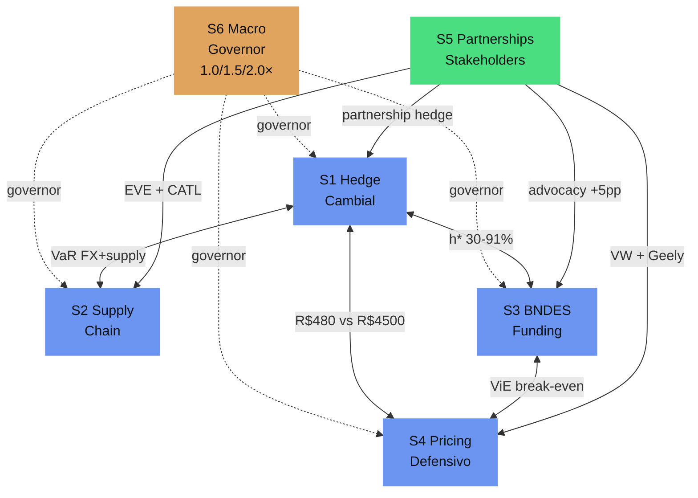

# D3 — Dependency Graph: 6 sessões × 9 acoplamentos

**Documento de consolidação** · T1.1 do Phase 1 (Q3 2026) · Compila os 9 acoplamentos modelados em um grafo navegável
**Data**: 21/jul/2026
**Status**: Working draft

---

## 1. Visão geral do grafo

O programa BYD Camaçari 2025-2027 tem 6 sessões (nós) e 9 acoplamentos (arestas) que foram modelados quantitativamente. Este documento consolida tudo em uma estrutura única para o Conselho e o time de execução.

### 1.1 Os 6 nós (sessões)

| Nó | Sessão | Tipo | Descrição |
|---|---|---|---|
| **S1** | Hedge cambial | Operacional | Proteção contra risco FX (BRL/USD) |
| **S2** | Supply chain | Operacional | Dual-sourcing, qualificação EVE, contratos LP |
| **S3** | BNDES / regulatory | Operacional | Funding BNDES, advocacy MDIC, bridge financing |
| **S4** | Pricing defensivo | Operacional | Redução de preço para preservar market share |
| **S5** | Partnerships | Operacional | Stakeholders (BYD global, CATL, EVE, VW, MDIC) |
| **S6** | Macro | Governor | Regime macro (PIB, IPCA, FX, FGV) — reescala todas as outras |

### 1.2 Os 9 acoplamentos (arestas)

| # | Acoplamento | Tipo | Doc | Intensidade |
|---|---|---|---|---|
| 1 | S1 ↔ S3 | Bidirecional | [D3-INTERDEPENDENCY-S1-S3.md](./D3-INTERDEPENDENCY-S1-S3.md) | **Forte** |
| 2 | S1 ↔ S2 | Bidirecional | [D3-INTERDEPENDENCY-S1-S2.md](./D3-INTERDEPENDENCY-S1-S2.md) | **Forte** |
| 3 | S1 ↔ S4 | Bidirecional | [D3-INTERDEPENDENCY-S1-S4.md](./D3-INTERDEPENDENCY-S1-S4.md) | **Forte** |
| 4 | S3 ↔ S4 | Bidirecional | [D3-INTERDEPENDENCY-S3-S4.md](./D3-INTERDEPENDENCY-S3-S4.md) | **Forte** |
| 5 | S6 → S1-S5 | Governor (unidirectional) | [D3-INTERDEPENDENCY-S6-TRIGGERS.md](./D3-INTERDEPENDENCY-S6-TRIGGERS.md) | **Forte** |
| 6 | S5 ↔ S1 | Bidirecional | [D3-INTERDEPENDENCY-S5-COUPLED.md §2](./D3-INTERDEPENDENCY-S5-COUPLED.md) | Fraco |
| 7 | S5 ↔ S2 | Bidirecional | [D3-INTERDEPENDENCY-S5-COUPLED.md §3](./D3-INTERDEPENDENCY-S5-COUPLED.md) | **Forte** |
| 8 | S5 ↔ S3 | Bidirecional | [D3-INTERDEPENDENCY-S5-COUPLED.md §4](./D3-INTERDEPENDENCY-S5-COUPLED.md) | **Forte** |
| 9 | S5 ↔ S4 | Bidirecional | [D3-INTERDEPENDENCY-S5-COUPLED.md §5](./D3-INTERDEPENDENCY-S5-COUPLED.md) | Médio |

**5 acoplamentos fortes** (intensidade = "Forte") + 1 governor (S6) + 1 médio + 1 fraco.

---

## 2. Matriz de adjacência (6×6)

Intensidade de cada acoplamento (linha → coluna):

| From \ To | S1 | S2 | S3 | S4 | S5 | S6 |
|---|---|---|---|---|---|---|
| **S1 Hedge** | — | **Forte** (#2) | **Forte** (#1) | **Forte** (#3) | Fraco (#6) | (governed) |
| **S2 Supply** | **Forte** (#2) | — | n/a | n/a | **Forte** (#7) | (governed) |
| **S3 BNDES** | **Forte** (#1) | n/a | — | **Forte** (#4) | **Forte** (#8) | (governed) |
| **S4 Pricing** | **Forte** (#3) | n/a | **Forte** (#4) | — | Médio (#9) | (governed) |
| **S5 Partnerships** | Fraco (#6) | **Forte** (#7) | **Forte** (#8) | Médio (#9) | — | n/a |
| **S6 Macro** | Governor (#5) | Governor (#5) | Governor (#5) | Governor (#5) | n/a | — |

**Notas**:
- "n/a" = acoplamento existe na teoria mas não foi modelado (gap conhecido)
- "(governed)" = sessão é reescalada por S6 macro multiplier (1.0/1.5/2.0×)
- S6 → S5 não modelado: partnerships são menos sensíveis a macro direto, embora macro RED afete capacidade de advocacy (BYD global com problemas)

---

## 3. Classificação por intensidade

### 3.1 Acoplamentos fortes (5 + 1 governor = 6)

| Acoplamento | Por que forte | Headline |
|---|---|---|
| **S1↔S3** | Hedge ótimo varia 30%-91% por cenário S3 (ViE) | Constraint-based sizing é crítico |
| **S1↔S2** | Supply VaR (R$ 5.18B) > FX VaR (R$ 2.08B) em stress conjunto | Hedge cobre só 1/3 do risco total |
| **S1↔S4** | Hedge R$ 480/unit vs defensivo R$ 4.500/unit (9.4× ratio) | Instrumentos diferentes, não substitutos |
| **S3↔S4** | Defensivo break-even em ViE=10%; catalog-wide destrutivo em RB Total | Tier system obrigatório |
| **S5↔S2** | EVE partnership + CATL LP entregam R$ 3.3bi em 3y sobre R$ 130M (ROI +2540%) | S5 é "óleo" do framework |
| **S5↔S3** | Partnerships (BYD global, EVE no Brasil) elevam ViE em +5-7pp cada | Advocacy preventiva é a chave |
| **S6→all** | Macro multiplier 1.0/1.5/2.0× reescala 4 sessões | Governor de todo o framework |

### 3.2 Acoplamentos médios (1)

| Acoplamento | Por que médio | Limitação |
|---|---|---|
| **S5↔S4** | VW partnership reduz canibalização mas depende de fatores externos | Decisões de outras empresas; ROI incerto |

### 3.3 Acoplamentos fracos (1)

| Acoplamento | Por que fraco | Limitação |
|---|---|---|
| **S5↔S1** | Partnership hedge é apenas 30% da exposição (concentração) | Saving máximo R$ 80M/ano; vale em stress moderado apenas |

### 3.4 Acoplamentos não modelados (gaps conhecidos)

Estes acoplamentos existem conceitualmente mas não foram modelados quantitativamente. Devem ser alvo da **Fase 3 (Q1 2027)**:

| Acoplamento | Por que não modelado | Estimativa de impacto |
|---|---|---|
| **S2↔S3** | BNDES funding para supply (capex/investimento) vs working capital | Médio — pode ser material se BNDES funding for parcial |
| **S2↔S4** | Defensivo reage a supply disruption (queda de oferta → preço sobe naturalmente) | Baixo — direção já está no S2↔S4 implícito |
| **S6↔S5** | Macro RED afeta capacidade de advocacy (BYD global com problemas) | Baixo — captured indiretamente via S6→S3 |

---

## 4. Critical path analysis

### 4.1 Topologia do grafo

O grafo tem uma estrutura clara:

```
                  S6 (Governor)
                   |
        +----------+----------+----------+
        |          |          |          |
        v          v          v          v
       S1 <-----> S2 <-----> S3 <-----> S4
        ^          ^          ^          ^
        |          |          |          |
        +----------+----------+----------+
                   |
                  S5 (Potenciador)
```

- **S6 é a raiz** (governor) — controla todas as outras
- **S1-S4 formam o "core loop"** — 4 sessões operacionais fortemente acopladas
- **S5 é o potenciador** — entra como modificador de S1-S4

### 4.2 Caminhos críticos

**Caminho 1: Stress macro amplifica todo o resto**
```
S6 macro deteriora → S3 BNDES funding at risk → S1 hedge sizing muda → S4 defensivo ajusta
Tempo de propagação: 1-3 meses (depende da cadência de detecção)
```

**Caminho 2: Compound risk FX + supply**
```
S2 supply disruption → S1 hedge sizing sobe (h*=90.6%) → stress FX conjunto amplifica
Tempo: semanas (quase simultâneo)
```

**Caminho 3: Advocacy BNDES melhora ViE → defensivo targeted viabilizado**
```
S5 partnership advocacy → S3 ViE +5pp → S4 defensivo targeted Tier 2 (não catalog-wide)
Tempo: 6-12 meses (advocacy tem latência)
```

### 4.3 Single point of failure (SPOF)

Se **um nó** falhar completamente, o impacto é:

| Nó que falha | Cascata | Mitigação |
|---|---|---|
| S1 (hedge) | Risco FX não coberto → margem cai 30%+ em stress | Cobertura obrigatória via S2 plano B (compra spot) |
| S2 (supply) | Supply disruption 6m → R$ 5.18B VaR materializado | S5 partnerships (EVE, CATL) como mitigador |
| S3 (BNDES) | ViE = 0 → margem cai 60%+ → defensivo catalog-wide destrutivo | S5 advocacy + bridge financing R$ 800M |
| S4 (defensivo) | Sem proteção de market share → share cai 5pp+ | Aceitar perda de share ou escalar S2 (volume) |
| S5 (partnerships) | Sem partnerships, S2 e S3 perdem alavancas | Aceitar (programa ainda funciona, mas menos eficiente) |
| S6 (macro) | Indetectável (é o regime) | S6 não "falha" — degrada gradualmente |

**Pior SPOF**: **S3 (BNDES)**. Se BNDES funding colapsar (RB Total), o programa perde 60% da margem e defensivo se torna destrutivo. Mitigação: S5 partnerships (preventivo) + bridge financing R$ 800M (reactive).

---

## 5. Visualização do grafo (Mermaid)



**Cores**:
- 🟠 Laranja: S6 (governor)
- 🟢 Verde: S5 (potenciador)
- 🔵 Azul: S1-S4 (core loop)

---

## 6. Mapa de documentos

Cada acoplamento tem doc dedicado. Para o Conselho, basta ler o grafo + 1-2 docs críticos. Para o time de execução, ler todos.

### 6.1 Por ordem de prioridade

| Prioridade | Doc | Por quê |
|---|---|---|
| **#1** | [D3-INTERDEPENDENCY-S3-S4.md](./D3-INTERDEPENDENCY-S3-S4.md) | Defensivo break-even em ViE=10%; **corrige prescrição errada do D2** |
| **#2** | [D3-INTERDEPENDENCY-S1-S3.md](./D3-INTERDEPENDENCY-S1-S3.md) | Hedge ótimo 30%-91% (não 50% flat); **corrige prescrição errada do D2** |
| **#3** | [D3-INTERDEPENDENCY-S6-TRIGGERS.md](./D3-INTERDEPENDENCY-S6-TRIGGERS.md) | Macro multiplier é o governor; **transforma D2 estático em dinâmico** |
| **#4** | [D3-INTERDEPENDENCY-S5-COUPLED.md](./D3-INTERDEPENDENCY-S5-COUPLED.md) | S5 partnerships = R$ 4bi em 3y sobre R$ 182M (ROI +2099%) |
| **#5** | [D3-INTERDEPENDENCY-S1-S2.md](./D3-INTERDEPENDENCY-S1-S2.md) | Stress conjunto FX + supply; supply VaR > FX VaR |
| **#6** | [D3-INTERDEPENDENCY-S1-S4.md](./D3-INTERDEPENDENCY-S1-S4.md) | Hedge vs defensivo (R$ 480 vs R$ 4.500/unit) |

### 6.2 Por sessão (qual coupling afeta cada nó)

| Sessão | Couplings que entram | Couplings que saem |
|---|---|---|
| S1 | S2 (stress), S3 (constraint-based), S5 (partnership hedge), S6 (governor) | S2 (hedge sizing), S4 (vs defensivo) |
| S2 | S1 (stress), S5 (partnerships), S6 (governor) | S1 (VaR supply em stress) |
| S3 | S1 (constraint-based), S4 (break-even), S5 (advocacy), S6 (governor) | S1 (hedge sizing), S4 (defensivo viável) |
| S4 | S1 (hedge vs defensivo), S3 (break-even), S5 (VW partnership), S6 (governor) | S1 (instrument comparison) |
| S5 | — | S1, S2, S3, S4 (potenciador) |
| S6 | (dados macro) | S1, S2, S3, S4 (governor) |

---

## 7. Tipping points por acoplamento (resumo)

| Acoplamento | Tipping point | Consequência |
|---|---|---|
| S1↔S3 | PTAX > 6.0 sustentado 3m | h* sobe para 95% (saturação) |
| S1↔S2 | Supply disruption 6m | h* constraint-based vs 50% flat inverte |
| S1↔S4 | Demand EV cai 15%+ | Defensivo vira custo fixo sem ROI |
| S3↔S4 | BNDES funding cai 10pp | Defensivo targeted Tier 2 apenas |
| S6→all | PIB YoY < 0% por 2 trimestres | Trigger S6 AMBER; recompute composite |
| S5↔S1 | PTAX vol > 18% | Partnership hedge desatrativa |
| S5↔S2 | Lítio < US$8k/t 12m | CATL LP 70% vira armadilha |
| S5↔S3 | BNDES funding garantido 12m | Partnerships S5↔S3 desnecessárias |
| S5↔S4 | VW partnership fechar antes de Q1 2027 | Defensivo pode ser descontinuado em mercados VW |

**Detalhes completos** em [D3-ANNEX.html §2.4](./D3-ANNEX.html#sec-2).

---

## 8. Como usar este documento

| Audiência | Leitura |
|---|---|
| **Conselho** | §1, §2, §3, §4.3, §5 (visão executiva; 10 min) |
| **CSO / Risk Officer** | §1, §2, §3, §4, §6.1, §7, §8 (visão tática; 30 min) |
| **Time de execução (Fase 1)** | Tudo + os 6 docs de coupling (visão operacional; 2-3 horas) |
| **Auditoria externa** | §1, §2, §6.1, §7 (compliance trail) |

---

## 9. Próximos passos

1. **T1.1 ✅** (este doc): dependency graph consolidado
2. **T1.2**: trigger matrix formal (próxima sessão) — D3-TRIGGER-MATRIX.md
3. **T1.3**: 12 decision trees (já cobertos no D3-MAIN.html §4.4)
4. **T1.4**: RACI matrix (já coberto no D3-MAIN.html §6.2)
5. **T1.5**: action register (já coberto no D3-MAIN.html §7)
6. **T1.6**: workshop Conselho 2h (calendário Q3 2026)

**Status T1.1**: ✅ FECHADO
**Status Phase 1**: 🟡 Em progresso (T1.1 done; T1.2 pendente; T1.3-1.5 já em D3-MAIN; T1.6 calendário)

---

**Resumo executivo em 1 frase**: 6 nós (sessões), 9 arestas (acoplamentos), 6 fortes + 1 governor + 1 médio + 1 fraco. S3 (BNDES) é o single point of failure; S5 (partnerships) é o potenciador de maior ROI (+2099%); S6 (macro) é o governor. Framework D3 v0.4 captura os 9 acoplamentos em 6 docs dedicados.
