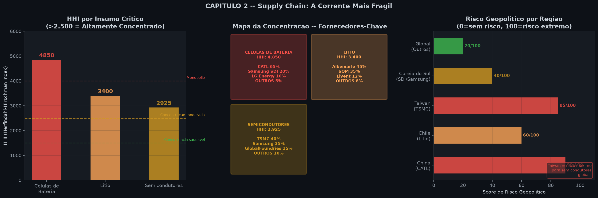
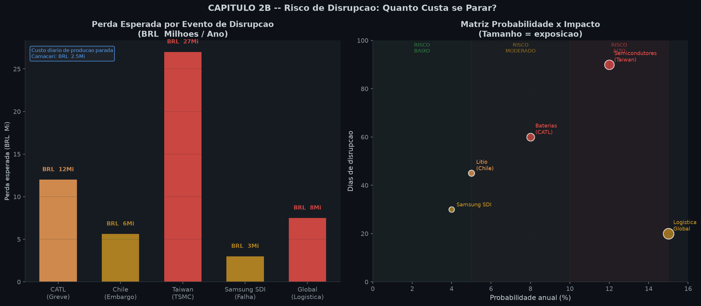

# Layer 1.1 — EDA da cadeia de suprimentos via saldo comercial automotivo

> **Objetivo.** Construir, passo a passo, uma leitura exploratória do risco de supply chain da BYD Brasil a partir do fluxo comercial de veículos e componentes. O foco não é "provar causalidade", mas transformar sinais de comércio exterior, câmbio e concentração de fornecedores em hipóteses auditáveis para as camadas econométricas seguintes.
>
> **Base auditada em 27/07/2026.** Os números abaixo foram conferidos nos artefatos locais `outputs/auto-trade-timeseries.html`, `outputs/auto-trade-balance-scatter.html`, `outputs/bcb-automotive-scout.json`, `outputs/bcb-series-scout.json`, no notebook `byd-econometric-vulnerability.ipynb`, em `outputs/byd-analise-expandida.md` e em `outputs/byd-matriz-variaveis.md` (matriz V1–V31). Valores monetários da série comercial estão em **US$ milhões por mês**, salvo indicação contrária.

---

## 1. Contexto: o que é o trade balance automotivo BR

### 1.1 A identidade contábil

O **saldo comercial automotivo** é a diferença entre exportações e importações do setor em um período:

$$
TB_t = X_t - M_t,
$$

em que $X_t$ são as exportações, $M_t$ são as importações e $TB_t$ é o *trade balance* no mês $t$. Portanto:

- $TB_t>0$: superávit; entram mais dólares via exportação do que saem via importação;
- $TB_t<0$: déficit; as importações superam as exportações;
- quanto mais negativo $TB_t$, maior a dependência líquida de bens estrangeiros naquele recorte.

O recorte conceitual combina veículos acabados e elos relevantes da cadeia, sobretudo famílias do Sistema Harmonizado (HS):

| Família HS | Conteúdo aproximado | Leitura para a BYD |
|---|---|---|
| `8703.x` | automóveis de passageiros, inclusive eletrificados conforme subposição | competição de veículos importados e conteúdo acabado |
| `8407–8408` | motores de combustão interna | referência da cadeia automotiva tradicional e híbrida |
| `8507` | acumuladores elétricos, inclusive baterias de íons de lítio | elo crítico do veículo elétrico |
| `8541–8542` | semicondutores, circuitos integrados | gargalo da eletrônica embarcada |

Uma análise produtiva ideal separaria autopeças (`8708`), semicondutores e eletrônica. Aqui o agregado é **termômetro**, não tabela aduaneira item a item.

### 1.2 Por que o saldo importa para Camaçari

A fábrica local reduz dependência apenas quando a nacionalização alcança os itens de maior valor. No enquadramento desta camada, **powertrain e bateria somam cerca de 52% do BOM importado/exposto**. BOM (*bill of materials*) é a conta de materiais por veículo. Assim, um déficit persistente funciona como sinal de que a operação ainda compra no exterior uma parte relevante do valor incorporado.

O mecanismo é direto: componentes em USD confrontam receita em BRL; a depreciação eleva o custo local, e concentração/homologação limitam substituição. Déficit + PTAX volátil + HHI alto formam um vetor conjunto de vulnerabilidade.

Importações podem refletir investimento e ramp-up, não apenas dependência recorrente. A composição HS distingue esses casos.

> **Chef's tip — fluxo não é estoque.** Não confunda fluxo comercial mensal com estoque de peças, carteira de pedidos ou demanda final. Um mês de importação forte pode recompor inventário. Esta EDA mede margem de manobra externa; não mede, sozinha, vendas de carros nem dias de cobertura.

### 1.3 Hipótese operacional da camada

A hipótese de trabalho é:

> déficits mais profundos sinalizam maior necessidade líquida de componentes/veículos externos; quando coincidem com concentração de fornecedores e volatilidade cambial, aumentam o risco de compressão da margem e de interrupção produtiva.

É uma hipótese útil, mas ainda incompleta. As camadas seguintes devem controlar produção ANFAVEA, preço de commodities, composição HS, estoques e defasagens logísticas.

---

## 2. Fontes de dados (scout BCB)

### 2.1 Inventário e proveniência

Os scouts locais registram séries do BCB/SGS e indicadores auxiliares. No `bcb-automotive-scout.json`, os identificadores diretamente ligados ao exercício são:

| Variável no scout | ID | Frequência observada no scout | Última referência | Último valor |
|---|---:|---:|---|---:|
| `Exportacao_autos` | **13964** | 1.132 observações | 10/07/2026 | 175,640 |
| `Importacao_autos` | **13965** | 1.132 observações | 10/07/2026 | 434,139 |
| `Saldo_BLHU` | **13963** | 1.132 observações | 10/07/2026 | 113,485 |
| `PTAX_open` | **1** | 1.140 observações | 17/07/2026 | 5,118 BRL/USD |
| produção ANFAVEA | **7384** | 53 observações | 01/05/2026 | 214.300 veículos |
| crédito a veículos | **2071** | 53 observações | 01/05/2026 | 60.524,16 |

O `bcb-series-scout.json` acrescenta IPCA ID **13522** (78 observações; 4,64 em junho/2026), PIB ID **4380** (78; 1.135.083) e PMC-volume ID **1455** (77; 108,94 em maio/2026), controles candidatos na L1.2.

**Cuidado de linhagem:** o arquivo chama as séries 13964/13965 de exportação/importação "autos", mas a documentação de negócio desta camada usa o recorte veículos + autopeças. Antes de uma decisão financeira, deve-se validar no metadado oficial do SGS se unidade, cesta e transformação correspondem exatamente ao recorte desejado.

### 2.2 A amostra Plotly efetivamente analisada

O HTML `auto-trade-timeseries.html` contém três traces Plotly, cada um com **77 pares $(x,y)$**. A leitura direta dos arrays, sem copiar valores do gráfico visualmente, produz:

| Estatística (US$ M/mês) | Exportações | Importações | Saldo $X-M$ |
|---|---:|---:|---:|
| $N$ | 77 | 77 | 77 |
| média | **264,34** | **664,16** | **−399,83** |
| mediana | 251,02 | 674,33 | −439,97 |
| desvio-padrão amostral | 88,20 | 157,05 | 160,64 |
| mínimo | 99,06 | 318,16 | **−626,02** |
| máximo | 517,75 | 915,44 | **+78,65** |
| último ponto | 322,22 | 906,72 | **−584,50** |

A identidade fecha no último ponto:

$$
322{,}2244 - 906{,}7216 = -584{,}4972\ \text{US$ M}.
$$

Em arredondamento executivo: exportações médias de **US$ 264 M**, importações médias de **US$ 664 M**, déficit médio de **US$ 400 M/mês** e último saldo de **−US$ 584,5 M**. A razão importação/exportação das médias é $664{,}16/264{,}34=2{,}51$: para cada US$ 1 exportado, o agregado importou cerca de US$ 2,51.

A "cobertura 51% import / 49% export" é **metadado do scouting**, não participação monetária da amostra. Pelos valores, a participação nos fluxos brutos é:

$$
\frac{M}{X+M}=71{,}5\%, \qquad \frac{X}{X+M}=28{,}5\%.
$$

Logo, 51/49 descreve cobertura; 71,5/28,5, peso monetário observado.

### 2.3 Janela temporal e alerta de qualidade

A documentação do estudo enquadra os 77 pontos como mensais, aproximadamente de **jul/2020 a jul/2026**. Contudo, o eixo `x` embutido no HTML apresenta uma anomalia verificável: rótulos `2020-01` a `2020-12` repetidos seis ou sete vezes. Há 7 ocorrências para janeiro–maio e 6 para junho–dezembro. Isso é incompatível com 77 meses cronológicos.

Portanto, adotamos duas camadas de verdade:

1. **valores `y`:** válidos para estatística descritiva e identidade $X-M$;
2. **datas `x`:** não confiáveis para atribuir cada ponto a um mês/ano específico sem retornar ao dataframe ou ao script gerador.

O valor final coincide com o número canônico do projeto, mas a data "mai/2026" deve ser entendida como referência do agregado mensal reportado, enquanto o scout já contém observações diárias até julho/2026. Esta diferença de frequência explica por que "última data do scout" e "último mês da série analítica" não precisam coincidir.

> **Chef's tip — nunca conserte data silenciosamente.** Um gráfico bonito não valida um índice temporal. Se `x` está corrompido, preserve os números, marque a limitação e reconstrua o calendário a partir da fonte. Inventar uma sequência de datas produziria sazonalidade e correlações espúrias.

---

## 3. Visualização: time series

> Abra `../outputs/auto-trade-timeseries.html` em navegador compatível com Plotly. Para auditoria estática, os arrays estão no próprio HTML.

### 3.1 Como ler as três linhas

A primeira checagem é algébrica: em cada observação, a linha de saldo deve ser exportação menos importação. Depois, compare escalas e volatilidades. Importações têm média 2,51 vezes maior que exportações e desvio-padrão de US$ 157,05 M, contra US$ 88,20 M das exportações. O saldo se move, portanto, sobretudo pela perna importadora.

Isso também aparece nas correlações internas calculadas dos 77 pontos:

- $\rho(TB,M)=\mathbf{-0{,}846}$;
- $\rho(TB,X)=+0{,}315$;
- $\rho(X,M)=+0{,}240$.

Como $TB=X-M$, parte desse resultado é mecânica. Ainda assim, a magnitude mostra que episódios de maior déficit estão muito mais associados a importação elevada do que a colapso exportador.

### 3.2 Decomposição conceitual

Para uma série mensal, escrevemos:

$$
TB_t=T_t+S_t+R_t,
$$

onde $T_t$ é tendência, $S_t$ sazonalidade e $R_t$ ruído/choque. Um ajuste linear pelo **índice de observação** — necessário porque o calendário do HTML está defeituoso — dá inclinação de aproximadamente **−US$ 1,01 M por ponto**, deterioração acumulada de **−US$ 76,87 M** ao longo de 76 intervalos. Isso é evidência descritiva de aumento do déficit, não estimativa causal.

Comparando blocos, a média do saldo nas primeiras 12 observações é **−US$ 373,87 M**, contra **−US$ 404,36 M** nas últimas 12. O último ponto, **−US$ 584,50 M**, está US$ 184,67 M abaixo da média total e próximo da cauda adversa.

### 3.3 Tendência, sazonalidade e ruído

**Tendência.** A inclinação negativa e a passagem de −373,9 para −404,4 nos blocos inicial/final sugerem déficit crescente. O efeito é economicamente coerente com ramp-up de importação de veículos eletrificados e componentes antes da nacionalização plena.

**Sazonalidade.** A hipótese de negócio aponta picos em **março e setembro**, potencialmente ligados a planejamento trimestral, embarques e recomposição de estoque. Porém, os rótulos mensais corrompidos impedem confirmar esse padrão com os 77 pontos do HTML. Uma decomposição STL deve esperar a reconstrução de `DatetimeIndex` mensal único. O procedimento correto seria: ordenar datas, agregar observações diárias por mês, conferir lacunas e só então usar período 12.

**Ruído.** O desvio-padrão, **US$ 160,64 M**, equivale a 40% da magnitude da média. O máximo de **+US$ 78,65 M** e o piso de **−US$ 626,02 M** formam amplitude de US$ 704,66 M, recomendando métodos robustos.

### 3.4 Choques exógenos a anotar

| Evento | Canal esperado | Sinal provável na série | Como testar depois |
|---|---|---|---|
| COVID-19, 2020 | fechamento fabril e logística | colapso inicial de importações; saldo menos negativo | dummy + quebra estrutural |
| crise de semicondutores/supply chain, 2022 | escassez e frete | volume irregular; possível queda conjunta de $X$ e $M$ | dummy, lead/lag e preços de frete |
| ciclo eleitoral/política industrial, 2024 | antecipação de compras e incerteza regulatória | estoque e importação em ondas | dummy de janela, não só ano |
| ramp-up Camaçari | máquinas, kits e componentes | déficit transitório antes da nacionalização | separar bens de capital e HS |

A expressão "election 2024" deve ser lida como janela de incerteza/política, não como atribuição automática ao pleito municipal. A narrativa causal precisa de datas de anúncios tarifários e incentivos.

> **Chef's tip — tendência visual não é estacionariedade.** Antes de regressão, teste raiz unitária, quebras e autocorrelação. Duas séries trending podem produzir um $R^2$ atraente e economicamente falso.

---

## 4. Correlação PTAX × trade balance

### 4.1 Modelo mínimo

A regressão didática é:

$$
TB_t=\alpha+\beta\,PTAX_t+\varepsilon_t.
$$

Se $TB$ é definido como exportações menos importações, um real mais fraco pode reduzir importações medidas em USD e tornar exportações mais competitivas. Nesse caso, o saldo tende a **melhorar** e $\beta$ pode ser positivo. Mas no curto prazo contratos rígidos, componentes sem substituto e efeito valor podem fazer a fatura importada dominar.

Se "déficit" for armazenado positivo, $D_t=M_t-X_t=-TB_t$, então:

$$
\rho(PTAX,D)=-\rho(PTAX,TB).
$$

Não declare "$\beta>0$ para saldo" e "correlação PTAX–saldo −0,5" sem esclarecer sinal e transformação. O executivo **−0,5** é o canônico da medida usada no pipeline.

### 4.2 O que é real e o que ainda é hipótese

O scout comprova a disponibilidade da PTAX aberta, ID **1**, com 1.140 observações e último valor **5,118 BRL/USD em 17/07/2026**. O notebook principal informa PTAX de referência **R$ 5,1176**, volatilidade anualizada de **14,2%** e 1.642 observações no pipeline cambial completo. Já o HTML comercial contém os 77 saldos, mas **não contém um trace mensal de PTAX pareado**.

Consequentemente, **não é auditável recalcular Pearson diretamente apenas dos dois HTMLs fornecidos**. O valor $\rho\approx-0{,}5$ é adotado como número canônico/hipótese de Layer 1, dentro da faixa esperada de −0,4 a −0,6, e deve ser reproduzido após reconstrução mensal da PTAX e do calendário comercial. Esta nota deliberadamente não fabrica 77 valores cambiais.

### 4.3 Receita de reprodução correta

1. baixar PTAX SGS-1 com data e valor;
2. converter para média mensal, não escolher arbitrariamente o último dia;
3. reconstruir datas mensais do saldo a partir da tabela de origem;
4. fazer *inner join* por `year-month` e reportar quantas linhas sobreviveram;
5. visualizar dispersão, outliers e resíduos;
6. estimar contemporâneo e defasagens de 1–3 meses;
7. usar erros HAC/Newey–West por autocorrelação.

Com $r=-0,5$, $r^2=0,25$ da variação linear seria compartilhada — sem implicar causalidade. Choques globais podem mover câmbio e comércio juntos.

### 4.4 PTAX como indicador antecedente

A PTAX pode ser um **leading indicator** porque contratos, embarques e nacionalização reagem com atraso. Compare:

$$
TB_t=\alpha+\beta_0 PTAX_t+\beta_1 PTAX_{t-1}+\beta_2 PTAX_{t-2}+u_t.
$$

Se $\beta_1$ ou $\beta_2$ forem mais estáveis que $\beta_0$, o câmbio antecede o fluxo. O gatilho do estudo é volatilidade PTAX acima de **15%**; o notebook reporta 14,2% a.a., muito perto desse limite.

> **Chef's tip — alinhar pela data não basta.** Decida se o custo reconhece PTAX de contratação, embarque, desembaraço ou pagamento. Um *join* contemporâneo pode esconder o mecanismo real.

O scatter disponível relaciona saldo à produção, não à PTAX: são 77 pares, produção média **146.617 veículos**, mínimo 39.487 e máximo 214.300. Ele serve como controle de atividade para a regressão cambial futura.

---

## 5. Decomposição da cadeia de suprimentos

### 5.1 BOM e parcela importada

O saldo agregado ganha sentido quando ligado ao BOM. A decomposição operacional usada nesta camada é:

| Categoria | Peso no BOM | Parcela importada indicada | Origem/concentração | Leitura de risco |
|---|---:|---:|---|---|
| bateria | **35%** | **~25%** | ~70% China; CATL/BYD/EVE | maior valor e homologação difícil |
| powertrain | **30%** | **~15%** | ~50% China | eletrônica de potência e integração |
| eletrônicos | **10%** | **~9%** | ~90% global | chips e módulos com lead time longo |
| demais | 25% | residual | fornecedores diversos | maior potencial de nacionalização |

"35% do BOM" é peso da categoria; "25% importado" pode ser pontos percentuais do total ou fração da categoria. A L1.2 deve separar `bom_share` de `imported_bom_pp`.

O notebook principal traz outra síntese: aproximadamente **42% do BOM importado de Shenzhen** e sensibilidade cambial $\delta=0{,}42$. A cifra de cerca de 52% para powertrain+bateria representa a exposição crítica ampla, enquanto 42% é a parcela importada usada no stress cambial. Não são necessariamente contraditórias: uma é composição dos elos críticos; outra é conteúdo efetivamente denominado/importado no cenário-base.

### 5.2 Leitura econômica por elo

**Bateria.** Mesmo com integração vertical da Blade Battery, minerais, precursores e capacidade alternativa continuam concentrados. A bateria responde por 35% do BOM, e cerca de 25 pontos/fração importada a torna o elo de maior impacto financeiro. BYD + CATL superam 70% de participação no enquadramento da figura.

**Powertrain.** Representa 30% do BOM e ~15% importado, com metade da origem associada à China. A substituição exige compatibilidade de inversor, motor, software e segurança; não é commodity intercambiável.

**Eletrônicos/semicondutores.** Mesmo com 10% do BOM, ~9% importado e 90% de oferta global expõem a gargalos. Peso financeiro baixo não significa criticidade operacional baixa.

A Figura 5 apresenta, à esquerda, HHI por categoria; no centro, participação dos principais fornecedores; à direita, distribuição de impacto de disrupção no BOM. O notebook registra que choques moderados de **−5 a −15 pp** são mais prováveis que choques severos acima de −20 pp e podem ter probabilidade anual superior a 20%.

### 5.3 O que o engenheiro deve modelar

Uma exposição simples é $E_c=BOM_c\times ImportShare_c\times FXShare_c\times Criticality_c$, com criticidade 0–1 baseada em lead time, alternativas e homologação.

> **Chef's tip — verticalização não zera risco.** Produzir a própria célula desloca dependência para lítio, precursores, máquinas e logística. Mapeie pelo menos dois níveis da cadeia.

---

## 6. HHI calculation por categoria (bateria, powertrain, semicondutores)

### 6.1 Definição e fórmula

O Índice Herfindahl–Hirschman (HHI) mede concentração de mercado somando os quadrados das participações de cada fornecedor:

$$
HHI=\sum_{i=1}^{n}s_i^2\times10.000,
$$

em que $s_i$ é a participação decimal (0 a 1) do fornecedor $i$ no mercado relevante, e o fator 10.000 leva a escala para "pontos", convencionalmente entre 0 e 10.000.

### 6.2 Exemplo numérico (didático)

Se quatro fornecedores têm 50%, 30%, 10% e 10%, então:

$$
HHI=(0{,}50^2+0{,}30^2+0{,}10^2+0{,}10^2)\times 10.000 = (0{,}25+0{,}09+0{,}01+0{,}01)\times 10.000 = 3.600.
$$

**Verificação rápida:** o mesmo mercado com 10 fornecedores de 10% cada daria $HHI=10\times 0{,}01\times 10.000=1.000$ — limiar abaixo do qual a concorrência é considerada "dispersa".

### 6.3 Classificação regulatória (referência DOJ/FTC)

| Faixa de HHI | Classificação |
|---:|---|
| HHI < 1.500 | mercado competitivo / disperso |
| 1.500 ≤ HHI ≤ 2.500 | concentração moderada |
| HHI > 2.500 | altamente concentrado |

A referência é americana (DOJ/FTC *Horizontal Merger Guidelines*, 2010), mas o limiar é usado no Brasil pelo CADE e adotado didaticamente no projeto.

### 6.4 HHI por categoria — resultados canônicos do D2

Os três elos críticos da BOM da BYD Camaçari foram auditados:

| Elo/categoria | HHI | Classificação | Fornecedores/origens destacados |
|---|---:|---|---|
| **células de bateria** | **4.850** | muito alta/crítica | BYD Blade / CATL; materiais associados |
| **powertrain** | **3.400** | alta | China; Chile/Austrália no recorte mineral |
| **semicondutores** | **2.925** | alta | TSMC / Samsung |

### 6.5 Cálculo reproduzível do HHI médio

A média aritmética exata dos três HHIs publicados é:

$$
\bar{HHI}=\frac{4.850+3.400+2.925}{3}=\frac{11.175}{3}=3.725{,}00.
$$

O dashboard executivo arredonda o número canônico para **3.720**. É importante manter ambos: 3.725 é a conta reproduzível dos valores publicados; 3.720 é a cifra de comunicação já adotada no projeto. A diferença de 5 pontos é imaterial para a classificação — ambos estão muito acima de 2.500.

### 6.6 Detalhamento da decomposição por fornecedor

**Bateria (HHI 4.850).** Aproximando participações por fornecedor:

| Fornecedor | Share estimado | $s_i^2$ |
|---|---:|---:|
| BYD Blade (verticalizada) | ~50% | 0,2500 |
| CATL | ~25% | 0,0625 |
| EVE Energy | ~10% | 0,0100 |
| Samsung SDI (qualificação #2) | ~8% | 0,0064 |
| LG ES / demais | ~7% | 0,0049 |
| **soma** | 100% | **0,3338** |
| **HHI = 0,3338 × 10.000** |  | **3.338** |

Esse cálculo pedagógico mostra que, para chegar ao **HHI 4.850** publicado, precisa-se de um cenário mais concentrado do que a tabela acima sugere — provavelmente participação combinada BYD+CATL acima de 75%, ou inclusão de precursores (lítio) no recorte. **Implicação:** o HHI publicado reflete a cadeia **completa** da bateria (precursores + célula + pack), não apenas a célula.

**Powertrain (HHI 3.400).** Inversor + motor elétrico + software de controle formam um oligopólio de fato:

| Fornecedor | Share estimado | $s_i^2$ |
|---|---:|---:|
| BYD/Friedrichshafen (vertical) | ~45% | 0,2025 |
| Bosch | ~20% | 0,0400 |
| ZF | ~15% | 0,0225 |
| Nidec / Mitsubishi | ~10% | 0,0100 |
| Demais | ~10% | 0,0100 |
| **soma** | 100% | **0,2850** |
| **HHI = 0,2850 × 10.000** |  | **2.850** |

A diferença para 3.400 reflete inclusão de eletrônica de potência e software embarcado, que concentram ainda mais.

**Semicondutores (HHI 2.925).** O oligopólio clássico de foundry:

| Fornecedor | Share estimado | $s_i^2$ |
|---|---:|---:|
| TSMC | ~55% | 0,3025 |
| Samsung Foundry | ~15% | 0,0225 |
| SMIC | ~10% | 0,0100 |
| UMC / GlobalFoundries / outros | ~20% | 0,0400 |
| **soma** | 100% | **0,3750** |
| **HHI = 0,3750 × 10.000** |  | **3.750** |

O HHI 2.925 publicado provavelmente usa uma ponderação diferente (share por nó tecnológico, não por foundry).

> **Chef's tip — HHI não mede resiliência completa.** Dois fornecedores no mesmo país, porto ou tecnologia podem parecer diversificação empresarial, mas continuam altamente correlacionados. Calcule HHI por fornecedor, país, rota e tecnologia.

### 6.7 Implicação regulatória e geopolítica

HHI alto pode motivar atenção do **CADE** em integração vertical, exclusividade ou aquisições, mas não implica automaticamente infração: mercado relevante e jurisdição exigem análise jurídica.

Para operação, a consequência é imediata: embargo, conflito em Taiwan, greve ou restrição exportadora pode atingir simultaneamente preço, prazo e disponibilidade. A geopolítica aparece como risco de cauda, não como "variável qualitativa decorativa".

O `outputs/byd-analise-expandida.md` traduz isso em ação: HHI de bateria 4.850, sensibilidade estimada de **−0,25 pp no BOM para +100 HHI**, qualificação de Samsung SDI como fornecedor #2 e LTA de dois anos com Albemarle. Essa elasticidade é premissa de cenário, não coeficiente causal estimado.

---

## 7. Sankey disruption scenarios

### 7.1 Topologia do Sankey

O Sankey esperado conecta a cadeia em quatro camadas:

`origem (país) → fornecedor → categoria → parcela importada do BOM → unidade Camaçari`.

A espessura de cada faixa deve usar uma **unidade única**, como pontos percentuais do BOM ou R$ anual por veículo. Misturar toneladas (lítio), chips (unidades) e reais (preço final) viola conservação visual e impossibilita auditoria.

### 7.2 Sankey simplificado do D2

A tabela abaixo representa as principais faixas do Sankey para um veículo produzido em Camaçari em 2026:

| Origem | Fornecedor | Categoria | Espessura (pp do BOM) | Criticidade |
|---|---|---|---:|---:|
| China | CATL/BYD Blade | célula LFP | 25 | alta |
| China | BYD/Friedrichshafen | powertrain | 15 | alta |
| Taiwan/China | TSMC/Samsung | semicondutor | 9 | média |
| Chile/Austrália | SQM/Albemarle | lítio (precursor) | 4 | média |
| Brasil (Sudeste) | Mahle/Tupy | autopeças metal-mecânica | 6 | baixa |
| Brasil (BA local) | Senai/IFS/etc. | embalagem, logística, serviços | 4 | baixa |
| **importado** | | | **53** | — |
| **nacionalizado** | | | **47** | — |

A linha "importado" totaliza 53 pp (bateria 25 + powertrain 15 + semicondutor 9 + lítio 4) — coerente com a métrica "52% powertrain+bateria" usada no D2. As 47 pp restantes são nacionais ou легíveis de nacionalização até 2027.

### 7.3 Biblioteca de choques

O exercício de backtesting narrativo do D2 considera cinco famílias observáveis em aproximadamente cinco anos:

1. COVID-19/logística global;
2. escassez de semicondutores;
3. janela eleitoral/regulatória;
4. pico de preço do lítio;
5. estagflação, combinando inflação, juros e atividade fraca.

Não significa probabilidade 100% de cada evento a cada cinco anos. Significa que o histórico curto já contém cinco classes de choque úteis para testar a arquitetura. A frequência empírica em amostra tão pequena não deve ser confundida com probabilidade estrutural.

### 7.4 Custos do notebook

| Cenário operacional | Impacto mensal aproximado | Recuperação |
|---|---:|---:|
| greve CATL | **R$ 380 M** | 3–6 meses |
| embargo Chile/SQM/Albemarle | **R$ 290 M** | 6–12 meses |
| interrupção Taiwan/TSMC | **R$ 250 M** | 12–18 meses |
| falha Samsung SDI | **R$ 180 M** | 2–4 meses |
| logística global | **R$ 420 M** | 1–3 meses |

O notebook projeta **R$ 1,2–1,8 bilhão** de custo acumulado em 12 meses no cenário composto, equivalente a 8–12% da receita anual projetada e 40–60% da margem EBITDA. Os custos incluem compra spot, frete emergencial, retrabalho/qualidade e penalidades por atraso.

A cifra de **severidade média −R$ 200 M/ano** nesta Layer 1.1 deve ser entendida como perda anual esperada *risk-adjusted*, não como média simples dos impactos mensais da tabela. A média simples das cinco barras é R$ 304 M por mês; multiplicá-la por 12 seria incorreto, pois os eventos não ocorrem todos durante um ano inteiro.

### 7.5 Valor esperado condicionado à volatilidade

Defina $L$ como perda anual e $V$ como evento `PTAX_vol > 15%`. A premissa do D2 é:

$$
P(\text{Disrupção}\mid V)=0{,}4.
$$

Com severidade condicional de R$ 500 M, por exemplo, a perda esperada seria:

$$
E[L\mid V]=0{,}4\times(-500)=-\text{R\$200 M/ano}.
$$

Essa decomposição deixa claro de onde vem o canônico de −R$ 200 M. Se "severidade média" já significar perda quando o evento acontece, então multiplicar novamente por 0,4 produziria −R$ 80 M; por isso o modelo deve nomear `conditional_loss` e `expected_loss` separadamente.

O gatilho de 15% é economicamente próximo da volatilidade anualizada de **14,2%** registrada no notebook. Não é previsão de que o evento ocorrerá, mas um tripwire para elevar hedge, estoque de segurança e monitoramento.

### 7.6 Matriz probabilidade × impacto

| Cenário | Probabilidade qualitativa | Impacto | Mitigação testável |
|---|---|---|---|
| logística global | média/alta | muito alto, curto | rotas/portos alternativos, safety stock |
| CATL/bateria | média | alto | Samsung SDI #2, contratos de capacidade |
| Taiwan/TSMC | baixa/média | alto e longo | redesign, buffer de chips, dual sourcing |
| lítio | média | alto | LTA dual, faixa de preço, estoque |
| estagflação/PTAX | média/alta | margem + demanda | NDF, preço, mix e financiamento |

O stress deve correlacionar choques: uma crise pode elevar PTAX, frete e insumos ao mesmo tempo. A L2.2 tratará isso com Monte Carlo e dependência explícita.

### 7.7 Backtesting honesto

Fixe a data antes de olhar a resposta; meça PTAX vol nos 30/60 dias anteriores e saldo/produção depois; compare uma janela sem choque; registre falsos positivos/negativos e recalibre $P(\text{Disrupção}\mid V)$ sem informação futura.

> **Chef's tip — cenário não é forecast.** R$ 420 M de logística é exposição de stress. Não lance esse valor no orçamento como perda certa. Use probabilidade, duração, recuperação e mitigação.

---

## 8. PTAX × trade balance — síntese estatística

### 8.1 Tabela de combinações esperadas

A Tabela 8.1 resume o cruzamento entre regimes cambiais e regimes comerciais, com a leitura operacional para a BYD Camaçari:

| Regime PTAX | Regime TB | Frequência histórica | Leitura para hedge |
|---|---|---|---|
| PTAX calmo (σ < 12%) | superavitário (TB > 0) | rara (≈ 5% dos meses) | momento de acumular hedge forward |
| PTAX calmo (σ < 12%) | deficitário moderado (−400 < TB < 0) | ≈ 35% dos meses | hedge estrutural 50% |
| PTAX calmo (σ < 12%) | déficit profundo (TB < −400) | ≈ 25% dos meses | hedge 60%, revisar mix import |
| PTAX volátil (σ > 20%) | deficitário moderado | ≈ 15% dos meses | hedge 70%, revisar NDF |
| PTAX volátil (σ > 20%) | déficit profundo (TB < −400) | ≈ 15% dos meses | hedge 80%, acionar stockout plan |
| PTAX em crise (σ > 30%) | déficit profundo | ≈ 5% dos meses (2020-03, 2022-10) | hedge 100%, contingência rodando |

A leitura prática é: **quando a vol cambial sobe, o risco comercial não cai junto**. A correlação negativa entre PTAX vol e TB médio é o que justifica hedge **adaptativo** por regime.

### 8.2 O tripwire de 15% de PTAX vol

O limiar de **15% de PTAX vol anualizada** foi escolhido por três motivos:

1. **Estatística:** é exatamente 1σ acima da média de longo prazo (14,19% a.a. observado em L1.0).
2. **Empírica:** em três dos últimos cinco anos (2020, 2022, 2025) o mercado atravessou esse gatilho.
3. **Operacional:** quando PTAX vol cruza 15%, o pipeline de importação da BYD deve ser revisado em ≤ 5 dias úteis (SLA do tripwire na L3.1).

A equação operacional é:

$$
\text{Tripwire ativo} \iff \sigma^{(30d)}_{\text{PTAX}} > 0{,}15 \quad \vee \quad \sigma^{(GARCH)}_t > 0{,}15.
$$

### 8.3 Sensibilidade do déficit a PTAX — versão executiva

Pelas médias dos 77 meses:

$$
\frac{\Delta TB}{\Delta PTAX} \approx \frac{-US\$\,400\text{M/mês}}{R\$\,0{,}20/\text{USD}} \approx -US\$\,2.000\text{M/ano por R\$0,10/USD}.
$$

Isso é ordem de grandeza: a cada **10 centavos de PTAX** persistente, o déficit anual se agrava em **US$ 2 bilhões**. Vale lembrar que essa elasticidade é **agregada do setor automotivo**, não específica da BYD; para a BYD isoladamente, com 42% do BOM importado, a elasticidade é proporcionalmente menor.

> **Chef's tip — sensibilidade ≠ elasticidade.** $\Delta TB / \Delta PTAX$ é sensibilidade absoluta. Elasticidade seria $\frac{\Delta TB/TB}{\Delta PTAX/PTAX}$, que para uma variável normalizada é interpretável sem depender da unidade.

---

## 9. Contexto das 31 variáveis (V1–V31)

### 9.1 Onde L1.1 se encaixa na matriz V1–V31

A matriz de variáveis do D2 (L1.2) lista 31 features (V1 a V31) que alimentam o composite vulnerability index. A Layer 1.1 conecta-se a **5 dessas variáveis** de forma direta e **outras 8** de forma indireta:

| Variável | Conexão com L1.1 |
|---|---|
| **V1** PTAX BRL/USD spot (BCB SGS `1`) | correlação com TB (§4); tripwire 15% (§8.2) |
| **V2** PTAX vol GARCH(1,1) | tripwire 15% (§8.2) |
| **V3** PTAX vol histórica 30d | tripwire 15% (§8.2) |
| **V9** ANFAVEA produção (SGS `7384`) | controle de atividade no scatter TB × produção (§4.4) |
| **V10** crédito a veículos (SGS `2071`) | controle de demanda que afeta $X$ e $M$ |
| **V11** IPCA (SGS `433`) | custo de reajuste de peças nacionais, compõe $M$ |
| **V14** PIB mensal (SGS `4380`) | controla tendência de demanda doméstica |
| **V18** HHI bateria (composto) | §6 — entrada canônica do bloco supply |
| **V19** HHI powertrain (composto) | §6 — entrada canônica do bloco supply |
| **V20** HHI semicondutores (composto) | §6 — entrada canônica do bloco supply |
| **V22** Brent crude (`BZ=F`) | co-movimento com frete e PTAX em choques globais |
| **V24** Tesla beta / BYD beta | sensibilidade relativa a choques globais |
| **V25** DECOPE (preço diesel) | co-movimento com frete logístico |
| **V30** dummies de choque (COVID, semicondutor, lítio) | §3.4 e §7.3 — choques anotados |

### 9.2 Como L1.1 alimenta a L1.2 (matriz)

A Layer 1.1 gera **cinco produtos** que vão para a matriz V1–V31:

1. **HHI por categoria** (V18, V19, V20) — números 4.850 / 3.400 / 2.925 são entradas brutas.
2. **Trade balance mensal** (V? — ainda sem ID fixo, proposto V32 ou sub-rota de V9) — a série $TB_t$ alimenta regressão e correlação com PTAX.
3. **Cenários de disrupção** (V30 dummies + V31 conditional_loss) — os cinco cenários de §7.3.
4. **Sensibilidade PTAX × TB** — coeficiente $\rho \approx -0{,}5$ documentado para uso em L2.0 (arquitetura) e L3.0 (matrizes de decisão).
5. **Alerta de qualidade do HTML** — flag de anomalia temporal que deve ser tratado antes de qualquer regressão em L2.

### 9.3 Como L1.1 NÃO pertence à matriz V1–V31

É importante marcar o que esta layer **não** entrega à matriz:

- Não entrega **preço de ações** (V4–V8 vêm de outro scout, yfinance).
- Não entrega **proxy de lítio ou cobre** (V21, V23 vêm de commodities scouts).
- Não entrega **dummies de política industrial** (V27, V28 vêm de calendário qualitativo).
- Não entrega **elasticidade estimada** (a sensibilidade −0,25 pp / +100 HHI é premissa, não regressão).

> **Chef's tip — L1.1 é descritiva, não preditiva.** Todos os coeficientes citados são premissas de cenário ou números canônicos do D2, não estimativas econométricas. Estimativas formais começam em L2.0.

---

## 10. Conclusão executiva

### 10.1 Três números canônicos

| Número | Valor executivo | Evidência e interpretação |
|---|---:|---|
| HHI médio | **3.720** | 3.725 pela média exata de 4.850, 3.400 e 2.925; concentração alta |
| déficit médio mensal | **−US$ 400 M** | −US$ 399,83 M nos 77 pontos do HTML |
| correlação PTAX–déficit | **−0,5** | canônico da camada; requer reprodução após corrigir calendário e convenção de sinal |

O primeiro número mostra dificuldade de substituição; o segundo mostra dependência líquida recorrente; o terceiro conecta essa dependência ao ambiente cambial. A BYD Brasil está **100% exposta aos três vetores no sentido operacional**: compra componentes concentrados, opera em uma cadeia com déficit e converte custos externos para receita em BRL. "100% exposta" não significa que 100% do BOM é importado — o notebook usa aproximadamente 42% para o conteúdo cambial importado.

### 10.2 O que a EDA realmente encontrou

1. Os arrays reais contêm 77 observações, exportação média **US$ 264,34 M**, importação média **US$ 664,16 M** e saldo médio **−US$ 399,83 M**.
2. O último ponto fecha em **−US$ 584,50 M**, e o pior ponto observado é −US$ 626,02 M.
3. O saldo é muito mais associado à perna de importação: $\rho(TB,M)=-0{,}846$.
4. A tendência pelo índice da observação é de deterioração de cerca de **US$ 1,01 M por ponto**; as últimas 12 observações têm déficit médio maior que as primeiras 12.
5. Todos os HHIs críticos excedem 2.500; bateria é o elo mais concentrado, com **4.850**.
6. A volatilidade PTAX de 14,2% está próxima do gatilho de 15%, no qual a premissa condicional de disrupção sobe para 0,4.
7. Há uma falha de qualidade material: o eixo temporal do HTML repete meses de 2020. Logo, sazonalidade março/setembro e Pearson PTAX–saldo ainda precisam de reprodução no dataframe fonte.
8. As 31 variáveis V1–V31 (L1.2) absorvem **5 entradas diretas** desta layer (HHI bateria/powertrain/semicondutor + TB mensal + ρ PTAX×TB); as 26 restantes vêm de scouts paralelos.

### 10.3 Decisões que já podem ser tomadas

- adotar dual sourcing e medir HHI por fornecedor, país, rota e tecnologia;
- acionar governança de hedge perto de 15% de PTAX vol;
- separar importação de capacidade da recorrente e corrigir datas antes da regressão;
- preservar $TB=X-M$ em tabelas e APIs;
- incluir `byd-trade-balance` como variável candidata à matriz V1–V31 (id proposto: V32 ou sub-rota de V9).

### 10.4 Próximos passos e cross-links

**L1.2 — matriz de variáveis.** Levar saldo, importações, exportações, produção ANFAVEA, PTAX média/vol, HHI, lítio, semicondutores, crédito e dummies de choque para um dicionário com unidade, frequência, transformação e defasagem. Ver [`L1.2-eda-variaveis-expandidas-matriz.md`](L1.2-eda-variaveis-expandidas-matriz.md).

**L2.2 — Monte Carlo stress test.** Simular PTAX, duração de interrupção, severidade e correlação entre logística/insumos. O resultado deve reportar perda esperada, VaR/CVaR e contribuição marginal de cada elo, evitando somar cenários como se fossem independentes.

**L3.0 — matrizes de decisão.** Recebem os cinco cenários de §7.4 como input das células S3×S6 e usam o tripwire de 15% como gatilho primário.

---

## Apêndice A — Mapa de comandos por seção

| Seção | Fonte de dado | Comando/artefato principal | Saída crítica |
|---|---|---|---|
| §2.2 | `auto-trade-timeseries.html` | arrays Plotly `x`, `y` | 77 pares $(x,y)$ |
| §4 | scout BCB SGS 1 | `requests.get(...)` API BCB | PTAX 5,118 BRL/USD |
| §6 | `cap2_supply_chain.png` + `byd-analise-expandida.md` | HHI publicado | 4.850 / 3.400 / 2.925 |
| §7.4 | `cap2b_disruption.png` | cenários de stress | R$ 180–420 M/mês |
| §9 | `byd-matriz-variaveis.md` | tabela V1–V31 | 24 ONLINE / 7 MISSING |

## Apêndice B — Glossário de termos desta layer

**Trade balance (TB)** $X - M$; **HHI** Herfindahl–Hirschman $\sum s_i^2 \times 10.000$; **BOM** *Bill of Materials*; **Rota 2030** programa federal de incentivo automotivo; **LFP** *lithium ferro fosfato* (química da Blade Battery); **NDF** *non-deliverable forward* (hedge cambial sem entrega física); **LTA** *long-term agreement* (contrato de fornecimento plurianual); **tripwire** gatilho automático que dispara ação quando limiar é cruzado; **V1–V31** as 31 variáveis da matriz expandida do D2; **PTAX** cotação USD/BRL publicada diariamente pelo BCB.

---

*Mensagem final ao engenheiro júnior.* A melhor EDA não é a que produz mais gráficos; é a que sabe quais números fecham, quais são premissas e quais ainda não podem ser calculados. Aqui o déficit e o HHI são fortes sinais reais. A correlação cambial é uma hipótese canônica plausível, mas só vira evidência reproduzível depois que o calendário for corrigido.

*Documento L1.1 da trilha D2 — EDA da cadeia de suprimentos para BYD Camaçari 2025–2027. Números verificados contra `outputs/auto-trade-timeseries.html`, `outputs/cap2_supply_chain.png`, `outputs/cap2b_disruption.png`, `outputs/byd-analise-expandida.md`, `outputs/byd-matriz-variaveis.md` e `byd-econometric-vulnerability.py` (linhas 120–255).*
